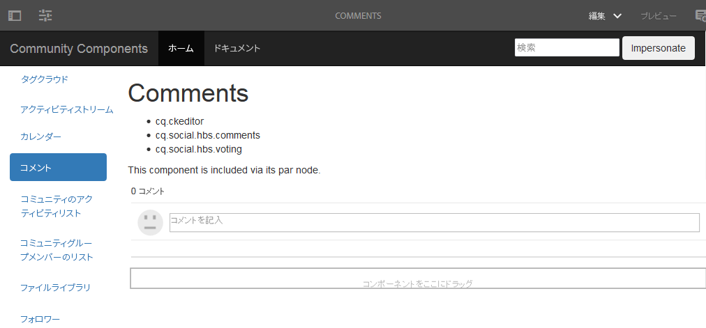

# コメントページの作成 {#create-comments-page}

>[!CAUTION]
>
>AEM 6.4 の拡張サポートは終了し、このドキュメントは更新されなくなりました。 詳細は、 [技術サポート期間](https://helpx.adobe.com/jp/support/programs/eol-matrix.html). サポートされているバージョンを見つける [ここ](https://experienceleague.adobe.com/docs/?lang=ja).

**[⇐コメントコンポーネントをオーバーレイ](overlay-comments.md) [ノードの作成⇒](overlay-create-nodes.md)**

## コメントページ {#comments-page}

この [コミュニティコンポーネントガイド](components-guide.md) では、コメントコンポーネントのオーバーレイを簡単に体験できます。

オーサーインスタンスでページを表示します。

* [http://localhost:4502/editor.html/content/community-components/en/comments.html](http://localhost:4502/editor.html/content/community-components/en/comments.html)

**[⇐コメントコンポーネントをオーバーレイ](overlay-comments.md) [ノードの作成⇒](overlay-create-nodes.md)**
