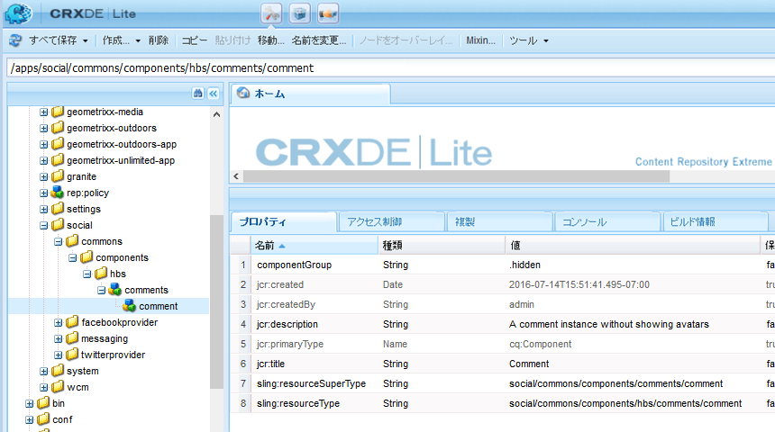

# ノードの作成 {#create-nodes}

>[!CAUTION]
>
>AEM 6.4 の拡張サポートは終了し、このドキュメントは更新されなくなりました。 詳細は、 [技術サポート期間](https://helpx.adobe.com/jp/support/programs/eol-matrix.html). サポートされているバージョンを見つける [ここ](https://experienceleague.adobe.com/docs/?lang=ja).

必要最小限の数のファイルを/libs から/apps にコピーし、/apps で変更することで、コメントシステムをカスタムバージョンでオーバーレイします。

>[!CAUTION]
>
>/libs フォルダーの内容は編集されません。再インストールまたはアップグレードを行うと、/apps フォルダーの内容が変更されないまま/libs フォルダーが削除または置き換えられる可能性があります。

使用 [CRXDE Lite](../../help/sites-developing/developing-with-crxde-lite.md) オーサーインスタンスで、まず、/libs フォルダー内のオーバーレイされたコンポーネントへのパスと同じパスを/apps フォルダーに作成します。

複製するパスは次のとおりです。

* `/libs/social/commons/components/hbs/comments/comment`

パス内の一部のノードはフォルダーで、一部はコンポーネントです。

1. 参照先 [http://localhost:4502/crx/de/index.jsp](http://localhost:4502/crx/de/index.jsp)
1. 作成 `/apps/social` （まだ存在しない場合）
   * 選択 `/apps` ノード
   * **[!UICONTROL 作成/フォルダー…]**
      * 名前を入力: `social`
1. 選択 `social` ノード
   * **[!UICONTROL 作成/フォルダー…]**
      * 名前を入力: `commons`
1. 選択 `commons` ノード
   * **[!UICONTROL 作成/フォルダー…]**
      * 名前を入力: `components`
1. 選択 `components` ノード
   * **[!UICONTROL 作成/フォルダー…]**.
      * 名前を入力: `hbs`
1. 選択 `hbs` ノード
   * **[!UICONTROL 作成/コンポーネントを作成…]**
      * ラベルを入力： `comments`
      * タイトルを入力： `Comments`
      * 説明を入力: `List of comments without showing avatars`
      * スーパータイプ：`social/commons/components/comments`
      * グループを入力： `Communities`
      * クリック **[!UICONTROL 次へ]** 次まで **[!UICONTROL OK]**
1. 選択 `comments` ノード

   * **[!UICONTROL 作成/コンポーネントを作成…]**

      * ラベルを入力： `comment`
      * タイトルを入力： `Comment`
      * 説明を入力: `A comment instance without avatars`
      * スーパータイプ：`social/commons/components/comments/comment`
      * グループを入力： `.hidden`
      * クリック **[!UICONTROL 次へ]** 次まで **[!UICONTROL OK]**
   * 選択 **[!UICONTROL すべて保存]**
1. デフォルトの `comments.jsp`
   * ノードを選択 `/apps/social/commons/components/hbs/comments/comments.jsp`
   * 選択 **[!UICONTROL 削除]**
1. デフォルトの comment.jsp を削除します。
   *  ノードを選択します`/apps/social/commons/components/hbs/comments/comment/comment.jsp`
   * 選択 **[!UICONTROL 削除]**
   * 選択 **[!UICONTROL すべて保存]**

>[!NOTE]
>
>継承チェーンを保持するには、 `Super Type` （プロパティ） `sling:resourceSuperType`) が `Super Type` （この場合は）オーバーレイされるコンポーネント
>
>* `social/commons/components/comments`
>* `social/commons/components/comments/comment`
>

オーバーレイ自体 `Type`（プロパティ） `sling:resourceType`) は、/apps に見つからないコンテンツが/libs 内で検索されるように、相対的な自己参照である必要があります。
* 名前：`sling:resourceType`
* タイプ：`String`
* 値：`social/commons/components/hbs/comments`

1. 緑を選択 `[+] Add`
   * 名前：`sling:resourceType`
   * タイプ：`String`
   * 値：`social/commons/components/hbs/comments/comment`
1. 緑を選択 `[+] Add`
   * 選択 **[!UICONTROL すべて保存]**

