# 公開したサイトを使ってみる {#experience-the-published-site}

## 公開で新しいサイトを参照 {#browse-to-new-site-on-publish}

新しく作成したコミュニティサイトが公開されたので、サイトの作成時に表示される URL を参照します。ただし、次に例を示します。

* 作成者 URL = http://localhost:4502/content/sites/engage/en.html
* 公開 URL = http://localhost:4503/content/sites/engage/en.html

オーサーとパブリッシュでどのメンバーがサインインしているかに関する混乱を最小限に抑えるために、インスタンスごとに異なるブラウザーを使用することをお勧めします。

公開されたサイトに初めてアクセスした場合、通常、サイト訪問者はまだサインインしておらず、匿名になります。

## http://localhost:4503/content/sites/engage/en.html {#http-localhost-content-sites-engage-en-html}

## 匿名のサイト訪問者 {#anonymous-site-visitor}

匿名のサイト訪問者の UI には、次の情報が表示されます。

* サイトのタイトル。 はじめにのチュートリアル
* プロファイルリンクなし
* メッセージリンクがありません
* 通知リンクがありません
* 検索フィールド
* ログインリンク
* ブランドバナー
* 参照サイトテンプレートに含まれるコンポーネントのメニューリンク

様々なリンクを選択すると、読み取り専用モードになります。

## JCR での匿名アクセスの防止 {#prevent-anonymous-access-on-jcr}

ただし、既知の制限により、コミュニティサイトコンテンツは jcr コンテンツと json を通じて匿名の訪問者に公開されます。 **匿名アクセスを許可** はサイトのコンテンツに対して無効です。 ただし、この動作は、Sling の制限を回避策として使用して制御できます。

jcr コンテンツと json を介した匿名ユーザーによるアクセスからコミュニティサイトのコンテンツを保護するには、次の手順に従います。

1. AEM オーサーインスタンスで、 https://に移動します。&lt;host>:&lt;port>/editor.html/content/site/&lt;sitename>.html

   >[!NOTE]
   >
   >ローカライズされたサイトに移動しないでください。

1. に移動します。 **[!UICONTROL ページプロパティ]**.

   

1. 「**[!UICONTROL 詳細]**」タブに移動します。

   

1. 有効にする **[!UICONTROL 認証要件]**.
1. ログインページのパスを追加します。 例：`/content/......./GetStarted`
1. ページを公開します。

## 信頼できるコミュニティメンバー {#trusted-community-member}

この操作は、次を前提としています。 [Aaron McDonald](tutorials.md#demo-users) は次の役割を割り当てられました： [コミュニティマネージャーとモデレーター](create-site.md#roles). そうでない場合は、オーサー環境に戻ります。 [サイト設定の変更](sites-console.md#modifying-site-properties) コミュニティマネージャーとモデレーターの両方として Aaron McDonald を選択します。

右上隅で、「 `Log in`をクリックし、ユーザー名「aaron.mcdonald@mailinator.com」とパスワード「password」を使用して署名します。 twitterまたはFacebookの資格情報を使用してログインする機能に注目してください。

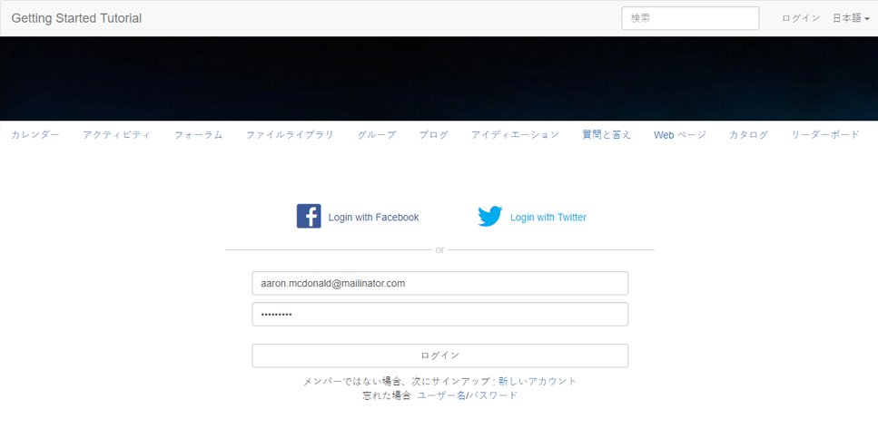

サインインすると、新しいメニュー項目が表示されます。 `Administration`（メンバーにモデレーターの役割が与えられたために表示されます） 現在は、様々なリンクを選択する方が興味深いです。

選択したリファレンスサイトテンプレートには、最初にカレンダー機能が含まれ、次にアクティビティストリーム機能、フォーラム機能などが含まれていたので、カレンダーページはホームページになっています。 この構造は、 [サイトテンプレート](sites.md#edit-site-template) コンソールまたはオーサー環境でサイトプロパティを変更する場合：

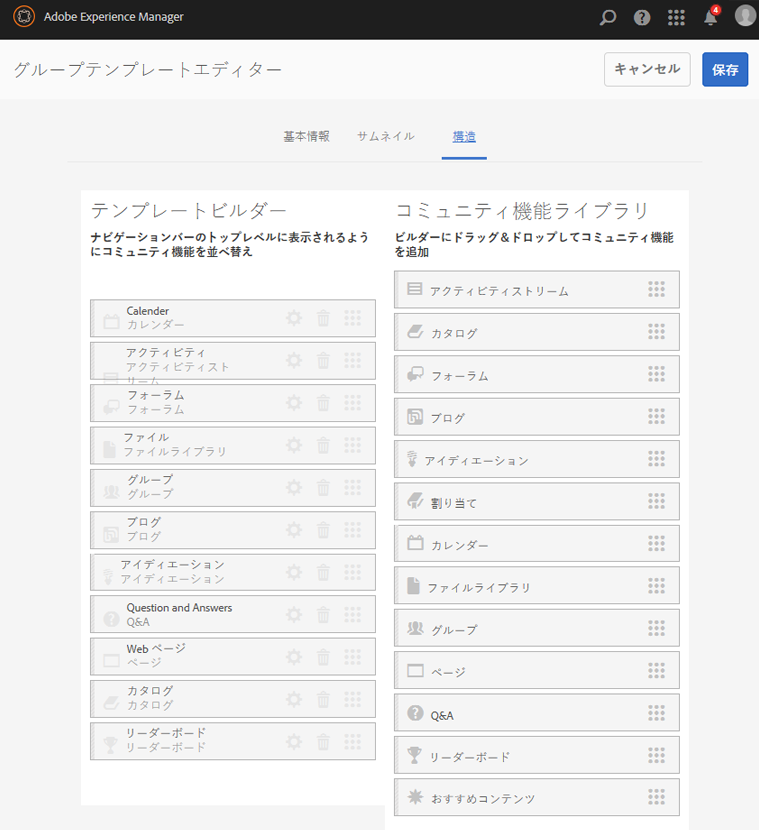

>[!NOTE]
>
>コミュニティのコンポーネントと機能について詳しくは、
>
>* [コミュニティコンポーネント](author-communities.md) （作成者向け）
>* [コンポーネント、機能、機能の基本事項](essentials.md) （開発者向け）
>

## フォーラムリンク {#forum-link}

「フォーラム」リンクを選択して、基本的なフォーラム機能を表示します。

メンバーは、新しいトピックを投稿したり、トピックをフォローしたりできます。

サイトの訪問者は、投稿を表示し、様々な方法で並べ替えることができます。

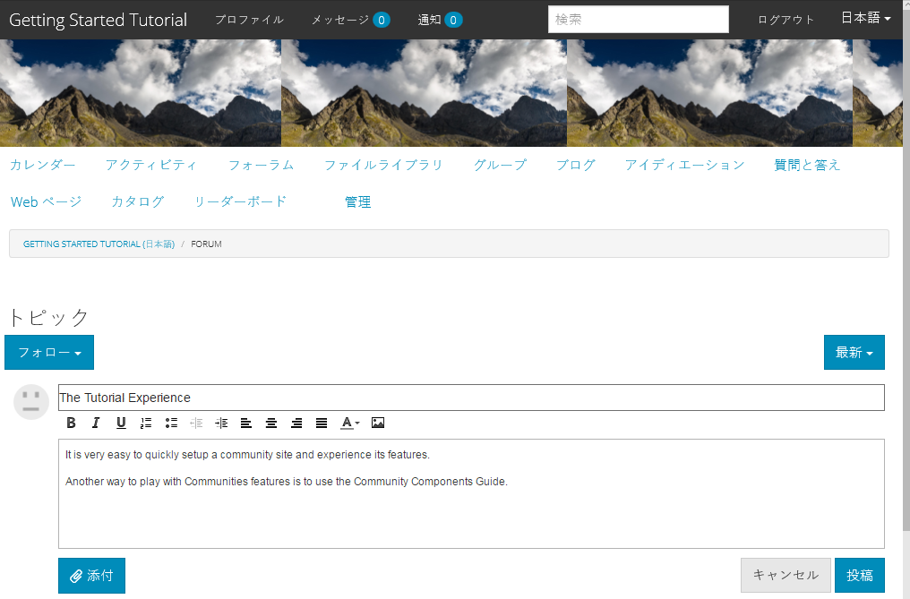

## グループリンク {#groups-link}

Aaron はグループ管理者なので、「グループ」リンクを選択すると、Aaron はグループテンプレート、画像、グループが開いているかシークレットであるか、メンバーを招待することで、新しいコミュニティグループを作成できます。

これは、パブリッシュ環境でグループを作成する例です。

グループは、オーサー環境で作成し、オーサー環境のコミュニティサイト ( [コミュニティグループコンソール](groups.md)) をクリックします。 の経験 [オーサー環境でのグループの作成](nested-groups.md) は、このチュートリアルの次の段階です。

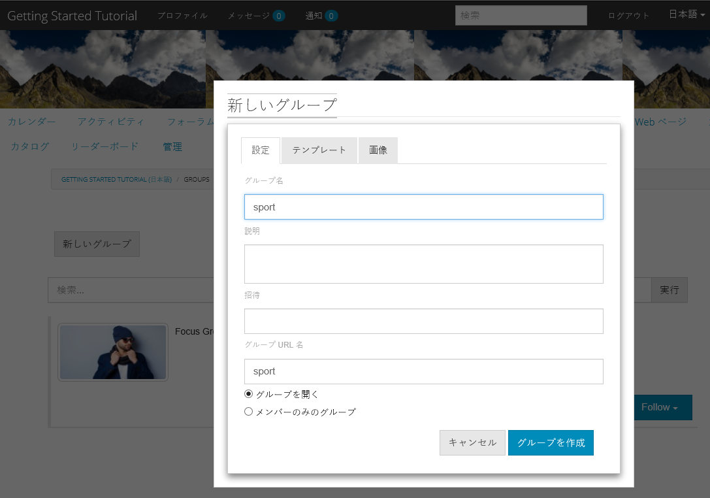

参照グループの作成：

1. 選択 **[!UICONTROL 新しいグループ]**
1. **[!UICONTROL 「設定」タブ]**
   * グループ名: `Sports`
   * 説明: `A parent group for various sporting groups`
   * グループ URL 名: `sports`
   * 選択 `Open Group` （コミュニティメンバーが参加することを許可）
1. **[!UICONTROL 「テンプレート」タブ]**
   * 選択 `Reference Group` （構造内にグループ機能を含み、ネストされたグループを許可します）
1. 選択 **[!UICONTROL グループを作成]**

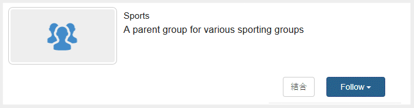

新しいグループが作成された後、 **新しいスポーツグループを選択します。** 2 つのグループ（ネスト）を作成するために、このグループ内にネストします。 サイト構造は、グループ機能で始めることができないので、Sports グループを開いた後、「グループ」リンクを選択する必要があります。

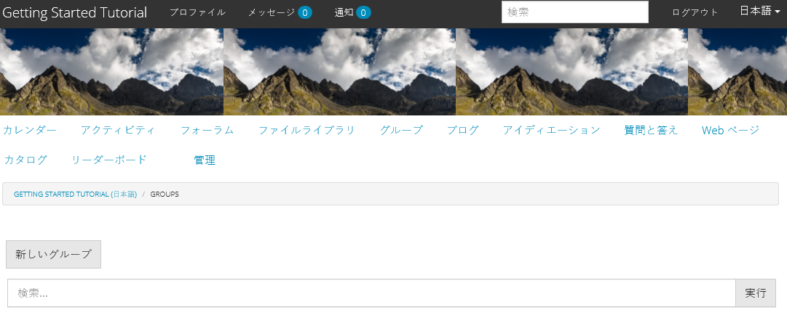

2 番目のリンクセット ( `Blog`( 現在選択されているグループに属し、 `Sports`グループ化します。 「スポーツ」 `Groups` リンクを使用すると、Sports グループ内に 2 つのグループをネストできます。

例えば、 n を 2 つ追加します。 `ew groups.`

* 次の名前の 1 つ： `Baseball`
   * 設定を `Open Group` （必須メンバーシップ）
   * 「テンプレート」タブで、「 `Conversational Group`
* 次の名前の 1 つ： `Gymnastics`
   * 設定をに変更します。 `Member Only Group` （メンバーシップの制限）
   * 「テンプレート」タブで、「 `Conversational Group`

**注意**:

* 両方のグループが表示される前に、ページの更新が必要になる場合があります
* このテンプレートにはグループ機能が含まれていないので、これ以上グループをネストすることはできません
* 作成者の場合、 [グループコンソール](groups.md) は 3 つ目の選択肢を提供します。 `Public Group` （オプションのメンバーシップ）

両方のグループを作成したら、Baseball グループ（開いているグループ）を選択し、リンクに注目します。 `Discussions` `What's New` `Members`
グループのリンクはメインサイトのリンクの下に表示され、結果として次のように表示されます。

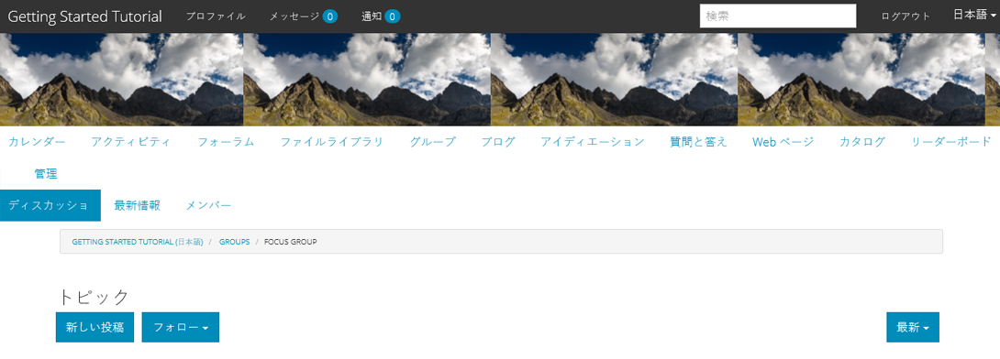

オーサー環境で、管理者権限を持つユーザーが [コミュニティグループコンソール](members.md) をクリックし、Weston McCall を `Community Engage Gymnastics <uid> Members` グループ化します。

公開後、Aaron McDonald としてログアウトし、Sports Group 内のグループを匿名のサイト訪問者として表示します。

* ホームページから
* 選択 `Groups`リンク
* 選択 `Sports`リンク
* スポーツを選択&#39; `Groups`リンク

野球グループのみが表示されます。

Weston McCall(weston.mccall@dodgit.com / password) としてログインし、同じ場所に移動します。 Weston が `Join` 開場 `Baseball` グループ化し、次のいずれかを選択します。 `enter or Leave` 私人 `Gymnastics`グループ化します。

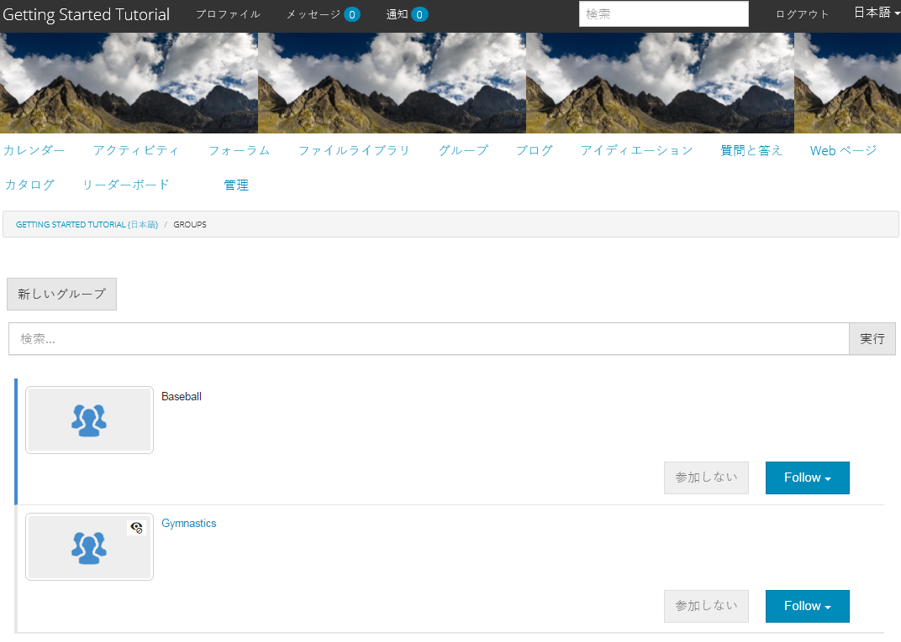

## Web ページリンク {#web-page-link}

「Web ページ」リンクを選択して、サイトに含まれる基本 Web ページを表示します。 標準のAEMオーサリングツールを使用して、オーサー環境でこのページにコンテンツを追加できます。

例えば、次に移動します。 **作成者** インスタンス、 `engage` フォルダーを [コミュニティサイトコンソール](sites-console.md)を選択し、 **サイトを開く** アイコンをクリックしてオーサリング編集モードに入ります。 次に、プレビューモードを選択して、 `Web Page`リンクをクリックし、「編集モード」を選択して、タイトルコンポーネントとテキストコンポーネントを追加します。 最後に、ページのみ、またはサイト全体を再公開します。

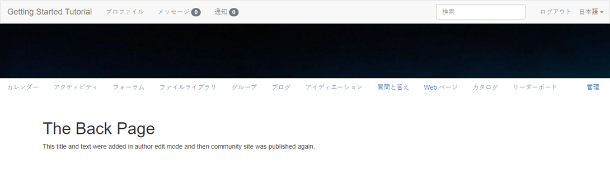

## 管理リンク {#administration-link}

コミュニティメンバーがモデレート権限を持っている場合は、「管理」リンクが表示され、このリンクを選択すると、投稿されたコミュニティコンテンツが表示され、投稿されたコミュニティコンテンツを使用できるようになります [モデレート済み](moderate-ugc.md) ～に似た方法で [モデレートコンソール](moderation.md) （オーサー環境で）

ブラウザーの「戻る」ボタンを使用して、公開済みのサイトに戻ります。 ほとんどのコンソールは、パブリッシュ環境のグローバルナビゲーションからはアクセスできません。

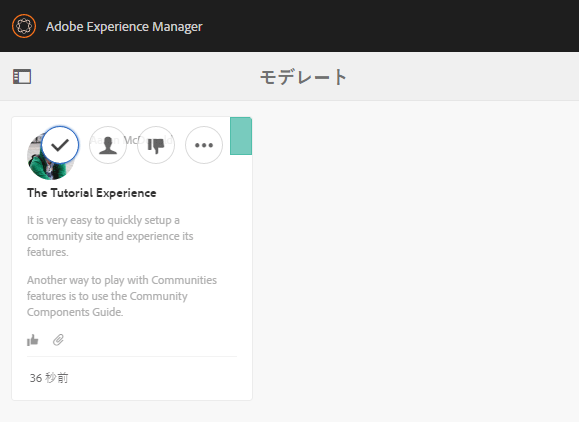

## 自己登録 {#self-registration}

ログアウト後に、新しいユーザー登録を作成できます。

* 選択 `Log In`
* 選択 `Sign up for a new account`

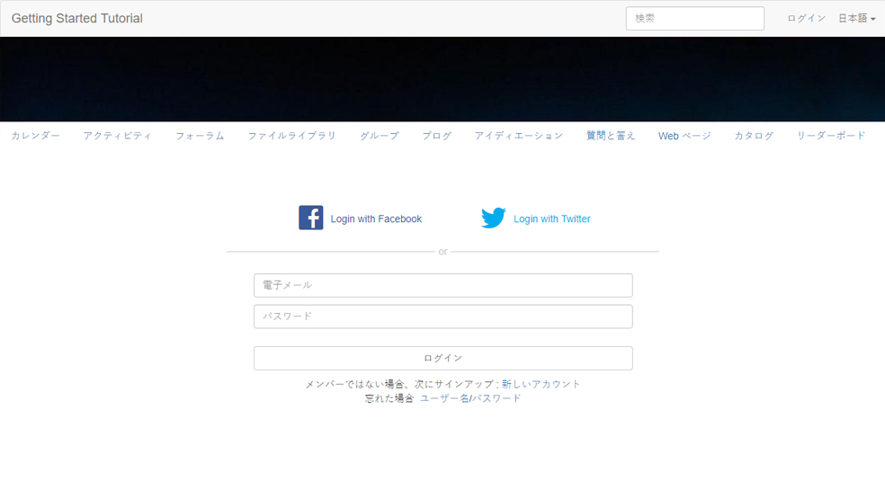 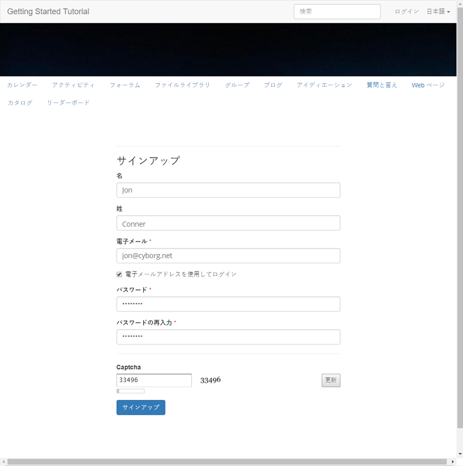

デフォルトでは、電子メールアドレスはログイン ID です。 オフにすると、訪問者は独自のログイン ID（ユーザー名）を入力できます。 ユーザー名は、パブリッシュ環境で一意である必要があります。

ユーザーの名前、電子メールおよびパスワードを指定した後、「 」を選択します。 `Sign Up`ユーザーを作成し、署名を有効にします。

サインインすると、最初に表示されるページが `Profile`ページに貼り付けることができます。

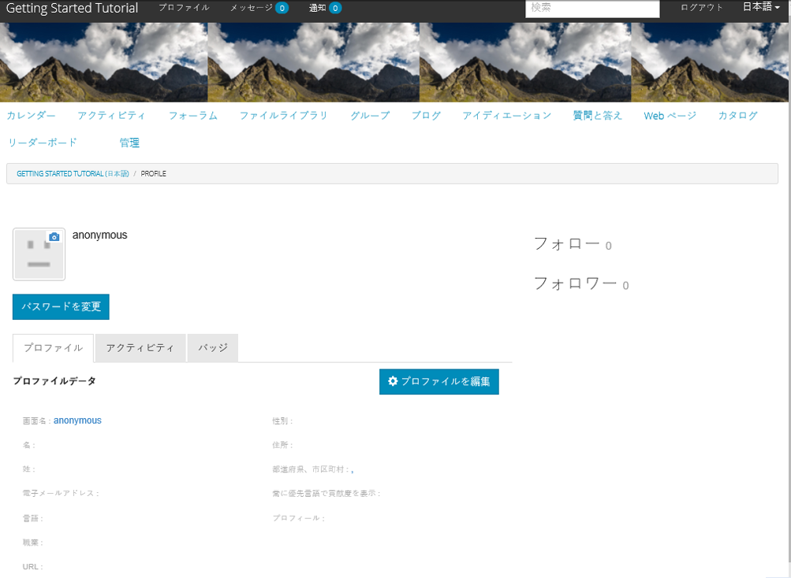

メンバーがログイン ID を忘れた場合は、そのメールアドレスを使用して復元できます。

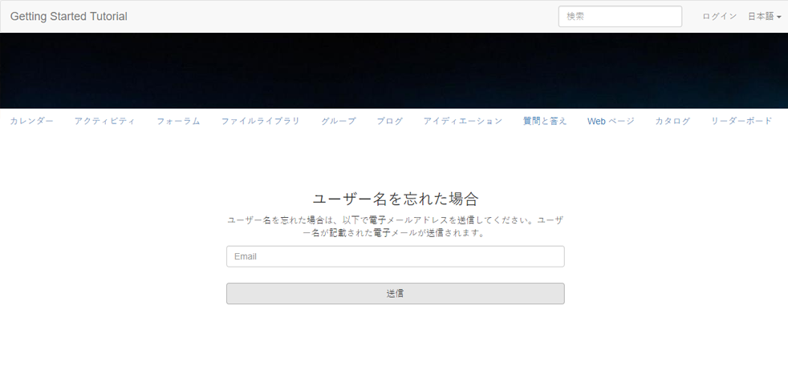
