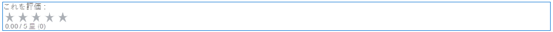
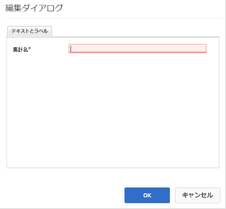

# 評価の使用 {#using-ratings}

>[!CAUTION]
>
>AEM 6.4 の拡張サポートは終了し、このドキュメントは更新されなくなりました。 詳細は、 [技術サポート期間](https://helpx.adobe.com/jp/support/programs/eol-matrix.html). サポートされているバージョンを見つける [ここ](https://experienceleague.adobe.com/docs/?lang=ja).

この `Rating`コンポーネントは、スタンドアロンで、または他のコミュニティ機能と組み合わせて使用されます。 このコンポーネントを使用すると、サインインしたコミュニティメンバーは、コンテンツを評価して意見を表明できます。

## ページへの評価の追加 {#adding-a-rating-to-a-page}

を追加するには、以下を実行します。 `Rating`コンポーネントをオーサリングモードでページに追加する場合は、 `Communities / Rating` をクリックし、ページ上の適切な位置（メンバーが評価する機能を基準とした位置など）にドラッグします。

必要な情報については、 [コミュニティコンポーネントの基本](basics.md).

次の場合に [必要なクライアント側ライブラリ](rating-basics.md#essentials-for-client-side) が含まれる場合、この方法で `Rating` コンポーネントが表示されます。

## 評価の設定 {#configuring-rating}

配置された `Rating` アクセスして選択するコンポーネント `Configure` 編集ダイアログを開くアイコン。

以下 **[!UICONTROL テキストとラベル]** 」タブでは、評価の内部識別子を指定します。

**[!UICONTROL 集計名]**
(*必須*) `Rating`このインスタンスを一意に識別する リポジトリの有効なノード名を指定する必要があります。

## サイト訪問者エクスペリエンス {#site-visitor-experience}

### メンバー {#members}

メンバーごとに 1 つの評価のみが許可されます。 会員は、いつでも評価を変更することができます。

### 匿名 {#anonymous}

匿名での評価の投稿はサポートされていません。 サイト訪問者が参加するには、登録（メンバーになる）してサインインする必要があります。

## 追加情報 {#additional-information}

詳しくは、 [評価の基本事項](rating-basics.md) 開発者向けのページ
