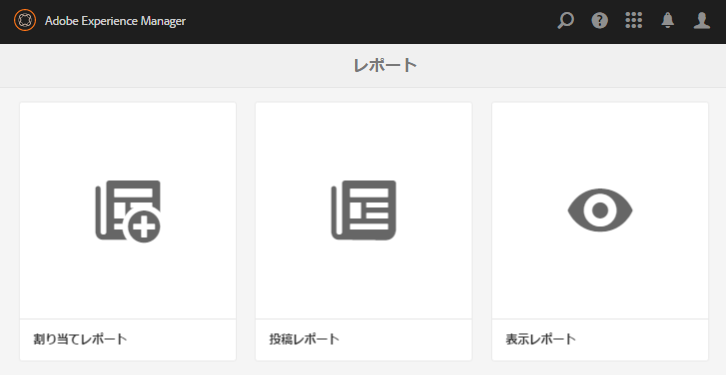
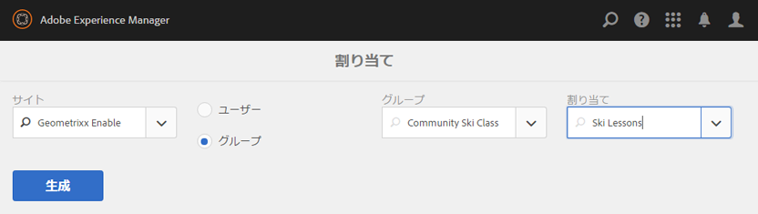
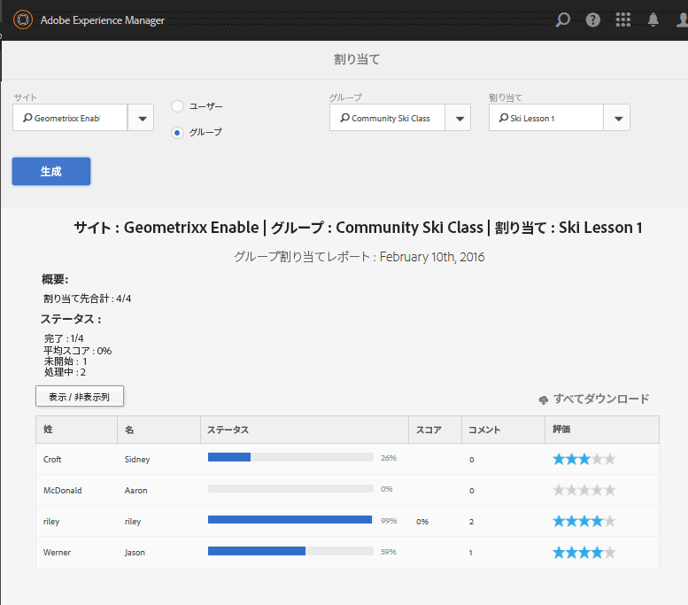
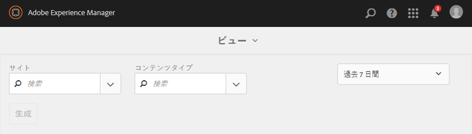
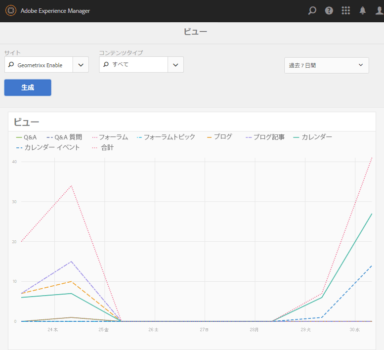
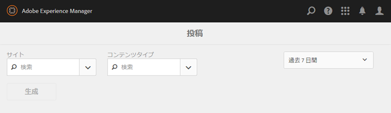
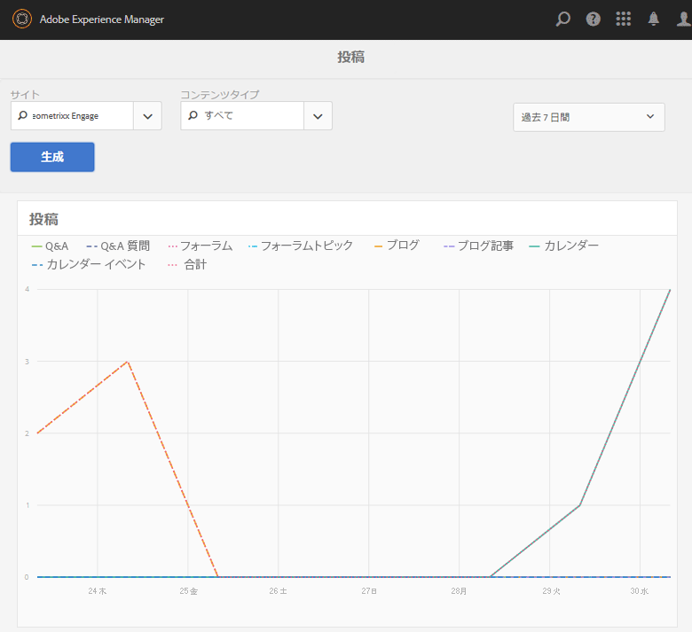

# レポートコンソール {#reports-console}

## 概要 {#overview}

AEM Communities には様々なレポートがあり、オーサー環境から複数の方法でアクセスできます。

通常、レポートには以下のものがあります。

* [割り当てレポート](#assignments-report) - [有効化コミュニティ用に](overview.md#enablement-community)、SCORM標準を実装する場合の関連スコアを含む、学習者の割り当てに関する進捗の概要が表示されます。
* [表示レポート](#views-report)  — コミュニティのメンバー別、および任意のコミュニティサイトのサイト訪問者別のコンテンツの表示のグラフを提供します。
* [投稿レポート](#posts-report)  — コミュニティメンバー別の様々なタイプの投稿を、任意のコミュニティサイトにグラフで表示します。

[Adobe Analyticsが有効](sites-console.md#analytics)の場合、レポートには、有効化された各リソースの表示数、再生数、コメント数、評価数が時間の経過と共に含まれます

表形式のレポートは .csv 形式でエクスポートして別の処理に使用できます。

## レポートコンソール  {#reporting-consoles}

### コミュニティサイトのレポート {#reports-for-community-sites}

* グローバルナビゲーションから：**[!UICONTROL ナビゲーション>コミュニティ>レポート]**
* 次から選択
   * **[!UICONTROL 割り当てレポート]**
      * 選択したコミュニティサイト、ユーザーまたはグループ、および割り当てに関するレポートを生成します
   * **[!UICONTROL 投稿レポート]**
      * 選択したコミュニティサイト、コンテンツタイプ、期間に関するレポートを生成します
   * **[!UICONTROL 表示レポート]**
      * 選択したコミュニティサイト、コンテンツタイプ、期間に関するレポートを生成します
         

### イネーブルメントリソースと学習パスのレポート {#reports-for-enablement-resources-and-learning-paths}

* グローバルナビゲーションから：**[!UICONTROL ナビゲーション>コミュニティ>リソース]**
* 既存の有効化コミュニティサイトを選択します
   * **[!UICONTROL レポート]**&#x200B;アイコンを選択して、有効化されたすべてのリソースを対象とするレポートを生成します
   * 有効化の学習パスを選択します
   * **[!UICONTROL レポート]**&#x200B;アイコンを選択して、レポートを生成します
      * 付属の有効化リソース
      * 学習パスに割り当てられた学習者
* これらのレポートには、次の機能があります。
   * 表データ（CSVとしてダウンロード可能）
      * 学習者の識別
      * 彼らの地位
      * カタログを使用して割り当てるか、アクセスするか
      * コメントの数
      * 与えられた星評価

詳しくは、リソースコンソールの[レポートセクション](resources.md#report)を参照してください。

## 割り当てレポート  {#assignments-report}

割り当てコンソールでは、イネーブルメントコミュニティサイト、ユーザー、グループおよび割り当てによってレポートをフィルタリングできます。

このレポートには、進捗状況に関する情報と、コメントや評価がある場合はそれも表示されます。

レポートのフィルタリング条件を選択します。

* **[!UICONTROL Site有効化コミュニティサイトを]**
選択します
* **[!UICONTROL ユーザーまたはグループ]**
   * 「ユーザー」を選択して、1人の学習者のレポートを生成します
   * 「グループ」を選択して、学習者グループのレポートを生成します
トンネルサービスは、パブリッシュ環境からメンバーとメンバーグループにアクセスします
* **[!UICONTROL 割り当て]**&#x200B;選択した学習者に割り当てられているイネーブルメントリソースの中から選択します。

「**[!UICONTROL 生成]**」を選択してレポートを作成します。

## Views Report {#views-report}

表示コンソールでは、指定した期間におけるコミュニティ機能別のページ表示回数のレポートを生成できます。

レポートのフィルタリング条件を選択します。

* **[!UICONTROL Siteコミュニティサイトを]**
選択します。
* **[!UICONTROL コンテンツの]**
種類「すべて」を選択するか、サイトに存在する機能の1つを選択できます。
* 時間枠
次のいずれかを選択します。
   * 過去 7 日間
   * 過去 30 日間
   * 過去 90 日間
   * 昨年

「**[!UICONTROL 生成]**」を選択してレポートを作成します。

## Posts Report {#posts-report}

投稿コンソールでは、指定した期間におけるコミュニティ機能への投稿数のレポートを生成できます。

レポートのフィルタリング条件を選択します。

* **[!UICONTROL Siteコミュニティサイトを]**
選択します。
* **[!UICONTROL コンテンツの]**
種類「すべて」を選択するか、サイトに存在する機能の1つを選択できます。
* 時間枠
次のいずれかを選択します。
   * 過去 7 日間
   * 過去 30 日間
   * 過去 90 日間
   * 昨年

「**[!UICONTROL 生成]**」を選択してレポートを作成します。

## トラブルシューティング {#troubleshooting}

### コミュニティサイトが 1 つも表示されない {#no-community-sites-listed}

コミュニティサイトが 1 つも表示されない場合は、Adobe Analytics がサイトに対して有効になっているかを確認してください。割り当てに関するレポートを選択する場合は、割り当て機能がコミュニティサイトの構造にあることを確認します。
