# イネーブルメントリソースの作成と割り当て {#create-and-assign-enablement-resources}

## イネーブルメントリソースの追加 {#add-an-enablement-resource}

新しいコミュニティサイトにイネーブルメントリソースを追加するには：

* オーサーインスタンス上
   * 例： [http://localhost:4502/](http://localhost:4503/)
* システム管理者としてサインイン
* グローバルナビゲーションから、 **コミュニティ/ [リソース](resources.md)**

   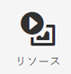
   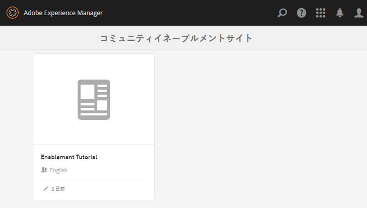
* イネーブルメントリソースを追加するコミュニティサイトを選択します。
   *  `Enablement Tutorial`
* メニューから、 ` Create`
* 選択 **[!UICONTROL リソース]**

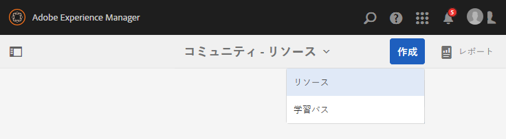

### 基本情報 {#basic-info}

以下のとおり、リソースの基本情報を入力します。

* **[!UICONTROL サイト名]**：選択したコミュニティサイトの名前（Enablement Tutorial）に設定されます。
* **[!UICONTROL リソース名&amp;ast;]**:スキーレッスン 1
* **[!UICONTROL タグ]**：Tutorial: Sports / Skiing
* **[!UICONTROL カタログに表示]**：オン
* **[!UICONTROL 説明]**：Sliding on snow for beginners
* **[!UICONTROL 画像を追加]**:割り当てビューでメンバに対するリソースを表す画像を追加します
   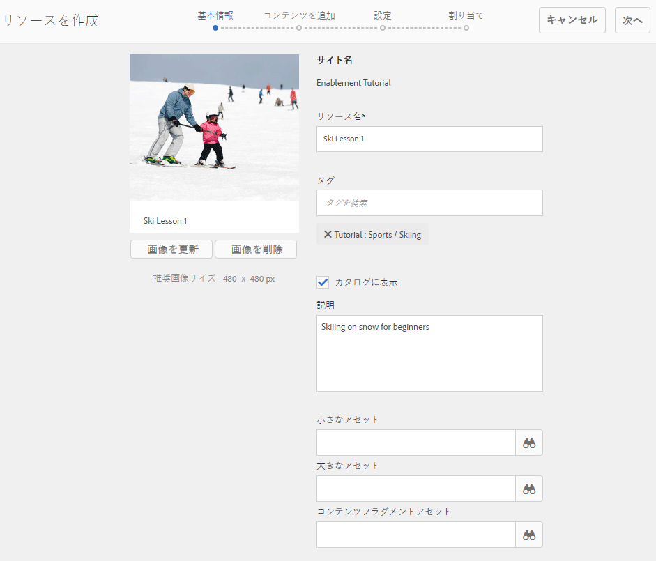
* 「**[!UICONTROL 次へ]**」を選択します。

### コンテンツの追加 {#add-content}

複数のリソースを選択できるように見えますが、選択できるのは 1 つだけです。

を選択します。 `'+' icon`の右上隅にあるをクリックし、ソースを識別してリソースを選択するプロセスを開始します。

 

リソースをアップロードします。ビデオリソースの場合は、ビデオの再生が開始される前に表示するカスタム画像をアップロードするか、ビデオからサムネールを生成できます（数分かかる場合があります。待つ必要はありません）。

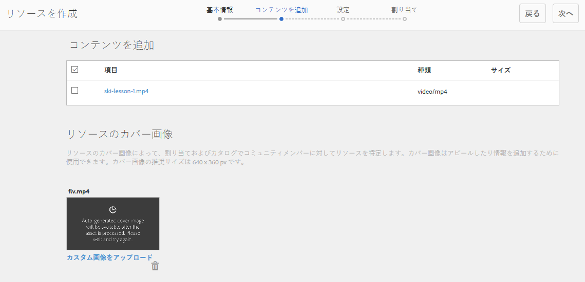

* 「**[!UICONTROL 次へ]**」を選択します。

### 設定 {#settings}

* **[!UICONTROL ソーシャルの設定]**&#x200B;学習者がイネーブルメントリソースにコメントや評価を付ける機能を体験するには、デフォルトの設定を維持します。
* **[!UICONTROL 期限]**

   *（オプション）* 割り当てを完了する日付を選択できます。
* **[!UICONTROL リソース作成者]**

   *（オプション）* 空白のままにします。
* **[!UICONTROL リソース連絡先&amp;ast;]**

   *（必須）* プルダウンメニューを使用してメンバを選択 `Quinn Harper`.
* **[!UICONTROL リソースエキスパート]**

   *（オプション）* 空白のままにします。
   **注意**:ユーザーまたはグループが表示されない場合は、 `Community Enable Members` グループと *保存済み* パブリッシュインスタンス上で
   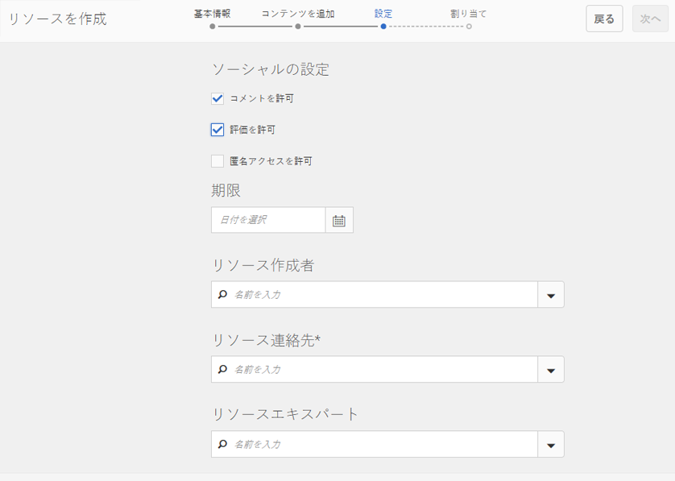
* 「**[!UICONTROL 次へ]**」を選択します。

### 割り当て {#assignments}

* **[!UICONTROL 割り当て先を追加]**&#x200B;ここでは未設定のままにします。このイネーブルメントリソースは学習パスに追加されるからです。学習者が個々のイネーブルメントリソースとイネーブルメントリソースを含む learningPath に割り当てられている場合、学習者はイネーブルメントリソースに 2 回割り当てられます。

* 「**[!UICONTROL 作成]**」を選択します。

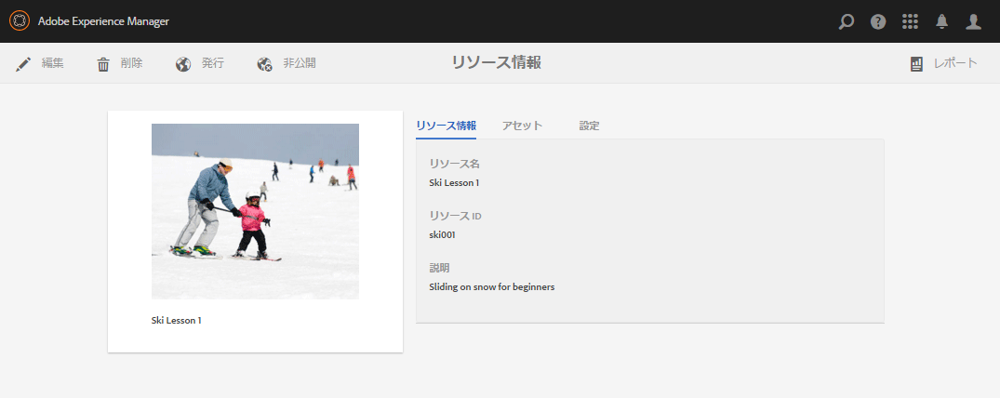

リソースが正常に作成されると、リソースコンソールに戻ります。新しく作成されたリソースが選択状態になっています。このコンソールから、学習者を公開、追加し、他の設定を変更できます。

新しいバージョンのイネーブルメントリソースをアップロードする際は、新しいリソースを作成したうえで、古いバージョンのリソースからメンバーを登録解除して新しいバージョンのリソースに登録することを推奨します。

### リソースの公開 {#publish-the-resource}

登録者が割り当てられたリソースを確認できるようにするには、その前に次の手順でリソースを公開する必要があります。

* 世界を選択 `Publish`アイコン

アクティベーションが成功したことを示す以下のメッセージが表示されます。

## 2 つ目のイネーブルメントリソースの追加 {#add-a-second-enablement-resource}

上記の手順を繰り返し、学習パス作成用の関連するイネーブルメントリソースを作成して公開します。

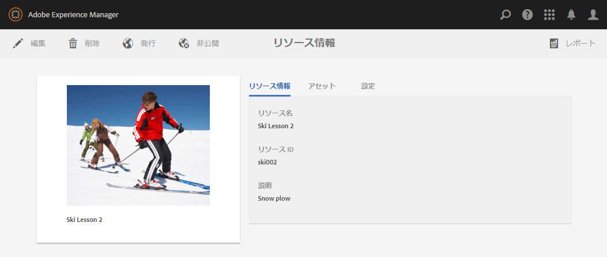

**公開** 2 つ目の Resource

Enablement Tutorial のリソースのリストに戻ります。

ヒント：どちらのリソースも表示されない場合は、ページを更新してください。**

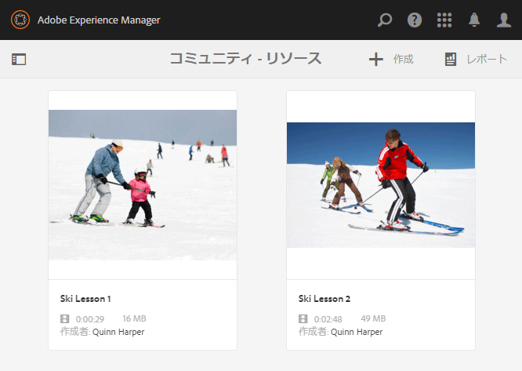

## 学習パスの追加 {#add-a-learning-path}

学習パスは、複数のイネーブルメントリソースを論理的にグループ化して 1 つのコースとしたものです。

* リソースコンソールで、「 `+ Create`
* 選択 **[!UICONTROL 学習パス]**

**[!UICONTROL 基本情報]**&#x200B;を追加します。

* **[!UICONTROL 学習パス名]**:Ski Lessons
* **[!UICONTROL タグ]**：Tutorial: Skiing
* **[!UICONTROL カタログに表示]**：オフのまま
* **[!UICONTROL 画像をアップロード]** リソースコンソールで学習パスを表すには

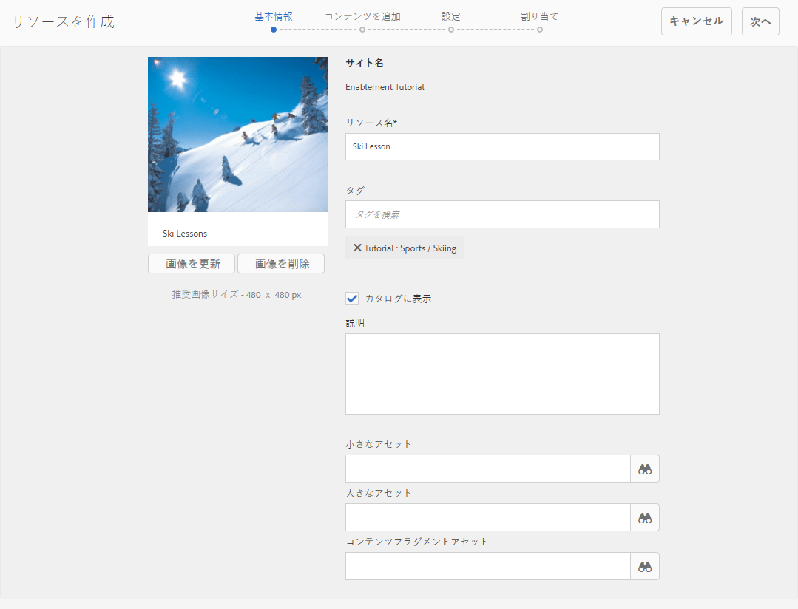

* 「**[!UICONTROL 次へ]**」を選択します。

前提条件となる追加する学習パスがないので、次のパネルをスキップします。

* 「**[!UICONTROL 次へ]**」を選択します。

リソースを追加パネルで、次の操作をおこないます。

* 選択 `+ Add Resources` 学習パスに追加する 2 つのスキーレッスンリソースを選択するには

   注意：のみ **公開済み** リソースは選択可能です。

>[!NOTE]
>
>学習パスと同じレベルのリソースのみを選択できます。例えば、グループ内に作成された学習パスには、グループレベルのリソースのみを使用できます。コミュニティサイト内に作成された学習パスには、そのサイト内のリソースを追加できます。

* 「**[!UICONTROL 送信]**」を選択します。

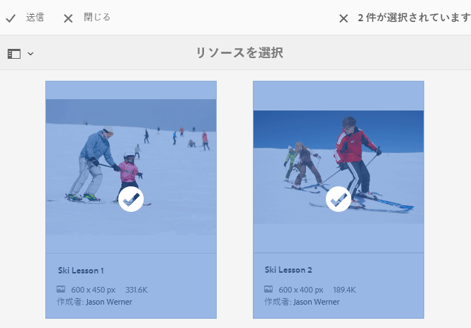 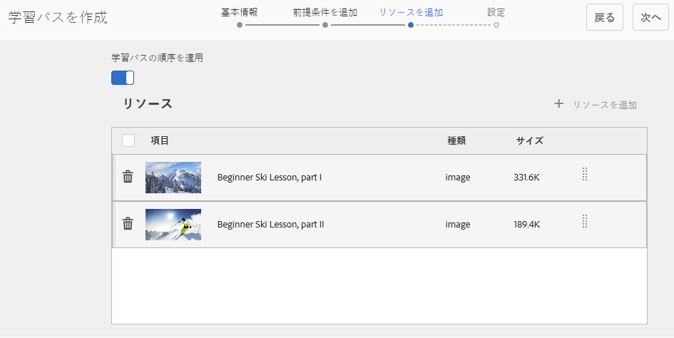

* 「**[!UICONTROL 次へ]**」を選択します。

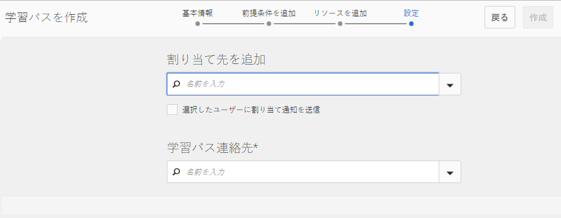

* **[!UICONTROL 担当者を追加]**
プルダウンメニューを使用して、 
`Community Ski Class` メンバーを含むグループ `Riley Taylor` および `Sidney Croft.`

* **[!UICONTROL 学習パスの連絡先&amp;ast;]**

   *（必須）* プルダウンメニューを使用してメンバを選択 `Quinn Harper`.

* 「**[!UICONTROL 作成]**」を選択します。

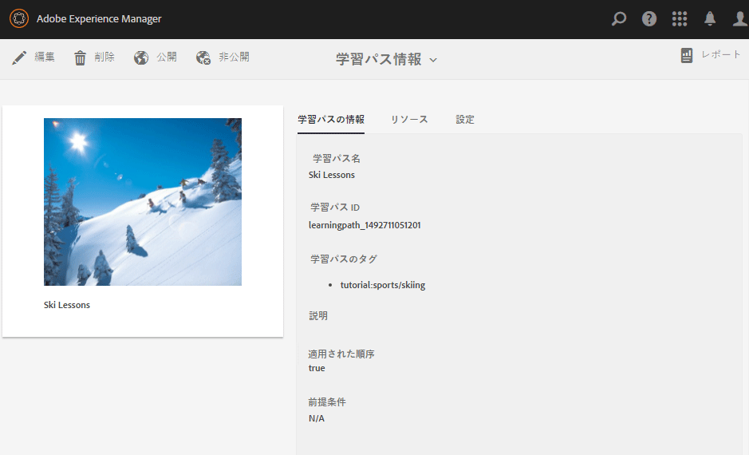

学習パスが正常に作成されると、リソースコンソールに戻ります。新しく作成された学習パスが選択状態になっています。このコンソールから、学習者を公開、追加し、他の設定を変更できます。

学習パスを&#x200B;**公開**&#x200B;します。
