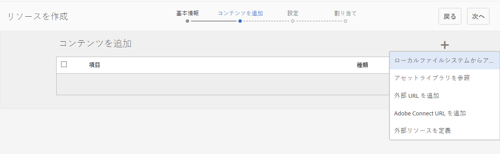

# イネーブルメントリソースの作成と割り当て {#create-and-assign-enablement-resources}

## イネーブルメントリソースの追加 {#add-an-enablement-resource}

新しいコミュニティサイトにイネーブルメントリソースを追加するには：

* オーサーインスタンス上
   * 例： [http://localhost:4502/](http://localhost:4503/)
* システム管理者としてログインする
* グローバルナビゲーションから、**コミュニティ/[リソース](resources.md)**を選択します。

   
   
* イネーブルメントリソースを追加するコミュニティサイトを選択します。
   *  `Enablement Tutorial`
* メニューから` Create`を選択します。
* **[!UICONTROL Resource]**&#x200B;を選択します。

### 基本情報 {#basic-info}

以下のとおり、リソースの基本情報を入力します。

* **[!UICONTROL サイト名]**：選択したコミュニティサイトの名前（Enablement Tutorial）に設定されます。
* **[!UICONTROL リソース名(&amp;A);]**:Ski Lesson 1
* **[!UICONTROL タグ]**：Tutorial: Sports / Skiing
* **[!UICONTROL カタログに表示]**：オン
* **[!UICONTROL 説明]**：Sliding on snow for beginners
* **[!UICONTROL 画像を追加]**:割り当てビューでメンバーにリソースを表す画像を追加します
   
* 「**[!UICONTROL 次へ]**」を選択します。

### コンテンツの追加 {#add-content}

複数のリソースを選択できるように見えますが、選択できるのは 1 つだけです。

右上隅の`'+' icon`を選択し、ソースを識別してリソースを選択するプロセスを開始します。

 

リソースをアップロードします。ビデオリソースの場合は、ビデオの再生を開始する前に表示するカスタム画像をアップロードするか、ビデオからサムネールを生成できるようにします（数分かかる場合があります。待つ必要はありません）。

* 「**[!UICONTROL 次へ]**」を選択します。

### 設定 {#settings}

* **[!UICONTROL ソーシャルの設定]**&#x200B;学習者がイネーブルメントリソースにコメントや評価を付ける機能を体験するには、デフォルトの設定を維持します。
* **[!UICONTROL 期限]**

   *（オプション）* 割り当てを完了する日付を選択できます。
* **[!UICONTROL リソース作成者]**

   *（オプション）* 空白のままにします。
* **[!UICONTROL リソース連絡先(&amp;A);]**

   *（必須）* プルダウンメニューを使用してメンバーを選択しま `Quinn Harper`す。
* **[!UICONTROL リソースエキスパート]**

   *（オプション）* 空白のままにします。
   **注意**:ユーザーまたはグループが表示されない場合は、それらがグループに追加され、パブリッシュインスタ `Community Enable Members` ンスに保 ** 存されたことを確認します。
   
* 「**[!UICONTROL 次へ]**」を選択します。

### 割り当て {#assignments}

* **[!UICONTROL 割り当て先を追加]**&#x200B;ここでは未設定のままにします。このイネーブルメントリソースは学習パスに追加されるからです。学習者が個々のイネーブルメントリソースと、イネーブルメントリソースを含む学習pPathに割り当てられると、学習者はイネーブルメントリソースに2回割り当てられます。

* 「**[!UICONTROL 作成]**」を選択します。

リソースが正常に作成されると、リソースコンソールに戻ります。新しく作成されたリソースが選択状態になっています。このコンソールから、学習者の公開、追加、その他の設定の変更を行うことができます。

新しいバージョンのイネーブルメントリソースをアップロードする際は、新しいリソースを作成したうえで、古いバージョンのリソースからメンバーを登録解除して新しいバージョンのリソースに登録することを推奨します。

### リソースの公開  {#publish-the-resource}

登録者が割り当てられたリソースを確認できるようにするには、その前に次の手順でリソースを公開する必要があります。

* ワールド`Publish`アイコンを選択します。

アクティベーションが成功したことを示す以下のメッセージが表示されます。

## 2 つ目のイネーブルメントリソースの追加 {#add-a-second-enablement-resource}

上記の手順を繰り返し、学習パス作成用の関連するイネーブルメントリソースを作成して公開します。

**** 2つ目のリソースを公開します。

Enablement Tutorial のリソースのリストに戻ります。

ヒント：どちらのリソースも表示されない場合は、ページを更新してください。**

## 学習パスの追加 {#add-a-learning-path}

学習パスは、複数のイネーブルメントリソースを論理的にグループ化して 1 つのコースとしたものです。

* リソースコンソールで、「`+ Create`」を選択します。
* **[!UICONTROL 学習パス]**&#x200B;を選択します。

**[!UICONTROL 基本情報]**&#x200B;を追加します。

* **[!UICONTROL 学習パス名]**:Ski Lessons
* **[!UICONTROL タグ]**：Tutorial: Skiing
* **[!UICONTROL カタログに表示]**：オフのまま
* **[!UICONTROL リソースコンソ]** ールでの学習パスを表す画像のアップロード

* 「**[!UICONTROL 次へ]**」を選択します。

前提条件となる追加する学習パスがないので、次のパネルをスキップします。

* 「**[!UICONTROL 次へ]**」を選択します。

リソースを追加パネルで、次の操作をおこないます。

* `+ Add Resources`を選択して、学習パスに追加する2つのスキーレッスンリソースを選択します。

   注意：選択できるリソースは&#x200B;**公開済み**&#x200B;のみです。

>[!NOTE]
>
>学習パスと同じレベルのリソースのみを選択できます。例えば、グループ内に作成された学習パスには、グループレベルのリソースのみを使用できます。コミュニティサイト内に作成された学習パスには、そのサイト内のリソースを追加できます。

* 「**[!UICONTROL 送信]**」を選択します。

 

* 「**[!UICONTROL 次へ]**」を選択します。

* **[!UICONTROL 割り当て]**
先の追加プルダウンメニューを使用して、 
`Community Ski Class` グループ(メンバーと `Riley Taylor`   `Sidney Croft.`

* **[!UICONTROL 学習パスの連絡先(&amp;A);]**

   *（必須）* プルダウンメニューを使用してメンバーを選択しま `Quinn Harper`す。

* 「**[!UICONTROL 作成]**」を選択します。

学習パスが正常に作成されると、リソースコンソールに戻ります。新しく作成された学習パスが選択状態になっています。このコンソールから、学習者の公開、追加、その他の設定の変更を行うことができます。

学習パスを&#x200B;**公開**&#x200B;します。
