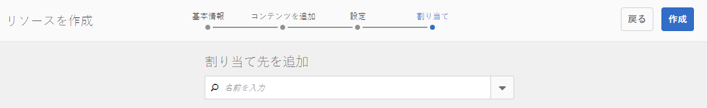

# イネーブルメントリソースの作成と割り当て {#create-and-assign-enablement-resources}

>[!CAUTION]
>
>AEM 6.4 の拡張サポートは終了し、このドキュメントは更新されなくなりました。 詳細は、 [技術サポート期間](https://helpx.adobe.com/jp/support/programs/eol-matrix.html). サポートされているバージョンを見つける [ここ](https://experienceleague.adobe.com/docs/?lang=ja).

## イネーブルメントリソースの追加 {#add-an-enablement-resource}

新しいコミュニティサイトにイネーブルメントリソースを追加するには、次の手順を実行します。

* オーサーインスタンス上
   * 例： [http://localhost:4502/](http://localhost:4503/)
* システム管理者としてサインイン
* グローバルナビゲーションから、 **コミュニティ/ [リソース](resources.md)**

   
   
* イネーブルメントリソースを追加するコミュニティサイトを選択します。
   * `Enablement Tutorial` を選択します。
* メニューから、 ` Create`
* 選択 **[!UICONTROL リソース]**

### 基本情報 {#basic-info}

リソースの基本情報を入力します。

* **[!UICONTROL サイト名]**:選択したコミュニティサイトの名前に設定します。イネーブルメントチュートリアル
* **[!UICONTROL リソース名&amp;ast;]**:スキーレッスン 1
* **[!UICONTROL タグ]**:チュートリアル：スポーツ/スキー
* **[!UICONTROL カタログに表示]**:オン
* **[!UICONTROL 説明]**:初心者向けの雪滑り
* **[!UICONTROL 画像を追加]**:割り当てビューでメンバに対するリソースを表す画像を追加します
   
* 選択 **[!UICONTROL 次へ]**

### コンテンツの追加 {#add-content}

複数のリソースが選択されている可能性がある場合は表示されますが、1 つのみが許可されます。

を選択します。 `'+' icon`の右上隅にあるをクリックし、ソースを識別してリソースを選択するプロセスを開始します。

 

リソースをアップロードします。 ビデオリソースの場合は、ビデオの再生が開始される前に表示するカスタム画像をアップロードするか、ビデオからサムネールを生成できます（数分かかる場合があります。待つ必要はありません）。

* 選択 **[!UICONTROL 次へ]**

### 設定 {#settings}

* **[!UICONTROL ソーシャルの設定]**
学習者によるイネーブルメントリソースのコメントや評価を体験するには、デフォルト設定をそのままにします。
* **[!UICONTROL 期限]**

   *（オプション）* 割り当てを完了する日付を選択できます。
* **[!UICONTROL リソース作成者]**

   *（オプション）* 空白のままにします。
* **[!UICONTROL リソース連絡先&amp;ast;]**

   *（必須）* プルダウンメニューを使用してメンバを選択 `Quinn Harper`.
* **[!UICONTROL リソースエキスパート]**

   *（オプション）* 空白のままにします。
   **注意**:ユーザーまたはグループが表示されない場合は、 `Community Enable Members` グループと *保存済み* パブリッシュインスタンス上で
   
* 選択 **[!UICONTROL 次へ]**

### 割り当て {#assignments}

* **[!UICONTROL 担当者を追加]**
このイネーブルメントリソースが学習パスに追加されるので、設定を解除します。 学習者が個々のイネーブルメントリソースとイネーブルメントリソースを含む learningPath に割り当てられている場合、学習者はイネーブルメントリソースに 2 回割り当てられます。

* 選択 **[!UICONTROL 作成]**

リソースが正常に作成されると、新しく作成されたリソースが選択された状態でリソースコンソールに戻ります。 このコンソールから、学習者を公開、追加し、他の設定を変更できます。

イネーブルメントリソースの新しいバージョンをアップロードするには、新しいリソースを作成し、古いバージョンからメンバーの登録を解除して新しいバージョンに登録することをお勧めします。

### リソースの公開 {#publish-the-resource}

登録者が割り当てられたリソースを表示できるようにするには、次の手順でリソースを公開する必要があります。

* 世界を選択 `Publish`アイコン

アクティベーションが成功メッセージと共に確認されました。

## 2 つ目のイネーブルメントリソースを追加する {#add-a-second-enablement-resource}

上記の手順を繰り返して、学習パスの作成に使用する 2 つ目の関連するイネーブルメントリソースを作成して公開します。

**公開** 2 つ目の Resource

リソースのイネーブルメントチュートリアルのリストに戻ります。

*ヒント：両方のリソースが表示されない場合は、ページを更新します。*

## 学習パスを追加 {#add-a-learning-path}

学習パスは、コースを構成するイネーブルメントリソースの論理的なグループです。

* リソースコンソールで、「 `+ Create`
* 選択 **[!UICONTROL 学習パス]**

を **[!UICONTROL 基本情報]**:

* **[!UICONTROL 学習パス名]**:Ski Lessons
* **[!UICONTROL タグ]**:チュートリアル：スキー
* **[!UICONTROL カタログに表示]**:オフにする
* **[!UICONTROL 画像をアップロード]** リソースコンソールで学習パスを表すには

* 選択 **[!UICONTROL 次へ]**

追加する前提条件となる学習パスがないので、次のパネルをスキップします。

* 選択 **[!UICONTROL 次へ]**

リソースを追加パネル

* 選択 `+ Add Resources` 学習パスに追加する 2 つのスキーレッスンリソースを選択するには

   注意：のみ **公開済み** リソースは選択可能です。

>[!NOTE]
>
>学習パスと同じレベルで利用可能なリソースのみを選択できます。 例えば、グループ内に作成された学習パスの場合、グループレベルのリソースのみを使用できます。コミュニティサイトで作成された学習パスの場合は、そのサイトのリソースを学習パスに追加できます。

* 「**[!UICONTROL 送信]**」を選択します。

 

* 選択 **[!UICONTROL 次へ]**

* **[!UICONTROL 担当者を追加]**
プルダウンメニューを使用して、 
`Community Ski Class` メンバーを含むグループ `Riley Taylor` および `Sidney Croft.`

* **[!UICONTROL 学習パスの連絡先&amp;ast;]**

   *（必須）* プルダウンメニューを使用してメンバを選択 `Quinn Harper`.

* 選択 **[!UICONTROL 作成]**

学習パスが正常に作成されると、リソースコンソールに戻り、新しく作成された学習パスが選択されます。 このコンソールから、学習者を公開、追加し、他の設定を変更できます。

**公開** 学習パス。
