# イネーブルメントリソースのコンソール {#enablement-resources-console}

>[!CAUTION]
>
>AEM 6.4 の拡張サポートは終了し、このドキュメントは更新されなくなりました。 詳細は、 [技術サポート期間](https://helpx.adobe.com/jp/support/programs/eol-matrix.html). サポートされているバージョンを見つける [ここ](https://experienceleague.adobe.com/docs/?lang=ja).

AEM Communitiesの場合、リソースコンソールでは、 [実施可能マネージャー](users.md) イネーブルメントコミュニティサイトのメンバーに対して、リソースを作成、管理、割り当てます。

## 要件 {#requirements}

コミュニティサイトにイネーブルメントリソースを追加する前に、次のようにAEMインスタンスを適切に設定する必要があります。

* SCORM
* FFmpeg

詳しくは、 [有効化の設定](enablement.md).

>[!CAUTION]
>
>コミュニティサイトの作成後に SCORM をインストールした場合は、SCORM をインストールする前に存在するイネーブルメントリソースを再作成する必要があります。

>[!NOTE]
>
>のリリースに伴い [AEM 6.3](deploy-communities.md#latestfeaturepack) および同等のコミュニティの機能パック [AEM 6.2 FP3](deploy-communities.md#latestfeaturepack) および [AEM 6.1 FP7](https://docs.adobe.com/content/docs/en/aem/6-1/deploy/communities.html#Latest機能パック ) を使用する場合、イネーブルメント機能に [MySQL データベース](mysql.md).

## 用語 {#terminology}

### リソース {#resource}

リソースは [実施可能コミュニティ](overview.md#enablement-community). メンバーに割り当てられた資料で、メンバーのスキルを向上させることができます。

リソースの特性：

* タイプ
   * 画像 (JPG、PNG、GIF、BMP)
   * ビデオ (MP4)
   * Flash(SWF)
   * ドキュメント (PDF)
   * クイズ (SCORM)
* 1 つ以上の学習パスから参照できます

### 学習パス {#learning-path}

学習パスは、メンバーに割り当てやすくするためにグループ化されたイネーブルメントリソースの論理的なセットです。

### メンバーグループ {#members-group}

コミュニティサイトを作成すると、その URL に対してサイトに付けられた名前が [サイト固有のユーザーグループ](users.md) 様々な役割に対する様々な権限で設定されます。 これらの自動的に作成されたグループの前には、「 `Community *<site-name>*`.

そのようなユーザーグループの 1 つが、 `Community *<site-name>* Members` グループ：パブリッシュ環境の登録ユーザーをコミュニティメンバーとして識別します。 チュートリアルを参照 [AEM Communities使用の手引き](getting-started-enablement.md) 例：

の場合 [コミュニティ](overview.md#egagementcommunity)を使用する場合、サイト訪問者が自己登録またはソーシャルログインを使用できるようにすると、その時点で訪問者がメンバーグループに自動的に追加されます。

の場合 [実施可能コミュニティ](overview.md#enablement-community)サイトを非公開にすることをお勧めします。その場合は、管理者がユーザーをメンバーグループに追加する必要があります。

## コミュニティサイトのイネーブルメントリソースへのアクセス {#accessing-a-community-site-s-enablement-resources}

### コミュニティリソースに移動 {#navigate-to-communities-resources}

オーサー環境でリソースコンソールに移動するには、次の手順を実行します。

* グローバルナビゲーションから： **[!UICONTROL ナビゲーション/コミュニティ/リソース]**

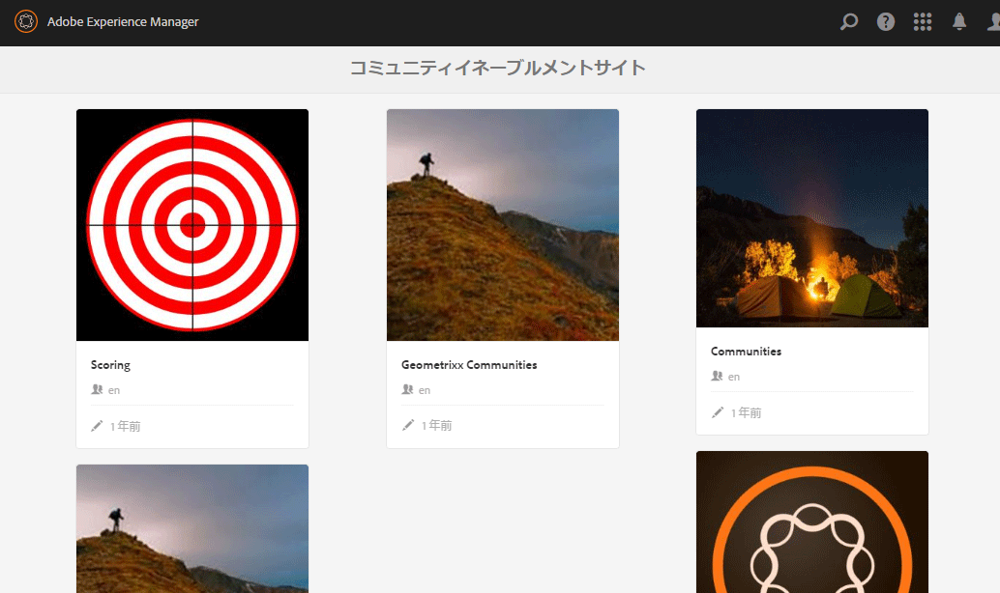

### コミュニティサイトを選択 {#select-a-community-site}

コミュニティリソースコンソールには、すべてのコミュニティサイトが表示されます。

リソースコンソールからサイトを選択すると、特定のコミュニティサイトに対してイネーブルメントリソースが作成されます。

特定のコミュニティサイトを選択すると、既存のイネーブルメントリソースと学習パスにアクセスして管理と変更を行い、新しいイネーブルメントリソースと学習パスを作成できます。

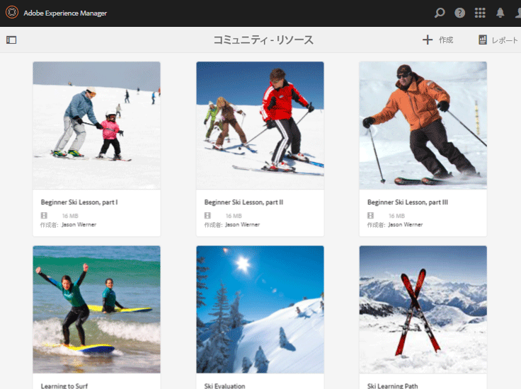

#### 検索 {#search-features}

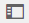

イネーブルメントリソースまたは学習パスを検索するには、サイドパネルの切り替えアイコンを選択します。 選択すると、コンソールの左側に検索パネルが開き、検索語句を入力できるテキストボックスが表示されます。

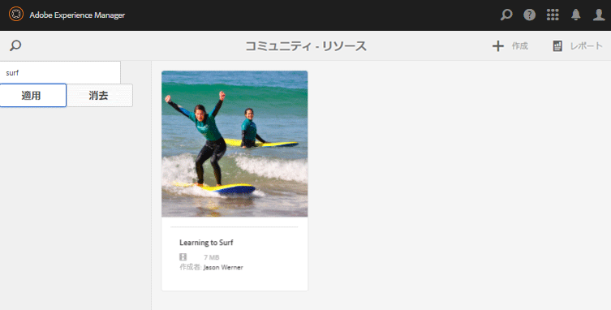

#### 選択モード {#selection-mode}

複数のイネーブルメントリソースを選択するには、カードにマウスポインターを置いてチェックマークアイコンを選択し、最初のを選択します。 選択した他のカードを選択すると、選択グループに追加されます。 2 回目を選択すると、カードの選択が解除されます。

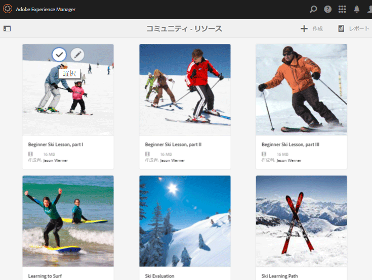

##  Resource オブジェクトの作成 {#create-a-resource}

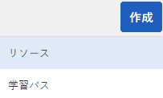

コミュニティサイトに新しいイネーブルメントリソースを追加するには

* を選択します。 `Create` アイコン
* 表示されるサブメニューから、「 」を選択します。 `Resource`

これにより、

* リソースの説明（名前、カード画像、テキスト）
* リソースコンテンツの選択
* リソースのカバー画像の選択
* リソースの連絡先の識別
* メンバーへのリソースの割り当て

リソースがコースの一部である場合、学習パス、メンバーは学習パスにのみ割り当てる必要があります。 割り当ては、イネーブルメントリソースの作成後に追加できます。

### 1 基本情報 {#basic-info}

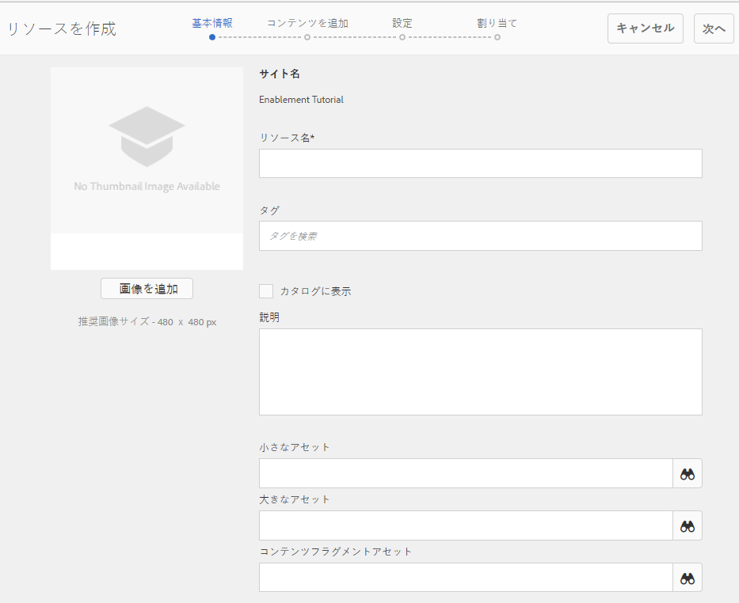

* **[!UICONTROL 画像を追加]**

   (*オプション*) メンバーの割り当てページおよびリソースコンソールのイネーブルメントリソースのカードに表示する画像です。 画像は、サーバーのローカルファイルシステムから選択されます。 画像が指定されていない場合、アップロードされたリソースのサムネールが生成されます。

   ***注意***:推奨される画像サイズは、480 x 480 ピクセルではありません。 カードが様々なブラウザーサイズにレスポンシブデザインになるので、表示サイズは 220 x 165 ピクセルから 400 x 165 ピクセルまで様々です。

* **[!UICONTROL サイト名]**

   (*読み取り専用*) リソースを追加するコミュニティサイト。

* **[!UICONTROL リソース名&amp;ast;]**

   (*必須*) リソースの表示名。 有効なノード名が表示名から作成されます。

* **[!UICONTROL タグ]**

   (*オプション*) イネーブルメントリソースを 1 つ以上のカタログに関連付ける 1 つ以上のタグを選択できます。 詳しくは、 [イネーブルメントリソースのタグ付け](tag-resources.md).

* **[!UICONTROL カタログに表示]**

   オフにすると、イネーブルメントリソースはどのカタログにも表示されません。 オンにすると、イネーブルメントリソースは、以下の条件を満たさない限り、すべてのカタログに表示されます。 [事前フィルター済み](catalog-developer-essentials.md#pre-filters) または、UI からフィルタを作成します。 初期設定はオフです。

* **[!UICONTROL 説明]**

   (*オプション*) イネーブルメントリソースに対して表示する説明。

* **[!UICONTROL 小さなアセット]**

   (*オプション*) AEM Assetsから選択しました。 カタログ内など、パブリッシュ環境でリソースを表すサムネール画像です。

* **[!UICONTROL 大きなアセット]**

   (*オプション*) AEM Assetsから選択しました。 リソースのメインページなど、パブリッシュ環境でリソースを表す大きな画像。

* **[!UICONTROL コンテンツフラグメントアセット]**

   (*オプション*) AEM Assetsから選択しました。 パブリッシュ環境で参照できるが、デフォルトでは使用されていないコンテンツフラグメント。

* 選択 **[!UICONTROL 次へ]**

### 2 コンテンツを追加 {#add-content}

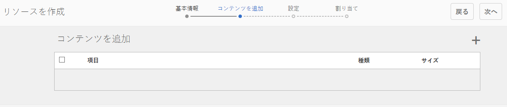

複数のイネーブルメントリソースを選択できるかのように見えますが、1 つのみが許可されます。

を選択します。 `'+' icon`の右上隅にあるをクリックし、ソースを識別してリソースを選択するプロセスを開始します。

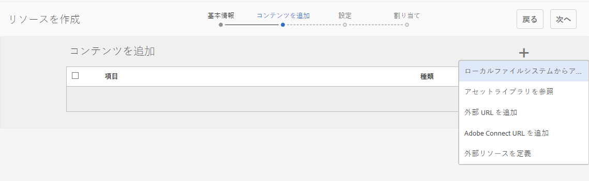

* **[!UICONTROL ローカルファイルからアップロード]**
ローカルファイルシステムからアップロードする場合は、ネイティブのファイルブラウザーを使用してファイルを選択し、アップロードします。 サポートされるファイルタイプは、SCORM.zip(HTML5 またはSWF)、MP4 ビデオ、SWF、PDF、画像の各タイプ (JPG、PNG、GIF、BMP) です。 ファイル名がアセットの名前になり、アセットライブラリに追加されます。

* **[!UICONTROL アセットライブラリを参照]**
アセットライブラリからを選択します。 選択できるのは、コミュニティサイト内で表示されるものに限られます。

* **[!UICONTROL 外部 URL を追加]**

   学習コンテンツへのリンクを入力します。

   開いたダイアログで、次のように入力します。

   * **[!UICONTROL タイトル]**

      イネーブルメントリソースのアセットの名前です。

   * **[!UICONTROL URL]**

      アセットの URL。

* **[!UICONTROL Adobe Connect URL を追加]**

   Adobe Connectセッションへのリンクを入力します。

   開いたダイアログで、次のように入力します。

   * **[!UICONTROL タイトル]**

      イネーブルメントリソースのアセットの名前です。

   * **[!UICONTROL URL]**

      Adobe Connectセッションの URL。

* **[!UICONTROL 外部リソースを定義]**

   資材を表示する場所を入力します。 成功ステータスとスコアの値は手動で入力します ( [レポート](reports.md)) をクリックします。 アップロードしたカバー画像を使用して、追加情報を提供できます。

   開いたダイアログで、次のように入力します。

   * **[!UICONTROL タイトル]**

      イネーブルメントリソースのアセットの名前です。

   * **[!UICONTROL 場所]**

      教室などの物理的なサイトの場所。

#### 追加されたビデオリソースの例 {#example-of-an-added-video-resource}

* **[!UICONTROL リソースのカバー画像]**

   カバー画像は、イネーブルメントリソースが最初に表示されたときに表示される画像です。 例えば、ビデオリソースがまだ再生されていない場合に、カバー画像が表示されます。 カスタム画像がアップロードされない場合は、デフォルト画像が表示されます。 ビデオリソースの場合、次の操作が可能です。 [サムネールを生成](enablement.md#ffmpeg)ただし、ビデオが URL として参照されている場合はアップロード時にのみ有効です。 場所のリソースの場合、画像を使用して追加情報を提供できます。

   カバー画像の推奨サイズは 640 x 360 px です。

* 選択 **[!UICONTROL 次へ]**

### 3 設定 {#settings}

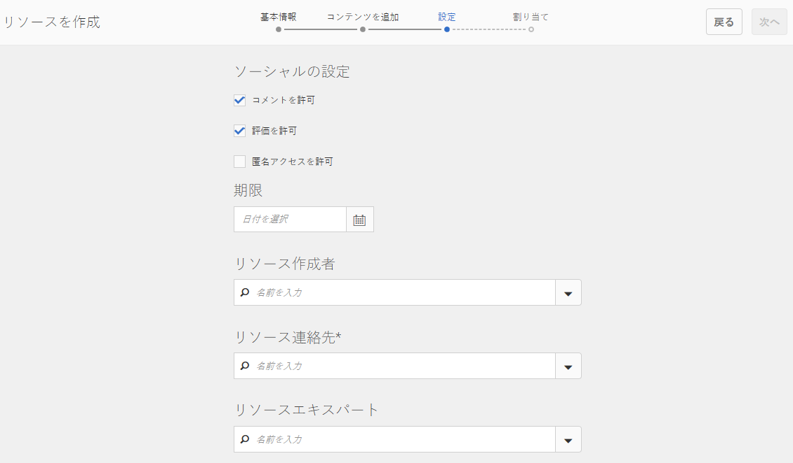

>[!NOTE]
>
>学習者は、学習パスから参照されるイネーブルメントリソースに直接登録してはなりません。 学習者は学習パスにのみ登録する必要があります。
>
>メンバーがそのリソースを参照するリソースと学習パスの両方に登録されている場合、その割り当てには、単一のリソースと学習パス内のリソースの両方が表示されます。

* **[!UICONTROL ソーシャルの設定]**

   これらの設定は、イネーブルメントリソースに関する入力を学習者に提供できるかどうかを制御します。 この [モデレート設定](sites-console.md#moderation) は親コミュニティサイトのものです。

   * **[!UICONTROL コメントを許可]**

      オンにすると、メンバーはリソースに対するコメントを許可されます。 初期設定はオンです。

   * **[!UICONTROL 評価を許可]**

      オンにすると、メンバーはリソースの評価を許可されます。 初期設定はオンです。

   * **[!UICONTROL 匿名アクセスを許可]**

      オンにすると、コミュニティサイトで匿名アクセスも許可されている場合に、匿名のサイト訪問者がカタログ内のリソースを表示できるようになります。 初期設定はオフです。

* **[!UICONTROL 期限]**

   *（オプション）* 割り当てを完了する日付を選択できます。

* **[!UICONTROL リソース作成者]**
   *（オプション）* イネーブルメントリソースの作成者。 プルダウンメニューを使用して、 [メンバーグループ](#members-group).

* **[!UICONTROL リソース連絡先&amp;ast;]**
   *（必須）* メンバーがイネーブルメントリソースに関して連絡できる担当者。 プルダウンメニューを使用して、 [メンバーグループ](#members-group).

* **[!UICONTROL リソースエキスパート]**
   *（オプション）* イネーブルメントリソースに関する専門知識を持つメンバーが連絡できる人物。 プルダウンメニューを使用して、 [メンバーグループ](#members-group).

### 4 割り当て {#assignments}

* **[!UICONTROL 担当者を追加]**
プルダウンメニューを使用して、次の中から選択します。 [メンバー](#members-group)  — 学習者として登録されるユーザーおよびユーザーグループ（太字で表示）。 メンバーがコミュニティサイトにサインインすると、登録されているイネーブルメントリソース（および学習パス）がコミュニティサイトに表示されます [割り当て](functions.md#assignments-function) ページ。

* 選択 **[!UICONTROL 作成]**

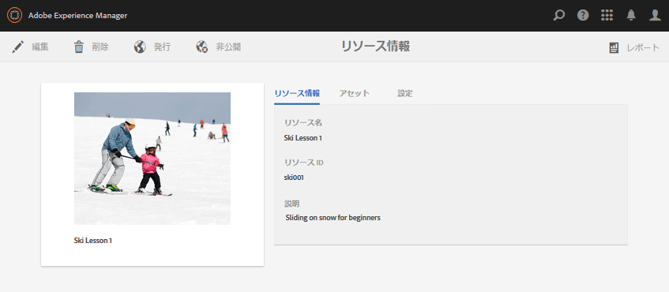

イネーブルメントリソースが正常に作成されると、リソースコンソールに戻り、新しく作成されたリソースが選択されます。 このコンソールから、次の操作を実行できます。 [リソースの管理](#managing-a-resource).

## 学習パスの作成 {#create-a-learning-path}

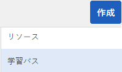

コミュニティサイトに新しい学習パスを追加するには

* を選択します。 `Create` アイコン
* 表示されるサブメニューから、「 」を選択します。 `Learning Path`

これにより、

* 学習パスの識別
* 学習者に学習パスを表すカード画像の提供
* 学習パスに含めるイネーブルメントリソースを参照する
* 必要に応じて、リソースを並べ替えます。
* 前提条件の学習パスを任意で指定
* 学習パスの連絡先の識別
* メンバーの登録

学習パスに含まれるイネーブルメントリソースの場合、割り当ては、個々のリソースではなく、学習パスに対してのみおこなう必要があります。

### 基本情報 {#basic-info-1}

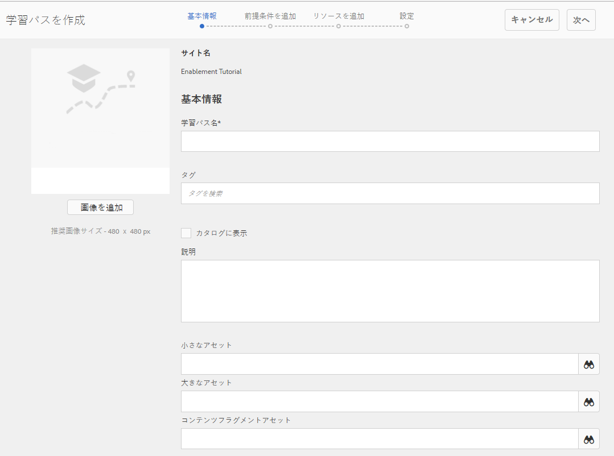

* **[!UICONTROL 画像を追加]**

   (*オプション*) メンバーの割り当てページおよびリソースコンソールの学習パスのカードに表示する画像です。 画像は、サーバーのローカルファイルシステムから選択されます。 画像が指定されていない場合、アップロードされたリソースのサムネールが生成されます。

   ***注意***:推奨画像サイズが 480 x 480 ピクセルではなくなりました。 カードが様々なブラウザーサイズにレスポンシブデザインになるので、表示サイズは 220 x 165 ピクセルから 400 x 165 ピクセルまで様々です。

* **[!UICONTROL サイト名]**

   (*読み取り専用*) リソースを追加するコミュニティサイト。

* **[!UICONTROL 学習パス名]**

   (*必須*) 学習パスの表示名。 有効なノード名が表示名から作成されます。

* **[!UICONTROL タグ]**

   (*オプション*) 学習パスを 1 つ以上のカタログに関連付ける 1 つ以上のタグを選択できます。 詳しくは、 [イネーブルメントリソースのタグ付け](tag-resources.md).

* **[!UICONTROL カタログに表示]**

   オフにすると、学習パスはどのカタログにも表示されません。 オンにすると、学習パスは、次の場合を除きすべてのカタログに表示されます。 [事前フィルター済み](catalog-developer-essentials.md#pre-filters) または、UI からフィルタを作成します。 カタログに学習パスを表示すると、含まれるすべてのリソースに対して間接的に読み取りアクセス権が付与されます。 初期設定はオフです。

* **[!UICONTROL 説明]**

   (*オプション*) イネーブルメントリソースに対して表示する説明。

* **[!UICONTROL 小さなアセット]**

   (*オプション*) AEM Assetsから選択しました。 カタログ内など、パブリッシュ環境でリソースを表すサムネール画像です。

* **[!UICONTROL 大きなアセット]**

   (*オプション*) AEM Assetsから選択しました。 リソースのメインページなど、パブリッシュ環境でリソースを表す大きな画像。

* **[!UICONTROL コンテンツフラグメントアセット]**

   (*オプション*) AEM Assetsから選択しました。 パブリッシュ環境で参照できるが、デフォルトでは使用されていないコンテンツフラグメント。

* 選択 **[!UICONTROL 次へ]**

### 前提条件を追加 {#add-prerequisites}

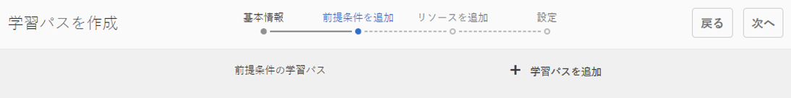

* **[!UICONTROL 前提条件の学習パス]**
(
*オプション*) 公開された他の学習パスを選択した場合、学習者がこの学習パスを選択する前に、パスを入力する必要があります。

* 選択 **[!UICONTROL 次へ]**

### リソースを追加 {#add-resources}

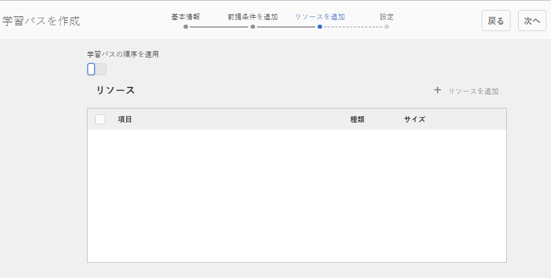

* **[!UICONTROL 学習パスの順序を適用]**

   (*オプション*) をオンに設定すると、イネーブルメントリソースが追加される順序は、学習パスを進めるために学習者が必要とする順序になります。 初期設定はオフです。

* **[!UICONTROL リソース]**

   現在のコミュニティサイト用に作成された公開済みのイネーブルメントリソースの中から 1 つ以上のリソースを選択します。

>[!NOTE]
>
>学習パスと同じレベルで利用可能なリソースのみを選択できます。 例えば、グループ内に作成された学習パスの場合、グループレベルのリソースのみを使用できます。コミュニティサイトで作成された学習パスの場合は、そのサイトのリソースを学習パスに追加できます。

* 「**[!UICONTROL 次へ]**」を選択します。

### 設定 {#settings-1}

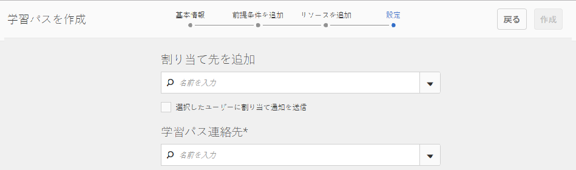

* **[!UICONTROL 登録を追加]**

   プルダウンメニューを使用して、コミュニティサイトのメンバーであるメンバーおよびメンバーグループ（太字で表示）から選択します。 [メンバーグループ](#members-group). 最初に学習パスを作成する際に、割り当てを追加する必要はありません。 学習パスのプロパティを変更して、後で学習者を追加できます。

* **[!UICONTROL 学習パスの連絡先&amp;ast;]**

   *（必須）* メンバーが学習パスに関して連絡できる人物。 プルダウンメニューを使用して、コミュニティサイトのメンバーであるユーザーから選択します。 [メンバーグループ](#members-group).

* 選択 **[!UICONTROL 作成]**

>[!NOTE]
>
>学習パスから参照されるイネーブルメントリソースは、同じ担当者（学習者）が存在する場合はリストに表示されません。
>
>メンバーがイネーブルメントリソースとそのリソースを参照する学習パスの両方に登録されている場合、その割り当てには、単一のリソースと学習パス内のリソースの両方が表示されます。

## リソースの管理 {#managing-a-resource}

単一のイネーブルメントリソースを管理するには

* リソースコンソールから
* リソースを含むコミュニティサイトを選択します
* リソースを選択

選択したイネーブルメントリソースに対して、次の操作を実行できます。

* プロパティを表示（デフォルト）
* プロパティの編集
* 削除
* 公開
* 非公開

イネーブルメントリソースの新しいバージョンをアップロードするには、新しいリソースを作成し、古いバージョンからメンバーの登録を解除して新しいバージョンに登録することをお勧めします。

### リソースを編集 {#edit-resource}

鉛筆アイコンを選択すると、イネーブルメントリソースの作成手順が使用可能になり、提供された情報を変更できます。

設定ステップで割り当てを変更するだけの変更の場合は、変更を保存すると、変更内容がパブリッシュされます。 その他の変更が行われた場合は、保存後にリソースを明示的に公開する必要があります。

### リソースを削除 {#delete-resource}

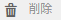

ごみ箱アイコンを選択すると、イネーブルメントリソースは次のようになります。 `Delete`d 確認後。

### パブリッシュ {#publish}

学習者が割り当てられたイネーブルメントリソースを表示できるようにするには、次の手順でリソースを公開する必要があります。

* 次の場所にある世界のアイコンを選択します。 `Publish`
* ポップアップ表示されるダイアログで、「 」を選択します。 **[!UICONTROL 公開]** 再度
* 選択 **[!UICONTROL 閉じる]**

アクションがキューに登録されているとダイアログに表示される場合でも、多くの場合、アクションは即座に公開されます。

### 非公開 {#unpublish}

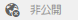

パブリッシュ環境のメンバーが削除せずに一時的にイネーブルメントリソースにアクセスできなくするには、ワールドアイコンを使用して `Unpublish`リソース。

### レポート {#report}

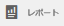

レポートアイコンを使用すると、学習者がパブリッシュ環境で割り当てられたイネーブルメントリソースとやり取りする際に生成されるレポートにアクセスできます。 レポートは、リソースのタイプに応じて異なります。

すべての学習パスに対して、リソースまたは学習者 ( `User Report`) をクリックします。

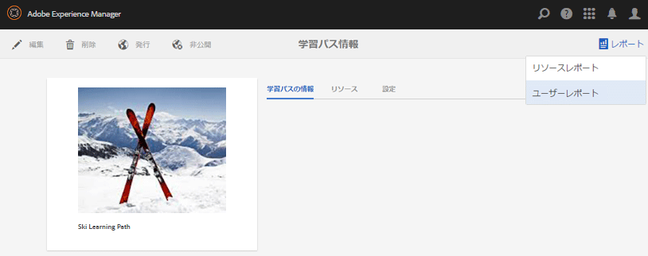

このレポートは、現在のイネーブルメントリソースまたは学習パスに関するものです。 表示されるレポートの深さは、レポートの種類に応じて異なります [Adobe Analytics](analytics.md) はコミュニティサイトに対してライセンスを取得し、有効にしています。 この [タイムライン](#timeline), [閲覧者のアクション](#viewer-engagement)、および [デバイス別のエンゲージメント](#engagement-by-device) レポートは、 [ポーリング間隔](analytics.md#report-importer).

Adobe Analyticsが有効かどうかに関係なく、すべてのイネーブルメントリソースに対して、 [担当者ステータス](#assignee-status) および [評価](#ratings) 同様に [レポートサマリ](#report-summary) 表。

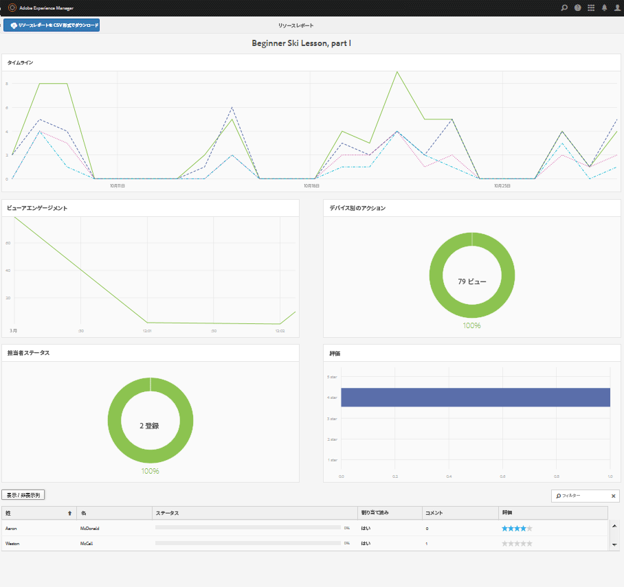

#### タイムライン {#timeline}

Analytics タイムラインレポートは、このイネーブルメントリソースに対するイベントの発生時期を示します。

* **表示**

   ビューとは、学習者がリソースの詳細ページを訪問したときのことです

* **再生**

   再生とは、学習者がリソースとやり取りするとき ( ビデオの再生やPDFの開始など )

* **評価**

   評価とは、学習者がリソースに星評価を割り当てたときです

* **コメント**

   コメントとは、alNearner がコメントを追加したときです

縦軸はイベントの数です。

横軸はカレンダー時間です。

[Adobe Analytics必須](sites-console.md#analytics).

#### ビューアエンゲージメント {#viewer-engagement}

Analytics のビューアのエンゲージメントレポートには、ビデオリソースに関して、リソースを閲覧した学習者の数と、最後まで再生されなかった場合に、学習者がリソースの再生を停止した時点が表示されます。

縦軸は、このリソースを閲覧した学習者の数です。

横軸は、このリソースの期間です。

[Marketing Cloud組織 ID が必要です](sites-console.md#enablement).

#### デバイス別のアクション {#engagement-by-device}

デバイス別の Analytics のエンゲージメントレポートでは、ビデオリソースに関して、デスクトップまたはモバイルから再生された視聴の割合を示します。

[Marketing Cloud組織 ID が必要です](sites-console.md#enablement).

#### 担当者ステータス {#assignee-status}

担当者ステータスレポートは、学習者の数に基づいて、次の条件を持つ学習者の数を示します。

* **開始前**
* **処理中**
* **完了**

#### 評価 {#ratings}

評価レポートは、イネーブルメントリソースを評価した学習者の数に基づいて表示され、各星評価の数に続いて評価の合計数と平均評価の概要が表示されます。

#### レポートサマリ {#report-summary}

イネーブルメントリソースの場合、レポートサマリは次の表に示されます

* リソースを操作した各学習者
   * ステータス
   * リソースが割り当てられたかどうか
      * カタログでリソースを見つけるのとは対照的に
   * 投稿されたコメント数
   * 与えられた評価（存在する場合）

学習パスの「リソースレポート」の「レポートサマリ」は、次の表に示します

* 学習パスに含まれる各リソース
   * 公開ステータス
   * ビュー数
   * 再生数
   * 平均評価
   * 形式
   * サイズ
   * コミュニティサイト名

学習パス「ユーザーレポート」の場合、「レポートサマリ」は次の表に示されます

* 学習パスに割り当てられている各学習者
   * 完了したリソースの数
   * ステータス

列を選択すると、テーブルの表示を調整できます。 `Show / hide columns` セレクター。

#### レポートを CSV 形式でダウンロード {#download-report-as-csv}

「レポートの概要」テーブルは、コンソール上部のボタンを使用して、CSV 形式でダウンロードできます。

* イネーブルメントリソースの場合： `Download Resource Report as CSV` ボタン
* 学習パスの場合： `Download Learning Path Report as CSV` ボタン

表示する列を選択していない場合は、「レポートの概要」全体がダウンロードされます。
