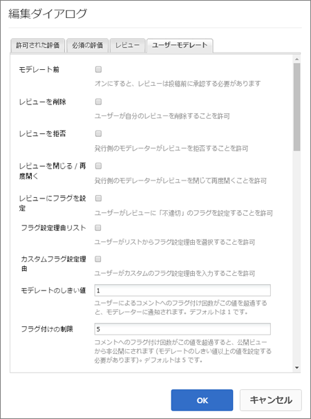

# レビューおよびレビューの概要（表示）の使用 {#using-reviews-and-reviews-summary-display}

この `Reviews`コンポーネントは、 [ `Comments`](comments.md) および [ `Rating`](rating.md) コンポーネントを使用する準備が整いました。

この `Reviews Summary (Display)` コンポーネントは、アクティブなインスタンスまたは閉じたインスタンスの概要を提供します `Reviews` サイト上の他の場所に表示するコンポーネント。

>[!NOTE]
>
>匿名でのレビュー投稿はサポートされていません。サイト訪問者が参加するには、登録（メンバーになる）してサインインする必要があります。 サインインした訪問者は、いつでもレビューを更新できます。

## レビューをページに追加 {#adding-a-review-to-a-page}

を追加するには、以下を実行します。 `Reviews` コンポーネントをオーサリングモードでページに追加する場合は、コンポーネントブラウザーを使用して `Communities / Reviews` をクリックし、ページ上の適切な位置（ユーザーが確認できる機能を基準とした位置など）にドラッグします。

必要な情報については、 [コミュニティコンポーネントの基本](basics.md).

次の場合に [必要なクライアント側ライブラリ](reviews-basics.md#essentials-for-client-side) が含まれる場合、この方法で `Reviews`コンポーネントが表示されます。

## レビューの設定 {#configuring-reviews}

配置された `Reviews` アクセスして選択するコンポーネント `Configure` 編集ダイアログを開くアイコン。

以下 **[!UICONTROL 許可された評価]** タブで、メンバーに表示する評価の完全なリストを指定します。 最初の評価は、全体的/一般的な評価である必要があります。これは、の平均評価を提供する評価です。 `Review Summary (Display)` コンポーネント。 デフォルト設定の次の 2 つの評価には、「サブレーティング 1」または「サブレーティング 2」以外の異なるタイトルを付ける必要があります。

* **[!UICONTROL 許可された評価]**

   メンバーが選択できる評価のリストです。

   表示される選択肢を変更するには、上向き矢印、下向き矢印および削除ボタンを使用します。

   評価の選択肢を追加するには、「**[!UICONTROL 項目を追加]**」をクリックします。

以下 **[!UICONTROL 必須の評価]** 」タブで、 **[!UICONTROL 許可された評価]** 評価が必要です。 「許可された評価」タブでのみ指定された項目は、メンバーが送信した際に、マークが付いていないままにすることができます。

Web サイト上では、必須の評価はアスタリスク付きで表示されます。項目が必須で、マークが付いていない場合は、必要な評価がすべてマークされるまで、メッセージがメンバーに表示され、送信が拒否されます。

* **[!UICONTROL 必須の評価]**

   許可された評価のサブセットで、必要な評価を示します。

   表示される選択肢を変更するには、上向き矢印、下向き矢印および削除ボタンを使用します。

   回答の選択肢を追加するには、「**[!UICONTROL 項目を追加]**」をクリックします。

>[!NOTE]
>
>項目が **[!UICONTROL 必須の評価]** タブ **[!UICONTROL 許可された評価]** 」タブに値を入力した場合、評価する項目には含まれません。

以下 **[!UICONTROL レビュー]** タブで、レビューの処理方法を指定します。

* **[!UICONTROL 応答を許可]**&#x200B;オンにすると、レビューに対する返信が許可されます。初期設定はオフです。

* **[!UICONTROL 閉じる]**&#x200B;オンにすると、レビューは新しいレビューや返信を受け付けなくなります。初期設定はオフです。

* **[!UICONTROL ファイルのアップロードを許可]**&#x200B;オンにすると、レビューに対して添付ファイルをアップロードできます。初期設定はオフです。

* **[!UICONTROL 最大ファイルサイズ]******「ファイルのアップロードを許可」がオンの場合にのみ関係します。このフィールドは、アップロードするファイルのサイズ（バイト単位）を制限します。デフォルトは 10 MB です。

* **[!UICONTROL メッセージの最大長]**&#x200B;テキストボックスに入力できる最大文字数です。初期設定は 4096 文字です。

* **[!UICONTROL 許可されるファイルタイプ]**「**[!UICONTROL ファイルのアップロードを許可]**」がオンの場合にのみ関係します。ドット付きのファイル拡張子をコンマ区切りで指定します（例：.jpg, .jpeg, .png, .doc, .docx, .pdf）。ファイルタイプが指定されている場合、指定されていないファイルは許可されません。 初期設定では何も指定されず、すべてのファイルタイプが許可されます。

* **[!UICONTROL リッチテキストエディター]**&#x200B;オンにすると、マークアップを使用して投稿を入力できます。初期設定はオフです。

* **[!UICONTROL 投票を許可]**&#x200B;オンにすると、トピックに投票機能が組み込まれます。初期設定はオフです。

以下 **[!UICONTROL ユーザーモデレート]** タブで、投稿されたレビューの管理方法を指定します。 詳しくは、 [ユーザー生成コンテンツのモデレート](moderate-ugc.md).

* **[!UICONTROL モデレート前]**&#x200B;オンにすると、レビューを公開サイトに表示する前に承認が必要になります。初期設定はオフです。

* **[!UICONTROL レビューを削除]**&#x200B;オンにすると、レビューを投稿したメンバーはそのレビューを削除できます。初期設定はオフです。

* **[!UICONTROL レビューを拒否]**&#x200B;オンにすると、モデレーターはレビューを拒否できます。初期設定はオフです。

* **[!UICONTROL レビューを閉じる／再度開く]**&#x200B;オンにすると、モデレーターはレビューを閉じたり、再度開いたりすることができます。初期設定はオフです。

* **[!UICONTROL レビューにフラグを設定]**&#x200B;オンにすると、メンバーはレビューに「不適切」のフラグを設定できます。初期設定はオフです。

* **[!UICONTROL フラグ設定理由リスト]**&#x200B;オンにすると、メンバーはレビューに「不適切」のフラグを設定した理由をドロップダウンリストから選択できます。初期設定はオフです。

* **[!UICONTROL カスタムフラグ設定理由]**&#x200B;オンにすると、メンバーはレビューに「不適切」のフラグを設定した独自の理由を入力できます。初期設定はオフです。

* **[!UICONTROL モデレートのしきい値]**&#x200B;メンバーがレビューに何回フラグを設定したらモデレーターに通知するかを指定します。初期設定は 1 回 (1) です。

* **[!UICONTROL フラグ付けの制限]**&#x200B;レビューに何回フラグが設定されたら、公開表示から非公開にするかを指定します。この数は **[!UICONTROL モデレートのしきい値]**. デフォルトは 5 です。

### レビューの概要（表示）をページに追加 {#adding-a-review-summary-display-to-a-page}

を追加するには、以下を実行します。 `Reviews Summary (Display)` コンポーネントをオーサリングモードでページに追加する場合は、

* `Communities / Reviews Summary (Display)`

コンポーネントを探し、ページ上のアクティブなレビューまたは閉じられたレビューを表示する位置にドラッグします。

必要な情報については、 [コミュニティコンポーネントの基本](basics.md).

次の場合に [必要なクライアント側ライブラリ](reviews-basics.md#essentials-for-client-side) が含まれる場合、この方法で `Reviews Summary (Display)`コンポーネントが表示されます。

>[!NOTE]
>
>「平均」は、要約するレビューの「許可された評価」タブに指定されている最初の項目への投票を反映します。

### レビューの概要（表示）の設定 {#configuring-reviews-summary-display}

配置された `Reviews Summary (Display)` アクセスして選択するコンポーネント `Configure` 編集ダイアログを開くアイコン。

「**[!UICONTROL レビューの概要]**」タブでは、以下の項目を設定します。

* `Review Path`

   配置されたインスタンスを入力するか、参照します `reviews`要約するコンポーネント ( 例えば、 [Geometrixxエンゲージサイト](getting-started.md) パスは次のようになります。

   /content/sites/engage/en/page/jcr:content/content/primary/reviews

* `Include histogram`

   オンにした場合、要約するレビューに含まれる各星評価の数を示す棒グラフの表示を含めます。 初期設定はオフです。

### カスタムレビュータイプへの変更 {#changing-to-a-custom-review-type}

レビューコンポーネントは、コメントシステムを使用します。

コメントリソースタイプを変更すると、デフォルトを使用するコメントのインスタンスではなく、開発者によってカスタマイズ（拡張）されたコメントのインスタンスが生成されるようになります。

カスタムリソースタイプがわかったら、次のように入力します。 [デザインモード](../../help/sites-authoring/default-components-designmode.md) そして、配置された `Comments` 追加のタブを含むダイアログを開くコンポーネント。

以下 **[!UICONTROL リソースタイプ]** タブで、新しいインスタンスのカスタム resourceType を指定します。 `Comments or Voting`コンポーネント：

* **[!UICONTROL コメントリソースタイプ]**

   拡張の resourceType に移動します。 `comment`/apps 内のコンポーネント（単一のコメント）。 例：`/apps/social/commons/components/hbs/comments/comment`

   このリソースは、訪問者がコメントを投稿したときに作成された UGC の resourceType を識別します。

* **[!UICONTROL 投票リソースタイプ]**

   拡張の resourceType に移動します。 `voting`/apps 内のコンポーネント。 例：`/apps/social/components/hbs/voting`

   このリソースは、訪問者が投票を投稿したときに作成された UGC のリソースタイプを識別します。

* **[!UICONTROL コメントシステムリソースタイプ]**

   拡張の resourceType に移動します。 `comments`/apps 内のコンポーネント（コメントシステム）。 ページテンプレートがない場合は空白のままにします [動的に含む](scf.md#add-or-include-a-communities-component) コメントシステムをリソースとしてページに追加する代わりに、基になるスクリプト内で使用します（コメントノード）。 詳しくは、 [{{include}} ヘルパー](handlebars-helpers.md#include)

## サイト訪問者のエクスペリエンス {#site-visitor-experience}

### モデレーターおよび管理者 {#moderators-and-administrators}

サインインしているユーザーがモデレーター権限または管理者権限を持っている場合は、誰がレビューを作成したかにかかわらず、コンポーネントの設定によって許可されているモデレートタスクを実行できます。

### メンバー {#members}

サイト訪問者がサインインすると、設定に応じて次のことができます。

* 新しいレビューを投稿
* 自分のレビューを編集
* 自分のレビューを削除
* 他のユーザーのレビューコメントにフラグを設定する

1 人のメンバーが付けられる評価は 1 つだけです。メンバーは、いつでも評価を変更できます。

### 匿名 {#anonymous}

サインインしていないサイト訪問者は、投稿されたレビューを閲覧することしかできず（サポートされている場合は翻訳も可）、評価またはレビューを追加したり、他のユーザーのレビューコメントにフラグを設定することはできません。

## 追加情報 {#additional-information}

詳しくは、 [レビューの基本事項](reviews-basics.md) 開発者向けのページ

投稿されたコメントのモデレートについては、 [ユーザー生成コンテンツのモデレート](moderate-ugc.md).

投稿されたコメントの翻訳については、[ユーザー生成コンテンツの翻訳](translate-ugc.md)を参照してください。
