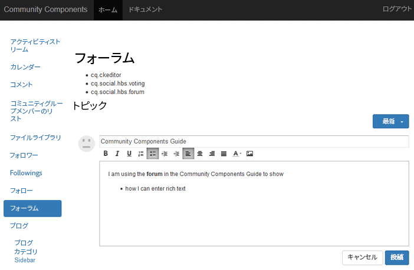

# リッチテキストエディターの基本事項 {#rich-text-editor-essentials}

## 概要 {#overview}

リッチテキストエディター (RTE) を使用すると、マークアップを含むテキストを入力できます。

コミュニティコンポーネントの場合は、 [オーサー環境のリッチテキストエディター](../../help/sites-authoring/rich-text-editor.md)パブリッシュ環境で入力されたテキストに影響します。



## リッチテキストエディターの有効化 {#enabling-rich-text-editor}

ユーザー生成コンテンツ (UGC) を許可するコミュニティコンポーネントを有効にして、RTE を許可できます。 コンポーネントがページに追加されたか、ページ内に含まれたかに応じて [関数](functions.md)の場合、RTE はデフォルトで有効になっている場合と無効になっている場合があります。

有効になっていない場合は、 [オーサー編集モード](sites-console.md#authoring-site-content)をクリックし、編集するコンポーネントを選択して、 `Rich Text Editor` チェックボックス。

RTE は、次のコミュニティコンポーネントで使用できます。

* [ブログ](blog-feature.md)
* [Calendar](calendar.md)
* [コメント](comments.md)
* [Filelibrary](file-library.md)
* [フォーラム](forum.md)
* [メッセージ](configure-messaging.md)
* [Q&amp;A](working-with-qna.md)
* [レビュー](reviews.md)

## カスタマイズ {#customization}

実装が [CKEditor](https://www.ckeditor.com/).

コミュニティコンポーネントの現在の設定は、 `cq.social.  scf   clientlib`( リポジトリ内の場所：

`/libs/clientlibs/social/commons/scf/ckrte.js`

cq.social.scf clientlib は変更しないでください。将来のアップグレードで編集が上書きされる可能性があるからです。

### カスタマイズの例：インラインリンク {#example-customization-inline-links}

セキュリティ上の問題により、ハイパーリンクオプションは、デフォルトでメンバーに表示されるリッチテキストアイコンのセットに含まれません。 UGC で href が許可されている場合、悪戯の能力は大きくなります。

ツールバーにハイパーリンクオプションを追加するには、次の手順を実行します。

* 「 `links`&quot;
   * `{ name: 'links', items: [ 'Link','Unlink','Anchor' ] }`
* 選択 **[!UICONTROL すべて保存]**

#### /libs/clientlibs/social/commons/scf/ckrte.js {#libs-clientlibs-social-commons-scf-ckrte-js}

```
CKRte.prototype.config = {
    toolbar: [
        { name: "basicstyles",
           items: ["Bold", "Italic", "Underline", "NumberedList", "BulletedList", "Outdent", "Indent", "JustifyLeft", "JustifyCenter", "JustifyRight", "JustifyBlock", "TextColor"]
        },
        { name: 'links', 
           items: [ 'Link','Unlink','Anchor' ] 
        }
    ],
    autoParagraph: false,
    autoUpdateElement: false,
    removePlugins: "elementspath",
    resize_enabled: false
};
```
