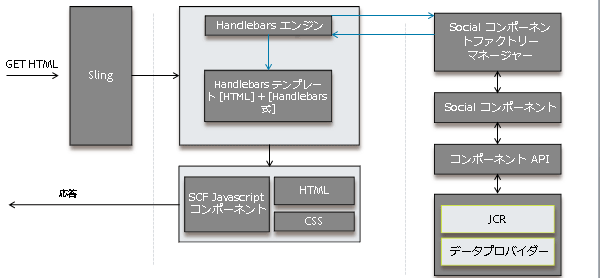

# ソーシャルコンポーネントフレームワーク {#social-component-framework}

ソーシャルコンポーネントフレームワーク（SCF）によって、サーバー側とクライアント側の両方で、コミュニティコンポーネントの設定、カスタマイズおよび拡張のプロセスが簡素化されます。

フレームワークの利点：

* **機能**:80%の使用例に対してカスタマイズがほとんどあるいはまったくない、すぐに使用できる簡単な統合
* **スキン可能**:CSSスタイル設定でのHTML属性の一貫した使用
* **拡張可能**:コンポーネントの実装は、オブジェクト指向でビジネスロジックが軽量 — サーバでの増分的なビジネスログインの追加が容易
* **柔軟性**:簡単にオーバーレイおよびカスタマイズできる、シンプルなロジックのないJavaScriptテンプレート
* **アクセス可能**:HTTP APIは、モバイルアプリを含む任意のクライアントからの投稿をサポートします
* **ポータブル**:任意のテクノロジーで構築されたWebページへの統合/埋め込み

インタラクティブな[コミュニティコンポーネントガイド](components-guide.md)を使用して、オーサーまたはパブリッシュインスタンスについて確認してください。

## 概要 {#overview}

SCF では、コンポーネントは SocialComponent POJO、Handlebars JS テンプレート（コンポーネントをレンダリングするため）および CSS（コンポーネントのスタイルを設定するため）で構成されます。

Handlebars JS テンプレートでは、モデル／ビュー JS コンポーネントを拡張して、クライアントでのコンポーネントとのユーザーインタラクションを処理できます。

コンポーネントがデータの変更をサポートする必要がある場合は、従来の Web アプリケーションでのモデル／データオブジェクトと同様のデータの編集／保存をサポートするために、SocialComponent API の実装を記述できます。さらに、操作リクエストの処理、ビジネスロジックの実行、モデル/データオブジェクトでのAPIの呼び出しを行うために、操作（コントローラー）と操作サービスを追加できます。

クライアントが必要とするデータをビューレイヤーまたは HTTP クライアントに提供するために、SocialComponent API を拡張できます。

### クライアントに対するページのレンダリング方法 {#how-pages-are-rendered-for-client}



### コンポーネントのカスタマイズおよび拡張 {#component-customization-and-extension}

コンポーネントをカスタマイズまたは拡張するには、今後のリリースへのアップグレードプロセスを簡素化する /apps ディレクトリに対してオーバーレイおよび拡張のみを記述します。

* スキニングの場合
   * 編集が必要なのは[CSSだけ](client-customize.md#skinning-css)
* ルックアンドフィール
   * JSテンプレートとCSSの変更
* 外観、操作性、UX
   * JSテンプレート、CSSおよび[JavaScript](client-customize.md#extending-javascript)の拡張/上書きの変更
* JSテンプレートまたはGETエンドポイントで使用可能な情報を変更するには
   * [SocialComponent](server-customize.md#socialcomponent-interface)を拡張します。
* 操作中のカスタム処理を追加するには
   * [OperationExtension](server-customize.md#operationextension-class)を書き込みます。
* 新しいカスタム操作を追加するには
   * 新しい[Sling Post操作](server-customize.md#postoperation-class)を作成します。
   * 必要に応じて、既存の[OperationServices](server-customize.md#operationservice-class)を使用します
   * 必要に応じてクライアント側から操作を呼び出すJavaScriptコードを追加します

## サーバー側フレームワーク {#server-side-framework}

このフレームワークでは、サーバー上の機能にアクセスし、クライアントとサーバー間のインタラクションをサポートするための API が提供されます。

### Java API {#java-apis}

Java API では、継承またはサブクラス化が容易な抽象クラスおよびインターフェイスが提供されます。

メインクラスについては、[サーバー側のカスタマイズ](server-customize.md)ページで説明します。

UGCの使用については、「 [ストレージリソースプロバイダーの概要](srp.md) 」を参照してください。

### HTTP API {#http-api}

HTTP API によって、PhoneGap アプリ、ネイティブアプリ、その他の統合およびマッシュアップについて、カスタマイズの容易さとクライアントプラットフォームの選択がサポートされます。さらに、HTTP APIを使用すると、コミュニティサイトをクライアントなしでサービスとして実行できるので、フレームワークコンポーネントを任意のテクノロジーで構築されたWebページに統合できます。

### HTTP API - GET 要求 {#http-api-get-requests}

すべての SocialComponent に対して、フレームワークによって HTTP ベースの API エンドポイントが提供されます。このエンドポイントにアクセスするには、「.social.json」セレクターと拡張子を持つGETリクエストをリソースに送信します。 Slingを使用して、要求が`DefaultSocialGetServlet`に渡されます。

：
`DefaultSocialGetServlet`

1. リソース(resourceType)を`SocialComponentFactoryManager`に渡し、リソースを表す`SocialComponent`を選択できるSocialComponentFactoryを受け取ります。

1. ファクトリを呼び出し、リソースと要求を処理できる`SocialComponent`を受け取ります。
1. `SocialComponent`を呼び出し、要求を処理して結果のJSON表現を返します。
1. JSONレスポンスをクライアントに返します。

**`GET Request`**

デフォルトの GET Servlet が、SocialComponent がカスタマイズ可能な JSON で応答する .social.json 要求をリスニングします。


### HTTP API - POST 要求 {#http-api-post-requests}

GET（読み取り）操作に加え、コンポーネントに対するその他の操作（作成、更新、削除など）を可能にするエンドポイントパターンがフレームワークによって定義されます。これらのエンドポイントは、HTTPステータスコードまたはJSON応答オブジェクトを使用して入力を受け取り、応答するHTTP APIです。

このフレームワークエンドポイントパターンにより、CUD 操作は拡張、再利用およびテストが可能になります。

**`POST Request`**

SocialComponent 操作ごとに Sling POST :operation があります。各操作のビジネスロジックとメンテナンスコードは、HTTP APIを通じて、またはOSGiサービスとして他の場所からアクセスできるOperationServiceにラップされます。 前後のアクションに対してプラグ可能な操作拡張をサポートするフックが提供されます。


### ストレージリソースプロバイダー（SRP） {#storage-resource-provider-srp}

[コミュニティコンテンツストア](working-with-srp.md)に格納された UGC の処理については、以下を参照してください。

* [ストレージリソースプロバイダーの概要](srp.md)  — 概要とリポジトリ使用の概要
* [SRPとUGCの基本事項](srp-and-ugc.md) - SRP APIユーティリティのメソッドと例
* [SRPによるUGCへのアクセス](accessing-ugc-with-srp.md)  — コーディングのガイドライン

### サーバー側のカスタマイズ {#server-side-customizations}

サーバー側のコミュニティコンポーネントのビジネスロジックおよび動作のカスタマイズについて詳しくは、[サーバー側のカスタマイズ](server-customize.md)を参照してください。

## Handlebars JS テンプレート言語 {#handlebars-js-templating-language}

新しいフレームワークの顕著な変更の1つは、サーバーとクライアントのレンダリングに一般的なオープンソーステクノロジーである`Handlebars JS`テンプレート言語(HBS)の使用です。

HBS スクリプトは、単純で、ロジックがなく、サーバーとクライアントの両方でコンパイルされ、オーバーレイやカスタマイズが容易であり、HBS ではクライアント側のレンダリングがサポートされているのでクライアント UX と自然にバインドします。

このフレームワークでは、SocialComponent の開発に便利な複数の [Handlebars ヘルパー](handlebars-helpers.md)が提供されます。

サーバーで、Sling は GET 要求を解決するときに、要求への応答に使用されるスクリプトを識別します。スクリプトがHBSテンプレート(.hbs)の場合、Slingは要求をHandlebarsエンジンにデリゲートします。 次に、Handlebars Engineは、適切なSocialComponentFactoryからSocialComponentを取得し、コンテキストを構築して、HTMLをレンダリングします。

### アクセス制限なし {#no-access-restriction}

Handlebars（HBS）テンプレートファイル（.hbs）は、.jsp および .html テンプレートファイルに似ていますが、クライアントブラウザーとサーバーの両方でレンダリングに使用できる点が異なります。そのため、クライアント側テンプレートを要求するクライアントブラウザーは、.hbs ファイルをサーバーから受け取ります。

これには、sling 検索パス内のすべての HBS テンプレート（/libs/ または /apps の下の .hbs ファイル）を、オーサーまたはパブリッシュから任意のユーザーが取得できる必要があります。

.hbs ファイルへの HTTP アクセスは禁止できません。

### コミュニティコンポーネントの追加またはインクルード {#add-or-include-a-communities-component}

ほとんどのコミュニティコンポーネントは、Sling アドレス可能リソースとして追加する必要があります。**&#x200B;一部のコミュニティコンポーネントは、ユーザー生成コンテンツ(UGC)を書き込む場所を動的に含めたりカスタマイズしたりするために、存在しないリソースとしてテンプレートに&#x200B;*含める*&#x200B;ことができます。

どちらの場合も、コンポーネントの[必要なクライアントライブラリ](clientlibs.md)も存在する必要があります。

**コンポーネントの追加**

コンポーネントの追加は、コンポーネントブラウザー（サイドキック）からページにオーサー編集モードでドラッグされたときなどに、リソース（コンポーネント）のインスタンスを追加するプロセスです。

結果は、同位ノードの下の JCR 子ノードであり、これは Sling アドレス可能です。

**コンポーネントのインクルード**

コンポーネントを含めると、スクリプト言語の使用など、テンプレート内の[「存在しない」リソース](srp.md#for-non-existing-resources-ners)（JCRノードなし）に参照を追加するプロセスが参照されます。

AEM 6.1以降では、コンポーネントが追加される代わりに動的に含まれる場合、コンポーネントのプロパティをオーサー*デザイン*モードで編集できます。

一部の AEM Communities コンポーネントのみを動的にインクルードできます。次の操作を行います。

* [コメント](essentials-comments.md)
* [評価](rating-basics.md)
* [レビュー](reviews-basics.md)
* [投票](essentials-voting.md)

[コミュニティコンポーネントガイド](components-guide.md)では、インクルード可能なコンポーネントを追加からインクルードに切り替えることができます。

**Handlebarstemplating言語を使** 用する場合、存在しないリソースは、そのresourceTypeを指定す [るincludeヘ](handlebars-helpers.md#include) ルパーを使用して含まれます。

`{{include this.id path="comments" resourceType="social/commons/components/hbs/comments"}}`

**JSP** を使用する場合、リソースはタグ [cq:include](../../help/sites-developing/taglib.md#lt-cq-include) を使用してインクルードされます。

```
<cq:include path="votes" 
 resourceType="social/tally/components/voting" />
```

>[!NOTE]
>
>コンポーネントを、テンプレートに追加またはインクルードせずに、ページに動的に追加するには、[コンポーネントのサイドローディング](sideloading.md)を参照してください。

### Handlebars ヘルパー {#handlebars-helpers}

SCF で使用できるカスタムヘルパーのリストおよび説明については、[SCF Handlebars ヘルパー](handlebars-helpers.md)を参照してください。

## クライアント側フレームワーク {#client-side-framework}

### モデル - ビュー JavaScript フレームワーク {#model-view-javascript-framework}

このフレームワークには、リッチでインタラクティブなコンポーネントの開発を促進するために、[Backbone.js](https://www.backbonejs.org/)（モデル - ビュー JavaScript フレームワーク）という拡張が含まれています。オブジェクト指向の特性は、拡張/再利用可能なフレームワークをサポートします。 クライアントとサーバー間の通信は、HTTP APIを使用することで簡略化されます。

このフレームワークは、サーバー側のHandlebarsテンプレートを利用して、クライアント用のコンポーネントをレンダリングします。 モデルは、HTTP APIによって生成されたJSON応答に基づいています。 ビューは、Handlebarsテンプレートによって生成されたHTMLにバインドされ、インタラクティビティを提供します。

### CSS の規則 {#css-conventions}

CSS クラスの定義と使用に推奨される規則を以下に示します。

* 明確に名前空間化されたCSSクラスセレクター名を使用し、「heading」、「image」などの汎用名は使用しないでください。
* CSSスタイルシートがページ上の他の要素やスタイルとうまく連携するように、特定のクラスセレクタースタイルを定義する。 例：`.social-forum .topic-list .li { color: blue; }`
* スタイル設定用のCSSクラスを、JavaScriptによって駆動されるUX用のCSSクラスとは別に保持する

### クライアント側のカスタマイズ {#client-side-customizations}

クライアント側でのコミュニティコンポーネントの外観と動作をカスタマイズするには、以下に関する情報が含まれている[クライアント側のカスタマイズ](client-customize.md)を参照してください。

* [オーバーレイ](client-customize.md#overlays)
* [拡張](client-customize.md#extensions)
* [HTML マークアップ](client-customize.md#htmlmarkup)
* [CSS のスキンの適用](client-customize.md#skinning-css)
* [JavaScript の拡張](client-customize.md#extending-javascript)
* [SCF の clientlib](client-customize.md#clientlibs-for-scf)

## 機能とコンポーネントの基本事項 {#feature-and-component-essentials}

開発者にとっての基本情報が、[機能とコンポーネントの基本事項](essentials.md)の節で説明されています。

開発者向けの追加情報については、[コーディングのガイドライン](code-guide.md)の節を参照してください。

## トラブルシューティング {#troubleshooting}

一般的な課題および既知の問題が、[トラブルシューティング](troubleshooting.md)の節で説明されています。
