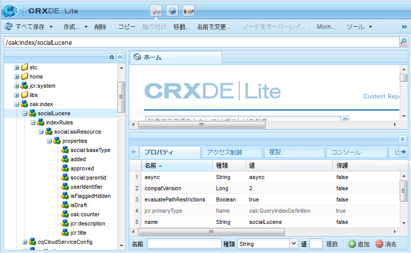

# 検索の基本事項 {#search-essentials}

## 概要 {#overview}

検索機能は、AEM Communitiesの重要な機能です。 また、 [AEM platform 検索](../../help/sites-deploying/queries-and-indexing.md) 機能、AEM Communities [UGC 検索 API](#ugc-search-api) ユーザー生成コンテンツ (UGC) を検索する目的で使用します。 UGC には、他のAEMコンテンツやユーザーデータとは別に入力および保存される固有のプロパティがあります。

Communities では、一般的に検索される 2 つの項目は次のとおりです。

* コミュニティメンバーが投稿したコンテンツ

   * AEM Communities の UGC 検索 API を使用

* ユーザーとユーザーグループ（ユーザーデータ）

   * AEM platform の検索機能を使用

このドキュメントのこの節は、UGC を作成または管理するカスタムコンポーネントを作成する開発者にとって興味深い内容です。

## セキュリティノードとシャドウノード {#security-and-shadow-nodes}

カスタムコンポーネントの場合、 [SocialResourceUtilities](socialutils.md#socialresourceutilities-package) メソッド。 UGC を作成および検索するユーティリティメソッドは、必要な [シャドウノード](srp.md#about-shadow-nodes-in-jcr) メンバーがリクエストに対する正しい権限を持っていることを確認します。

SRP ユーティリティで管理されないのは、モデレートに関連するプロパティです。

詳しくは、 [SRP と UGC の基本事項](srp-and-ugc.md) UGC および ACL シャドウノードへのアクセスに使用するユーティリティメソッドに関する情報。

## UGC 検索 API {#ugc-search-api}

この [UGC 共通ストア](working-with-srp.md) は、様々なストレージリソースプロバイダー (SRP) の 1 つによって提供され、それぞれが異なるネイティブクエリ言語を持つ場合があります。 したがって、選択した SRP に関係なく、カスタムコードでは [UGC API パッケージ](https://helpx.adobe.com/experience-manager/6-4/sites/developing/using/reference-materials/javadoc/com/adobe/cq/social/ugc/api/package-summary.html) (*com.adobe.cq.social.ugc.api*) を呼び出し、選択した SRP に適したクエリ言語を呼び出します。

### ASRP 検索 {#asrp-searches}

の場合 [ASRP](asrp.md)に設定した場合、UGC はAdobeクラウドに保存されます。 UGC は CRX には表示されませんが、 [モデレート](moderate-ugc.md) は、オーサー環境とパブリッシュ環境の両方から使用できます。 の使用 [UGC 検索 API](#ugc-search-api) ASRP では、他の SRP と同じように機能します。

ASRP 検索を管理するためのツールは現在存在しません。

検索可能なカスタムプロパティを作成する場合は、 [命名要件](#naming-of-custom-properties).

### MSRP 検索 {#msrp-searches}

の場合 [MSRP](msrp.md)を使用する場合、UGC は Solr を使用して検索するように設定された MongoDB に保存されます。 UGC は CRX には表示されませんが、 [モデレート](moderate-ugc.md) は、オーサー環境とパブリッシュ環境の両方から使用できます。

MSRP と Solr に関して：

* AEMプラットフォームに埋め込まれた Solr は、MSRP には使用されません
* AEMプラットフォームでリモート Solr を使用している場合、MSRP と共有できますが、異なるコレクションを使用する必要があります
* Solr は、標準検索または多言語検索 (MLS) 用に設定できます
* 設定の詳細については、 [Solr 設定](msrp.md#solr-configuration) （MSRP 用）

カスタム検索機能では、 [UGC 検索 API](#ugc-search-api).

検索可能なカスタムプロパティを作成する場合は、 [命名要件](#naming-of-custom-properties).

### JSRP 検索 {#jsrp-searches}

の場合 [JSRP](jsrp.md)に設定した場合、UGC は [Oak](../../help/sites-deploying/platform.md) とは、入力されたAEMオーサーインスタンスまたはパブリッシュインスタンスのリポジトリーにのみ表示されます。

UGC は通常パブリッシュ環境に入力されるので、マルチパブリッシャーの実稼動システムでは、 [クラスターを公開](topologies.md)（パブリッシュファームではなく）入力したコンテンツをすべてのパブリッシャーから表示できるようにする。

JSRP の場合、パブリッシュ環境に入力された UGC は、オーサー環境では表示されません。 したがって、すべて [モデレート](moderate-ugc.md) タスクはパブリッシュ環境で実行されます。

カスタム検索機能では、 [UGC 検索 API](#ugc-search-api).

#### Oak インデックス作成 {#oak-indexing}

AEMプラットフォーム検索では Oak インデックスは自動的に作成されませんが、AEM 6.2 以降では、AEM Communitiesのパフォーマンスを向上させ、UGC 検索結果を表示する際のページネーションをサポートするために、Oak インデックスが追加されました。

カスタムプロパティが使用中で検索に時間がかかる場合は、カスタムプロパティのパフォーマンスを高めるために、追加のインデックスを作成する必要があります。 移植性を維持するには、 [命名要件](#naming-of-custom-properties) 検索可能なカスタムプロパティを作成する際。

既存のインデックスを変更したり、カスタムインデックスを作成するには、 [Oak クエリとインデックス作成](../../help/sites-deploying/queries-and-indexing.md).

この [Oak インデックスマネージャ](https://adobe-consulting-services.github.io/acs-aem-commons/features/oak-index-manager.html) は、ACS AEM Commons から入手できます。 これには次の機能があります。

* 既存のインデックスの表示
* インデックス再作成を開始する機能

で既存の Oak インデックスを表示するには、以下を実行します。 [CRXDE Lite](../../help/sites-developing/developing-with-crxde-lite.md)の場所は次のようになります。

* `/oak:index/socialLucene`



## インデックス付き検索プロパティ {#indexed-search-properties}

### デフォルトの検索プロパティ {#default-search-properties}

様々なコミュニティ機能で使用される検索可能なプロパティの一部を次に示します。

| **プロパティ** | **データタイプ** |
|---|---|
| isFlagged | *ブール型* |
| isSpam | *ブール型* |
| 読み取り | *ブール型* |
| 影響 | *ブール型* |
| attachments | *ブール型* |
| 好感度 | *Long* |
| フラグ付き | *ブール型* |
| 追加済み | *日付* |
| modifiedDate | *日付* |
| ステート | *文字列* |
| userIdentifier | *文字列* |
| 返信 | *Long* |
| jcr:title | *文字列* |
| jcr:description | *文字列* |
| sling:resourceType | *文字列* |
| allowThreadedReply | *ブール型* |
| isDraft | *ブール型* |
| publishDate | *日付* |
| publishJobId | *文字列* |
| 回答済み | *ブール型* |
| chosensered | *ブール型* |
| tag | *文字列* |
| cq:Tag | *文字列* |
| author_display_name | *文字列* |
| location_t | *文字列* |
| parentPath | *文字列* |
| parentTitle | *文字列* |

### カスタムプロパティの名前 {#naming-of-custom-properties}

カスタムプロパティを追加する場合、これらのプロパティを、 [UGC 検索 API](#ugc-search-api)の場合は、プロパティ名にサフィックスを追加する必要があります。

サフィックスは、スキーマを使用するクエリ言語用です。

* プロパティが検索可能であることを識別します
* データタイプを識別します

Solr は、スキーマを使用するクエリ言語の例です。

| **サフィックス** | **データタイプ** |
|---|---|
| _b | *ブール型* |
| _dt | *Calendar* |
| _d | *倍精度浮動小数点* |
| _tl | *Long* |
| _秒 | *文字列* |
| _t | *テキスト* |

**メモ：**

* *テキスト* はトークン化された文字列です。 *文字列* がではありません。 用途 *テキスト* fuzy（より似た）検索用。

* 複数値型の場合、サフィックスに「s」を追加します。次に例を示します。

   * `viewDate_dt`:単一の日付プロパティ
   * `viewDates_dts`:日付プロパティのリスト

## フィルター {#filters}

次を含むコンポーネント： [コメントシステム](essentials-comments.md) は、エンドポイントへのフィルターパラメーターの追加をサポートしています。

AND および OR 論理のフィルター構文は、次のように表現されます（URL エンコードの前に示します）。

* OR を指定するには、1 つのフィルタパラメータをコンマ区切り値で使用します。

   * `filter=name eq 'Jennifer',name eq 'Jen'`

* AND を指定するには、次のように複数のフィルターパラメーターを使用します。

   * `filter = name eq 'Jackson'&filter=message eq 'testing'`

デフォルトの実装 [検索コンポーネント](search.md) はこの構文を使用します。これは、 [コミュニティコンポーネントガイド](components-guide.md). 実験するには、 [http://localhost:4503/content/community-components/en/search.html](http://localhost:4503/content/community-components/en/search.html).

フィルター演算子は次のとおりです。

| EQ | が次の値と等しい |
|---|---|
| NE | 等しくない |
| LT | より小さい |
| LTE | 次よりも小さいか等しい |
| GE | より大きい |
| GTE | 次よりも大きいか等しい |
| LIKE | ファジーマッチ |

URL は、コンポーネントが配置されているページではなく、コミュニティコンポーネント（リソース）を参照することが重要です。

* 正しい構文：フォーラムコンポーネント
   * `/content/community-components/en/forum/jcr:content/content/forum.social.json`
* 誤った構文：フォーラムページ
   * `/content/community-components/en/forum.social.json`

## SRP ツール {#srp-tools}

以下を含むAdobe Marketing Cloud GitHub プロジェクトがあります。

[AEM Communities SRP ツール](https://github.com/Adobe-Marketing-Cloud/aem-communities-srp-tools)

このリポジトリには、SRP でデータを管理するためのツールが含まれています。

現在、任意の SRP からすべての UGC を削除できるサーブレットが 1 つあります。

例えば、ASRP 内のすべての UGC を削除するには、次のようにします。

```shell
curl -X POST http://localhost:4502/services/social/srp/cleanup?path=/content/usergenerated/asi/cloud -uadmin:admin
```

## トラブルシューティング {#troubleshooting}

### Solr クエリ {#solr-query}

Solr クエリに関する問題のトラブルシューティングに役立つように、

`com.adobe.cq.social.srp.impl.SocialSolrConnector`

実際の Solr クエリは、URL エンコードされてデバッグログに表示されます。

solr に対するクエリ： `sort=timestamp+desc&bl=en&pl=en&start=0&rows=10 &q=%2Btitle_t:(hello)+%2Bprovider_id:\/content/usergenerated/asi/mongo/content/+%2Bresource_type_s:&df=provider_id&trf=verbatim&fq={!cost%3D100}report_suite:mongo`

の値 `q` パラメータはクエリです。 URL エンコーディングがデコードされたら、クエリを Solr 管理クエリツールに渡して、さらにデバッグできます。

## 関連リソース {#related-resources}

* [コミュニティコンテンツストレージ](working-with-srp.md) - UGC 共通ストアで使用可能な SRP の選択肢について説明します
* [ストレージリソースプロバイダの概要](srp.md)  — 概要とリポジトリ使用の概要
* [SRP を使用した UGC へのアクセス](accessing-ugc-with-srp.md)  — コーディングガイドライン
* [SocialUtils リファクタリング](socialutils.md) - SocialUtils に代わる SRP のユーティリティメソッド
* [検索および検索結果のコンポーネント](search.md)  — テンプレートへの UGC 検索機能の追加
