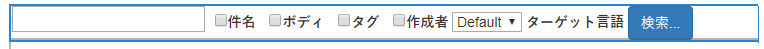
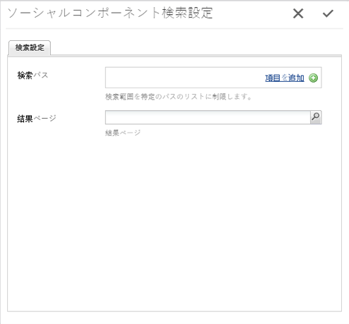
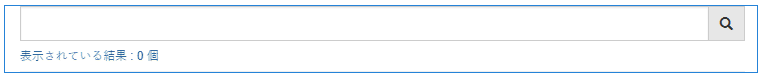
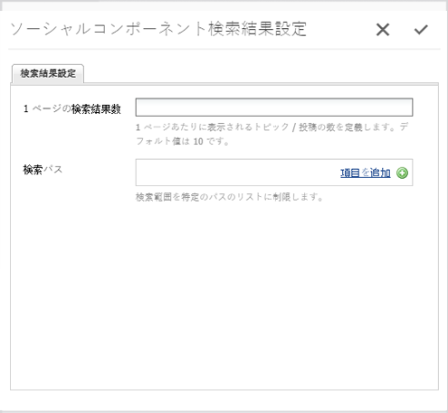

# 検索機能 {#search-feature}

検索機能は、フォーラムなど他の様々な機能と連携して、コンテンツを検索できるようにします。

When adding the ability to search posts entered by community members, referred to as user generated content (UGC), there are two components: [ `Search`](#search-features) and [ `Search Results`](#search-results).

を含むページ `Search Results` コンポーネントは、検索と結果の表示の両方をサポートします。

を含むページ `Search`コンポーネントでは、検索を開始し、結果を `Search Results` ページ。

検索機能は、サイト訪問者やメンバーに向けてコンテンツを表示する他の機能と共に使用できます。

## 検索 {#search-features}

### 検索をページに追加 {#add-search-to-a-page}

を追加するには、以下を実行します。 `Search` コンポーネントをオーサリングモードでページに追加する場合は、コンポーネントブラウザーを使用して `Communities / Search` をクリックし、ページ上の適切な場所にドラッグします。 Use of `Search` requires a second page for the `Search Results.`

For necessary information, visit [Communities Components Basics](basics.md).

When the required client-side library, `cq.social.hbs.search`, is included, this is how the `Search` component will appear.

### 追加した検索を設定 {#configure-the-added-search}

Select the placed `Search` component to access and select the `Configure` icon which opens the edit dialog.

以下 **[!UICONTROL 検索設定]** タブでは、訪問者がクエリを入力した場合に検索するパスを指定します。

* **[!UICONTROL 検索パス]**「項目を追加」ボタンを使用して検索パスを追加すると、コンテンツの検索が限定されます。例えば、検索を特定のフォーラムに限定するには、ページ内に配置されているフォーラムコンポーネントを選択します。

   * `/content/community-components/en/forum/jcr:content/content/forum`

* **[!UICONTROL 結果ページ]**
結果は、ブラウザーを使用して 
`Search Results` component.

## 検索結果 {#search-results}

### 検索結果をページに追加 {#add-search-results-to-a-page}

を追加するには、以下を実行します。 `Search Results` コンポーネントをオーサリングモードでページに追加する場合は、コンポーネントブラウザーを使用して

* `Communities / Search Results`

コンポーネントを探し、ページ上の位置にドラッグします。検索コンポーネントとは異なり、2 番目のページは不要です。同じページに結果が表示されるからです。

If using Search elsewhere within the website, this one page with `Search Results` may be configured to be the `Result Page` for any or all instances of `Search`.

必要な情報については、 [コミュニティコンポーネントの基本](basics.md).

必要なクライアント側ライブラリの場合、 `cq.social.hbs.search`を含める場合は、次のようになります。 `Search Result` コンポーネントが表示されます。

### 追加した検索結果を設定 {#configure-the-added-search-result}

配置された `Search Results` アクセスして選択するコンポーネント `Configure` 編集ダイアログを開くアイコン。

Under the **[!UICONTROL Search Result Settings]** tab, it is possible to specify what paths are included in the search when a query is entered by a visitor.

* **[!UICONTROL 1 ページの検索結果数]** 1 ページに表示するトピック数または投稿数を定義します。初期設定は 10 です。

* **[!UICONTROL 検索パス]**「項目を追加」ボタンを使用して検索パスを追加すると、コンテンツの検索が限定されます。

## 追加情報 {#additional-information}

詳しくは、 [検索の基本事項](search-implementation.md) 開発者向けのページ
