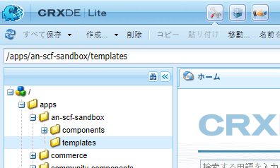
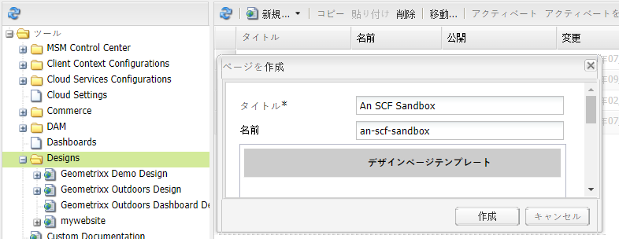
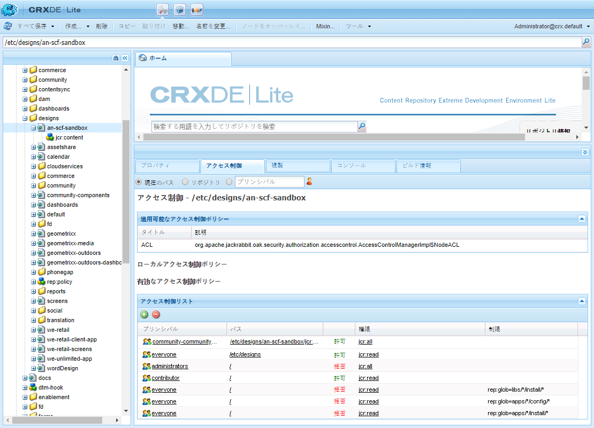

# Web サイト構造のセットアップ {#setup-website-structure}

Web サイトをセットアップするために、後述の手順では、次の場所に作成するフォルダーについて説明します。

* `/apps/an-scf-sandbox`
カスタムアプリケーションとテンプレートが存在する場所です

* `/etc/designs/an-scf-sandbox`
ダウンロード可能なデザイン要素が配置される場所

* `/content/an-scf-sandbox`
ダウンロード可能な Web ページが存在する場所

このチュートリアル内のコードは、アプリケーション、デザインおよびコンテンツについてメインフォルダー名が同じであるという前提に基づきます。Web サイトに別の名前を選択する場合は、 `an-scf-sandbox` 選択した名前で置き換えます。

>[!NOTE]
>
>名前について：
>
>* CRXDE に表示される名前は、アドレス可能なコンテンツへのパスを形成するノード名です
>* ノード名にはスペースを含めることができますが、URI で使用する場合は、スペースを「%20」または「+」としてエンコードする必要があります。
>* ノード名にハイフンとアンダースコアを含めることができますが、Java ファイル内でパッケージ名として参照する場合はエンコードする必要があります。 ハイフンとアンダースコアの両方は、アンダースコアに続いて Unicode 値を付けてエスケープされます。
   >
   >   * ハイフンが「_002d」になる
   >   * アンダースコアは「_005f」になります。

## アプリケーションディレクトリ (/apps) を設定します {#setup-the-application-directory-apps}

リポジトリの /apps ディレクトリには、/content ディレクトリから提供されるページの動作やレンダリングを実装するコードが格納されます。

/apps ディレクトリは保護され、/content ディレクトリおよび /etc/designs ディレクトリとは異なり、外部からアクセスすることはできません。

1. 作成 `/apps/an-scf-sandbox` フォルダー。

   **[!UICONTROL CRXDE Lite]** を使用して、エクスプローラーペインで次の手順を実行します。

   1. を選択します。 `/apps` フォルダー
   1. 右クリック **[!UICONTROL 作成]**...またはプルダウン **[!UICONTROL 作成…]** メニュー
   1. 選択 **[!UICONTROL フォルダーを作成…]** .
   1. 内 **[!UICONTROL フォルダーを作成]** ダイアログ、入力 `an-scf-sandbox`
   1. 「**[!UICONTROL OK]**」をクリックします。

1. **[!UICONTROL components]** サブフォルダーを作成します。

   1. を選択します。 `/apps/an-scf-sandbox` フォルダー
   1. クリック **[!UICONTROL 作成/フォルダーを作成]**
   1. 内 **[!UICONTROL フォルダーを作成]** ダイアログ、入力 **[!UICONTROL コンポーネント]**
   1. 「**[!UICONTROL OK]**」をクリックします。

1. **[!UICONTROL templates]** サブフォルダーを作成します。

   1. を選択します。 `/apps/an-scf-sandbox` フォルダー
   1. クリック **[!UICONTROL 作成/フォルダーを作成]**
   1. 内 **[!UICONTROL フォルダーを作成]** ダイアログ、入力 **[!UICONTROL テンプレート]**
   1. 「**[!UICONTROL OK]**」をクリックします。
   1. 再選択 `/apps/an-scf-sandbox`
   1. 「**[!UICONTROL すべて保存]**」を選択します。

   他の編集プロセスと同様ですが、保存は頻繁におこなってください。データの入力に問題が発生した場合は、ログインがタイムアウトしたか、以前の編集内容を保存する必要がある可能性があります。

1. CRXDE Lite のエクスプローラーペインでの構造は、次のようになります。

   

## デザインディレクトリ (/etc/designs) を設定します。 {#setup-the-design-directory-etc-designs}

/etc/designs ディレクトリには、ページコンテンツと共にダウンロードされる画像、スクリプトおよびスタイルシートが格納されます。

1. クラシック UI で Designer ツールを使用するには、以下を参照します。 [https://&lt;server>:&lt;port>/miscadmin](http://localhost:4502/miscadmin).

   注意：CRXDE Liteを使用してタイプのノードを作成する場合 `cq:Page`に値を指定しない場合、「アクセス制御」と「レプリケーション」はページのデフォルト設定に設定されませんでした。

1. エクスプローラーペインで、**[!UICONTROL Designs]** フォルダーを選択し、**[!UICONTROL 新規／新しいページ]**&#x200B;をクリックします。

   Enter:

   * タイトル： **SCF サンドボックス**
   * 名前：**an-scf-sandbox**
   * 選択 **デザインページテンプレート**

   「**[!UICONTROL 作成]**」をクリックします。

   

1. An SCF Sandbox フォルダーが表示されない場合は、エクスプローラーペインを更新します。

1. CRXDE Lite（http://localhost:4502/crx/de）に戻り、/etc/designs を展開して、「an-scf-sandbox」という名前のノードを表示します。

   CRXDE の右下のペインで、「プロパティ」タブ、「アクセス制御」タブおよび「レプリケーション」タブを表示して、デザインページテンプレートを使用して定義された内容を確認できます。

   

## コンテンツディレクトリ (/content) の設定 {#setup-the-content-directory-content}

リポジトリの /content ディレクトリには、Web サイトコンテンツが格納されます。/content の下のパスは、ブラウザーリクエストの URL のパスを構成します。

*後* の [ページテンプレート](initial-app.md#createthepagetemplate) は、初期アプリケーションの一部として作成され、初期ページコンテンツは、テンプレートに基づいて作成できます。. [**⇒**](initial-app.md)
