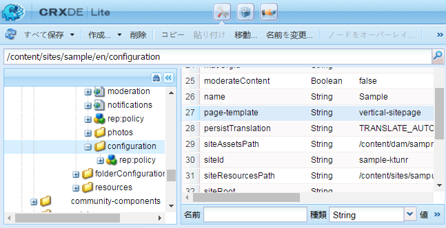

# コミュニティサイトの基本事項 {#community-site-essentials}

## カスタムサイトテンプレート {#custom-site-template}

カスタムサイトテンプレートは、コミュニティサイトの各言語コピーに対して個別に指定できます。

それには、

* カスタムテンプレートの作成
* デフォルトのサイトテンプレートパスをオーバーレイ
* オーバーレイパスにカスタムテンプレートを追加する
* カスタムテンプレートを指定するには、 `page-template` プロパティを `configuration` ノード

**デフォルトのテンプレート**:

/**libs**/social/console/components/hbs/sitepage/**sitepage**.hbs

**オーバーレイパスのカスタムテンプレート**:

/**アプリ**/social/console/components/hbs/sitepage/**&lt;*template-name*>**.hbs

**プロパティ**:page-template\
**タイプ**:文字列\
**値**:&lt;*template-name*> （拡張子なし）

**設定ノード**:

/content/&lt;*コミュニティサイトパス*>/&lt;*lang*>/configuration

例：/content/sites/engage/en/configuration

>[!NOTE]
>
>オーバーレイされたパス内のすべてのノードは、タイプのみである必要があります `Folder`.

>[!CAUTION]
>
>カスタムテンプレートに *sitepage.hbs,* その後、すべてのコミュニティサイトがカスタマイズされます。

### カスタムサイトテンプレートの例 {#custom-site-template-example}

例えば、 `vertical-sitepage.hbs` は、バナーの下に水平方向ではなく、ページの左側から垂直方向にメニューリンクを配置するサイトテンプレートです。

[ダウンロード](assets/vertical-sitepage.hbs)
オーバーレイフォルダーにカスタムサイトテンプレートを配置します。

/**アプリ**/social/console/components/hbs/sitepage/**vertical-sitepage**.hbs

カスタムテンプレートを指定するには、 `page-template` プロパティを設定ノードに設定します。

/content/sites/sample/en/configuration

必ず **すべて保存** すべてのAEMインスタンスにカスタムコードをレプリケートします（コミュニティサイトコンテンツをコンソールから公開する際に、カスタムコードは含まれません）。

カスタムコードをレプリケートする場合の推奨方法は、次のとおりです。 [パッケージの作成](../../help/sites-administering/package-manager.md#creating-a-new-package) すべてのインスタンスにデプロイします。

## コミュニティサイトを書き出す {#exporting-a-community-site}

コミュニティサイトを作成したら、そのサイトをパッケージマネージャーに保存されたAEMパッケージとして書き出し、ダウンロードおよびアップロードできます。

これは、 [コミュニティサイトコンソール](sites-console.md#exporting-the-site).

UGC とカスタムコードはコミュニティサイトパッケージに含まれていません。

UGC を書き出すには、 [AEM Communities UGC 移行ツール](https://github.com/Adobe-Marketing-Cloud/communities-ugc-migration):GitHub で利用できるオープンソース移行ツールです。

## コミュニティサイトの削除 {#deleting-a-community-site}

AEM Communities 6.3 Service Pack 1 以降、コミュニティ/サイトコンソールからコミュニティサイトにカーソルを合わせると、「サイトを削除」アイコンが表示されます。 開発時にコミュニティサイトを削除して新規に開始したい場合は、この機能を使用できます。 コミュニティサイトを削除すると、そのサイトに関連付けられている次の項目が削除されます。

* [UGC](#user-generated-content)
* [ユーザーグループ](#community-user-groups)
* [Assets](#enablement-assets)
* [データベースレコード](#database-records)

### コミュニティの一意のサイト ID {#community-unique-site-id}

CRXDE を使用して、コミュニティサイトに関連付けられた一意のサイト ID を識別するには、次の手順を実行します。

* サイトの言語ルート（例： ）に移動します。 `/content/sites/*<site name>*/en/rep:policy`

* 次を検索： `allow<#>` ノード `rep:principalName` この形式で `rep:principalName = *community-enable-nrh9h-members*`

* サイト ID は、 `rep:principalName`
例えば、 
`rep:principalName = community-enable-nrh9h-members`

   * **サイト名** = *有効*
   * **サイト ID** = *nrh9h*
   * **一意のサイト ID** = *enable-nrh9h*

### ユーザー生成コンテンツ {#user-generated-content}

Github から communities-srp-tools プロジェクトを取得します。

* [https://github.com/Adobe-Marketing-Cloud/communities-srp-tools](https://github.com/Adobe-Marketing-Cloud/communities-srp-tools)

SRP からすべての UGC を削除するサーブレットが含まれます。

すべての UGC は、次のように、特定のサイトで削除できます。

* path=/content/usergenerated/asi/mongo/content/sites/engage

これにより、ユーザー生成コンテンツ（パブリッシュ時に入力）は削除され、オーサリングコンテンツ（オーサー時に入力）は削除されません。 したがって [シャドウノード](srp.md#shadownodes) は影響を受けません。

### コミュニティユーザーグループ {#community-user-groups}

すべてのオーサーインスタンスとパブリッシュインスタンスで、 [セキュリティコンソール](../../help/sites-administering/security.md)を探し、 [ユーザーグループ](users.md) 次のようになります。

* プレフィックス `community`
* 続いて [一意のサイト id](#community-unique-site-id)

例：`community-engage-x0e11-members`

### 実施可能アセット {#enablement-assets}

メインコンソールから：

* 選択 **[!UICONTROL Assets]**
* 入力 **[!UICONTROL 選択]** mode
* 次を使用してという名前のフォルダーを選択します。 [一意のサイト ID](#community-unique-site-id)
* 選択 **[!UICONTROL 削除]** ( 次の中から選択する必要がある場合があります： **[!UICONTROL さらに詳しく…]**)

### データベースレコード {#database-records}

特定のイネーブルメントコミュニティサイトのデータベースエントリを選択的に削除するツールはありません。

すべてのコミュニティサイトを削除したら、MySQL Workbench を使用して enablementdb と scormenginedb を削除します。
