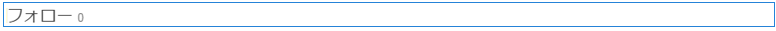

# ソーシャルグラフの使用 {#using-social-graph}

## はじめに {#introduction}

コミュニティメンバーが[アクティビティ](activities.md)をフォローし、フォローする機能は、次の2つのコンポーネントを通じて確立されます。`Follow`と`Following`が含まれます。

`Follow`コンポーネントは別のリソースに関連付ける必要があり、この関連付けはコミュニティのメンバーと機能に対して既に確立されています。

`Following`コンポーネントは、現在のメンバーをフォローしているメンバー、または現在のメンバーをフォローしているメンバーを一覧表示します。 このメンバー間の関係のソーシャルグラフは、[コミュニティサイト](overview.md#communitiessites)用に確立されたユーザープロファイルに含まれます。

## フォロー中コンポーネントをページに追加 {#adding-following-to-a-page}

オーサリングモードでページに`Following`コンポーネントを追加する場合は、コンポーネント`Communities / Following`を選択し、ソーシャルグラフが表示されるページ上の位置にドラッグします。

必要な情報については、[コミュニティコンポーネントの基本](basics.md)を参照してください。

[必須のクライアント側ライブラリ](essentials-socialgraph.md#essentials-for-client-side)を含めると、`Following`コンポーネントは次のように表示されます。

## フォロー中コンポーネントの設定 {#configuring-following}

現在、コンポーネントが`follows`関係を表示するか、`following`関係を表示するかを指定するプロパティを設定する必要があります。

## 追加情報 {#additional-information}

詳しくは、開発者向けの[ソーシャルグラフの重要事項](essentials-socialgraph.md)ページを参照してください。
