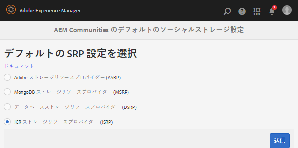

# ストレージ設定 {#storage-configuration}

ストレージ設定では、コミュニティコンテンツ用に選択されているストレージを確認できます。コミュニティコンテンツはユーザー生成コンテンツ（UGC）とも呼ばれます。

この設定では、UGC アクセス時に使用されるストレージリソースプロバイダー（SRP）の実装に関する AEM Communities のコード情報が提供されます。設定は、AEM のデプロイ時に確立したトポロジを反映している必要があります。

ストレージオプションとデプロイメントトポロジの説明については、以下を参照してください。

* [コミュニティコンテンツストア](working-with-srp.md)
* [推奨されるトポロジ](topologies.md)

## ストレージ設定コンソール  {#storage-configuration-console}

オーサー環境でストレージ設定コンソールに移動するには、

* グローバルナビゲーションから：**[!UICONTROL ツール/コミュニティ/ストレージ設定]**

デフォルトの JCR 以外のストレージオプションを選択するには、

* オプションを選択します。
* 適切な設定

   * [MSRP](msrp.md#select-msrp)の選択の詳細を参照
   * [DSRP](dsrp.md#select-dsrp)の選択の詳細を参照
   * [ASRP](asrp.md#select-asrp)の選択の詳細を参照

* **[!UICONTROL 送信]**&#x200B;を選択

### JCR ストレージについて {#about-jcr-storage}

選択しなかった場合は、AEM リポジトリである JCR がデフォルトで使用されることに注意してください。

JCRは、作成者と発行環境が共有する共通のストアではありません。*a1/>*&#x200B;コミュニティコンテンツは、そのコンテンツが作成された作成者または発行環境からのみ表示されます。

詳しくは、[JCR ストア](jsrp.md)を参照してください。

>[!NOTE]
>
>`/etc/socialconfig`の下にノード`srpc`がない場合は、デフォルトの[JCRストア](jsrp.md)を示します。

