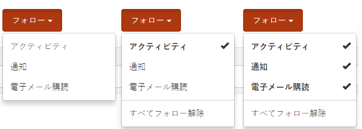
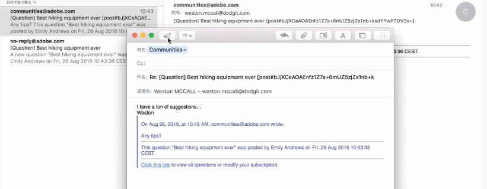
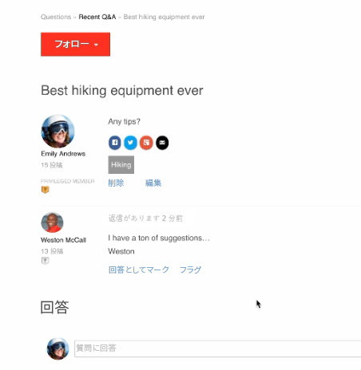

# コミュニティの購読 {#communities-subscriptions}

>[!CAUTION]
>
>AEM 6.4 の拡張サポートは終了し、このドキュメントは更新されなくなりました。 詳細は、 [技術サポート期間](https://helpx.adobe.com/jp/support/programs/eol-matrix.html). サポートされているバージョンを見つける [ここ](https://experienceleague.adobe.com/docs/?lang=ja).

## 概要 {#overview}

コミュニティの時点 [FP1](deploy-communities.md#latestfeaturepack)コミュニティメンバーは、購読と呼ばれる機能を使用して、電子メールを通じてコミュニティとやり取りすることができます。

購読は、 [通知](notifications.md) ブログ記事、フォーラムトピック、Q&amp;A の質問に従う際に、メンバーが購読する場合があります。

購読と通知は次の点で異なります。

* メンバーは、他のメンバーをフォローする際に購読できません
* メンバーが実行するアクションは、選択するだけです `Email Subscriptions` フォロー中
* 電子メールの返信が設定されている場合、メンバーは受信した電子メールに返信するだけで、効果的にコンテンツを投稿できます

### 要件 {#requirements}

**電子メールを設定**

購読が機能し、メンバーが E メールで返信できるように、E メールを設定する必要があります。

電子メールの設定手順については、 [電子メールの設定](email.md).

**購読を有効にしてフォロー**

購読を有効にするには、コンポーネントを設定する必要があります *および* フォロー中 サブスクリプションを許可する機能は、 [ブログ](blog-feature.md), [フォーラム](forum.md) および [Q&amp;A](working-with-qna.md).

## フォローからの購読 {#subscriptions-from-following}

この **フォロー** ボタンを使用すると、エントリをアクティビティ、購読、通知としてフォローできます。 毎回 **フォロー** ボタンが選択されている場合、選択のオン/オフを切り替えることができます。

次のいずれかの方法を選択した場合、ボタンのテキストは **フォロー中**. 便宜上、 `Unfollow All` をクリックして、すべてのメソッドをオフにします。

この **フォロー** ボタンに `Email Subscriptions` オプションは、フォーラム、Q&amp;A またはブログが電子メール購読を有効にするように設定されている場合にのみ有効です。 このボタンが表示されます

* 有効なフォーラム、Q&amp;A またはブログのメイン機能ページ

   * この機能の下にあるすべてのアクティビティのメールを送信します

* フォーラムトピック、Q&amp;A 質問、ブログ記事などの特定のエントリ

   * その特定のエントリに対するアクティビティがある場合に電子メールを送信します

## メールで返信 {#reply-by-email}

電子メールが [電子メールで返信するように設定されました](email.md#configure-polling-importer)購読したメンバーは、投稿されたコンテンツとオンラインコンテンツへのリンクを含む E メールを受信します。

メールに返信する場合、返信に入力した内容は、コンテンツとしてオンラインで表示されます。

返信の投稿に要する時間は、 [ポーリングインポーターの更新間隔](email.md#configure-polling-importer).

