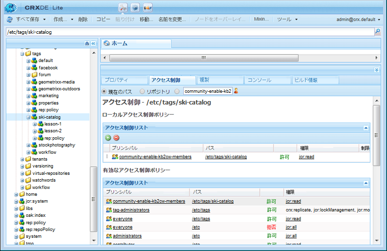
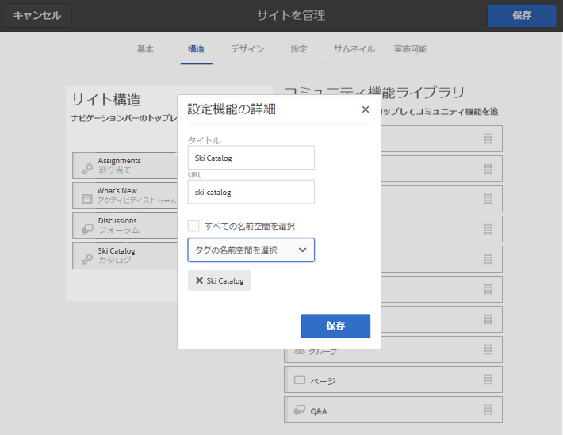
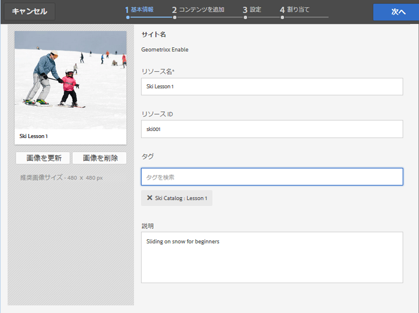
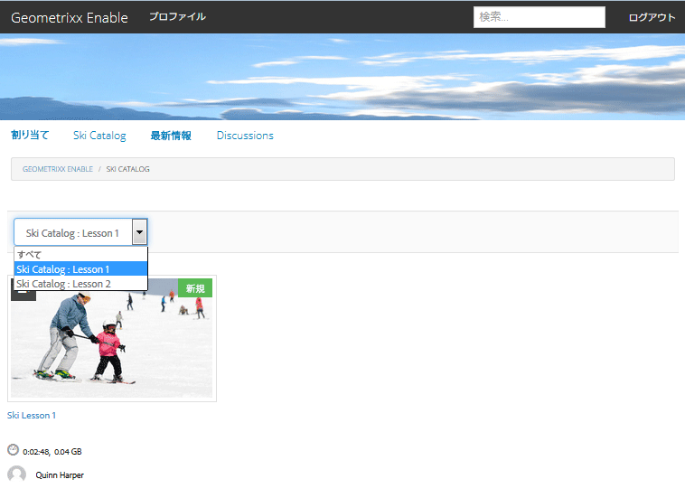

# イネーブルメントリソースのタグ付け {#tagging-enablement-resources}

## 概要 {#overview}

イネーブルメントリソースのタグ付けにより、メンバーが参照する際にリソースと学習パスをフィルタリングできます。 [カタログ](functions.md#catalog-function).

基本的には、

* [タグ名前空間の作成](../../help/sites-administering/tags.md#creating-a-namespace) 各カタログ

   * [タグ権限の設定](../../help/sites-administering/tags.md#setting-tag-permissions)

      * コミュニティメンバーのみ（閉じられたコミュニティ）

         * の読み取りアクセスを許可 [コミュニティサイトのメンバーグループ](users.md#publish-group-roles)
      * サイト訪問者の場合は、サインインしているか、匿名（オープンコミュニティ）かを問わず、

         * の読み取りアクセスを許可 `Everyone`グループ
   * [タグを公開](../../help/sites-administering/tags.md#publishing-tags)

* [コミュニティサイトのタグの範囲を定義する](sites-console.md#tagging)

   * [サイトの構造に存在するカタログを設定する](functions.md#catalog-function)

      * カタログインスタンスにタグを追加して、UI フィルターに表示されるタグのリストを制御できます。
      * 追加可能 [プリフィルター](catalog-developer-essentials.md#pre-filters)（カタログに含まれるリソースを制限）

* [コミュニティサイトを公開](sites-console.md#publishing-the-site)
* [イネーブルメントリソースへのタグの適用](resources.md#create-a-resource) したがって、それらは、分類的にフィルタリングされるかもしれない
* [イネーブルメントリソースを公開する](resources.md#publish)

## コミュニティサイトタグ {#community-site-tags}

コミュニティサイトを作成または編集する場合、 [タグ設定](sites-console.md#tagging) 既存のタグ名前空間のサブセットを選択して、サイトの機能に使用できるタグの範囲を設定します。

タグはいつでもコミュニティサイトに作成および追加できますが、データベースのデザインと同様に、事前に分類をデザインすることをお勧めします。 [タグの使用](../../help/sites-authoring/tags.md)を参照してください。

後で既存のコミュニティサイトにタグを追加する場合は、編集を保存してから、新しいタグをサイトの構造のカタログ機能に追加する必要があります。

コミュニティサイトの場合、サイトを公開してタグを公開した後、コミュニティのメンバーに対して読み取りアクセスを有効にする必要があります。 詳しくは、 [タグ権限の設定](../../help/sites-administering/tags.md#setting-tag-permissions).

管理者がに読み取り権限を適用すると、CRXDE では次のように表示されます。 `/etc/tags/ski-catalog` グループの `Community Enable Members`.

## カタログタグ名前空間 {#catalog-tag-namespaces}

カタログ機能は、タグを使用して自身を定義します。 コミュニティサイトでカタログ機能を設定する際、選択するタグ名前空間のセットは、コミュニティサイトで設定されたタグ名前空間の範囲によって定義されます。

カタログ機能には、カタログのフィルタ UI に表示されるタグを定義するタグ設定が含まれます。 「すべての名前空間」の設定は、コミュニティサイトで選択したタグ名前空間の範囲を指します。

## イネーブルメントリソースへのタグの適用 {#applying-tags-to-enablement-resources}

イネーブルメントリソースと学習パスは、 `Show in Catalog` がオンになっている。 リソースと学習パスにタグを追加すると、特定のカタログに事前にフィルタリングしたり、カタログ UI でフィルタリングしたりできます。

イネーブルメントリソースと学習パスを特定のカタログに制限するには、 [プリフィルター](catalog-developer-essentials.md#pre-filters).

カタログ UI を使用すると、訪問者は、カタログに表示されるリソースと学習パスのリストにタグフィルターを適用できます。

イネーブルメントリソースにタグを適用する管理者は、より詳細な分類をおこなうためにサブタグを選択するために、カタログに関連付けられたタグ名前空間と分類を認識しておく必要があります。

例えば、 `ski-catalog` 名前空間が作成され、次の名前のカタログに設定されました： `Ski Catalog`という 2 つの子タグを持つ場合があります。 `lesson-1` および `lesson-2`.

したがって、以下のいずれかがタグ付けされたイネーブルメントリソースが存在します。

* ski-catalog:
* ski-catalog:lesson-1
* ski-catalog:lesson-2

が `Ski Catalog` イネーブルメントリソースが公開された後。

## 公開時にカタログを表示 {#viewing-catalog-on-publish}

すべてをオーサー環境から設定して公開したら、カタログを使用してイネーブルメントリソースを見つける経験をパブリッシュ環境で体験できます。

ドロップダウンにタグ名前空間が表示されない場合は、パブリッシュ環境で権限が正しく設定されていることを確認します。

タグ名前空間が追加され、見つからない場合は、タグとサイトが再公開されたことを確認します。

カタログの表示時にタグを選択した後にイネーブルメントリソースが表示されない場合は、カタログの名前空間からイネーブルメントリソースに適用されたタグが存在することを確認します。

