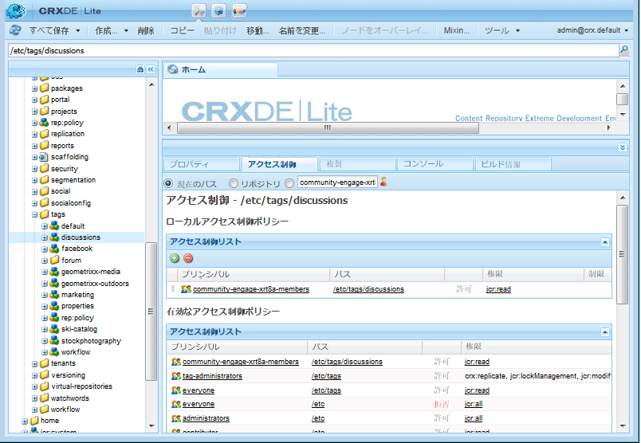

# ユーザー生成コンテンツのタグ付け {#tagging-user-generated-content}

## 概要 {#overview}

ユーザー生成コンテンツ (UGC) のタグ付けは、コミュニティメンバーが他のメンバーがコンテンツを検索する際に役立つ手段です。

通常、タグはオーサー環境で作成者および管理者が適用します。 UGC のタグ付けは、UGC タグがパブリッシュ環境のコミュニティメンバーによって適用される点で一意です。

タグの名前空間と分類は、両方のアプリケーションで同じです。

## コミュニティの機能 {#communities-features}

タグ付けを許可するように設定できるAEM Communitiesの機能は次のとおりです。

* [ブログ](blog-feature.md)
* [Calendar](calendar.md)
* [ファイルライブラリ](file-library.md)
* [フォーラム](forum.md#configuretheaddedforum)
* [質問と答え](working-with-qna.md)

## タグの管理 {#administering-tags}

詳しくは、 [タグの管理](../../help/sites-administering/tags.md#tagging-console) タグ名前空間と分類の作成と管理

詳しくは、 [タグの基本事項](tag.md) 」を参照してください。

詳しくは、 [Social タグクラウドの使用](tagcloud.md) ページに Social タグクラウドコンポーネントを追加して、適用したタグを使用して、投稿された UGC を検索しやすくする。

### タグ権限 {#tag-permissions}

デフォルトの権限では、パブリッシュ環境の全員がタグ名前空間を読み取れないように設定されています。

タグはパブリッシュ環境で UGC に適用されるので、コミュニティメンバーが適用するタグを選択できるようにするには、読み取り権限をコミュニティメンバーに対して有効にする必要があります。

詳しくは、 [タグ権限の設定](../../help/sites-administering/tags.md#setting-tag-permissions).

管理者がに読み取り権限を適用すると、CRXDE では次のように表示されます。 `/etc/tag/discussions` グループの `*Community Engage Members*`.

