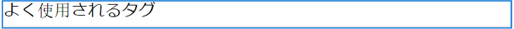
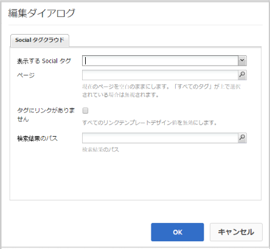
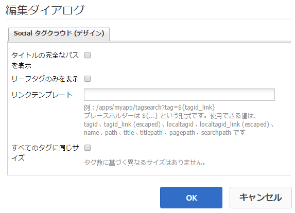

# Social タグクラウドの使用  {#using-social-tag-cloud}

## はじめに {#introduction}

`Social Tag Cloud`コンポーネントは、コンテンツの投稿時にコミュニティメンバーが適用したタグを強調表示します。 これは、トレンドトピックを識別し、サイト訪問者がタグ付きコンテンツをすばやく見つけられるようにする手段です。

現在のトレンドを識別するもう 1 つの手段については、「[アクティビティのトレンド](trends.md)」を参照してください。

このページでは、`Social Tag Cloud`コンポーネントダイアログの設定と、ユーザーエクスペリエンスについて説明します。

開発者向けの詳細な情報は、[タグの重要事項](tag.md)を参照してください。

タグの作成と管理、およびタグが適用されるコンテンツについて詳しくは、[タグの管理](../../help/sites-administering/tags.md)を参照してください。

## Social タグクラウドの追加 {#adding-a-social-tag-cloud}

`Social Tag Cloud`コンポーネントをオーサリングモードでページに追加するには、コンポーネントブラウザーを使用して`Communities / Social Tag Cloud`を探し、タグクラウドが表示されるページ上の位置にドラッグします。

必要な情報については、[コミュニティコンポーネントの基本](basics.md)を参照してください。

[必須のクライアント側ライブラリ](tag.md#essentials-for-client-side)を含めると、`Social Tag Cloud`コンポーネントは次のように表示されます。

## Social タグクラウドの設定 {#configuring-social-tag-cloud}

配置済みの`Social Tag Cloud`コンポーネントを選択し、`Configure`アイコンを選択すると、編集ダイアログが開きます。

「**[!UICONTROL Social タグクラウド]**」タブでは、どのタグを表示するかと、タグがアクティブリンクである場合に、検索結果を表示するページの場所を指定します。

* **[!UICONTROL 表示する Social タグ]**&#x200B;表示する UGC タグを指定します。プルダウンオプションは次のとおりです。

   * `From page and child pages`
   * `All tags`

   デフォルト値は`From page and child pages`です。「page」は、以下の&#x200B;**Page**&#x200B;設定を参照します。

* **[!UICONTROL ページ]**
（そうでない場合は必須） 
`All tags)` ページのUGCへのパス。空白の場合、初期設定は現在のページです。

* **[!UICONTROL タグにリンクがありません]**&#x200B;オンにすると、タグはタグクラウドにプレーンテキストとして表示されます。オフにすると、タグは、そのタグが適用されるすべてのコンテンツを検索するアクティブなリンクとして表示されます。 初期設定はオフで、**[!UICONTROL 検索結果のパス]**&#x200B;を設定する必要があります。

* **[!UICONTROL 検索結]**
果のパス： 
`Search Result` ページ設定で指定されたUGCパスを含むUGCを参照するようにコンポーネントが配置され **** ている。

## Social タグクラウドの表示を変更する {#change-display-of-social-tag-cloud}

**Socialタグクラウド**&#x200B;の表示を編集するには、[デザインモード](../../help/sites-authoring/default-components-designmode.md)に入り、配置された`Social Tag Cloud`コンポーネントをダブルクリックして、追加のタブを含むダイアログを開きます。

「**[!UICONTROL Socialタグクラウド（デザイン）]**」タブを使用して、タグの表示方法を指定します。 タグは、単純なタグ、デフォルトの名前空間内の単一の単語、または階層的な分類です。

* **[!UICONTROL タイトルの完全なパスを表示]**&#x200B;オンにすると、適用されたタグごとに、親タグと名前空間のタイトルが表示されます。

   次に例を示します。

   * チェック: `Geometrixx Media: Gadgets / Cars`
   * 未チェック: `Cars`

   シンプルなタグの場合は、表示に違いは現れません。

   初期設定はオフです。

* **[!UICONTROL リーフタグのみを表示]**&#x200B;オンにした場合は、適用されるタグのみが表示され、その他のタグは含まれません。

   例えば、

   `Geometrixx Media: Gadgets / Cars`

   次の3つのタグを適用できます。`Geometrixx Media (the namespace)`、`Gadgets`、および`Cars`

   * オン：適用される場合は、`Cars`のみが表示されます。
   * オフ：`Geometrixx Media`と`Gadgets`、`Cars`が表示されます（適用される場合）

   シンプルなタグはリーフタグです。

   初期設定はオフです。

* **[!UICONTROL リンクテンプレート]**&#x200B;コンポーネントの編集ダイアログでリンクが有効にされているときに、タグクラウド内にリンクを表示するために使用されるデフォルト以外のテンプレートを指定します。

* **[!UICONTROL すべてのタグに同じサイズ]**&#x200B;オンにすると、タグクラウド内のすべての単語が同じスタイルに設定されます。オフにすると、単語のスタイルが使用方法に応じて異なります。 初期設定はオフです。

## 追加情報 {#additional-information}

詳しくは、開発者向けの[タグの基本事項](tag.md)ページを参照してください。

タグの作成と管理について詳しくは、[ユーザー生成コンテンツのタグ付け](tag-ugc.md)(UGC)を参照してください。
