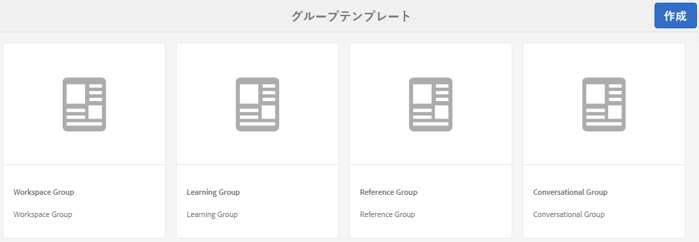
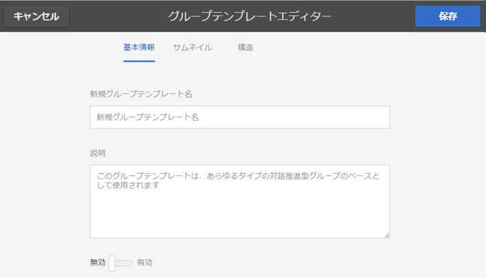
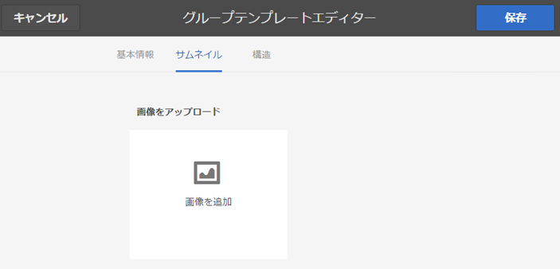
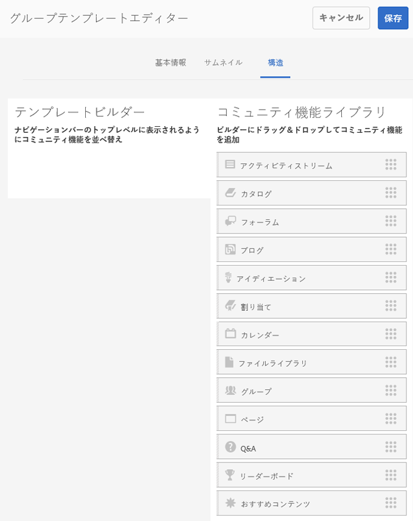
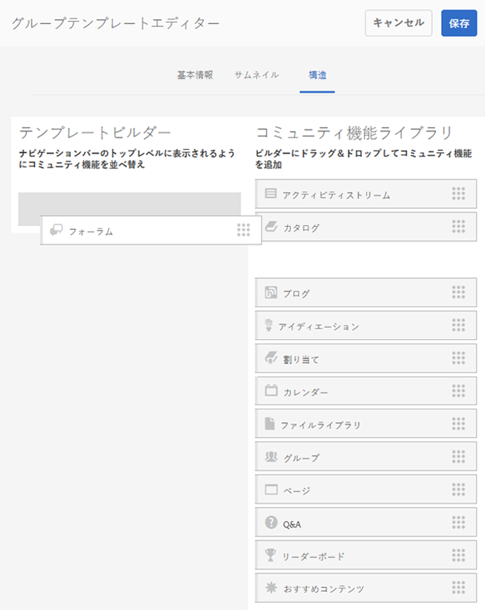

# グループテンプレート {#group-templates}

グループテンプレートコンソールは、[サイトテンプレート](sites.md)コンソールによく似ています。どちらも、コミュニティサイトを形成する、事前に配線されたページと機能のセットの設計図です。 異なる点は、サイトテンプレートはメインコミュニティ用、グループテンプレートはコミュニティグループ用、つまりメインコミュニティ内にネストされたサブコミュニティ用です。

[Groups関数](functions.md#groups-function)を含めることで、コミュニティグループをサイトテンプレートに組み込む（これはテンプレート内の最初の機能でも唯一の機能でもない）。

Communities [機能パック 1](deploy-communities.md#latestfeaturepack) 以降、グループテンプレート内にグループ機能を含めることにより、グループをネストできるようになりました。

新しいコミュニティグループを作成するアクションが実行されるとすぐに、グループのテンプレート（構造）が選択されます。選択項目は、サイトまたはグループテンプレートに追加したときにGroups機能がどのように設定されたかによって異なります。

>[!NOTE]
>
>[コミュニティサイト](sites-console.md)、[コミュニティサイトテンプレート](sites.md)、[コミュニティグループテンプレート](tools-groups.md)、[コミュニティ機能](functions.md)の作成用コンソールは、作成者環境でのみ使用できます。

## Group Templates Console {#group-templates-console}

オーサー環境でグループテンプレートコンソールに移動するには、

* グローバルナビゲーションから：**[!UICONTROL ツール/コミュニティ/グループテンプレート]**

このコンソールには、[コミュニティサイト](sites-console.md)を作成できるテンプレートが表示され、新しいグループテンプレートを作成できます。

## グループテンプレートの作成 {#create-goup-template}

新しいグループテンプレートの作成を開始するには、「**[!UICONTROL 作成]**」を選択します。

するとサイトエディターパネルに移動します。パネルには以下の 3 つのサブパネルがあります。

### 基本情報 {#basic-info}

基本情報パネルでは、名前、説明およびテンプレートを有効にするか無効にするかを設定します。

* **[!UICONTROL New Group Template]**
Nameテンプレート名id

* ****
説明テンプレートの説明

* **[!UICONTROL 無効/]**
有効テンプレートが参照可能かどうかを制御する切り替えスイッチ

### サムネール  {#thumbnail}

（オプション）コミュニティサイトの作成者に対し、名前と説明に加えてサムネイルを表示するには、画像をアップロードアイコンを選択します。

### 構造 {#structure}

>[!CAUTION]
>
>AEM 6.1 Communities FP4 以前のバージョンを使用している場合は、グループテンプレートにグループ機能を追加しないでください。
>
>ネストされたグループの機能を使用できるのは、Communities [FP1](communities.md#latestfeaturepack) 以降です。
>
>テンプレート内の 1 番目の機能または唯一の機能としてグループ機能を追加することはまだできません。

コミュニティ機能を追加するには、右側から左側にドラッグします。サイトメニューのリンクは追加した順番で表示されます。スタイルは、サイトの作成時にテンプレートに適用されます。

例えば、フォーラムが必要な場合は、フォーラム機能をライブラリからテンプレートビルダーにドラッグ＆ドロップします。これにより、フォーラム設定ダイアログが開きます。 設定ダイアログの詳細については、[関数コンソール](functions.md)を参照してください。

このテンプレートをベースとするサブコミュニティサイト（グループ）に必要な、その他のコミュニティ機能を続けてドラッグ＆ドロップします。

必要なすべての関数がテンプレートビルダー領域に配置され、設定されたら、右上隅の「**[!UICONTROL 保存]**」を選択します。

## グループテンプレートを編集 {#edit-group-template}

メインの[グループテンプレートコンソール](#group-templates-console)でコミュニティグループを表示しているときに、既存のサイトテンプレートを選択して編集できます。

グループテンプレートを編集しても、そのテンプレートを基に作成された既存のコミュニティサイトに影響が及ぶことはありません。その代わりに、直接[コミュニティサイトの構造を編集](sites-console.md#modify-structure)することができます。

このプロセスでは、[グループテンプレートの作成](#create-goup-template)と同じパネルを使用します。
