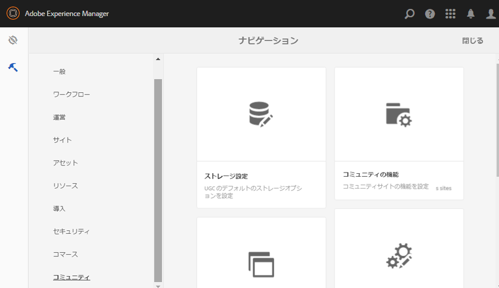

# コミュニティツール {#communities-tools}

>[!CAUTION]
>
>AEM 6.4 の拡張サポートは終了し、このドキュメントは更新されなくなりました。 詳細は、 [技術サポート期間](https://helpx.adobe.com/jp/support/programs/eol-matrix.html). サポートされているバージョンを見つける [ここ](https://experienceleague.adobe.com/docs/?lang=ja).

オーサー環境でコミュニティツールコンソールにアクセスするには、次の手順に従います。

* グローバルナビゲーションから： **[!UICONTROL ツール/コミュニティ]**

* [サイトテンプレート](sites.md)  — サイトテンプレートの作成と管理のためのコンソール
* [グループテンプレート](tools-groups.md) — グループテンプレートの作成と管理のためのコンソール
* [コミュニティ機能](functions.md) — コミュニティ機能の作成と管理のためのコンソール
* [ストレージ設定](srp-config.md)  — コンソールを使用して、 [デフォルトの SRP](working-with-srp.md)

* [コンポーネントガイド](components-guide.md) - SCF コンポーネントの動作方法と、その設定方法またはカスタマイズ方法を実験できるインタラクティブサイトを開きます。
* [バッジ](badges.md)  — カスタムバッジを追加して [スコアとバッジのルール](implementing-scoring.md)
