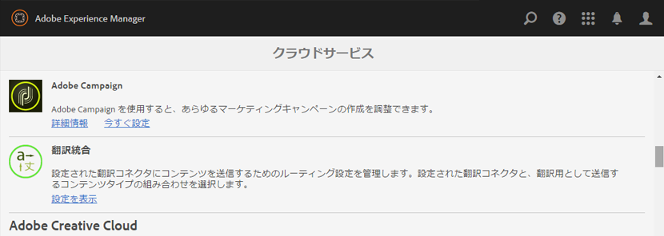
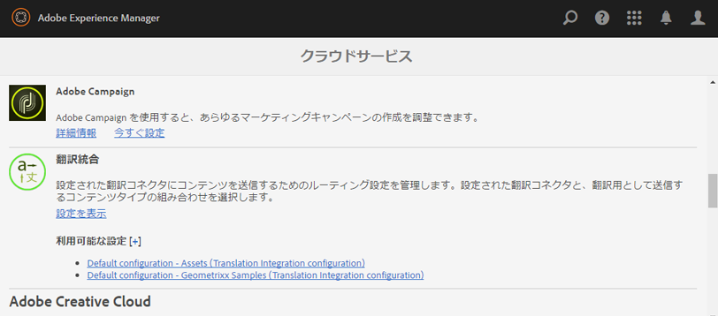
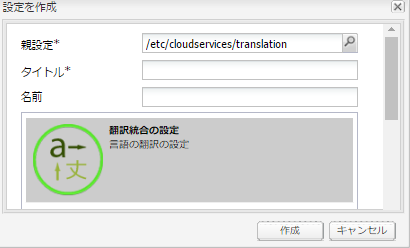
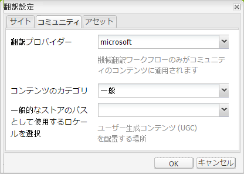
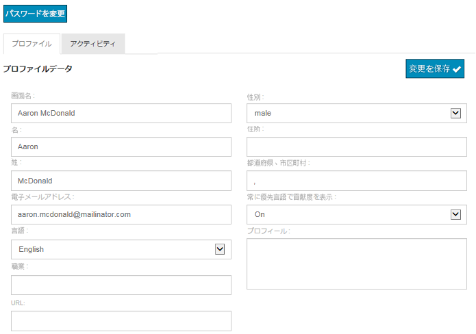

# ユーザー生成コンテンツの翻訳 {#translating-user-generated-content}

AEM Communitiesの翻訳機能は、 [ページコンテンツの翻訳](../../help/sites-administering/translation.md) を使用してコミュニティサイトに投稿されたユーザー生成コンテンツ (UGC) に [ソーシャルコンポーネントフレームワーク (SCF) コンポーネント](scf.md).

UGC の翻訳により、サイトの訪問者やメンバーは言語の障壁を取り除くことで、グローバルなコミュニティを体験できます。

例として、次のように考えます。

* フランスのメンバーが、多国籍料理の Web サイトのコミュニティフォーラムに、フランス語でレシピを投稿します
* 他の日本人は、この翻訳機能を使って、フランス語から日本語へのトリガーを行っています
* 日本語でレシピを読んだ後、日本から来たメンバーは日本語でコメントを投稿します
* フランスのメンバーは、翻訳機能を使用して日本語のコメントをフランス語に翻訳します
* グローバルコミュニケーション！

## 概要 {#overview}

このドキュメントのこの節では、AEMを UGC に接続する方法を理解していると仮定しながら、翻訳サービスと UGC の連携の仕組みについて具体的に説明します。 [翻訳サービスプロバイダー](../../help/sites-administering/translation.md#connectingtoatranslationserviceprovider) を設定し、 [翻訳統合フレームワーク](../../help/sites-administering/tc-tic.md).

翻訳サービスプロバイダーがサイトに関連付けられている場合、サイトの各言語コピーは、コメントなどの SCF コンポーネントを通じて投稿された UGC の独自のスレッドを維持します。

翻訳サービスプロバイダーに加えて翻訳統合フレームワークを設定すると、サイトの各言語コピーで UGC の 1 つのスレッドを共有でき、言語コピー間でグローバルに通信できます。 言語別のディスカッションスレッドの代わりに、設定された [グローバル共有ストア](#global-translation-of-ugc) どの言語コピーから表示されているかに関係なく、スレッド全体を表示できます。 さらに、地域別などのグローバル参加者の論理的なグループ化に対して、異なるグローバル共有ストアを指定して、複数の翻訳統合設定を設定できます。

## デフォルトの翻訳サービス {#the-default-translation-service}

AEM Communitiesには [試用ライセンス](../../help/sites-administering/tc-msconf.md#microsoft-translator-trial-license) の [デフォルトの翻訳サービス](../../help/sites-administering/tc-msconf.md) 複数の言語で有効になっています。

条件 [コミュニティサイトの作成](sites-console.md)の場合、デフォルトの翻訳サービスは `Allow Machine Translation` が [翻訳](sites-console.md#translation) サブパネル

>[!CAUTION]
>
>デフォルトの翻訳サービスはデモ用です。
>
>実稼動システムの場合は、ライセンスされた翻訳サービスが必要です。 ライセンスがない場合、デフォルトの翻訳サービスを [オフにする](../../help/sites-administering/tc-msconf.md#microsoft-translator-trial-license-geometrixx-outdoors).

## UGC のグローバル翻訳 {#global-translation-of-ugc}

Web サイトに複数の [言語コピー](../../help/sites-administering/tc-prep.md)を指定した場合、デフォルトの翻訳サービスは、あるサイトに入力された UGC が別のサイトに入力された UGC と関連している可能性があることを認識しません。これは、UGC が基本的に同じコンポーネント（コンポーネントを含むページの言語コピー）で生成される場合と同様です。

1 つの大きなグループの誰もが 1 つの会話に参加するのに比べ、自分のグループ以外のグループでのコメントに気づかないで話し合う人々のグループと似ています。

「1 つのグループでの会話」が必要な場合は、複数の言語コピーを持つ Web サイト全体でグローバル翻訳を有効にして、どの言語コピーから表示されているかに関係なく、スレッド全体を表示できます。

例えば、ベースサイト上にフォーラムが確立され、言語コピーが作成され、グローバル翻訳が有効になっている場合、1 つの言語コピーでフォーラムに投稿されたトピックがすべての言語コピーに表示されます。 返信元の言語コピーが入力された言語に関係なく、返信に対しても同じことが言えます。 その結果、トピックが表示されている言語コピーに関係なく、トピックと返信のスレッド全体が表示されます。

>[!CAUTION]
>
>グローバル翻訳以前に存在していた UGC は表示されなくなりました。
>
>UGC が [共通店](working-with-srp.md)に設定されている場合は、言語固有の UGC の場所の下に配置されますが、グローバル翻訳の設定後に追加された新しいコンテンツは、グローバル共有ストアの場所から取得されます。
>
>言語固有のコンテンツをグローバル共有ストアに移動または結合するための移行ツールは用意されていません。

### 翻訳統合の設定 {#translation-integration-configuration}

新しい翻訳統合を作成するには、翻訳サービスコネクタをオーサーインスタンス上の Web サイトに統合します。

* 管理者としてログイン
* 次の [メインメニュー](http://localhost:4502/)
* 「**[!UICONTROL ツール]**」を選択します
* 選択 **[!UICONTROL 運用]**
* 選択 **[!UICONTROL クラウド]**
* 選択 **[!UICONTROL Cloud Services]**
* 下にスクロールして **[!UICONTROL 翻訳の統合]**

* 選択 **[!UICONTROL 設定を表示]**

* 選択 `[+]` 隣のアイコン **[!UICONTROL 利用可能な設定]** 新しい設定を作成するには

#### 設定を作成ダイアログ {#create-configuration-dialog}

* **[!UICONTROL 親設定]**
（必須）通常はデフォルトのままにします。 初期設定は です。 
`/etc/cloudservices/translation`

* **[!UICONTROL タイトル]**
（必須）任意の表示タイトルを入力します。 デフォルト値はありません。

* **[!UICONTROL 名前]**
（オプション）設定の名前を入力します。 初期設定は、タイトルに基づくノード名です。

* 選択 **[!UICONTROL 作成]**

#### 翻訳設定ダイアログ {#translation-config-dialog}

詳細な手順については、 [翻訳統合設定の作成](../../help/sites-administering/tc-tic.md#creating-a-translation-integration-configuration)

* **[!UICONTROL サイト]** タブ：デフォルトのままにすることができます
* **[!UICONTROL コミュニティ]** タブ：
   * **[!UICONTROL 翻訳プロバイダー]**
ドロップダウンリストから翻訳プロバイダーを選択します。 初期設定は です。 
`microsoft`、試用サービス。

   * **[!UICONTROL コンテンツカテゴリ]**
翻訳されるコンテンツを説明するカテゴリを選択します。 初期設定は です。 
`General.`

   * **[!UICONTROL ロケールを選択…]**
（オプション）UGC を保存するロケールを選択すると、すべての言語コピーからの投稿が 1 つのグローバル会話に表示されます。 慣例により、 [ベース言語](sites-console.md#translation) を参照してください。 選択 `No Common Store` グローバル翻訳を無効にします。 デフォルトでは、グローバル翻訳は無効になっています。

* **[!UICONTROL Assets]** タブ：デフォルトのままにすることができます
* 選択 **[!UICONTROL OK]**

#### アクティベーション {#activation}

新しい翻訳統合クラウドサービスをパブリッシュ環境に対してアクティブ化する必要があります。 Web サイトに関連付けられている場合、まだアクティベートされていない場合、関連付けられているページが公開される際に、このクラウドサービス設定の公開を求めるメッセージがアクティベーションワークフローに表示されます。

## 翻訳設定の管理 {#managing-translation-settings}

>[!NOTE]
>
>**優先言語**
>
>投稿が優先言語とは異なる言語であるかどうかを検出するために、サイト訪問者の優先言語を設定する必要があります。
>
>優先言語とは、サイト訪問者がサインインし、言語設定を指定した場合にユーザーのプロファイルで設定される言語設定です。
>
>サイト訪問者が匿名の場合、またはプロファイルで言語設定が指定されていない場合、優先言語はページテンプレートの基本言語になります。

### ユーザーの環境設定 {#user-preference}

#### ユーザープロファイル {#user-profile}

すべてのコミュニティサイトは、サインインしたメンバーが編集して、自分自身をコミュニティに特定し、自分の環境設定を設定できるユーザープロファイルを提供します。

その 1 つは、コミュニティコンテンツを常に優先言語で表示するかどうかです。 デフォルトでは、設定は設定されておらず、デフォルトでシステム設定になります。 ユーザーは、設定を [ オン ] または [ オフ ] に変更し、システム設定を上書きできます。

ページがユーザーの優先言語に自動翻訳される場合でも、元のテキストを表示し、翻訳を改善するための UI が引き続き利用可能になります。

### コミュニティサイト設定 {#community-site-setting}

コミュニティサイトを作成する際に、翻訳オプションを有効にして設定できます。 翻訳設定は、匿名のサイト訪問者が表示できるコンテンツに対して有効ですが、ユーザーのプロファイル設定によって上書きされます。
