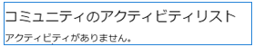
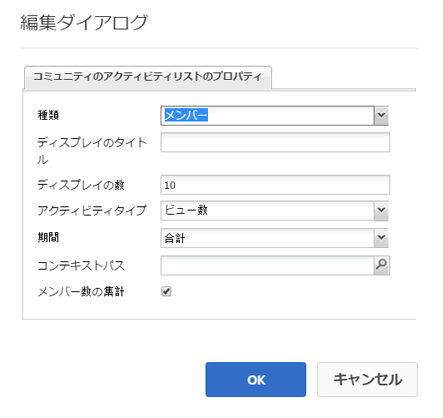
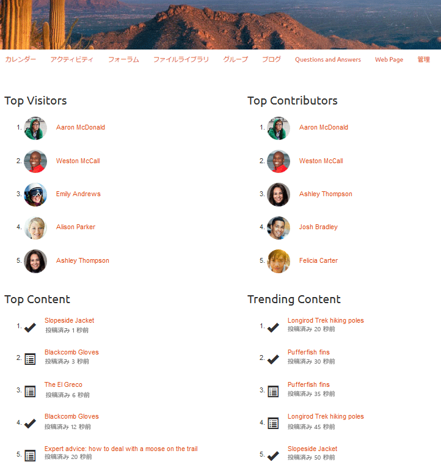

# アクティビティのトレンド {#activity-trends}

## はじめに {#introduction}

この `Community Activity List` コンポーネントを使用すると、メンバーによる投稿およびビュー、およびコンテンツの投稿とビューに関するトレンド情報を追加できます。

ドキュメントのこの節では、

* の追加 `Community Activity List` コンポーネントを [コミュニティサイト](overview.md#community-sites)

* の設定 `Community Activity List` コンポーネント

## 要件 {#requirement}

のデータ `Community Activity List` は、Adobe Analyticsがコミュニティサイトに対してライセンスを取得し、設定されている場合にのみ使用できます。

詳しくは、 [コミュニティ機能用の Analytics 設定](analytics.md).

## コミュニティアクティビティリストをページに追加する {#adding-a-community-activity-list-to-a-page}

を追加するには、以下を実行します。 `Community Activity List` コンポーネントをオーサリングモードでページに追加する場合は、 `Communities / Community Activity List` をクリックし、ページ上の適切な場所にドラッグします。

必要な情報については、 [コミュニティコンポーネントの基本](basics.md).

コミュニティサイトのページに最初に配置したとき、コンポーネントは次のように表示されます。

## コミュニティアクティビティリストの設定  {#configuring-community-activity-list}

配置された `Community Activity List` アクセスして選択するコンポーネント `Configure` 編集ダイアログを開くアイコン。

以下 **[!UICONTROL コメント]** タブで、アップロードされたファイルのコメントを表示するかどうかと表示方法を指定します。

* **[!UICONTROL タイプ]**

   コミュニティメンバーに関するデータを表示するか、ユーザー生成コンテンツ (UGC) に関するデータを表示するかを指定します。

   次から選択：
   * `Members`
   * `Content`

   デフォルトは `Members` です。

* **[!UICONTROL 表示タイトル]**

   データの上に表示する説明的なタイトル（例： ） `Trending Content`.

   初期設定ではタイトルはありません。

* **[!UICONTROL 表示数]**

   リストする項目の数。

   初期設定は 10 です。

* **[!UICONTROL アクティビティタイプ]**

   次のいずれかを選択
   * `Views`（訪問ページ数）
   * `Posts`（UGC の作成）
   * `Follows`
   * `Likes`

   初期設定は Views です。

* **[!UICONTROL 期間]**

   次のいずれかを選択
   * `Last 24 hours`
   * `Last 7 days`
   * `Last 30 days`
   * `Last 90 days`
   * `This year (since Jan 1st)`
   * `Total`

   デフォルトは `Total` です。

* **[!UICONTROL コンテキストパス]**

   特定のブログなど、サイトのサブセットに対するアクティビティの範囲を設定できます。

   デフォルトはコミュニティサイト全体です。

* **[!UICONTROL メンバー数の集計]**

   オフ（オフ）にすると、最上位の投稿のみがカウントされます。 例えば、コンテキストがルートページ（デフォルト）の場合、 `Activity Type`/ `Posts`コンテンツをルートページに投稿できないので、アクティビティは表示されません。 オンにすると、すべての下位のページのカウントが含まれます。

   初期設定はオンです。

## 4 つのコンポーネントを含むページの例 {#example-page-with-components}

**上位の訪問者** config:タイプ=メンバー、アクティビティタイプ=ビュー

**上位の寄稿者** config:タイプ=メンバー、アクティビティタイプ=投稿

**上位のコンテンツ** config:タイプ=コンテンツ、アクティビティタイプ=ビュー

**コンテンツのトレンド** config:タイプ=コンテンツ、アクティビティタイプ=投稿

