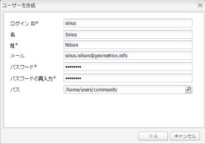

# ユーザーとユーザーグループの管理 {#managing-users-and-user-groups}

## 概要 {#overview}

AEM Communitiesでは、パブリッシュ環境で、ユーザーは自己登録とプロファイルの編集が可能です。 適切な権限を与えられれば、

* コミュニティサイト内にサブコミュニティを作成します（[コミュニティグループ](creating-groups.md)を参照）。
* [](moderation.md) ユーザー生成コンテンツ(UGC)のモデレート
* [イネーブルメントリソース](resources.md)の連絡先
* ブログ、カレンダー、Q&amp;Aおよびフォーラムのエントリを作成するには、[権限を持つ](#privileged-members-group)が必要です

パブリッシュ環境で登録されたユーザーは、通常、オーサー環境でコミュニティメンバー（メンバー）*と呼ばれ、オーサー環境でユーザーと区別します。*

メンバーに権限を付与するには、そのメンバーを、オーサー環境でコミュニティサイトを[作成](sites-console.md)または[変更](sites-console.md#modifying-site-properties)したときに動的に作成される[メンバー（ユーザー）グループ](#publish-group-roles)に割り当てます。オーサー環境で作業する場合、[トンネルサービス](#tunnel-service)を使用してパブリッシュ環境からメンバーを表示できます。

設計上、パブリッシュ環境で作成したメンバーとメンバーグループは、オーサー環境に表示されません。 オーサー環境で作成したユーザーとユーザーグループも、同様にオーサー環境にとどまります。

オーサー環境のユーザーとパブリッシュ環境のメンバーが同じユーザーのリストを基にしている場合も（同じ LDAP ディレクトリから同期される場合など）、それらのユーザーは、オーサー環境とパブリッシュ環境の両方で同じ権限とグループメンバーシップを持つ同一のユーザーとは見なされません。メンバーとユーザーの役割は、必要に応じて、パブリッシュ環境とオーサー環境で個別に確立する必要があります。

[パブリッシュファーム](topologies.md)の場合、1つのパブリッシュインスタンスに対する登録と変更を他のパブリッシュインスタンスと同期して、同じユーザーデータにアクセスできるようにする必要があります。 詳しくは、[ユーザーの同期](sync.md)を参照してください。この中には、[次の場合に起こることを説明する節が含まれています。](sync.md#what-happens-when)と入力します。

### 貢献度の制限 {#contribution-limits}

スパムから保護するために、メンバーによるコンテンツの投稿頻度を制限できます。また、新規登録会員の寄与を自動的に制限することも可能である。

詳しくは、[メンバーの貢献度の制限](limits.md)を参照してください。

### 動的に作成されるユーザーグループ {#dynamically-created-user-groups}

コミュニティサイトを作成すると、オーサー環境（[オーサーグループの役割](#author-group-roles)を参照）かパブリッシュ環境（[パブリッシュグループの役割](#publish-group-roles)を参照）のどちらかで、コミュニティサイトを管理するために必要な各種管理機能の適切な権限と一意の ID（uid）を持った新しいユーザーグループが動的に作成されます。

グループの名前は、[コミュニティサイトを作成](sites-console.md#step13asitetemplate)するときに指定した名前から生成されます。一意のIDを使用することで、同じサーバー上の同じ名前のコミュニティサイトとコミュニティグループの名前の競合を回避できます。

例えば、「We.Retail Engage」というタイトルのサイトに「*engage*」というサイト名を付けた場合、作成されるユーザーグループのうち 1 つは次のようになります。

* コミュニティ&#x200B;*Engage*&#x200B;メンバー

## オーサー環境 {#author-environment}

### トンネルサービス {#tunnel-service}

オーサー環境を使用して[サイト](sites-console.md)を作成し、[サイトのプロパティを変更](sites-console.md#modifying-site-properties)および[コミュニティメンバーとメンバーグループを管理する場合は、パブリッシュ環境に登録されたユーザーとユーザーグループにアクセスする必要があります。](members.md)

トンネルサービスは、オーサー環境のレプリケーションエージェントを使用してこのアクセスを提供します。

* 詳しくは、デプロイメントページの[設定手順](deploy-communities.md#tunnel-service-on-author)を参照してください。

[コミュニティメンバーコンソールとグループコンソール](members.md)は、パブリッシュ環境でのみ登録されたユーザー（メンバー）とユーザーグループ（メンバーグループ）を管理する目的のみです。

オーサー環境で登録されたユーザーとユーザーグループを管理するには、[セキュリティコンソール](../../help/sites-administering/security.md)を使用します。

### オーサーグループの役割 {#author-group-roles}

| メンバーが所属するグループ | 主な役割 |
|---|---|
| 管理者 | 管理者グループは、コミュニティ管理者のすべての能力を持つシステム管理者と、コミュニティ管理者グループを管理する能力を持つシステム管理者で構成されます。 |
| コミュニティ管理者 | コミュニティ管理者グループは、自動的にすべてのコミュニティサイトと、そのサイトで作成されたすべてのコミュニティグループのメンバーになります。コミュニティ管理者グループの初期メンバーは、管理者グループです。オーサー環境で、コミュニティ管理者はコミュニティサイトの作成、サイトの管理、メンバーの管理（メンバーのコミュニティの使用を禁止することが可能）およびコンテンツのモデレートを実行できます。 |
| コミュニティ&lt;*サイト名*> Sitecontentmanager | コミュニティサイトコンテンツマネージャーは、従来の AEM オーサリング、コンテンツ作成およびコミュニティサイトのページの変更を実行できます。 |
| コミュニティイネーブルメントマネージャー | コミュニティイネーブルメントマネージャーグループは、コミュニティサイトのイネーブルメントマネージャーグループの管理者の割り当てに使用できるユーザーで構成されます。 |
| コミュニティ&lt;*サイト名* > Siteenablementmanagers | コミュニティサイトイネーブルメントマネージャーグループは、コミュニティサイトのイネーブルメント[リソース](resources.md)の管理を割り当てられたユーザーで構成されます。 |
| なし | 匿名のサイト訪問者はオーサー環境にアクセスできません。 |

### システム管理者 {#system-administrators}

管理者グループのメンバーは、オーサー環境とパブリッシュ環境の両方で AEM のインストールの初期設定を実行できるシステム管理者です。

デモ用および開発用に、管理者グループには、ユーザーIDが&#x200B;*admin*、パスワードが&#x200B;*admin*&#x200B;のメンバーが割り当てられています。

実稼動環境では、デフォルトの管理者グループを修正する必要があります。

[セキュリティチェックリスト](../../help/sites-administering/security-checklist.md)に従っているかを確認してください。

## パブリッシュ環境 {#publish-environment}

### メンバーになる {#becoming-a-member}

パブリッシュ環境では、コミュニティサイトの[設定](sites-console.md#user-management)に応じて、サイト訪問者がコミュニティメンバーになる場合があります

* コミュニティサイトが非公開（閉じられた）の場合：
   * 招待による
   * 管理者のアクション別

* コミュニティサイトが公開（開いている）の場合：
   * 自己登録
   * facebookとTwitterを使用したソーシャルログイン

>[!NOTE]
>
>サイト訪問者が 1 つのオープンコミュニティサイトに登録すると、その訪問者は自動的に、同じパブリッシュ環境上の他のオープンコミュニティサイトのメンバーになります。

### パブリッシュグループの役割 {#publish-group-roles}

| メンバーが所属するグループ | 主な役割 |
|---|---|
| コミュニティ&lt;*サイト名*>メンバー | コミュニティサイトメンバーは、登録済みのユーザーです。ユーザーは、ログイン、自分のプロファイルの変更、オープンなコミュニティグループへの参加、コミュニティへのコンテンツの投稿、他のメンバーへのメッセージの送信、サイトアクティビティのフォローをおこなうことができます。 |
| コミュニティ&lt;*サイト名*>モデレーター | コミュニティサイトモデレーターは、モデレートコンソールを使用した UGC の一括モデレートや、コンテンツが投稿されたページでのコンテキスト内モデレートを実行できる、信頼されているコミュニティメンバーです。 |
| コミュニティ&lt;*サイト名*&lt;*グループ名*>メンバー | コミュニティグループメンバーは、オープンコミュニティグループに参加したコミュニティメンバーか、クローズドコミュニティグループに招待されたコミュニティメンバーのどちらかです。このメンバーは、サイト内のそのコミュニティグループのメンバーの能力を持ちます。 |
| コミュニティ&lt;*サイト名*>グループ管理者 | コミュニティサイトグループ管理者は、コミュニティサイト内のサブコミュニティ（グループ）を作成および管理する権限を持った、信頼されているコミュニティメンバーです。コンテキスト内モデレートを提供する機能が含まれます。 |
| 権限を持つメンバーのセキュリティグループ&#x200B;** | コンテンツ作成を制限するために、手動で作成および保守されるユーザーグループです。[権限を持つメンバーグループ](#privileged-members-group)を参照してください。 |
| なし | サイトを発見した匿名のサイト訪問者は、匿名アクセスが許可されているコミュニティサイトを表示および検索できます。コンテンツに参加して投稿するには、ユーザーが自己登録（許可されている場合）し、コミュニティメンバーになる必要があります。 |

### パブリッシュグループの役割へのメンバーの割り当て {#assigning-members-to-publish-group-roles}

オーサー環境で[コミュニティサイト](sites-console.md)を作成する場合、または[サイトのプロパティを変更する場合、](sites-console.md#modifying-site-properties)メンバーには、モデレーター、グループ管理者、リソース連絡先、権限を持つメンバーなど、パブリッシュ環境で実行される様々な役割が割り当てられます。

[トンネルサービスを有](sync.md#accessingpublishusersfromauthor) 効にすると、割り当ての選択肢が、オーサー環境のユーザーではなくパブリッシュ環境のメンバーから表示されます。

選択したメンバーは、[適切なグループ](#publish-group-roles)に自動的に割り当てられ、コミュニティサイトの公開（再公開）時にそのメンバーシップが含まれます。

### 権限を持つメンバーグループ {#privileged-members-group}

権限を持つメンバーのセキュリティグループの目的は、特定のコミュニティ機能のコンテンツの作成を、権限を持つコミュニティサイトの一部のメンバーだけに限定することです。

権限を持つメンバーグループは、[コミュニティグループコンソール](members.md)を使用して作成および管理します。

権限を持つメンバーグループを作成し、さらに[トンネルサービスを有効](sync.md#accessingpublishusersfromauthor)にしたら、既存のコミュニティサイトの構造を[変更](sites-console.md#modify-structure)してコミュニティ機能の設定を編集し、「権限を持つメンバーを許可」をオンにし、作成済みのグループを追加できます。

以下のコミュニティ機能では、権限を持つメンバーグループを 1 つ以上指定できます。

* [ブログ機能](functions.md#blog-function)  — 新しい記事の作成を制限
* [カレンダー機能](functions.md#calendar-function)  — 新しいイベントの作成を制限
* [フォーラム機能](functions.md#forum-function)  — 新しいトピックの作成を制限
* [Q&amp;A 機能](functions.md#qna-function) - 新しい質問の作成を制限

コミュニティ機能にセキュリティ制限がない（権限を持つメンバーグループが割り当てられていない）場合は、すべてのコミュニティサイトメンバーが、その機能のコンテンツ（記事、イベント、トピック、質問）を作成できます。

>[!NOTE]
>
>あるコミュニティサイトで、権限を持つメンバーグループにユーザーを追加しても、そのユーザーが同じコミュニティサイトのメンバーでもある場合は、そのユーザーに対して作成権限が与えられるだけです。

## コミュニティメンバーの作成 {#creating-community-members}

### リポジトリの場所 {#repository-location}

特定の機能を正しく動作させるためには、適切な権限を持つユーザーとユーザーグループを作成する必要があります。

`/home/users/community`でメンバーを作成すると、メンバーのプロファイルに読み取り権限を付与する適切なACLが継承されます。

同様に、カスタムコミュニティユーザーグループ（権限を持つメンバーグループなど）を`/home/groups/community`内に作成する必要があります。

[コミュニティメンバーコンソールとグループコンソール](members.md)を使用すると、ユーザーとグループがそれぞれのパスに作成されます。

カスタムパスを指定するには、クラシックセキュリティUIを使用する必要があります。クラシックセキュリティUIは、[https://&lt;server>:&lt;port>/useradmin](http://localhost:4503/useradmin)からアクセスできます。

カスタムメンバーパスに読み取り権限を付与するには、すべてのパブリッシュインスタンスで、`/home/users/community`に類似したACLを設定します。

```xml
<allow
  jcr:primaryType="rep:GrantACE"
  rep:principalName="everyone"
  rep:privileges="{Name}[jcr:read]" >
  <rep:restrictions
    jcr:primaryType="rep:Restrictions"
    rep:glob="*/profile*" />
</allow>
```

カスタムメンバーグループのパス（ /home/groups/mycompanyなど）に適切な権限を付与するには、すべてのパブリッシュインスタンスで`/home/groups/community`に類似したACLを設定します。

```xml
<allow
  jcr:primaryType="rep:GrantACE"
  rep:principalName="community-administrators"
  rep:privileges="{Name}[jcr:read]"  />
```

### コンソール {#consoles}

オーサー環境でのみ使用できる、以下の 4 つの独立したコンソールがあります。

| console | ツール／セキュリティ／ユーザー | ツール／セキュリティ／グループ | コミュニティ／メンバー | コミュニティ／グループ |
|----------|-----------------------|------------------------|------------------------------------------------------------|------------------------------------------------------------|
| 管理対象 | オーサー環境のユーザー | オーサー環境のユーザーグループ | パブリッシュ環境のメンバー | パブリッシュ環境のメンバーグループ |
| 必須 | 管理者権限 | 管理者権限 | 管理者権限、トンネルサービス、ユーザーの同期（パブリッシュファームの場合） | 管理者権限、トンネルサービス、ユーザーの同期（パブリッシュファームの場合） |

### コミュニティイネーブルメントマネージャーの役割 {#community-enablement-manager-role}

[イネーブルメントコミュニティ](overview.md#enablement-community)では、メンバーごとに関連するコストが発生することから、通常は、サイト訪問者による自己登録機能は許可されません。イネーブルメント学習者とリソースは、作成者のサイト作成時に](sites-console.md#enablement)の[役割](#author-group-roles)が`enablement manager` [に割り当てられたユーザーが管理します（グループ`Community <site-name> Siteenablementmanagers`のメンバーとして追加）。 `enablement manager`は、[オーサー環境のコミュニティメンバーに学習リソース](resources.md)を割り当てる役割も果たします。

特定のコミュニティサイトの`Community Enablement Managers`として選択できるのは、グローバル`enablement manager`グループのメンバーであるユーザーだけです。

`Community Site Enablement Manager`の役割を割り当てられるユーザーを作成するには、クラシックUIセキュリティコンソールを使用してパスを指定します。

オーサーインスタンスの場合：

1. 管理者権限でサインインし、クラシックUIセキュリティコンソールを参照します。
例： [http://localhost:4502/useradmin](http://localhost:4502/useradmin)

2. 「編集」メニューから「**[!UICONTROL ユーザーを作成]**」を選択します。
3. `Create User`ダイアログに入力します。
   * パスは`/home/users/community`でなければなりません
4. 「**[!UICONTROL 作成]**」を選択します。



* 左側のペインで、新しく作成されたユーザーを検索し、「 」を選択して右側のペインに表示します。


左側のウィンドウで、

1. 検索ボックスをオフにし、「**[!UICONTROL ユーザーを非表示]**」を選択します。
2. 右側のウィンドウに表示される新しいユーザーの「`community-enablementmanagers`グループ&#x200B;]**」タブに**[!UICONTROL &#x200B;をドラッグします


### コミュニティ管理者の役割 {#community-administrators-role}

[オーサーグループの役割](#author-group-roles)の表に示したとおり、コミュニティ管理者グループのメンバーは、コミュニティサイトの作成、サイトの管理、メンバーの管理（メンバーのコミュニティの使用を禁止できる）、コンテンツのモデレートをおこなうことができます。

[イネーブルメントマネージャー](#communitysiteenablementmanagerrole)の役割にユーザーを作成して割り当てるのと同じ手順に従いますが、ユーザーの「グループ」タブにc `ommunity-administrators`グループを追加します。

### LDAP の統合 {#ldap-integration}

AEM は、ユーザーの認証およびユーザーアカウントの作成で LDAP の使用をサポートします。詳しくは、[AEM 6](../../help/sites-administering/ldap-config.md)でのLDAPの設定で説明しています。

コミュニティメンバーおよびメンバーグループ固有の設定の詳細の一部を次に示します。

1. 各AEMパブリッシュインスタンスに対するLDAPの設定
2. [LDAP IDプロバイダー](../../help/sites-administering/ldap-config.md#configuring-the-ldap-identity-provider)

   * 特別な指示はありません

3. [同期ハンドラー](../../help/sites-administering/ldap-config.md#configuring-the-synchronization-handler)

   * 次のプロパティを設定します。

      * **[!UICONTROL User auto membership]**: `community-<site name>-<uid>-members`
      * **[!UICONTROL User Path Prefix]**: `/community`
      * **[!UICONTROL Group Path Prefix]**:  `/community`

4. [外部ログインモジュール](../../help/sites-administering/ldap-config.md#the-external-login-module)

   * 特別な指示はありません。

これにより、ユーザーはコミュニティサイトのメンバーグループに自動的に割り当てられ、リポジトリの場所は`/home/users/community`と`/home/groups/community`になり、相互にプロファイルを参照する適切な権限を継承します。

* `User auto membership`の値は、プロファイルの`givenName`（表示名）ではなく、`rep:authorizableId`プロパティにする必要があります。

## AEM インスタンス間のユーザーの同期 {#synchronizing-users-among-aem-instances}

[パブリッシュファーム](topologies.md)を使用する場合は、まず 1 つのインスタンスにユーザーを読み込みます。続いて[ユーザーの同期を有効](sync.md)にし、ユーザーを Sling で他のパブリッシュインスタンスに配信することによって、各パブリッシュインスタンスで各ユーザーのパスが同じになるようにします。

ユーザーグループを読み込む場合、各パブリッシュインスタンスでユーザーグループのパスが同じになるようにするには、1 つのインスタンスに読み込んでから、エクスポート用の[パッケージを作成](../../help/sites-administering/package-manager.md#creating-a-new-package)し、そのパッケージを他のすべてのパブリッシュインスタンスにインストールします。

ユーザー同期を通じたユーザーグループの同期は、今後のリリースで組み込まれる予定ですが、現在のところ、ユーザー同期が実行されると、ユーザーグループのメンバーシップのみが同期されます。

## コミュニティグループについて {#about-community-groups}

グループに関しては、以下の 2 種類のトピックがあります。

* **[コミュニティ](overview.md#communitygroups)**
グループコミュニティグループは、コミュニティグループの作成をサポートするコミュニティサイトのパブリッシュ環境で作成できるサブコミュニティです。コミュニティグループを作成すると、Webサイトに追加されるページが増え、親コミュニティサイトと同様の方法で管理されます。 詳しくは、開発者向けの[コミュニティグループの基本事項](essentials-groups.md)および作成者向けの[コミュニティグループ](creating-groups.md)を参照してください。

* **[メンバー](../../help/sites-administering/security.md)**
グループメンバーグループは、メンバーが属することができるグループで、グループコンソールを通じて管理されます。このページでの議論の多くは、メンバーグループに費やされています。 コミュニティサイト用に自動的に作成されたメンバーグループ（先頭に*`Community`*&#x200B;が付く）は、コミュニティグループと呼ばれる場合があるので、ディスカッションのコンテキストを考慮する必要があります。
