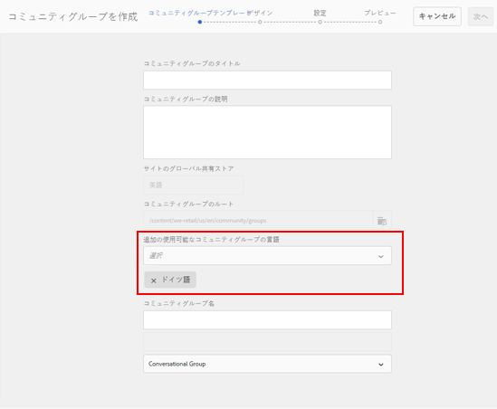
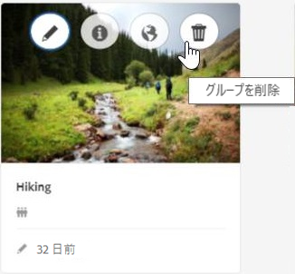
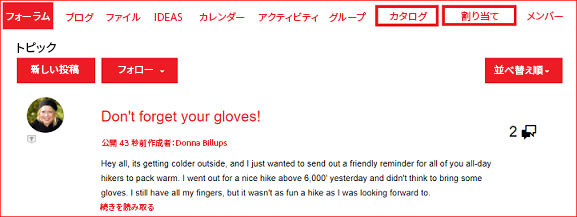
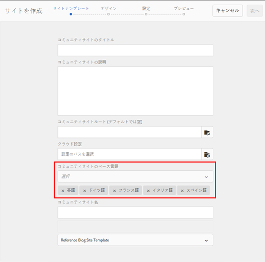
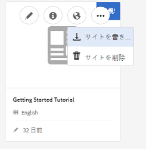

# AEM 6.4 Communities の新機能 {#what-s-new-in-aem-communities}

AEM Communities は、ビジネスパートナー、顧客および従業員が共同作業をおこなうビジネスフレームワークを提供します。Web サイト構造にソーシャル機能を提供し、業務関係者とナレッジを共有してブランド価値の向上に役立てることができます。

AEM 6.4 Communities は、コミュニティユーザーのエクスペリエンスを強化し、コミュニティ管理者、モデレーターおよびマネージャーの日常業務を容易にする機能を提供します。

新機能および機能強化について詳しくは、概要を参照してください。また、AEM 6.4 Communities の[リリースノート](../release-notes/communities-release-notes.md)も参照してください。AEM 6.4 Communities ドキュメントについては、 [AEM 6.4 Communities ユーザーガイド](home.md).

## サブコミュニティまたはコミュニティグループの管理 {#managing-sub-communities-or-community-groups}

AEM Communities では、オーサー環境で事前定義されたテンプレートを使用して、コミュニティサイト内にグループやサブグループを作成できます。これらのグループは、親サイトからテーマやスタイルなどの多くの設定を継承するサブコミュニティとして機能します。ただし、これらのグループには親サイトとは異なる設定を適用でき、例えば別のグループモデレーターを設定したり、セキュリティレベルを変更したりできます。これらのグループは完全に独立したミニコミュニティとして機能し、次の機能強化によってさらに多くのことができます。

### 単一手順でのマルチロケールグループの作成 {#create-multi-locale-groups-in-single-step}

コミュニティサイトの一部として、複数言語を使用するグループを 1 回の操作で作成できます。これを実行するには、コミュニティサイト内に[新しいコミュニティグループ](groups.md)を作成する際に表示される&#x200B;**[!UICONTROL コミュニティグループテンプレート]**&#x200B;ページの「**[!UICONTROL 追加の使用可能なコミュニティグループの言語]**」フィールドを使用します。

このようなグループを作成するには、まずサイトコンソールから目的のコミュニティサイトのグループコレクションに移動します。グループを作成し、**[!UICONTROL コミュニティグループテンプレート]**&#x200B;ページの「**[!UICONTROL 追加の使用可能なコミュニティグループの言語]**」フィールドに使用する言語を指定します。

### グループコンソールからのコミュニティグループの削除 {#delete-community-groups-from-groups-console}

AEM 6.4 Communities では、コミュニティサイトコンソール内で、コミュニティグループコレクションの既存のコミュニティグループに対して、グループを削除アイコンを使用できます。このアイコンを使用すると、1 回クリックするだけで、グループに関連付けられているすべてのアイテム（コンテンツやユーザーのメンバーシップなど）と[グループを削除](groups.md#deleting-the-group)できます。

### グループ内でのイネーブルメントリソースの作成と割り当て {#create-and-assign-enablement-resources-within-groups}

ターゲットとなる特定のコミュニティメンバー向けの学習コンテンツを作成、管理および公開できるようになりました。コミュニティグループに対して（コミュニティサイト全体だけでなく）カタログおよび割り当て機能を使用できるので、イネーブルメントマネージャーは、少人数のグループにも学習パスと[イネーブルメントリソースを割り当てる](resource.md)ことができます。

## ユーザー生成コンテンツのモデレート {#moderating-user-generated-content}

AEM 6.4 Communities は、モデレートの機能強化を提供して、コミュニティモデレーターの日々の負担を軽減します。

### 自動スパム検出  {#automatic-spam-detection}

新しいスパム検出エンジンは、コミュニティサイトまたはグループにとって好ましくない迷惑なユーザー生成コンテンツを除去するために役立ちます。有効にすると、この機能は、事前に定義された一連のスパムワードに基づいて、ユーザー生成コンテンツの一部をスパムまたは非スパムとしてマークできます。 モデレーターは、コンテンツに対してさらに操作して、パブリッシュインスタンスでの表示を拒否または許可できます。 これらのモデレート操作は、インラインまたは一括モデレートコンソールを通じて実行できます。

[スパム検出プログラム](moderate-ugc.md#spam-detection)は、ユーザー生成コンテンツを 90％の精度で検出してフラグを設定します。ただし、この機能はデフォルトでは有効になっていません。 この機能を有効にするには、コミュニティ管理者が、system/console/configMgr に移動して、スパムプロセスを追加する必要があります。

### Q&amp;A 用の新しいフィルター（回答済み／未回答） {#new-answered-unanswered-filters-for-qna}

AEM 6.4 では、一括モデレートコンソールに、Q&amp;A 質問用の「回答済み」および「未回答」の 2 つの[新しいフィルター](moderation.md#filter-rail)が追加されています。これらのフィルターは、フィルターレールの「ステータス」で使用できます。

「回答済み」ステータスを選択すると、すべての回答済みの質問が、コンテンツ領域のモデレーターに表示されます。一方、「未回答」ステータスのみを選択すると、回答済みの質問を除く（すべてのコンテンツタイプの）すべてのコンテンツが表示されます。これは、未回答の質問とフォーラムトピックやブログ記事、コメントなどのコンテンツには、回答済みの質問に関係するプロパティが存在しないからです。

### ブックマークモデレートフィルター {#bookmark-moderation-filters}

AEM Communities は、モデレートコンソールで[事前定義されたモデレートフィルターをブックマーク](moderation.md#filter-rail)する機能を提供します。ブックマークを保存しておくと、後で再検討したり、他のユーザーと共有したりできます。

ユーザーは、モデレートコンソールのフィルターレールから目的のフィルターを選択するだけで、フィルタリングされた UGC を表示し、ブラウザー上でそのフィルターをブックマークできます。これらのフィルターは URL 文字列の末尾に追加されるので、後で共有、再利用、再検討できます。

## コミュニティサイトの管理 {#managing-community-sites}

AEM 6.4 Communities では、サイト管理機能が強化されており、様々な言語を使用した多数のコミュニティサイトを容易に作成、管理および削除できます。

### 複数ロケールのコミュニティサイトをワンステップで作成 {#create-multi-locale-community-sites-in-one-step}

AEM Communities では、[複数言語を使用するコミュニティサイト](create-site.md)を 1 回の操作で作成できます。サイトコンソールから新しいコミュニティサイトを作成する際に、**[!UICONTROL サイトテンプレート]**&#x200B;ページの「**[!UICONTROL コミュニティサイトのベース言語]**」フィールドで複数の言語を選択できるようになったことで、この操作が可能になりました。

ユーザーは、これらすべてのサイトに対して、設定フォルダーやブランディングなどの設定を一度に選択できます。

### サイトコンソールからのコミュニティサイトの削除 {#delete-community-sites-from-sites-console}

AEM 6.4 Communities では、コミュニティサイトコンソール内で、既存のコミュニティサイトに対して、サイトを削除アイコンを使用できます。このアイコンを使用すると、1 回クリックするだけで、サイトに関連付けられているアイテムと[サイトを削除](create-site.md)できます。

## UGC とユーザープロファイルの管理 {#managing-ugc-and-user-profiles}

AEM Communities では、ユーザーデータの保護をコミュニティエクスペリエンスの重要事項としながら、[そのまますぐに使用できる API](user-ugc-management-service.md) と[サンプルサーブレット](https://github.com/Adobe-Marketing-Cloud/aem-communities-ugc-migration/tree/main/bundles/communities-ugc-management-servlet)を公開します。これらの API を使用すると、ユーザー生成コンテンツの一括管理（一括削除と一括書き出し）と、EU GDPR のコンプライアンス要件への対応を容易におこなうことができます。

## 変更点 {#what-s-changed}

* AEM 6.4 Communities では、新しいコミュニティを作成する際に Captcha 検証を標準で使用できなくなりました。ただし、コミュニティサイトをカスタマイズして、 [Googleコンポーネント reCAPTCHA](https://helpx.adobe.com/experience-manager/using/aem_recaptcha.html) セキュリティの向上
* カスタム CSS をアップロードするオプションが、コミュニティサイトとグループテーマから削除されました。
* 「コンテンツのみ」および「検索」アイコンが、一括モデレート UI のフィルターレールに追加されました。
* コンテンツパスフィルターが、一括モデレート UI のフィルターレールに追加されました。
* 一括モデレート UI から、一括モードに切り替え、一括モードを終了する機能が削除されました。 複数選択モードに入るには、選択 ( ) アイコンを投稿に表示します。投稿の上にマウスを置く（デスクトップ）か、投稿の上に指を押しながら（モバイル）表示します。
