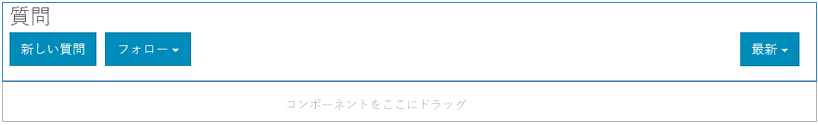
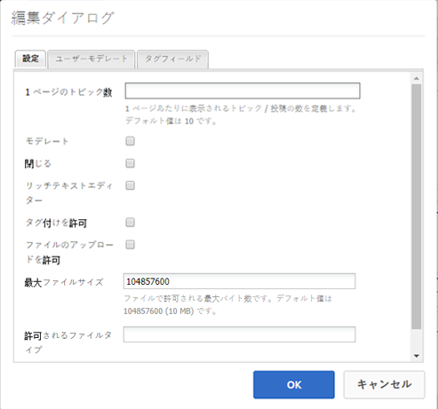

# Q&amp;A フォーラム機能 {#q-a-forum-feature}

## はじめに {#introduction}

Q&amp;A（質問と回答）フォーラム機能は、コミュニティメンバーが質問に答えるための領域を提供します。

* 新しい質問の作成
* インライン画像（ドラッグ&amp;ドロップのサポートを含む）
* 質問に対する回答を表示
* 質問の検索
* Q&amp;A コンテンツのモデレートに役立つ
* 最適な回答を特定する
* Q&amp;A の質問をページ間で移動する

ドキュメントのこの節では、

* AEMサイトへの Q&amp;A フォーラム機能の追加
* の設定 `QnA`コンポーネント

## ページへの Q&amp;A フォーラムの追加 {#adding-a-q-a-forum-to-a-page}

を追加するには、以下を実行します。 `QnA` コンポーネントをオーサリングモードでページに追加する場合は、コンポーネントブラウザーを使用して `Communities / QnA` をクリックし、ページ上の Q&amp;A フォーラムが表示される場所にドラッグします。

必要な情報については、 [コミュニティコンポーネントの基本](basics.md).

次の場合に [必要なクライアント側ライブラリ](qna-essentials.md#essentials-for-client-side) が含まれる場合、この方法で `QnA` コンポーネントが表示されます。

### Q&amp;A の設定 {#configuring-qna}

配置された `QnA` アクセスして選択するコンポーネント `Configure` 編集ダイアログを開くアイコン。

 

#### 「設定」タブ {#settings-tab}

以下 **[!UICONTROL 設定]** タブで、トピック（質問）と返信（回答）の設定を指定します。

* **[!UICONTROL 1 ページのトピック数]**
1 ページに表示される質問/投稿の数を定義します。 初期設定は 10 です。

* **[!UICONTROL モデレート]**
オンにすると、トピックおよびコメントの投稿を発行サイトに表示する前に承認が必要になります。 初期設定はオフです。

* **[!UICONTROL クローズ]**
オンにすると、フォーラムは新しい質問やコメントを受け付けなくなります。 初期設定はオフです。

* **[!UICONTROL リッチテキストエディター]**
オンにすると、マークアップを使用してトピックとコメントを入力できます。 初期設定はオフです。

* **[!UICONTROL タグ付けを許可]**
オンにすると、メンバーは投稿にタグラベルを追加できます ( **[!UICONTROL タグフィールド]** 」タブ ) をクリックします。 初期設定はオフです。

* **[!UICONTROL ファイルのアップロードを許可]**
オンにすると、質問またはコメントに添付ファイルを追加できます。 初期設定はオフです。

* **[!UICONTROL 最大ファイルサイズ]**
次の場合にのみ関連します。 
`Allow File Uploads` がオンになっている。 このフィールドは、アップロードするファイルのサイズ（バイト単位）を制限します。 初期設定は104857600(10 MB) です。

* **[!UICONTROL 許可されているファイルタイプ]**
次の場合にのみ関連します。 
`Allow File Uploads` がオンになっている。 「ドット」区切り文字を使用したファイル拡張子のコンマ区切りリスト。 例：.jpg、.jpeg、.png、.doc、.docx、.pdf ファイルタイプが指定されている場合、指定されていないファイルのアップロードは許可されません。 初期設定では何も指定されず、すべてのファイルタイプが許可されます。

* **[!UICONTROL 添付する画像ファイルの最大サイズ]**
「ファイルのアップロードを許可」がオンの場合にのみ関連します。 アップロードされた画像ファイルの最大バイト数。 初期設定は2097152 (2 MB) です。

* **[!UICONTROL フォローを許可]**
オンにすると、フォーラム投稿に次の機能が含まれ、メンバーは [通知済み](notifications.md) 新しい投稿の数。 初期設定はオフです。

* **[!UICONTROL ピン留めを許可]**
オンにすると、フォーラムトピックがトピックのリストの先頭にピン留めされる場合があります。 初期設定はオフです。

* **[!UICONTROL メール購読を許可]**
オンにすると、新しい投稿をメールでメンバーに通知することを許可します ([購読](subscriptions.md)) をクリックします。 必要 `Allow Following` チェックされ [電子メール設定済み](email.md). 初期設定はオフです。

* **[!UICONTROL 返信を許可]**
オンにすると、質問に投稿されたコメントに対する返信を許可します。 初期設定はオフです。

* **[!UICONTROL ユーザーによるコメントおよびトピックの削除を許可]**
オンにすると、メンバーは自分が投稿したコメントや質問を削除できます。 初期設定はオフです。

* **[!UICONTROL 投票を許可]**
オンにした場合、質問に投票機能を含めます。 初期設定はオフです。

* **[!UICONTROL 選択した回答を一番上に移動]**
オンにすると、最初の回答が選択した回答として表示されます。 初期設定はオンです。

* **[!UICONTROL バッジを表示]**
オンにすると、獲得および割り当て済みを表示します [バッジ](implementing-scoring.md) メンバーのブログエントリを含む 初期設定はオフです。

* **[!UICONTROL おすすめコンテンツを許可]**
オンにすると、アイデアを [おすすめコンテンツ](featured.md). 初期設定はオフです。

#### 「ユーザーモデレート」タブ {#user-moderation-tab}

以下 **[!UICONTROL ユーザーモデレート]** タブで、投稿されたトピック（質問）と回答（ユーザー生成コンテンツ）の管理方法を指定します。 詳しくは、 [ユーザー生成コンテンツのモデレート](moderate-ugc.md).

* **[!UICONTROL 回答を拒否]**
オンにすると、信頼できるメンバーのモデレーターは、投稿された回答を拒否し、公開 Q&amp;A フォーラムに回答が表示されなくなります。 初期設定はオフです。

* **[!UICONTROL トピックを閉じる/再度開く]**
オンにすると、信頼されているメンバーモデレーターは、質問（トピック）を閉じて、さらに編集や回答を行ったり、質問を再度開いたりできます。 初期設定はオフです。

* **[!UICONTROL トピックを移動]**
オンにすると、公開側のモデレーターが質問を移動できます。 初期設定はオフです。

* **[!UICONTROL 投稿にフラグを設定]**
オンにすると、メンバーは他のユーザーの質問や回答に「不適切」のフラグを設定できます。 初期設定はオフです。

* **[!UICONTROL フラグ設定理由リスト]**
オンにすると、メンバーは質問または回答に「不適切」のフラグを設定した理由をドロップダウンリストから選択できます。 初期設定はオフです。

* **[!UICONTROL カスタムフラグ設定理由]**
オンにすると、メンバーは質問または回答に「不適切」のフラグを設定した独自の理由を入力できます。 初期設定はオフです。

* **[!UICONTROL モデレートのしきい値]**
メンバーが質問または回答に何回フラグを設定したらモデレーターに通知するかを指定します。 初期設定は 1 （1 回）です。

* **[!UICONTROL フラグ付け制限]**
質問または回答に何回フラグを設定したら、公開ビューに表示されなくなるかを入力します。 -1 に設定した場合、フラグ付きの質問や回答が公開表示から非表示にされることはありません。 それ以外の場合は、この数はモデレートのしきい値以上にする必要があります。 デフォルトは 5 です。

#### 「タグフィールド」タブ {#tag-field-tab}

以下 **[!UICONTROL タグフィールド]** 」タブに追加します。タグが適用される場合は、 **[!UICONTROL 設定]** タブは、選択した名前空間に応じて制限されます。

* **[!UICONTROL 許可された名前空間]**
次の場合に関連 
`Allow Tagging` が **設定** タブをクリックします。 適用できるタグは、チェックされた名前空間カテゴリ内のタグに限定されます。 名前空間のリストには、「標準タグ」（デフォルトの名前空間）と「すべてのタグを含める」が含まれます。 初期設定はオフです。これは、すべての名前空間が許可されていることを意味します。

* **[!UICONTROL 提案の制限]**
フォーラムに投稿するメンバーに提案として表示するタグの数を入力します。 値： 
`-1` は、制限がないことを意味します。 初期設定は 0 です。

#### 「並べ替え設定」タブ {#sort-settings-tab}

以下 **[!UICONTROL 並べ替え設定]** タブで、投稿されたコメントを表示する際の並べ替え方法を指定します。

* **[!UICONTROL 並べ替え基準]**
許可されている並べ替えの選択項目をすべてオンにします。 
`Newest, Oldest, Last Updated, Most Viewed, Most Active, Most Followed and Most Liked` を使用して作成します。デフォルトは `Newest, Oldest, Last Updated` です。

* **[!UICONTROL デフォルトとして設定]**
プルダウンして、オンにした並べ替えオプションの 1 つを選択し、デフォルトとして表示します。 初期設定は です。 
`Newest`

* **[!UICONTROL Analytics 並べ替えの時間オプションの選択]**
プルダウンして次のいずれかを選択 
`All, Last 24 Hours, Last 7 Days, Last 30 Days` を使用して作成します。デフォルトは `All` です。

## サイト訪問者エクスペリエンス {#site-visitor-experience}

### 回答の識別 {#identifying-answers}

1 つの回答は、 `Select Answer` 」ボタンをクリックします。 質問が「回答済み」とマークされた後は、最初の質問が `Unmark Chosen Answer`」ボタンをクリックします。

有効な回答として選択した回答は、 `Unmark Chosen Answer` 」ボタンをクリックします。

回答が実行可能な回答として選択されると、その質問が実行可能な回答であることを示します `Answered`は、メインの Q&amp;A ページの質問トピックの横に表示されます。

### モデレーターと管理者 {#moderators-and-administrators}

サインインしているユーザーがモデレーターまたは管理者の権限を持っている場合、質問や回答を作成したユーザーに関係なく、コンポーネントの設定で許可されるモデレートタスクを実行できます。

また、回答を特定する機能も備えています。

### メンバー {#members}

サイト訪問者がサインインしたとき、設定に応じて、ログイン者によっては

* 新しい質問を投稿
* 作成した質問を編集または削除します
* 他のユーザーの質問や回答にフラグを設定することもできます
* 作成した質問に対する回答を特定できます。

### 匿名 {#anonymous}

サインインしていないサイト訪問者は、投稿された質問や回答の読み取り、サポートされている場合は翻訳のみをおこなえますが、質問や回答の追加、他の人の投稿へのフラグ付けはおこなえません。

## 追加情報 {#additional-information}

詳しくは、 [Q&amp;A の基本事項](qna-essentials.md) 開発者向けのページ

投稿されたトピックおよびコメントのモデレートについては、 [ユーザー生成コンテンツのモデレート](moderate-ugc.md).

投稿されたトピックおよびコメントのタグ付けについては、 [ユーザー生成コンテンツのタグ付け](tag-ugc.md).
