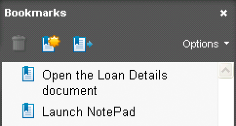

# ブックマークを使用したPDFドキュメントのアセンブリ {#assembling-pdf-documents-with-bookmarks}

ブックマークを含むPDFドキュメントをアセンブリできます。 たとえば、しおりが含まれていないPDFドキュメントがあり、しおりを指定して変更するとします。 Assembler サービスを使用すると、ブックマークを含まないPDFドキュメントにそのドキュメントを渡し、ブックマークを含むPDFドキュメントに戻すことができます。

ブックマークには、次のプロパティが含まれます。

* 画面にテキストとして表示されるタイトル。
* ユーザーがブックマークをクリックしたときの動作を指定するアクション。 ブックマークの一般的なアクションは、現在のドキュメント内の別の場所に移動するか、別のPDFドキュメントを開くことですが、他のアクションを指定することもできます。

この説明では、次の DDX ドキュメントが使用されていると仮定します。

```as3
 <?xml version="1.0" encoding="UTF-8"?> 
 <DDX xmlns="https://ns.adobe.com/DDX/1.0/"> 
       <PDF result="FinalDoc.pdf"> 
          <PDF source="Loan.pdf"> 
             <Bookmarks source="doc2" /> 
          </PDF> 
       </PDF> 
 </DDX>
```

この DDX ドキュメント内では、 source 属性に値が割り当てられています `Loan.pdf`. この DDX ドキュメントは、1 つのPDFドキュメントを Assembler サービスに渡すように指定します。 ブックマーク付きのPDFドキュメントを組み立てる場合は、結果ドキュメント内のブックマークを説明するブックマーク XML ドキュメントを指定する必要があります。 ブックマーク XML ドキュメントを指定するには、 `Bookmarks` 要素が DDX ドキュメント内で指定されています。

この DDX ドキュメントの例では、 `Bookmarks` 要素の指定 `doc2` を値として使用します。 この値は、Assembler サービスに渡される入力マップに、という名前のキーが含まれていることを示します `doc2`. の値 `doc2` キーは `com.adobe.idp.Document` ブックマーク XML ドキュメントを表す値。 ( 詳しくは、 [Assembler サービスと DDX リファレンス](https://www.adobe.com/go/learn_aemforms_ddx_63).)

このトピックでは、次の XML ブックマーク言語を使用して、ブックマークを含むPDFドキュメントを構成します。

```as3
 <?xml version="1.0" encoding="UTF-8"?> 
 <Bookmarks xmlns="https://ns.adobe.com/pdf/bookmarks" version="1.0"> 
       <Bookmark> 
          <Action> 
             <Launch NewWindow="true"> 
                <File Name="C:\Adobe\LoanDetails.pdf" /> 
             </Launch> 
          </Action> 
         <Title>Open the Loan document</Title> 
       </Bookmark> 
 <Bookmark> 
          <Action> 
             <Launch> 
                <Win Name="C:\WINDOWS\notepad.exe" /> 
             </Launch> 
          </Action> 
     <Title>Launch NotePad</Title> 
       </Bookmark> 
 </Bookmarks>
```

このブックマーク XML ドキュメント内には、ユーザーがブックマークをクリックしたときに実行されるアクションを定義する Action 要素があります。 Action 要素の下には、NotePad などのアプリケーションを起動し、アプリケーションファイルなどのファイルを開く Launch 要素があります。 PDFファイルを開くには、開くファイルを指定する File 要素を使用する必要があります。 例えば、このセクションで指定したブックマーク XML ファイルでは、開くファイルの名前は LoanDetails.pdf です。

>[!NOTE]
>
>サポートされるアクションの詳細については、 `Action` element」 [Assembler サービスと DDX リファレンス](https://www.adobe.com/go/learn_aemforms_ddx_63).

この節で指定した DDX ドキュメントとブックマーク XML ファイルを入力として指定した場合、Assembler サービスは、次のブックマークを含むPDFドキュメントをアセンブルします。



ユーザーが *ローンの詳細を開く* ブックマークの場合は、LoanDetails.pdf が開きます。 同様に、ユーザーが *NotePad を起動* ブックマークの場合は、NotePad が起動します。

>[!NOTE]
>
>この節を読む前に、Assembler サービスを使用したPDFドキュメントの組み立てに関する知識を身に付けておくことをお勧めします。 このセクションでは、入力ドキュメントを含むコレクションオブジェクトの作成や、返されたコレクションオブジェクトから結果を抽出する方法の学習など、概念については説明しません。 ( [プログラムによるPDF文書の作成](/help/forms/developing/programmatically-assembling-pdf-documents.md#programmatically-assembling-pdf-documents).)

>[!NOTE]
>
>Assembler サービスについて詳しくは、 [AEM Formsのサービスリファレンス](https://www.adobe.com/go/learn_aemforms_services_63).

>[!NOTE]
>
>DDX ドキュメントについて詳しくは、 [Assembler サービスと DDX リファレンス](https://www.adobe.com/go/learn_aemforms_ddx_63).

## 手順の概要 {#summary-of-steps}

ブックマークを含むPDF・ドキュメントを組み立てるには、次のタスクを実行します。

1. プロジェクトファイルを含めます。
1. Assembler クライアントをPDFします。
1. 既存の DDX ドキュメントを参照します。
1. ブックマークを追加するPDFドキュメントを参照します。
1. ブックマーク XML ドキュメントを参照します。
1. Map コレクションにPDF文書とブックマーク XML 文書を追加します。
1. 実行時オプションを設定します。
1. PDF文書を組み立てる。
1. しおりを含むPDFドキュメントを保存します。

**プロジェクトファイルを含める**

必要なファイルを開発プロジェクトに含めます。 Java を使用してクライアントアプリケーションを作成する場合は、必要な JAR ファイルを含めます。 Web サービスを使用している場合は、プロキシファイルを必ず含めてください。

次の JAR ファイルをプロジェクトのクラスパスに追加する必要があります。

* adobe-livecycle-client.jar
* adobe-usermanager-client.jar
* adobe-assembler-client.jar
* adobe-utilities.jar(AEM Formsを JBoss にデプロイする場合に必要 )
* jbossall-client.jar(AEM Formsが JBoss にデプロイされている場合に必要 )

AEM Formsが JBoss 以外のサポート対象の J2EE アプリケーションサーバーにデプロイされている場合は、adobe-utilities.jar ファイルと jbossall-client.jar ファイルを、AEM Formsがデプロイされている J2EE アプリケーションサーバーに固有の JAR ファイルに置き換える必要があります。 すべてのAEM Forms JAR ファイルの場所について詳しくは、 [AEM Forms Java ライブラリファイルを含める](/help/forms/developing/invoking-aem-forms-using-java.md#including-aem-forms-java-library-files).

**Assembler クライアントのPDF**

Assembler 操作をプログラムで実行する前に、Assembler サービスクライアントを作成する必要があります。

**既存の DDX ドキュメントの参照**

DDX ドキュメントを参照して、アセンブリドキュメントをPDFする必要があります。 この DDX ドキュメントには `Bookmarks` 要素：ブックマークを含むPDFをアセンブルするよう Assembler サービスに指示します。 （この節で前述した DDX ドキュメントの例を参照）。

**ブックマークを追加するPDFドキュメントを参照します。**

ブックマークを追加するPDFドキュメントを参照します。 参照先のブックマークドキュメントに既にPDFが含まれているかどうかは関係ありません。 この `Bookmarks` 要素がPDFソース要素の子である場合、ブックマークはPDFソースに既に存在する要素を置き換えます。 ただし、既存のブックマークを保持する場合は、 `Bookmarks` は、PDFソース要素の兄弟です。 例えば、次の例を考えてみましょう。

```as3
 <PDF result="foo"> 
      <PDF source="inDoc"/> 
      <Bookmarks source="doc2"/> 
 </PDF>
```

**ブックマーク XML ドキュメントを参照します**

新しいブックマークを含むPDFを組み立てるには、ブックマーク XML ドキュメントを参照する必要があります。 ブックマーク XML ドキュメントは、Map コレクションオブジェクト内の Assembler サービスに渡されます。 （例については、この節で前述したブックマーク XML ドキュメントを参照してください）。

>[!NOTE]
>
>詳しくは、 [Assembler サービスと DDX リファレンス](https://www.adobe.com/go/learn_aemforms_ddx_63).

**PDF文書とブックマーク XML 文書を Map コレクションに追加する**

ブックマークを追加するPDF文書と、ブックマーク XML 文書の両方を Map コレクションに追加する必要があります。 したがって、 Map コレクションオブジェクトには次の 2 つの要素が含まれます。PDFドキュメントとブックマーク XML ドキュメント。

**実行時オプションを設定**

ジョブの実行中に Assembler サービスの動作を制御する実行時オプションを設定できます。 例えば、エラーが発生した場合にジョブの処理を続行するよう Assembler サービスに指示するオプションを設定できます。 設定できる実行時オプションについて詳しくは、 `AssemblerOptionSpec` のクラス参照 [AEM Forms API リファレンス](https://www.adobe.com/go/learn_aemforms_javadocs_63_en).

**アセンブリPDF**

新しいPDFを含むブックマークドキュメントを組み立てるには、Assembler サービスの `invokeDDX` 操作。 を使用する必要がある理由 `invokeDDX` 操作を、 `invokeOneDocument` これは、Assembler サービスが Map コレクションオブジェクト内で渡すブックマーク XML ドキュメントを必要とするためです。 このオブジェクトは、 `invokeDDX` 操作。

**しおりを含むPDFドキュメントを保存します**

返されたマップオブジェクトから結果を抽出し、対応するPDF文書を保存する必要があります。 ( [プログラムによるPDF文書の作成](/help/forms/developing/programmatically-assembling-pdf-documents.md).)

**関連トピック**

[AEM Forms Java ライブラリファイルを含める](/help/forms/developing/invoking-aem-forms-using-java.md#including-aem-forms-java-library-files)

[接続プロパティの設定](/help/forms/developing/invoking-aem-forms-using-java.md#setting-connection-properties)

[プログラムによるPDF文書の作成](/help/forms/developing/programmatically-assembling-pdf-documents.md)

## Java API を使用したPDFドキュメントのブックマークとのアセンブリ {#assemble-pdf-documents-with-bookmarks-using-the-java-api}

Assembler Service API(Java) を使用して、PDFドキュメントをブックマークと共にアセンブリします。

1. プロジェクトファイルを含めます。

   Java プロジェクトのクラスパスに、adobe-assembler-client.jar などのクライアント JAR ファイルを含めます。

1. Assembler クライアントをPDFします。

   * 接続プロパティを含む `ServiceClientFactory` オブジェクトを作成します。（[接続プロパティの設定](/help/forms/developing/invoking-aem-forms-using-java.md#setting-connection-properties)を参照。）
   * の作成 `AssemblerServiceClient` オブジェクトのコンストラクタを使用し、 `ServiceClientFactory` オブジェクト。

1. 既存の DDX ドキュメントを参照します。

   * の作成 `java.io.FileInputStream` コンストラクターを使用して DDX ファイルの場所を指定する string 値を渡すことによって DDX ドキュメントを表すオブジェクト。
   * コンストラクタを使用して `com.adobe.idp.Document` オブジェクトを渡すことによって、`java.io.FileInputStream` オブジェクトを作成します。

1. ブックマークを追加するPDFドキュメントを参照します。

   * の作成 `java.io.FileInputStream` オブジェクトのコンストラクタを使用し、PDF・ドキュメントの場所を渡す。
   * の作成 `com.adobe.idp.Document` オブジェクトのコンストラクタを使用し、 `java.io.FileInputStream` オブジェクトドキュメントを含むPDF。

1. ブックマーク XML ドキュメントを参照します。

   * の作成 `java.io.FileInputStream` オブジェクトを指定します。
   * の作成 `com.adobe.idp.Document` オブジェクトを選択し、 `java.io.FileInputStream` オブジェクトドキュメントを含むPDF。

1. Map コレクションにPDF文書とブックマーク XML 文書を追加します。

   * の作成 `java.util.Map` オブジェクトを使用して、入力PDF・ドキュメントとブックマーク XML ドキュメントの両方を保存します。
   * を呼び出して、入力PDFドキュメントを追加します。 `java.util.Map` オブジェクトの `put` メソッドを使用し、次の引数を渡す。

      * キー名を表す string 値です。 この値は、DDX ドキュメントで指定されたPDFソース要素の値と一致する必要があります。
      * A `com.adobe.idp.Document` 入力PDF・ドキュメントを格納するオブジェクト。
   * を呼び出して、ブックマーク XML ドキュメントを追加します。 `java.util.Map` オブジェクトの `put` メソッドを使用し、次の引数を渡す。

      * キー名を表す string 値です。 この値は、DDX ドキュメントで指定された Bookmarks source 要素の値と一致する必要があります。
      * A `com.adobe.idp.Document` ブックマーク XML ドキュメントを含むオブジェクト。


1. 実行時オプションを設定します。

   * の作成 `AssemblerOptionSpec` コンストラクタを使用して実行時オプションを格納するオブジェクト。
   * に属するメソッドを呼び出して、ビジネス要件を満たすように実行時オプションを設定する `AssemblerOptionSpec` オブジェクト。 例えば、エラーが発生したときにジョブの処理を続行するように Assembler サービスに指示するには、 `AssemblerOptionSpec` オブジェクトの `setFailOnError` メソッドとパス `false`.

1. PDF文書を組み立てる。

   を呼び出す `AssemblerServiceClient` オブジェクトの `invokeDDX` メソッドを使用して、以下の必須値を渡します。

   * A `com.adobe.idp.Document` 使用する DDX ドキュメントを表すオブジェクト
   * A `java.util.Map` 入力PDF文書とブックマーク XML 文書の両方を含むオブジェクト。
   * A `com.adobe.livecycle.assembler.client.AssemblerOptionSpec` デフォルトのフォントやジョブログレベルを含む、実行時のオプションを指定するオブジェクト

   この `invokeDDX` メソッドは、 `com.adobe.livecycle.assembler.client.AssemblerResult` ジョブの結果と発生した例外を含むオブジェクト。

1. しおりを含むPDFドキュメントを保存します。

   新しく作成したPDF・ドキュメントを取得するには、次の操作を実行します。

   * を呼び出す `AssemblerResult` オブジェクトの `getDocuments` メソッド。 これにより、 `java.util.Map` オブジェクト。
   * 反復処理 `java.util.Map` 結果が見つかるまでオブジェクトを閉じます。 `com.adobe.idp.Document` オブジェクト。 (DDX ドキュメントで指定されたPDF結果エレメントを使用して、ドキュメントを取得できます )。
   * を呼び出す `com.adobe.idp.Document` オブジェクトの `copyToFile` メソッドを使用して、PDFドキュメントを抽出します。

**関連トピック**

[クイックスタート（SOAP モード）:Java API を使用したPDFドキュメントのブックマークとのアセンブリ](/help/forms/developing/assembler-service-java-api-quick.md#quick-start-soap-mode-assembling-pdf-documents-with-bookmarks-using-the-java-api)

[AEM Forms Java ライブラリファイルを含める](/help/forms/developing/invoking-aem-forms-using-java.md#including-aem-forms-java-library-files)

[接続プロパティの設定](/help/forms/developing/invoking-aem-forms-using-java.md#setting-connection-properties)

## Web サービス API を使用して、PDFドキュメントをブックマークと組み合わせます。 {#assemble-pdf-documents-with-bookmarks-using-the-web-service-api}

Assembler Service API（Web サービス）を使用して、PDFドキュメントをブックマークと共にアセンブリします。

1. プロジェクトファイルを含めます。

   MTOM を使用するMicrosoft .NET プロジェクトを作成します。 次の WSDL 定義を使用していることを確認します。 `http://localhost:8080/soap/services/AssemblerService?WSDL&lc_version=9.0.1`.

   >[!NOTE]
   >
   >置換 `localhost` を、AEM Formsをホストするサーバーの IP アドレスに設定します。

1. Assembler クライアントをPDFします。

   * の作成 `AssemblerServiceClient` オブジェクトのデフォルトのコンストラクタを使用します。
   * の作成 `AssemblerServiceClient.Endpoint.Address` オブジェクトを `System.ServiceModel.EndpointAddress` コンストラクタ。 WSDL をAEM Formsサービスに渡す文字列値 ( 例： `http://localhost:8080/soap/services/AssemblerService?blob=mtom`) をクリックします。 を使用する必要はありません。 `lc_version` 属性。 この属性は、サービス参照を作成する際に使用されます。
   * の作成 `System.ServiceModel.BasicHttpBinding` オブジェクトを作成するには、 `AssemblerServiceClient.Endpoint.Binding` フィールドに入力します。 戻り値を `BasicHttpBinding` にキャストします。
   * を `System.ServiceModel.BasicHttpBinding` オブジェクトの `MessageEncoding` ～に向かって `WSMessageEncoding.Mtom`. この値は、MTOM が確実に使用されるようにします。
   * 次のタスクを実行して、基本的な HTTP 認証を有効にします。

      * フィールドにAEM forms ユーザー名を割り当てます。 `AssemblerServiceClient.ClientCredentials.UserName.UserName`.
      * 対応するパスワード値をフィールドに割り当てます。 `AssemblerServiceClient.ClientCredentials.UserName.Password`.
      * 定数値を割り当て `HttpClientCredentialType.Basic` フィールドに `BasicHttpBindingSecurity.Transport.ClientCredentialType`.
      * 定数値を割り当て `BasicHttpSecurityMode.TransportCredentialOnly` フィールドに `BasicHttpBindingSecurity.Security.Mode`.

1. 既存の DDX ドキュメントを参照します。

   * コンストラクタを使用して `BLOB` オブジェクトを作成します。この `BLOB` オブジェクトは、DDX ドキュメントを保存するために使用されます。
   * の作成 `System.IO.FileStream` オブジェクトを開くには、コンストラクターを呼び出し、DDX ドキュメントのファイルの場所とファイルを開くモードを表す string 値を渡します。
   * コンテンツを格納するバイト配列を作成します。 `System.IO.FileStream` オブジェクト。 バイト配列のサイズは、 `System.IO.FileStream` オブジェクトの `Length` プロパティ。
   * を呼び出して、バイト配列にストリームデータを入力します。 `System.IO.FileStream` オブジェクトの `Read` メソッドを使用し、読み込むバイト配列、開始位置、ストリーム長を渡す。
   * 次の項目に `BLOB` オブジェクトを割り当てる `MTOM` フィールドにバイト配列の内容を入力します。

1. ブックマークを追加するPDFドキュメントを参照します。

   * コンストラクタを使用して `BLOB` オブジェクトを作成します。この `BLOB` オブジェクトは、入力PDFを格納するために使用されます。
   * の作成 `System.IO.FileStream` オブジェクトを指定します。
   * コンテンツを格納するバイト配列を作成します。 `System.IO.FileStream` オブジェクト。 バイト配列のサイズは、 `System.IO.FileStream` オブジェクトの `Length` プロパティ。
   * を呼び出して、バイト配列にストリームデータを入力します。 `System.IO.FileStream` オブジェクトの `Read` メソッドを使用し、読み込むバイト配列、開始位置、ストリーム長を渡す。
   * 次の項目に `BLOB` オブジェクトを割り当てる `MTOM` フィールドにバイト配列の内容を入力します。

1. ブックマーク XML ドキュメントを参照します。

   * コンストラクタを使用して `BLOB` オブジェクトを作成します。この `BLOB` オブジェクトは、ブックマーク XML ドキュメントを保存するために使用されます。
   * の作成 `System.IO.FileStream` オブジェクトを指定します。
   * コンテンツを格納するバイト配列を作成します。 `System.IO.FileStream` オブジェクト。 バイト配列のサイズは、 `System.IO.FileStream` オブジェクトの `Length` プロパティ。
   * を呼び出して、バイト配列にストリームデータを入力します。 `System.IO.FileStream` オブジェクトの `Read` メソッドを使用し、読み込むバイト配列、開始位置、ストリーム長を渡す。
   * 次の項目に `BLOB` オブジェクトを割り当てる `MTOM` フィールドにバイト配列の内容を入力します。

1. Map コレクションにPDF文書とブックマーク XML 文書を追加します。

   * の作成 `MyMapOf_xsd_string_To_xsd_anyType` オブジェクト。 このコレクションオブジェクトは、入力コレクションドキュメントとブックマーク XMLPDFを格納するために使用されます。
   * 入力PDFドキュメントとブックマーク XML ドキュメントごとに、 `MyMapOf_xsd_string_To_xsd_anyType_Item` オブジェクト。
   * キー名を表す string 値を `MyMapOf_xsd_string_To_xsd_anyType_Item` オブジェクトの `key` フィールドに入力します。 この値は、DDX ドキュメントで指定されたPDFソース要素の値と一致する必要があります。
   * を `BLOB` オブジェクトを指定し、PDFドキュメントを `MyMapOf_xsd_string_To_xsd_anyType_Item` オブジェクトの `value` フィールドに入力します。
   * を `MyMapOf_xsd_string_To_xsd_anyType_Item` オブジェクトを `MyMapOf_xsd_string_To_xsd_anyType` オブジェクト。 を呼び出す `MyMapOf_xsd_string_To_xsd_anyType` オブジェクトの `Add` メソッドを使用して、 `MyMapOf_xsd_string_To_xsd_anyType` オブジェクト。 ( このタスクは、入力PDFドキュメントとブックマーク XML ドキュメントごとに実行します )。

1. 実行時オプションを設定します。

   * の作成 `AssemblerOptionSpec` コンストラクタを使用して実行時オプションを格納するオブジェクト。
   * に属するデータメンバーに値を割り当てて、ビジネス要件を満たすようにランタイムオプションを設定する `AssemblerOptionSpec` オブジェクト。 例えば、エラーが発生した場合にジョブの処理を続行するように Assembler サービスに指示するには、 `false` から `AssemblerOptionSpec` オブジェクトの `failOnError` データメンバー。

1. PDF文書を組み立てる。

   を呼び出す `AssemblerServiceClient` オブジェクトの `invokeDDX` メソッドを使用して、次の値を渡します。

   * A `BLOB` DDX ドキュメントを表すオブジェクト
   * この `MyMapOf_xsd_string_To_xsd_anyType` 入力ドキュメントを格納する配列
   * An `AssemblerOptionSpec` 実行時のオプションを指定するオブジェクト

   この `invokeDDX` メソッドは、 `AssemblerResult` ジョブの結果と発生した可能性のある例外を含むオブジェクト。

1. しおりを含むPDFドキュメントを保存します。

   新しく作成したPDF・ドキュメントを取得するには、次の操作を実行します。

   * 次にアクセス： `AssemblerResult` オブジェクトの `documents` フィールド ( `Map` 結果PDF文書を含むオブジェクト。
   * 反復処理 `Map` オブジェクトを閉じます。 次に、その配列メンバの `value` から `BLOB`.
   * PDFドキュメントを表すバイナリデータを、そのドキュメントにアクセスして抽出します `BLOB` オブジェクトの `MTOM` フィールドに入力します。 これは、バイトの配列を返し、PDF・ファイルに書き出すことができます。

**関連トピック**

[MTOM を使用したAEM Formsの呼び出し](/help/forms/developing/invoking-aem-forms-using-web.md#invoking-aem-forms-using-mtom)
