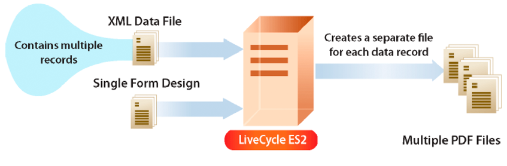

# ドキュメント出力ストリームの作成  {#creating-document-output-streams}

**Output サービスについて**

Output サービスを使用すると、ドキュメントをPDF(PDF/A ドキュメントを含む )、PostScript、Printer Control Language(PCL) および次のラベル形式で出力できます。

* ゼブラ — ZPL
* Intermec - IPL
* Datamax - DPL
* 東芝 — TPCL

Output サービスを使用すると、XML フォームデータをフォームデザインと結合し、ドキュメントをネットワークプリンターまたはファイルに出力できます。

フォームデザイン（XDP ファイル）を Output サービスに渡す方法は 2 つあります。 次のいずれかの方法で `com.adobe.idp.Document` フォームデザインを含む Output サービスへのインスタンス。 または、フォームデザインの場所を指定する URI 値を渡すこともできます。 これらの両方の方法については、 *AEM forms によるプログラミング*.

>[!NOTE]
>
>Output サービスは、アプリケーションオブジェクト固有のスクリプトを含む AcroformPDFドキュメントをサポートしていません。 アプリケーションPDF固有のスクリプトを含む Acroform アプリケーションドキュメントは、レンダリングされません。

次の節では、URI 値を使用してフォームデザインを Output サービスに渡す方法を示します。

* [PDF文書の作成](creating-document-output-streams.md#creating-pdf-documents)
* [PDF/A ドキュメントの作成](creating-document-output-streams.md#creating-pdf-a-documents)

以下の節では、 `com.adobe.idp.Document` インスタンス：

* [Content Services（非推奨）にあるドキュメントを Output サービスに渡す](creating-document-output-streams.md#passing-documents-located-in-content-services-deprecated-to-the-output-service)
* [フラグメントを使用したPDFドキュメントの作成](creating-document-output-streams.md#creating-pdf-documents-using-fragments)

どの方法を使用するかを決定する際の考慮事項として、別のAEM Formsサービスからフォームデザインを取得し、そのフォームデザインを `com.adobe.idp.Document` インスタンス。 両方の *Output サービスにドキュメントを渡す* および *フラグメントを使用したPDFドキュメントの作成* セクションでは、別のAEM Formsサービスからフォームデザインを取得する方法を示します。 最初の節では、Content Services（非推奨）からフォームデザインを取得します。 2 つ目の節では、Assembler サービスからフォームデザインを取得します。

ファイルシステムなどの固定の場所からフォームデザインを取得する場合は、どちらの方法でも使用できます。 つまり、URI 値を XDP ファイルに指定するか、 `com.adobe.idp.Document` インスタンス。

PDFドキュメントの作成時にフォームデザインの場所を指定する URI 値を渡すには、 `generatePDFOutput` メソッド。 同様に、 `com.adobe.idp.Document` インスタンスを Output サービスに追加する場合は、PDFドキュメントを作成する際に、 `generatePDFOutput2` メソッド。

出力ストリームをネットワークプリンターに送信する場合は、どちらの方法でも使用できます。 出力ストリームをプリンタに送信するには、 `com.adobe.idp.Document` フォームデザインを含むインスタンスを使用するには、 `sendToPrinter2`メソッド。 URI 値を渡して出力ストリームをプリンターに送信するには、 `sendToPrinter`メソッド。 この *プリンタへの印刷ストリームの送信* セクションでは `sendToPrinter` メソッド。

Output サービスを使用して、次のタスクを実行できます。

* [PDF文書の作成](creating-document-output-streams.md#creating-pdf-documents)
* [PDF/A ドキュメントの作成](creating-document-output-streams.md#creating-pdf-a-documents)
* [Content Services（非推奨）にあるドキュメントを Output サービスに渡す](creating-document-output-streams.md#passing-documents-located-in-content-services-deprecated-to-the-output-service)
* [フラグメントを使用したPDFドキュメントの作成](creating-document-output-streams.md#creating-pdf-documents-using-fragments)
* [ファイルへの印刷](creating-document-output-streams.md#printing-to-files)
* [プリンタへの印刷ストリームの送信](creating-document-output-streams.md#sending-print-streams-to-printers)
* [複数の出力ファイルの作成](creating-document-output-streams.md#creating-multiple-output-files)
* [検索ルールの作成](creating-document-output-streams.md#creating-search-rules)
* [PDF文書の統合](creating-document-output-streams.md#flattening-pdf-documents)

>[!NOTE]
>
>Output サービスについて詳しくは、 [AEM Formsのサービスリファレンス](https://www.adobe.com/go/learn_aemforms_services_63).

## PDF文書の作成 {#creating-pdf-documents}

Output サービスを使用して、指定したフォームデザインと XML フォームデータに基づくPDFドキュメントを作成できます。 Output サービスで作成されるPDFドキュメントは、インタラクティブなPDFドキュメントではありません。ユーザーはフォームデータを入力または変更できません。

長期保存を目的としたPDFドキュメントを作成する場合は、PDF/A ドキュメントを作成することをお勧めします。 ( [PDF/A ドキュメントの作成](creating-document-output-streams.md#creating-pdf-a-documents).)

ユーザーがデータを入力できるインタラクティブなPDFフォームを作成するには、Formsサービスを使用します。 ( [インタラクティブPDF formsのレンダリング](/help/forms/developing/rendering-forms.md#rendering-interactive-pdf-forms).)

>[!NOTE]
>
>Output サービスについて詳しくは、 [AEM Formsのサービスリファレンス](https://www.adobe.com/go/learn_aemforms_services_63).

### 手順の概要 {#summary-of-steps}

PDF・ドキュメントを作成するには、次の手順に従います。

1. プロジェクトファイルを含めます。
1. Output Client オブジェクトを作成します。
1. XML データソースを参照します。
1. PDFの実行時オプションを設定します。
1. レンダリングの実行時オプションを設定します。
1. PDF文書を生成
1. 操作の結果を取得します。

**プロジェクトファイルを含める**

開発プロジェクトに必要なファイルを含めます。 Java を使用してクライアントアプリケーションを作成する場合は、必要な JAR ファイルを含めます。 Web サービスを使用している場合は、必ずプロキシファイルを含めてください。

次の JAR ファイルをプロジェクトのクラスパスに追加する必要があります。

* adobe-livecycle-client.jar
* adobe-usermanager-client.jar
* adobe-output-client.jar
* adobe-utilities.jar(AEM Formsを JBoss にデプロイする場合に必須 )
* jbossall-client.jar(AEM Formsが JBoss にデプロイされている場合に必須 )

AEM Formsが JBoss 以外のサポート対象の J2EE アプリケーションサーバーにデプロイされている場合は、adobe-utilities.jar ファイルと jbossall-client.jar ファイルを、AEM Formsがデプロイされている J2EE アプリケーションサーバーに固有の JAR ファイルに置き換える必要があります。

**出力クライアントオブジェクトの作成**

Output サービスの操作をプログラムで実行する前に、Output サービスのクライアントオブジェクトを作成する必要があります。 Java API を使用している場合は、 `OutputClient` オブジェクト。 Output Web サービス API を使用している場合、 `OutputServiceService` オブジェクト。

**XML データソースの参照**

データをフォームデザインと結合するには、データを含む XML データソースを参照する必要があります。 データを入力するフォームフィールドごとに、XML 要素が存在する必要があります。 XML 要素名は、フィールド名と一致する必要があります。XML 要素がフォームフィールドに対応していない場合や、XML 要素名がフィールド名と一致しない場合、XML 要素は無視されます。すべての XML 要素が指定されている場合、XML 要素の表示順序を一致させる必要はありません。

次のサンプルのローン申し込みフォームについて考えてみましょう。


データをこのフォームデザインに結合するには、フォームに対応する XML データソースを作成する必要があります。 次の XML は、サンプルの住宅ローン申し込みフォームに対応する XDP XML データソースを表しています。

```as3
 <?xml version="1.0" encoding="UTF-8" ?>  
 - <xfa:datasets xmlns:xfa="https://www.xfa.org/schema/xfa-data/1.0/"> 
 - <xfa:data> 
 - <data> 
     - <Layer> 
         <closeDate>1/26/2007</closeDate>  
         <lastName>Johnson</lastName>  
         <firstName>Jerry</firstName>  
         <mailingAddress>JJohnson@NoMailServer.com</mailingAddress>  
         <city>New York</city>  
         <zipCode>00501</zipCode>  
         <state>NY</state>  
         <dateBirth>26/08/1973</dateBirth>  
         <middleInitials>D</middleInitials>  
         <socialSecurityNumber>(555) 555-5555</socialSecurityNumber>  
         <phoneNumber>5555550000</phoneNumber>  
     </Layer> 
     - <Mortgage> 
         <mortgageAmount>295000.00</mortgageAmount>  
         <monthlyMortgagePayment>1724.54</monthlyMortgagePayment>  
         <purchasePrice>300000</purchasePrice>  
         <downPayment>5000</downPayment>  
         <term>25</term>  
         <interestRate>5.00</interestRate>  
     </Mortgage> 
 </data> 
 </xfa:data> 
 </xfa:datasets>
```

**PDF実行時オプションを設定**

ファイルドキュメントを作成する際に「 file URI 」オプションをPDFします。 このオプションは、Output サービスが生成するPDFファイルの名前と場所を指定します。

>[!NOTE]
>
>ファイル URI の実行時オプションを設定する代わりに、Output サービスから返される複雑なデータ型からPDFドキュメントをプログラムで取得することができます。 ただし、ファイル URI の実行時オプションを設定することで、プログラムによってPDFドキュメントを取得するアプリケーションロジックを作成する必要はありません。

**レンダリング実行時オプションを設定**

レンダリングの実行時オプションは、PDFドキュメントの作成時に設定できます。 これらのオプションは必須ではありませんが ( 必要なPDFランタイムオプションとは異なり )、Output サービスのパフォーマンス向上などのタスクを実行できます。 例えば、Output サービスが使用するフォームデザインをキャッシュして、パフォーマンスを向上させることができます。

タグ付きAcrobatフォームを入力として使用する場合、Output サービス Java または Web サービス API を使用してタグ付き設定をオフにすることはできません。 プログラムによってこのオプションをに設定しようとした場合、 `false`を指定しない場合、結果PDFドキュメントはタグ付けされたままになります。

>[!NOTE]
>
>レンダリングの実行時オプションを指定しない場合は、デフォルト値が使用されます。 実行時オプションのレンダリングについて詳しくは、 `RenderOptionsSpec` クラス参照。 ( [AEM Forms API リファレンス](https://www.adobe.com/go/learn_aemforms_javadocs_63_en)) をクリックします。

**PDF文書を生成**

フォームデータを含む有効な XML データソースを参照し、ランタイムオプションを設定した後、Output サービスを呼び出すと、PDFドキュメントが生成されます。

PDFドキュメントを生成する際に、Output サービスでPDFドキュメントを作成するために必要な URI 値を指定します。 フォームデザインは、サーバーのファイルシステムなどの場所や、AEM Formsアプリケーションの一部として保存できます。 Formsアプリケーションの一部として存在するフォームデザイン（または画像ファイルなどの他のリソース）は、コンテンツルート URI 値を使用して参照できます `repository:///`. 例えば、次のフォームデザインの名前が *Loan.xdp* という名前のFormsアプリケーション内にある *Applications/FormsApplication*:


前の図に示す Loan.xdp ファイルにアクセスするには、次のように指定します。 `repository:///Applications/FormsApplication/1.0/FormsFolder/` を返します。 `OutputClient` オブジェクトの `generatePDFOutput` メソッド。 フォーム名 (*Loan.xdp*) を `OutputClient` オブジェクトの `generatePDFOutput` メソッド。

XDP ファイルに画像（またはフラグメントなどの他のリソース）が含まれている場合は、XDP ファイルと同じアプリケーションフォルダーにリソースを配置します。 AEM Formsは、画像への参照を解決するためのベースパスとしてコンテンツルート URI を使用します。 例えば、Loan.xdp ファイルに画像が含まれている場合、必ず次の場所に画像を配置します。 `Applications/FormsApplication/1.0/FormsFolder/`.

>[!NOTE]
>
>Formsアプリケーション URI は、 `OutputClient` オブジェクトの `generatePDFOutput` または `generatePrintedOutput` メソッド。

>[!NOTE]
>
>Formsアプリケーション内の XDP を参照してPDFドキュメントを作成する完全なクイックスタートについては、 [クイックスタート（EJB モード）:Java API を使用したPDFXDP ファイルに基づくアプリケーションドキュメントの作成](/help/forms/developing/output-service-java-api-quick.md#quick-start-soap-mode-creating-a-pdf-document-based-on-an-application-xdp-file-using-the-java-api).

**操作の結果の取得**

Output サービスは操作を実行した後、操作が成功したかどうかを示すステータス XML データなど、様々なデータ項目を返します。

**関連トピック**

[Java API を使用したPDFドキュメントの作成](creating-document-output-streams.md#create-a-pdf-document-using-the-java-api)

[Web サービス API を使用してPDFドキュメントを作成する](creating-document-output-streams.md#create-a-pdf-document-using-the-web-service-api)

[AEM Forms Java ライブラリファイルを含める](/help/forms/developing/invoking-aem-forms-using-java.md#including-aem-forms-java-library-files)

[接続プロパティの設定](/help/forms/developing/invoking-aem-forms-using-java.md#setting-connection-properties)

[Output サービス API のクイックスタート](/help/forms/developing/output-service-java-api-quick.md#output-service-java-api-quick-start-soap)

### Java API を使用したPDFドキュメントの作成 {#create-a-pdf-document-using-the-java-api}

Output API(Java) を使用してPDFドキュメントを作成します。

1. プロジェクトファイルを含めます。

   Java プロジェクトのクラスパスに、adobe-output-client.jar などのクライアント JAR ファイルを含めます。

1. Output Client オブジェクトを作成します。

   * 接続プロパティを含む `ServiceClientFactory` オブジェクトを作成します。
   * の作成 `OutputClient` オブジェクトのコンストラクタを使用し、 `ServiceClientFactory` オブジェクト。

1. XML データソースを参照します。

   * の作成 `java.io.FileInputStream` コンストラクタを使用し、XML ファイルの場所を指定する string 値を渡すことで、PDF・ドキュメントにデータを入力するために使用される XML データ・ソースを表すオブジェクト。
   * コンストラクタを使用して `com.adobe.idp.Document` オブジェクトを作成します。パス `java.io.FileInputStream` オブジェクト。

1. PDFの実行時オプションを設定します。

   * コンストラクタを使用して `PDFOutputOptionsSpec` オブジェクトを作成します。
   * を呼び出して、「 File URI 」オプションを設定します。 `PDFOutputOptionsSpec` オブジェクトの `setFileURI` メソッド。 Output サービスが生成するPDFファイルの場所を指定する string 値を渡します。 「ファイル URI 」オプションは、クライアントコンピューターではなく、AEM Formsをホストする J2EE アプリケーションサーバーに対する相対パスです。

1. レンダリングの実行時オプションを設定します。

   * コンストラクタを使用して `RenderOptionsSpec` オブジェクトを作成します。
   * フォームデザインをキャッシュし、 `RenderOptionsSpec` オブジェクトの `setCacheEnabled` そして通り過ぎ `true`.

   >[!NOTE]
   >
   >次を使用してPDFドキュメントのバージョンを設定することはできません： `RenderOptionsSpec` オブジェクトの `setPdfVersion` メソッドを使用します。入力ドキュメントが、Acrobatフォーム (Acrobatで作成されたフォーム ) または署名または認証された XFA ドキュメントの場合。 出力PDFドキュメントには、元のPDFバージョンが保持されます。 同様に、 `RenderOptionsSpec` オブジェクトの `setTaggedPDF`*入力ドキュメントがAcrobatフォーム、または署名済みまたは認証済みの XFA ドキュメントの場合は、メソッドを使用します。*

   >[!NOTE]
   >
   >線形化PDFは、 `RenderOptionsSpec` オブジェクトの `setLinearizedPDF` メソッド：入力PDFドキュメントが認証済みまたはデジタル署名済みの場合。 ( [デジタル署名PDF文書&#x200B;](/help/forms/developing/digitally-signing-certifying-documents.md#digitally-signing-pdf-documents)*.)*

1. PDF文書を生成

   を呼び出してPDFドキュメントを作成する `OutputClient` オブジェクトの `generatePDFOutput` メソッドを使用して、次の値を渡します。

   * A `TransformationFormat` 列挙値。 PDF・ドキュメントを生成するには、 `TransformationFormat.PDF`.
   * フォームデザイン名を指定する string 値。
   * フォームデザインが配置されているコンテンツルートを指定する string 値です。
   * A `PDFOutputOptionsSpec` PDFの実行時オプションを含むオブジェクト。
   * A `RenderOptionsSpec` レンダリングの実行時オプションを含むオブジェクト。
   * この `com.adobe.idp.Document` フォームデザインとマージするデータが含まれる XML データソースを含むオブジェクト。

   この `generatePDFOutput` メソッドは、 `OutputResult` 操作の結果を格納するオブジェクト。

   >[!NOTE]
   >
   >を呼び出してPDFドキュメントを生成する場合 `generatePDFOutput` メソッドを使用する場合、署名または認証された XFAPDFフォームとデータを結合することはできません。 ( [ドキュメントのデジタル署名と認証&#x200B;](/help/forms/developing/digitally-signing-certifying-documents.md#digitally-signing-and-certifying-documents)*.)*

   >[!NOTE]
   >
   >この `OutputResult` オブジェクトの `getRecordLevelMetaDataList` メソッドの戻り値 `null`*.*

   >[!NOTE]
   >
   >また、 `OutputClient` オブジェクトの `generatePDFOutput2` メソッド。 ( [Content Services（非推奨）にあるドキュメントを Output サービスに渡す&#x200B;](creating-document-output-streams.md#passing-documents-located-in-content-services-deprecated-to-the-output-service)*.)*

1. 操作の結果を取得します。

   * の取得 `com.adobe.idp.Document` オブジェクトのステータスを表すオブジェクト `generatePDFOutput` を呼び出すことによる操作 `OutputResult` オブジェクトの `getStatusDoc` メソッド。 このメソッドは、操作が成功したかどうかを示すステータス XML データを返します。
   * の作成 `java.io.File` 操作の結果を格納するオブジェクト。 ファイル名の拡張子が.xml であることを確認します。
   * を呼び出す `com.adobe.idp.Document` オブジェクトの `copyToFile` メソッドを使用して、 `com.adobe.idp.Document` オブジェクトをファイルに追加します ( `com.adobe.idp.Document` が返したオブジェクト `getStatusDoc` メソッド )。

   Output サービスはPDFドキュメントを、 `PDFOutputOptionsSpec` オブジェクトの `setFileURI` メソッドを使用すると、 `OutputResult` オブジェクトの `getGeneratedDoc` メソッド。

**関連トピック**

[手順の概要](creating-document-output-streams.md#summary-of-steps)

[クイックスタート（EJB モード）:Java API を使用したPDFドキュメントの作成](/help/forms/developing/output-service-java-api-quick.md#quick-start-soap-mode-creating-a-pdf-document-using-the-java-api)

[クイックスタート（SOAP モード）:Java API を使用したPDFドキュメントの作成](/help/forms/developing/output-service-java-api-quick.md#quick-start-soap-mode-creating-a-pdf-document-using-the-java-api)

[AEM Forms Java ライブラリファイルを含める](/help/forms/developing/invoking-aem-forms-using-java.md#including-aem-forms-java-library-files)

[接続プロパティの設定](/help/forms/developing/invoking-aem-forms-using-java.md#setting-connection-properties)

### Web サービス API を使用してPDFドキュメントを作成する {#create-a-pdf-document-using-the-web-service-api}

Output API（Web サービス）を使用してPDFドキュメントを作成します。

1. プロジェクトファイルを含めます。

   MTOM を使用するMicrosoft .NET プロジェクトを作成します。 次の WSDL 定義を使用していることを確認します。 `http://localhost:8080/soap/services/OutputService?WSDL&lc_version=9.0.1`.

   >[!NOTE]
   >
   >置換 `localhost`* AEM Formsをホストするサーバーの IP アドレス*

1. Output Client オブジェクトを作成します。

   * の作成 `OutputServiceClient` オブジェクトのデフォルトのコンストラクタを使用します。
   * の作成 `OutputServiceClient.Endpoint.Address` オブジェクトを `System.ServiceModel.EndpointAddress` コンストラクタ。 WSDL をAEM Formsサービスに渡す文字列値 ( 例： `http://localhost:8080/soap/services/OutputService?blob=mtom`.) を使用する必要はありません。 `lc_version` 属性。 この属性は、サービス参照を作成する際に使用されます。 ただし、 `?blob=mtom` MTOM を使用する。
   * の作成 `System.ServiceModel.BasicHttpBinding` オブジェクトを作成するには、 `OutputServiceClient.Endpoint.Binding` フィールドに入力します。 戻り値を `BasicHttpBinding` にキャストします。
   * を `System.ServiceModel.BasicHttpBinding` オブジェクトの `MessageEncoding` ～に向かって `WSMessageEncoding.Mtom`. この値は、MTOM が確実に使用されるようにします。
   * 次のタスクを実行して、基本的な HTTP 認証を有効にします。

      * フィールドにAEM forms ユーザー名を割り当てます。 `OutputServiceClient.ClientCredentials.UserName.UserName`.
      * 対応するパスワード値をフィールドに割り当てます。 `OutputServiceClient.ClientCredentials.UserName.Password`.
      * 定数値を割り当て `HttpClientCredentialType.Basic` フィールドに `BasicHttpBindingSecurity.Transport.ClientCredentialType`.
      * 定数値を割り当て `BasicHttpSecurityMode.TransportCredentialOnly` フィールドに `BasicHttpBindingSecurity.Security.Mode`.

1. XML データソースを参照します。

   * コンストラクタを使用して `BLOB` オブジェクトを作成します。この `BLOB` オブジェクトは、PDF・ドキュメントと結合される XML データを格納するために使用されます。
   * の作成 `System.IO.FileStream` オブジェクトを指定します。
   * コンテンツを格納するバイト配列を作成します。 `System.IO.FileStream` オブジェクト。 バイト配列のサイズは、 `System.IO.FileStream` オブジェクトの `Length` プロパティ。
   * を呼び出して、バイト配列にストリームデータを入力します。 `System.IO.FileStream` オブジェクトの `Read` メソッドを使用し、読み込むバイト配列、開始位置、ストリーム長を渡す。
   * 次の項目に `BLOB` オブジェクトを割り当てる `MTOM` フィールドにバイト配列の内容を入力します。

1. PDF実行時オプションを設定

   * コンストラクタを使用して `PDFOutputOptionsSpec` オブジェクトを作成します。
   * Output サービスが生成するPDFファイルの場所をに指定する string 値を割り当てて、「File URI」オプションを設定します `PDFOutputOptionsSpec` オブジェクトの `fileURI` データメンバー。 「ファイル URI 」オプションは、クライアントコンピューターではなく、AEM Formsをホストする J2EE アプリケーションサーバーに対する相対パスです。

1. レンダリングの実行時オプションを設定します。

   * コンストラクタを使用して `RenderOptionsSpec` オブジェクトを作成します。
   * 値を割り当てて Output サービスのパフォーマンスを向上させるためにフォームデザインをキャッシュします `true` から `RenderOptionsSpec` オブジェクトの `cacheEnabled` データメンバー。

   >[!NOTE]
   >
   >次を使用してPDFドキュメントのバージョンを設定することはできません： `RenderOptionsSpec` オブジェクトの `setPdfVersion` メソッドを使用します。入力ドキュメントが、Acrobatフォーム (Acrobatで作成されたフォーム ) または署名または認証された XFA ドキュメントの場合。 出力PDFドキュメントには、元のPDFバージョンが保持されます。 同様に、 `RenderOptionsSpec` オブジェクトの `setTaggedPDF`*入力ドキュメントがAcrobatフォーム、または署名済みまたは認証済みの XFA ドキュメントの場合は、メソッドを使用します。*

   >[!NOTE]
   >
   >線形化PDFは、 `RenderOptionsSpec` オブジェクトの `linearizedPDF` メンバー：入力PDF・ドキュメントが認証済みまたはデジタル署名済みの場合。 ( [デジタル署名PDF文書&#x200B;](/help/forms/developing/digitally-signing-certifying-documents.md#digitally-signing-pdf-documents)*.)*

1. PDF文書を生成

   を呼び出してPDFドキュメントを作成する `OutputServiceService` オブジェクトの `generatePDFOutput`メソッドを使用して、次の値を渡します。

   * A `TransformationFormat` 列挙値。 PDF・ドキュメントを生成するには、 `TransformationFormat.PDF`.
   * フォームデザイン名を指定する string 値。
   * フォームデザインが配置されているコンテンツルートを指定する string 値です。
   * A `PDFOutputOptionsSpec` PDFの実行時オプションを含むオブジェクト。
   * A `RenderOptionsSpec` レンダリングの実行時オプションを含むオブジェクト。
   * この `BLOB` フォームデザインとマージするデータが含まれる XML データソースを含むオブジェクト。
   * A `BLOB` オブジェクト `generatePDFOutput` メソッド。 この `generatePDFOutput` メソッドは、ドキュメントを表す生成されたメタデータをこのオブジェクトに設定します。 （このパラメーター値は、Web サービスの呼び出しにのみ必要です）。
   * A `BLOB` オブジェクト `generatePDFOutput` メソッド。 この `generatePDFOutput` メソッドは、このオブジェクトに結果データを入力します。 （このパラメーター値は、Web サービスの呼び出しにのみ必要です）。
   * An `OutputResult` 操作の結果を格納するオブジェクト。 （このパラメーター値は、Web サービスの呼び出しにのみ必要です）。

   >[!NOTE]
   >
   >を呼び出してPDFドキュメントを生成する場合 `generatePDFOutput` メソッドを使用する場合、署名または認証された XFAPDFフォームとデータを結合することはできません。 ( [ドキュメントのデジタル署名と認証&#x200B;](/help/forms/developing/digitally-signing-certifying-documents.md#digitally-signing-and-certifying-documents)*.)*

   >[!NOTE]
   >
   >また、 `OutputClient` オブジェクトの `generatePDFOutput2` メソッド。 ( [Content Services（非推奨）にあるドキュメントを Output サービスに渡す&#x200B;](creating-document-output-streams.md#passing-documents-located-in-content-services-deprecated-to-the-output-service)*.)*

1. 操作の結果を取得します。

   * の作成 `System.IO.FileStream` オブジェクトを作成します。 ファイル名の拡張子が.xml であることを確認します。
   * のデータコンテンツを格納するバイト配列を作成します。 `BLOB` オブジェクトに `OutputServiceService` オブジェクトの `generatePDFOutput` メソッド（8 番目のパラメーター）。 バイト配列を生成するには、 `BLOB` オブジェクトの `MTOM` `field`.
   * の作成 `System.IO.BinaryWriter` オブジェクトのコンストラクタを呼び出し、 `System.IO.FileStream` オブジェクト。
   * を呼び出して、バイト配列の内容を XML ファイルに書き込みます。 `System.IO.BinaryWriter` オブジェクトの `Write` メソッドを使用してバイト配列を渡す。

   関連トピック

[手順の概要](creating-document-output-streams.md#summary-of-steps)

[MTOM を使用したAEM Formsの呼び出し](/help/forms/developing/invoking-aem-forms-using-web.md#invoking-aem-forms-using-mtom)

[SwaRef を使用したAEM Formsの呼び出し](/help/forms/developing/invoking-aem-forms-using-web.md#invoking-aem-forms-using-swaref)

   >[!NOTE]
   >
   >この `OutputServiceService` オブジェクトの `generateOutput` メソッドは非推奨です。

## PDF/A ドキュメントの作成 {#creating-pdf-a-documents}

Output サービスを使用してPDF/A ドキュメントを作成できます。 PDF/A はドキュメントのコンテンツを長期保存するためのアーカイブ形式なので、すべてのフォントが埋め込まれ、ファイルが非圧縮になります。 その結果、通常、PDF/A ドキュメントは標準の PDF ドキュメントよりも大きくなります。また、PDF/A ドキュメントには、オーディオおよびビデオコンテンツは含まれていません。 他の Output サービスタスクと同様に、フォームデザインとデータの両方を提供して、フォームデザインとマージし、PDF/A ドキュメントを作成します。

PDF/A-1 仕様は、a と b の 2 つの適合レベルで構成されます。この 2 つの主な違いは、論理構造（アクセシビリティ）のサポートに関するもので、適合レベル b には必要ありません。適合レベルに関係なく、PDF/A-1 では、生成されたPDF/A ドキュメントにすべてのフォントが埋め込まれます。

PDF/A はPDFドキュメントのアーカイブの標準ですが、標準PDFドキュメントがお客様の企業のニーズを満たす場合に、アーカイブにPDF/A を使用する必要はありません。 PDF/A 規格の目的は、ドキュメントの保存要件を満たし、長期間保存できるPDFファイルを確立することです。 例えば、ある URL をPDF/A に埋め込むことはできません。これは、URL が時間の経過と共に無効になる可能性があるためです。

組織は、独自のニーズ、ドキュメントの保持期間、ファイルサイズに関する考慮事項を評価し、独自のアーカイブ戦略を決定する必要があります。 DocConverter サービスを使用すると、PDFドキュメントがPDF/A に準拠しているかどうかをプログラムで判断できます。 ( [プログラムによるPDF/A 準拠の判断](/help/forms/developing/pdf-a-documents.md#programmatically-determining-pdf-a-compliancy).)

PDF/A ドキュメントでは、フォームデザインで指定されたフォントを使用する必要があり、フォントを置き換えることはできません。 その結果、PDFドキュメント内のフォントがホストオペレーティングシステム (OS) 上で使用できない場合は、例外が発生します。

AcrobatでPDF/A ドキュメントを開くと、次の図に示すように、ドキュメントがPDF/A ドキュメントであることを確認するメッセージが表示されます。


>[!NOTE]
>
>AIM Web サイトには、次の URL でアクセスできるPDF/A の FAQ セクションがあります。 [https://www.loc.gov/preservation/digital/formats/fdd/fdd000125.shtml](https://www.loc.gov/preservation/digital/formats/fdd/fdd000125.shtml).

>[!NOTE]
>
>Output サービスについて詳しくは、 [AEM Formsのサービスリファレンス](https://www.adobe.com/go/learn_aemforms_services_64).

### 手順の概要 {#summary_of_steps-1}

PDF/A ドキュメントを作成するには、次の手順を実行します。

1. プロジェクトファイルを含めます。
1. Output Client オブジェクトを作成します。
1. XML データソースを参照します。
1. PDF/A ランタイムオプションを設定します。
1. レンダリングの実行時オプションを設定します。
1. PDF/A ドキュメントを生成します。
1. 操作の結果を取得します。

**プロジェクトファイルを含める**

開発プロジェクトに必要なファイルを含めます。 Java を使用してカスタムアプリケーションを作成する場合は、必要な JAR ファイルを含めます。 Web サービスを使用している場合は、必ずプロキシファイルを含めてください。

次の JAR ファイルをプロジェクトのクラスパスに追加する必要があります。

* adobe-livecycle-client.jar
* adobe-usermanager-client.jar
* adobe-output-client.jar
* adobe-utilities.jar(AEM Formsを JBoss にデプロイする場合に必須 )
* jbossall-client.jar(AEM Formsが JBoss にデプロイされている場合に必須 )

AEM Formsが JBoss 以外のサポート対象の J2EE アプリケーションサーバーにデプロイされている場合は、adobe-utilities.jar ファイルと jbossall-client.jar ファイルを、AEM Formsがデプロイされている J2EE アプリケーションサーバーに固有の JAR ファイルに置き換える必要があります。

**出力クライアントオブジェクトの作成**

Output サービスの操作をプログラムで実行する前に、Output サービスのクライアントオブジェクトを作成する必要があります。 Java API を使用している場合は、 `OutputClient` オブジェクト。 Output Web サービス API を使用している場合、 `OutputServiceService` オブジェクト。

**XML データソースの参照**

データをフォームデザインと結合するには、データを含む XML データソースを参照する必要があります。 データを入力するフォームフィールドごとに、XML 要素が存在する必要があります。 XML 要素名は、フィールド名と一致する必要があります。XML 要素がフォームフィールドに対応していない場合や、XML 要素名がフィールド名と一致しない場合、XML 要素は無視されます。すべての XML 要素が指定されている場合、XML 要素の表示順序を一致させる必要はありません。

**PDF/A ランタイムオプションを設定**

PDF/A ドキュメントの作成時に「 File URI 」オプションを設定できます。 URI は、AEM Formsをホストする J2EE アプリケーションサーバーに対する相対 URI です。 つまり、C:\Adobeを設定した場合、ファイルはクライアントコンピューターではなく、サーバー上のフォルダーに書き込まれます。 URI は、Output サービスが生成するPDF/A ファイルの名前と場所を指定します。

**レンダリング実行時オプションを設定**

レンダリングの実行時オプションは、PDF/A ドキュメントの作成時に設定できます。 設定できるPDF/A 関連のオプションは次の 2 つです。 `PDFAConformance` および `PDFARevisionNumber` 値。 この `PDFAConformance` 値とは、PDFドキュメントが電子ドキュメントの長期保存方法を指定する要件にどのように従うかを指します。 このオプションの有効な値は次のとおりです。 `A` および `B`. レベル a および b の準拠について詳しくは、タイトルが「PDF/A-1 ISO」仕様を参照してください。 *ISO 19005-1 文書管理*.

この `PDFARevisionNumber` の値は、PDF/A ドキュメントのリビジョン番号を参照します。 PDF/A ドキュメントのリビジョン番号について詳しくは、タイトルが付いたPDF/A-1 ISO 仕様を参照してください。 *ISO 19005-1 文書管理*.

>[!NOTE]
>
>タグ付きAdobe PDFオプションを `false` (PDF/A 1A ドキュメントの作成時 ) PDF/A 1A は、常にタグ付きPDF文書になります。 また、タグ付きAdobe PDFオプションを `true` (PDF/A 1B ドキュメントを作成する場合 ) PDF/A 1B は、常にタグなしのPDF文書になります。

**PDF/A ドキュメントを生成**

フォームデータを含む有効な XML データソースを参照し、ランタイムオプションを設定した後、Output サービスを呼び出して、PDF/A ドキュメントを生成することができます。

**操作の結果の取得**

Output サービスは操作を実行した後、XML データなど、操作が成功したかどうかを示す様々なデータ項目を返します。

**関連トピック**

[Java API を使用したPDF/A ドキュメントの作成](creating-document-output-streams.md#create-a-pdf-a-document-using-the-java-api)

[Web サービス API を使用してPDF/A ドキュメントを作成する](creating-document-output-streams.md#create-a-pdf-a-document-using-the-web-service-api)

[AEM Forms Java ライブラリファイルを含める](/help/forms/developing/invoking-aem-forms-using-java.md#including-aem-forms-java-library-files)

[接続プロパティの設定](/help/forms/developing/invoking-aem-forms-using-java.md#setting-connection-properties)

[Output サービス API のクイックスタート](/help/forms/developing/output-service-java-api-quick.md#output-service-java-api-quick-start-soap)

### Java API を使用したPDF/A ドキュメントの作成 {#create-a-pdf-a-document-using-the-java-api}

Output API(Java) を使用してPDF/A ドキュメントを作成します。

1. プロジェクトファイルを含めます。

   Java プロジェクトのクラスパスに、adobe-output-client.jar などのクライアント JAR ファイルを含めます。

1. Output Client オブジェクトを作成します。

   * 接続プロパティを含む `ServiceClientFactory` オブジェクトを作成します。
   * の作成 `OutputClient` オブジェクトのコンストラクタを使用し、 `ServiceClientFactory` オブジェクト。

1. XML データソースを参照します。

   * の作成 `java.io.FileInputStream` コンストラクタを使用し、XML ファイルの場所を指定する string 値を渡すことによって、PDF/A ドキュメントにデータを取り込むために使用される XML データソースを表すオブジェクト。
   * コンストラクタを使用して `com.adobe.idp.Document` オブジェクトを渡すことによって、`java.io.FileInputStream` オブジェクトを作成します。

1. PDF/A ランタイムオプションを設定します。

   * コンストラクタを使用して `PDFOutputOptionsSpec` オブジェクトを作成します。
   * を呼び出して、「 File URI 」オプションを設定します。 `PDFOutputOptionsSpec` オブジェクトの `setFileURI` メソッド。 Output サービスが生成するPDFファイルの場所を指定する string 値を渡します。 「ファイル URI 」オプションは、クライアントコンピューターではなく、AEM Formsをホストする J2EE アプリケーションサーバーに対する相対パスです。

1. レンダリングの実行時オプションを設定します。

   * コンストラクタを使用して `RenderOptionsSpec` オブジェクトを作成します。
   * を `PDFAConformance` を呼び出すことによる値 `RenderOptionsSpec` オブジェクトの `setPDFAConformance` メソッドと `PDFAConformance` 適合レベルを指定する enum 値。 たとえば、適合レベル A を指定するには、 `PDFAConformance.A`.
   * を `PDFARevisionNumber` を呼び出すことによる値 `RenderOptionsSpec` オブジェクトの `setPDFARevisionNumber` メソッドとパス `PDFARevisionNumber.Revision_1`.

   >[!NOTE]
   >
   >PDFバージョンのPDF/A ドキュメントは、 `RenderOptionsSpec` オブジェクトの `setPdfVersion`*メソッド。*

1. PDF/A ドキュメントを生成します。

   を呼び出してPDF/A ドキュメントを作成する `OutputClient` オブジェクトの `generatePDFOutput` メソッドを使用して、次の値を渡します。

   * A `TransformationFormat` 列挙値。 PDF/A ドキュメントを生成するには、次を指定します。 `TransformationFormat.PDFA`.
   * フォームデザイン名を指定する string 値。
   * フォームデザインが配置されているコンテンツルートを指定する string 値です。
   * A `PDFOutputOptionsSpec` PDFの実行時オプションを含むオブジェクト。
   * A `RenderOptionsSpec` レンダリングの実行時オプションを含むオブジェクト。
   * この `com.adobe.idp.Document` フォームデザインとマージするデータが含まれる XML データソースを含むオブジェクト。

   この `generatePDFOutput` メソッドは、 `OutputResult` 操作の結果を格納するオブジェクト。

   >[!NOTE]
   >
   >この `OutputResult` オブジェクトの `getRecordLevelMetaDataList` メソッドの戻り値 `null`*.*

   >[!NOTE]
   >
   >また、 `OutputClient` オブジェクトの `generatePDFOutput`2 メソッド。 ( [Content Services（非推奨）にあるドキュメントを Output サービスに渡す](creating-document-output-streams.md#passing-documents-located-in-content-services-deprecated-to-the-output-service).)

1. 操作の結果を取得します。

   * の作成 `com.adobe.idp.Document` オブジェクトのステータスを表すオブジェクト `generatePDFOutput` メソッドを呼び出す `OutputResult` オブジェクトの `getStatusDoc` メソッド。
   * の作成 `java.io.File` 操作の結果を格納するオブジェクト。 ファイル名の拡張子が.xml であることを確認します。
   * を呼び出す `com.adobe.idp.Document` オブジェクトの `copyToFile` メソッドを使用して、 `com.adobe.idp.Document` オブジェクトをファイルに追加します ( `com.adobe.idp.Document` が返したオブジェクト `getStatusDoc` メソッド )。

   >[!NOTE]
   >
   >Output サービスはPDF/A ドキュメントを、 `PDFOutputOptionsSpec` オブジェクトの `setFileURI` メソッドを使用すると、 `OutputResult` オブジェクトの `getGeneratedDoc`*メソッド。*

**関連トピック**

[手順の概要](creating-document-output-streams.md#summary-of-steps)

[クイックスタート（SOAP モード）:Java API を使用したPDF/A ドキュメントの作成](/help/forms/developing/output-service-java-api-quick.md#quick-start-soap-mode-creating-a-pdf-a-document-using-the-java-api)

[AEM Forms Java ライブラリファイルを含める](/help/forms/developing/invoking-aem-forms-using-java.md#including-aem-forms-java-library-files)

[接続プロパティの設定](/help/forms/developing/invoking-aem-forms-using-java.md#setting-connection-properties).

### Web サービス API を使用してPDF/A ドキュメントを作成する {#create-a-pdf-a-document-using-the-web-service-api}

Output API（Web サービス）を使用してPDF/A ドキュメントを作成します。

1. プロジェクトファイルを含めます。

   MTOM を使用するMicrosoft .NET プロジェクトを作成します。 次の WSDL 定義を使用していることを確認します。 `http://localhost:8080/soap/services/OutputService?WSDL&lc_version=9.0.1`.

   >[!NOTE]
   >
   >置換 `localhost`* AEM Formsをホストするサーバーの IP アドレス*

1. Output Client オブジェクトを作成します。

   * の作成 `OutputServiceClient` オブジェクトのデフォルトのコンストラクタを使用します。
   * の作成 `OutputServiceClient.Endpoint.Address` オブジェクトを `System.ServiceModel.EndpointAddress` コンストラクタ。 WSDL をAEM Formsサービスに渡す文字列値 ( 例： `http://localhost:8080/soap/services/OutputService?blob=mtom`.) を使用する必要はありません。 `lc_version` 属性。 この属性は、サービス参照を作成する際に使用されます。 ただし、 `?blob=mtom` MTOM を使用する。
   * の作成 `System.ServiceModel.BasicHttpBinding` オブジェクトを作成するには、 `OutputServiceClient.Endpoint.Binding` フィールドに入力します。 戻り値を `BasicHttpBinding` にキャストします。
   * を `System.ServiceModel.BasicHttpBinding` オブジェクトの `MessageEncoding` ～に向かって `WSMessageEncoding.Mtom`. この値は、MTOM が確実に使用されるようにします。
   * 次のタスクを実行して、基本的な HTTP 認証を有効にします。

      * フィールドにAEM forms ユーザー名を割り当てます。 `OutputServiceClient.ClientCredentials.UserName.UserName`.
      * 対応するパスワード値をフィールドに割り当てます。 `OutputServiceClient.ClientCredentials.UserName.Password`.
      * 定数値を割り当て `HttpClientCredentialType.Basic` フィールドに `BasicHttpBindingSecurity.Transport.ClientCredentialType`.
      * 定数値を割り当て `BasicHttpSecurityMode.TransportCredentialOnly` フィールドに `BasicHttpBindingSecurity.Security.Mode`.

1. XML データソースを参照します。

   * コンストラクタを使用して `BLOB` オブジェクトを作成します。この `BLOB` オブジェクトは、PDF/A ドキュメントと結合されるデータを保存するために使用されます。
   * の作成 `System.IO.FileStream` オブジェクトを呼び出し、暗号化するPDFドキュメントのファイルの場所と、ファイルを開くモードを表す string 値を渡すことによって、オブジェクトを指定します。
   * コンテンツを格納するバイト配列を作成します。 `System.IO.FileStream` オブジェクト。 バイト配列のサイズは、 `System.IO.FileStream` オブジェクトの `Length` プロパティ。
   * を呼び出して、バイト配列にストリームデータを入力します。 `System.IO.FileStream` オブジェクトの `Read` メソッドを使用し、読み込むバイト配列、開始位置、ストリーム長を渡す。
   * 次の項目に `BLOB` オブジェクトを割り当てる `MTOM` フィールドにバイト配列の内容を入力します。

1. PDF/A ランタイムオプションを設定します。

   * コンストラクタを使用して `PDFOutputOptionsSpec` オブジェクトを作成します。
   * Output サービスが生成するPDFファイルの場所をに指定する string 値を割り当てて、「File URI」オプションを設定します `PDFOutputOptionsSpec` オブジェクトの `fileURI` データメンバー。 「ファイル URI 」オプションは、AEM Formsをホストする J2EE アプリケーションサーバーに対する相対パスであり、クライアントコンピューターに対する相対パスではありません

1. レンダリングの実行時オプションを設定します。

   * コンストラクタを使用して `RenderOptionsSpec` オブジェクトを作成します。
   * を `PDFAConformance` 値を割り当てる `PDFAConformance` enum 値を `RenderOptionsSpec` オブジェクトの `PDFAConformance` データメンバー。 たとえば、適合レベル A を指定するには、 `PDFAConformance.A` をこのデータメンバーに追加します。
   * を `PDFARevisionNumber` 値を割り当てる `PDFARevisionNumber` enum 値を `RenderOptionsSpec` オブジェクトの `PDFARevisionNumber` データメンバー。 割り当て `PDFARevisionNumber.Revision_1` をこのデータメンバーに追加します。

   >[!NOTE]
   >
   >PDF値に関係なく、PDF/A ドキュメントのバージョンは 1.4 です。

1. PDF/A ドキュメントを生成します。

   を呼び出してPDFドキュメントを作成する `OutputServiceService` オブジェクトの `generatePDFOutput`メソッドを使用して、次の値を渡します。

   * TransformationFormat 列挙値。 PDF・ドキュメントを生成するには、 `TransformationFormat.PDFA`.
   * フォームデザイン名を指定する string 値。
   * フォームデザインが配置されているコンテンツルートを指定する string 値です。
   * A `PDFOutputOptionsSpec` PDFの実行時オプションを含むオブジェクト。
   * A `RenderOptionsSpec` レンダリングの実行時オプションを含むオブジェクト。
   * この `BLOB` フォームデザインとマージするデータが含まれる XML データソースを含むオブジェクト。
   * A `BLOB` オブジェクト `generatePDFOutput` メソッド。 この `generatePDFOutput` メソッドは、ドキュメントを表す生成されたメタデータをこのオブジェクトに設定します。 （このパラメーター値は、Web サービスの呼び出しにのみ必要です）。
   * A `BLOB` オブジェクト `generatePDFOutput` メソッド。 この `generatePDFOutput` メソッドは、このオブジェクトに結果データを入力します。 （このパラメーター値は、Web サービスの呼び出しにのみ必要です）。
   * An `OutputResult` 操作の結果を格納するオブジェクト。 （このパラメーター値は、Web サービスの呼び出しにのみ必要です）。

   >[!NOTE]
   >
   >また、 `OutputClient` オブジェクトの `generatePDFOutput`2 メソッド。 ( [Content Services（非推奨）にあるドキュメントを Output サービスに渡す](creating-document-output-streams.md#passing-documents-located-in-content-services-deprecated-to-the-output-service).)

1. 操作の結果を取得します。

   * の作成 `System.IO.FileStream` オブジェクトを作成します。 ファイル名の拡張子が.xml であることを確認します。
   * のデータコンテンツを格納するバイト配列を作成します。 `BLOB` オブジェクトに `OutputServiceService` オブジェクトの `generatePDFOutput` メソッド（8 番目のパラメーター）。 バイト配列を生成するには、 `BLOB` オブジェクトの `MTOM` フィールドに入力します。
   * の作成 `System.IO.BinaryWriter` オブジェクトのコンストラクタを呼び出し、 `System.IO.FileStream` オブジェクト。
   * を呼び出して、バイト配列の内容を XML ファイルに書き込みます。 `System.IO.BinaryWriter` オブジェクトの `Write` メソッドを使用してバイト配列を渡す。

**関連トピック**

[手順の概要](creating-document-output-streams.md#summary-of-steps)

[MTOM を使用したAEM Formsの呼び出し](/help/forms/developing/invoking-aem-forms-using-web.md#invoking-aem-forms-using-mtom)

[SwaRef を使用したAEM Formsの呼び出し](/help/forms/developing/invoking-aem-forms-using-web.md#invoking-aem-forms-using-swaref)

## Content Services（非推奨）にあるドキュメントを Output サービスに渡す {#passing-documents-located-in-content-services-deprecated-to-the-output-service}

Output サービスは、通常は XDP ファイルとして保存され、Designer で作成されたフォームデザインに基づく、非インタラクティブなPDFフォームをレンダリングします。 次の条件を満たす場合に、 `com.adobe.idp.Document` フォームデザインを含んで Output サービスに送信するオブジェクト。 次に、Output サービスは、 `com.adobe.idp.Document` オブジェクト。

を通過する利点 `com.adobe.idp.Document` Output サービスのオブジェクトは、他のAEM Formsサービス操作が `com.adobe.idp.Document` インスタンス。 つまり、 `com.adobe.idp.Document` インスタンスを別のサービス操作から削除し、レンダリングします。 例えば、XDP ファイルがという名前の Content Services（非推奨）ノードに格納されているとします。 `/Company Home/Form Designs`（次の図に示すように）

プログラムによって Content Services（非推奨）から Loan.xdp を取得し、 `com.adobe.idp.Document` オブジェクト。

>[!NOTE]
>
>Formsサービスについて詳しくは、 [AEM Formsのサービスリファレンス](https://www.adobe.com/go/learn_aemforms_services_63).

### 手順の概要 {#summary_of_steps-2}

Content Services（非推奨）から取得したドキュメントを Output サービスに渡すには、次のタスクを実行します。

1. プロジェクトファイルを含めます。
1. 出力とドキュメント管理クライアント API オブジェクトを作成します。
1. Content Services（非推奨）からフォームデザインを取得します。
1. 非インタラクティブPDFフォームをレンダリング
1. データストリームでアクションを実行します。

**プロジェクトファイルを含める**

必要なファイルを開発プロジェクトに含めます。 Java を使用してクライアントアプリケーションを作成する場合は、必要な JAR ファイルを含めます。 Web サービスを使用している場合は、プロキシファイルを含めます。

**出力とドキュメント管理クライアント API オブジェクトの作成**

Output サービス API 操作をプログラムで実行する前に、Output クライアント API オブジェクトを作成します。 また、このワークフローは Content Services（非推奨）から XDP ファイルを取得するので、Document Management API オブジェクトを作成します。

**Content Services（非推奨）からフォームデザインを取得する**

Java または Web サービス API を使用して、Content Services（非推奨）から XDP ファイルを取得します。 XDP ファイルは、 `com.adobe.idp.Document` インスタンス ( または `BLOB` インスタンス（web サービスを使用する場合）。 その後、 `com.adobe.idp.Document` インスタンスを Output サービスに追加します。

**非インタラクティブPDFフォームのレンダリング**

非インタラクティブフォームをレンダリングするには、 `com.adobe.idp.Document` Content Services（非推奨）から Output サービスに返されたインスタンス。

>[!NOTE]
>
>次の 2 つの新しいメソッド： `generatePDFOutput2`および g `eneratePrintedOutput2`受け入れる `com.adobe.idp.Document` フォームデザインを含むオブジェクト。 また、 `com.adobe.idp.Document`印刷ストリームをネットワークプリンターに送信する際に Output サービスにフォームデザインを含む

**フォームデータストリームを使用してアクションを実行します**

非インタラクティブフォームは、保存ファイルとしてPDFできます。 フォームは、Adobe ReaderまたはAcrobatで表示できます。

**関連トピック**

[Java API を使用してドキュメントを Output Service に渡す](creating-document-output-streams.md#pass-documents-to-the-output-service-using-the-java-api)

[Web サービス API を使用してドキュメントを Output Service に渡す](creating-document-output-streams.md#pass-documents-to-the-output-service-using-the-web-service-api)

[AEM Forms Java ライブラリファイルを含める](/help/forms/developing/invoking-aem-forms-using-java.md#including-aem-forms-java-library-files)

[接続プロパティの設定](/help/forms/developing/invoking-aem-forms-using-java.md#setting-connection-properties)

[Output サービス API のクイックスタート](/help/forms/developing/output-service-java-api-quick.md#output-service-java-api-quick-start-soap)

[フラグメントを使用したPDFドキュメントの作成](creating-document-output-streams.md#creating-pdf-documents-using-fragments)

### Java API を使用してドキュメントを Output Service に渡す {#pass-documents-to-the-output-service-using-the-java-api}

Output サービスおよび Content Services（非推奨）API(Java) を使用して Content Services（非推奨）から取得したドキュメントを渡します。

1. プロジェクトファイルを含めます。

   Java プロジェクトのクラスパスに、adobe-output-client.jar や adobe-contentservices-client.jar などのクライアント JAR ファイルを含めます。

1. 出力とドキュメント管理クライアント API オブジェクトを作成します。

   * 接続プロパティを含む `ServiceClientFactory` オブジェクトを作成します。（[接続プロパティの設定](/help/forms/developing/invoking-aem-forms-using-java.md#setting-connection-properties)を参照。）
   * の作成 `OutputClient` オブジェクトのコンストラクタを使用し、 `ServiceClientFactory` オブジェクト。
   * コンストラクタを使用して `DocumentManagementServiceClientImpl` オブジェクトを渡すことによって、`ServiceClientFactory` オブジェクトを作成します。

1. Content Services（非推奨）からフォームデザインを取得します。

   を呼び出す `DocumentManagementServiceClientImpl` オブジェクトの `retrieveContent` メソッドを使用して、次の値を渡します。

   * コンテンツが追加されるストアを指定する string 値です。 デフォルトのストアは `SpacesStore`. この値は必須のパラメータです。
   * 取得するコンテンツの完全修飾パスを指定する string 値 ( 例： `/Company Home/Form Designs/Loan.xdp`) をクリックします。 この値は必須のパラメータです。
   * バージョンを指定する string 値。 この値はオプションのパラメーターで、空の文字列を渡すことができます。 この場合、最新バージョンが取得されます。

   この `retrieveContent` メソッドは、 `CRCResult` XDP ファイルを格納するオブジェクト。 の取得 `com.adobe.idp.Document` を呼び出すことによるインスタンス `CRCResult` オブジェクトの `getDocument` メソッド。

1. 非インタラクティブPDFフォームをレンダリング

   を呼び出す `OutputClient` オブジェクトの `generatePDFOutput2` メソッドを使用して、次の値を渡します。

   * A `TransformationFormat` 列挙値。 PDF・ドキュメントを生成するには、 `TransformationFormat.PDF`.
   * 画像などの追加リソースが存在するコンテンツルートを指定する string 値です。
   * A `com.adobe.idp.Document` フォームデザインを表すオブジェクト ( `CRCResult` オブジェクトの `getDocument` メソッド )。
   * A `PDFOutputOptionsSpec` PDFの実行時オプションを含むオブジェクト。
   * A `RenderOptionsSpec` レンダリングの実行時オプションを含むオブジェクト。
   * この `com.adobe.idp.Document` フォームデザインとマージするデータが含まれる XML データソースを含むオブジェクト。

   この `generatePDFOutput2` メソッドは、 `OutputResult` 操作の結果を格納するオブジェクト。

1. フォームデータストリームを使用してアクションを実行します。

   * の取得 `com.adobe.idp.Document` を呼び出して非インタラクティブフォームを表すオブジェクト `OutputResult` オブジェクトの `getGeneratedDoc` メソッド。
   * の作成 `java.io.File` 操作の結果を格納するオブジェクト。 ファイル名の拡張子が.pdf であることを確認します。
   * を呼び出す `com.adobe.idp.Document` オブジェクトの `copyToFile` メソッドを使用して、 `com.adobe.idp.Document` オブジェクトをファイルに追加します ( `com.adobe.idp.Document` が返したオブジェクト `getGeneratedDoc` メソッド )。

**関連トピック**

[手順の概要](creating-document-output-streams.md#summary-of-steps)

[クイックスタート（EJB モード）:Java API を使用して Output Service にドキュメントを渡す](/help/forms/developing/output-service-java-api-quick.md#quick-start-soap-mode-passing-documents-to-the-output-service-using-the-java-api)

[クイックスタート（SOAP モード）:Java API を使用して Output Service にドキュメントを渡す](/help/forms/developing/output-service-java-api-quick.md#quick-start-soap-mode-passing-documents-to-the-output-service-using-the-java-api)

[AEM Forms Java ライブラリファイルを含める](/help/forms/developing/invoking-aem-forms-using-java.md#including-aem-forms-java-library-files)

[接続プロパティの設定](/help/forms/developing/invoking-aem-forms-using-java.md#setting-connection-properties)

### Web サービス API を使用してドキュメントを Output Service に渡す {#pass-documents-to-the-output-service-using-the-web-service-api}

Output サービスおよび Content Services（非推奨）API（Web サービス）を使用して Content Services（非推奨）から取得したドキュメントを渡します。

1. プロジェクトファイルを含めます。

   MTOM を使用するMicrosoft .NET プロジェクトを作成します。 このクライアントアプリケーションは 2 つのAEM Formsサービスを呼び出すので、2 つのサービス参照を作成します。 Output サービスに関連付けられたサービス参照に、次の WSDL 定義を使用します。 `http://localhost:8080/soap/services/OutputService?WSDL&lc_version=9.0.1`.

   Document Management サービスに関連付けられたサービス参照に対して、次の WSDL 定義を使用します。 `http://localhost:8080/soap/services/DocumentManagementService?WSDL&lc_version=9.0.1`.

   これは、 `BLOB` データタイプは、両方のサービス参照に共通で、完全に修飾されます `BLOB` データタイプを使用する場合。 対応する Web サービスのクイックスタートで、 `BLOB` インスタンスは完全に選定されています。

   >[!NOTE]
   >
   >置換 `localhost`* AEM Formsをホストするサーバーの IP アドレス*

1. 出力とドキュメント管理クライアント API オブジェクトを作成します。

   * の作成 `OutputServiceClient` オブジェクトのデフォルトのコンストラクタを使用します。
   * の作成 `OutputServiceClient.Endpoint.Address` オブジェクトを `System.ServiceModel.EndpointAddress` コンストラクタ。 WSDL をFormsサービスに渡す文字列値 ( 例： `http://localhost:8080/soap/services/OutputService?blob=mtom`) をクリックします。 を使用する必要はありません。 `lc_version` 属性。 この属性は、サービス参照を作成する際に使用されます )。
   * の作成 `System.ServiceModel.BasicHttpBinding` オブジェクトを作成するには、 `OutputServiceClient.Endpoint.Binding` フィールドに入力します。 戻り値を `BasicHttpBinding` にキャストします。
   * を `System.ServiceModel.BasicHttpBinding` オブジェクトの `MessageEncoding` ～に向かって `WSMessageEncoding.Mtom`. この値は、MTOM が確実に使用されるようにします。
   * 次のタスクを実行して、基本的な HTTP 認証を有効にします。

      * フィールドにAEM forms ユーザー名を割り当てます。 `OutputServiceClient.ClientCredentials.UserName.UserName`.
      * 対応するパスワード値をフィールドに割り当てます。 `OutputServiceClient.ClientCredentials.UserName.Password`.
      * 定数値を割り当て `HttpClientCredentialType.Basic` フィールドに `BasicHttpBindingSecurity.Transport.ClientCredentialType`.
   * 定数値を割り当て `BasicHttpSecurityMode.TransportCredentialOnly` フィールドに `BasicHttpBindingSecurity.Security.Mode`.

   >[!NOTE]
   >
   >以下の手順を `DocumentManagementServiceClient`*サービスクライアント。*

1. Content Services（非推奨）からフォームデザインを取得します。

   を呼び出して、コンテンツを取得する `DocumentManagementServiceClient` オブジェクトの `retrieveContent` メソッドを使用して、次の値を渡します。

   * コンテンツが追加されるストアを指定する string 値です。 デフォルトのストアは `SpacesStore`. この値は必須のパラメータです。
   * 取得するコンテンツの完全修飾パスを指定する string 値 ( 例： `/Company Home/Form Designs/Loan.xdp`) をクリックします。 この値は必須のパラメータです。
   * バージョンを指定する string 値。 この値はオプションのパラメーターで、空の文字列を渡すことができます。 この場合、最新バージョンが取得されます。
   * 参照リンクの値を格納する文字列出力パラメーター。
   * A `BLOB` コンテンツを格納する出力パラメーター。 この出力パラメーターを使用して、コンテンツを取得できます。
   * A `ServiceReference1.MyMapOf_xsd_string_To_xsd_anyType` コンテンツ属性を格納する出力パラメーター。
   * A `CRCResult` 出力パラメーター。 このオブジェクトを使用する代わりに、 `BLOB` コンテンツを取得する出力パラメーター。

1. 非インタラクティブPDFフォームをレンダリング

   を呼び出す `OutputServiceClient` オブジェクトの `generatePDFOutput2` メソッドを使用して、次の値を渡します。

   * A `TransformationFormat` 列挙値。 PDF・ドキュメントを生成するには、 `TransformationFormat.PDF`.
   * 画像などの追加リソースが存在するコンテンツルートを指定する string 値です。
   * A `BLOB` フォームデザインを表すオブジェクト ( `BLOB` Content Services（非推奨）から返されたインスタンスです。
   * A `PDFOutputOptionsSpec` PDFの実行時オプションを含むオブジェクト。
   * A `RenderOptionsSpec` レンダリングの実行時オプションを含むオブジェクト。
   * この `BLOB` フォームデザインとマージするデータが含まれる XML データソースを含むオブジェクト。
   * 出力 `BLOB` オブジェクト `generatePDFOutput2` メソッド。 この `generatePDFOutput2` メソッドは、ドキュメントを表す生成されたメタデータをこのオブジェクトに設定します。 （このパラメーター値は、Web サービスの呼び出しにのみ必要です）。
   * 出力 `OutputResult` 操作の結果を格納するオブジェクト。 （このパラメーター値は、Web サービスの呼び出しにのみ必要です）。

   この `generatePDFOutput2` メソッドは、 `BLOB` 非インタラクティブPDFフォームを含むオブジェクト。

1. フォームデータストリームを使用してアクションを実行します。

   * の作成 `System.IO.FileStream` オブジェクトを指定します。 インタラクティブPDFドキュメントのファイルの場所と、ファイルを開くモードを表す string 値を渡します。
   * コンテンツを格納するバイト配列を作成します。 `BLOB` から取得したオブジェクト `generatePDFOutput2` メソッド。 バイト配列を生成するには、 `BLOB` オブジェクトの `MTOM` データメンバー。
   * の作成 `System.IO.BinaryWriter` オブジェクトのコンストラクタを呼び出し、 `System.IO.FileStream` オブジェクト。
   * を呼び出して、バイト配列の内容をPDFファイルに書き込みます。 `System.IO.BinaryWriter` オブジェクトの `Write` メソッドを使用してバイト配列を渡す。

**関連トピック**

[手順の概要](creating-document-output-streams.md#summary-of-steps)

[MTOM を使用したAEM Formsの呼び出し](/help/forms/developing/invoking-aem-forms-using-web.md#invoking-aem-forms-using-mtom)

## リポジトリ内のドキュメントを Output サービスに渡す {#passing-documents-located-in-the-repository-to-the-output-service}

Output サービスは、通常は XDP ファイルとして保存され、Designer で作成されたフォームデザインに基づく、非インタラクティブなPDFフォームをレンダリングします。 次の条件を満たす場合に、 `com.adobe.idp.Document` フォームデザインを含んで Output サービスに送信するオブジェクト。 次に、Output サービスは、 `com.adobe.idp.Document` オブジェクト。

を通過する利点 `com.adobe.idp.Document` Output サービスのオブジェクトは、他のAEM Formsサービス操作が `com.adobe.idp.Document` インスタンス。 つまり、 `com.adobe.idp.Document` インスタンスを別のサービス操作から削除し、レンダリングします。 例えば、次の図に示すように、XDP ファイルがAEM Formsリポジトリに格納されているとします。


この *FormsFolder* folder は、AEM Formsリポジトリ内のユーザー定義の場所です（この場所は例で、デフォルトでは存在しません）。 この例では、Loan.xdp という名前のフォームデザインがこのフォルダー内にあります。 フォームデザインに加えて、画像などの他のフォームの販促物もこの場所に保存できます。 AEM Formsリポジトリ内のリソースへのパスは次のとおりです。

`Applications/Application-name/Application-version/Folder.../Filename`

プログラムによってAEM Formsリポジトリから Loan.xdp を取得し、 `com.adobe.idp.Document` オブジェクト。

リポジトリ内の XDP ファイルに基づいてPDFを作成するには、2 つの方法のいずれかを使用します。 XDP の場所は、参照によって渡すことも、プログラムによってリポジトリから XDP を取得し、XDP ファイル内で Output サービスに渡すこともできます。

[クイックスタート（EJB モード）:Java API を使用したPDFXDP ファイルに基づくアプリケーションドキュメントの作成](/help/forms/developing/output-service-java-api-quick.md#quick-start-soap-mode-creating-a-pdf-document-based-on-an-application-xdp-file-using-the-java-api) （参照によって XDP ファイルの場所を渡す方法を示します）。

[クイックスタート（EJB モード）:Java API を使用してAEM Formsリポジトリ内のドキュメントを Output サービスに渡す](/help/forms/developing/output-service-java-api-quick.md#quick-start-soap-mode-passing-a-document-located-in-the-repository-to-the-output-service-using-the-java-api) ( プログラムによってAEM Formsリポジトリから XDP ファイルを取得し、 `com.adobe.idp.Document` インスタンス )。 （このセクションでは、このタスクの実行方法について説明します）。

>[!NOTE]
>
>Formsサービスについて詳しくは、 [AEM Formsのサービスリファレンス](https://www.adobe.com/go/learn_aemforms_services_63).

### 手順の概要 {#summary_of_steps-3}

AEM Formsリポジトリから取得したドキュメントを Output サービスに渡すには、次のタスクを実行します。

1. プロジェクトファイルを含めます。
1. 出力とドキュメント管理クライアント API オブジェクトを作成します。
1. AEM Formsリポジトリからフォームデザインを取得します。
1. 非インタラクティブPDFフォームをレンダリング
1. データストリームでアクションを実行します。

**プロジェクトファイルを含める**

必要なファイルを開発プロジェクトに含めます。 Java を使用してクライアントアプリケーションを作成する場合は、必要な JAR ファイルを含めます。 Web サービスを使用している場合は、プロキシファイルを含めます。

**出力とドキュメント管理クライアント API オブジェクトの作成**

Output サービス API 操作をプログラムで実行する前に、Output クライアント API オブジェクトを作成します。 また、このワークフローは Content Services（非推奨）から XDP ファイルを取得するので、Document Management API オブジェクトを作成します。

**AEM Formsリポジトリからフォームデザインを取得する**

Repository API を使用して、AEM Formsリポジトリから XDP ファイルを取得します。 ( [リソースの読み取り](/help/forms/developing/aem-forms-repository.md#reading-resources).)

XDP ファイルは、 `com.adobe.idp.Document` インスタンス ( または `BLOB` インスタンス（web サービスを使用する場合）。 その後、 `com.adobe.idp.Document` Output サービスのインスタンス。

**非インタラクティブPDFフォームのレンダリング**

非インタラクティブフォームをレンダリングするには、 `com.adobe.idp.Document` AEM Forms Repository API を使用して返されたインスタンス。

>[!NOTE]
>
>次の 2 つの新しいメソッド： `generatePDFOutput2`および `generatePrintedOutput2`受け入れる `com.adobe.idp.Document`フォームデザインを含むオブジェクト。 また、 `com.adobe.idp.Document` 印刷ストリームをネットワークプリンターに送信する際に Output サービスにフォームデザインを含む

**フォームデータストリームを使用してアクションを実行します**

非インタラクティブフォームは、保存ファイルとしてPDFできます。 フォームは、Adobe ReaderまたはAcrobatで表示できます。

**関連トピック**

[Java API を使用して、リポジトリ内のドキュメントを Output Service に渡します](creating-document-output-streams.md#pass-documents-located-in-the-repository-to-the-output-service-using-the-java-api)

[AEM Forms Java ライブラリファイルを含める](/help/forms/developing/invoking-aem-forms-using-java.md#including-aem-forms-java-library-files)

[接続プロパティの設定](/help/forms/developing/invoking-aem-forms-using-java.md#setting-connection-properties)

[Output サービス API のクイックスタート](/help/forms/developing/output-service-java-api-quick.md#output-service-java-api-quick-start-soap)

ResourceRepositoryClient

### Java API を使用して、リポジトリ内のドキュメントを Output Service に渡します {#pass-documents-located-in-the-repository-to-the-output-service-using-the-java-api}

Output サービスと Repository API(Java) を使用してリポジトリから取得したドキュメントを渡します。

1. プロジェクトファイルを含めます。

   Java プロジェクトのクラスパスに、adobe-output-client.jar や adobe-repository-client.jar などのクライアント JAR ファイルを含めます。

1. 出力とドキュメント管理クライアント API オブジェクトを作成します。

   * 接続プロパティを含む `ServiceClientFactory` オブジェクトを作成します。（[接続プロパティの設定](/help/forms/developing/invoking-aem-forms-using-java.md#setting-connection-properties)を参照。）
   * の作成 `OutputClient` オブジェクトのコンストラクタを使用し、 `ServiceClientFactory` オブジェクト。
   * コンストラクタを使用して `DocumentManagementServiceClientImpl` オブジェクトを渡すことによって、`ServiceClientFactory` オブジェクトを作成します。

1. AEM Formsリポジトリからフォームデザインを取得します。

   を呼び出す `ResourceRepositoryClient` オブジェクトの `readResourceContent` メソッドを使用して URI の場所を指定する string 値を XDP ファイルに渡します。 例えば、`/Applications/FormsApplication/1.0/FormsFolder/Loan.xdp` のようになります。この値は必須です。 このメソッドは、 `com.adobe.idp.Document` XDP ファイルを表すインスタンス。

1. 非インタラクティブPDFフォームをレンダリング

   を呼び出す `OutputClient` オブジェクトの `generatePDFOutput2` メソッドを使用して、次の値を渡します。

   * A `TransformationFormat` 列挙値。 PDF・ドキュメントを生成するには、 `TransformationFormat.PDF`.
   * 画像などの追加リソースが存在するコンテンツルートを指定する string 値です。 （例：`repository:///Applications/FormsApplication/1.0/FormsFolder/`）。
   * A `com.adobe.idp.Document` フォームデザインを表すオブジェクト ( `ResourceRepositoryClient` オブジェクトの `readResourceContent` メソッド )。
   * A `PDFOutputOptionsSpec` PDFの実行時オプションを含むオブジェクト。
   * A `RenderOptionsSpec` レンダリングの実行時オプションを含むオブジェクト。
   * この `com.adobe.idp.Document` フォームデザインとマージするデータが含まれる XML データソースを含むオブジェクト。

   この `generatePDFOutput2` メソッドは、 `OutputResult` 操作の結果を格納するオブジェクト。

1. フォームデータストリームを使用してアクションを実行します。

   * の取得 `com.adobe.idp.Document` を呼び出して非インタラクティブフォームを表すオブジェクト `OutputResult` オブジェクトの `getGeneratedDoc` メソッド。
   * の作成 `java.io.File` 操作の結果を格納するオブジェクト。 ファイル名の拡張子が.pdf であることを確認します。
   * を呼び出す `com.adobe.idp.Document` オブジェクトの `copyToFile` メソッドを使用して、 `com.adobe.idp.Document` オブジェクトをファイルに追加します ( `com.adobe.idp.Document` が返したオブジェクト `getGeneratedDoc` メソッド )。

**関連トピック**

[手順の概要](creating-document-output-streams.md#summary-of-steps)

[クイックスタート（EJB モード）:Java API を使用してAEM Formsリポジトリ内のドキュメントを Output サービスに渡す](/help/forms/developing/output-service-java-api-quick.md#quick-start-soap-mode-passing-a-document-located-in-the-repository-to-the-output-service-using-the-java-api)

[AEM Forms Java ライブラリファイルを含める](/help/forms/developing/invoking-aem-forms-using-java.md#including-aem-forms-java-library-files)

[接続プロパティの設定](/help/forms/developing/invoking-aem-forms-using-java.md#setting-connection-properties)

## フラグメントを使用したPDFドキュメントの作成 {#creating-pdf-documents-using-fragments}

Output サービスと Assembler サービスを使用して、フラグメントに基づく出力ストリーム (PDFドキュメントなど ) を作成できます。 Assembler サービスは、複数の XDP ファイル内に配置されたフラグメントに基づく XDP ドキュメントをアセンブリします。 アセンブリされた XDP ドキュメントが Output サービスに渡され、Output サービスがPDFドキュメントを作成します。 このワークフローでは、生成中のPDFドキュメントが表示されますが、Output サービスでは、このワークフローに対して ZPL などの他の出力タイプを生成できます。 PDFドキュメントは、ディスカッションの目的でのみ使用されます。

次の図に、このワークフローを示します。


読む前に *フラグメントを使用したPDFドキュメントの作成*&#x200B;を使用する場合は、Assembler サービスを使用して複数の XDP ドキュメントをアセンブリする方法を理解しておくことをお勧めします。 ( [複数の XDP フラグメントのアセンブリ](/help/forms/developing/assembling-pdf-documents.md#assembling-multiple-xdp-fragments).)

>[!NOTE]
>
>また、Assembler サービスによってアセンブルされたフォームデザインを、Output サービスの代わりにFormsサービスに渡すこともできます。 Output サービスとFormsサービスの主な違いは、FormsサービスがインタラクティブなPDFドキュメントを生成し、Output サービスが非インタラクティブなPDFドキュメントを生成する点です。 また、Formsサービスは、ZPL などのプリンターベースの出力ストリームを生成できません。

>[!NOTE]
>
>Output サービスについて詳しくは、 [AEM Formsのサービスリファレンス](https://www.adobe.com/go/learn_aemforms_services_63).

### 手順の概要 {#summary_of_steps-4}

フラグメントに基づいてPDFドキュメントを作成するには、次の手順に従います。

1. プロジェクトファイルを含めます。
1. Output および Assembler Client オブジェクトを作成します。
1. フォームデザインを生成するには、Assembler サービスを使用します。
1. Output サービスを使用してPDFドキュメントを生成します。
1. PDF・ドキュメントをPDF・ファイルとして保存します。

**プロジェクトファイルを含める**

開発プロジェクトに必要なファイルを含めます。 Java を使用してクライアントアプリケーションを作成する場合は、必要な JAR ファイルを含めます。 Web サービスを使用している場合は、必ずプロキシファイルを含めてください。

**出力およびアセンブラクライアントオブジェクトの作成**

Output サービス API 操作をプログラムで実行する前に、Output クライアント API オブジェクトを作成します。 また、このワークフローは Assembler サービスを呼び出してフォームデザインを作成するので、Assembler クライアント API オブジェクトを作成します。

**Assembler サービスを使用してフォームデザインを生成する**

Assembler サービスを使用して、フラグメントを使用してフォームデザインを生成します。 Assembler サービスが `com.adobe.idp.Document` フォームデザインを含むインスタンス。

**Output サービスを使用してPDFドキュメントを生成**

Output サービスを使用して、Assembler サービスが作成したフォームデザインを使用してPDFドキュメントを生成できます。 パス `com.adobe.idp.Document` Assembler サービスが Output サービスに返したインスタンス。

**PDFドキュメントをPDFファイルとして保存**

Output サービスがPDFドキュメントを生成したら、ドキュメントをPDFファイルとして保存できます。

**関連トピック**

[Java API を使用して、フラグメントに基づくPDFドキュメントを作成する](creating-document-output-streams.md#create-a-pdf-document-based-on-fragments-using-the-java-api)

[Web サービス API を使用して、フラグメントに基づくPDFドキュメントを作成します](creating-document-output-streams.md#create-a-pdf-document-based-on-fragments-using-the-web-service-api)

[AEM Forms Java ライブラリファイルを含める](/help/forms/developing/invoking-aem-forms-using-java.md#including-aem-forms-java-library-files)

[接続プロパティの設定](/help/forms/developing/invoking-aem-forms-using-java.md#setting-connection-properties)

[Output サービス API のクイックスタート](/help/forms/developing/output-service-java-api-quick.md#output-service-java-api-quick-start-soap)

[複数の XDP フラグメントのアセンブリ](/help/forms/developing/assembling-pdf-documents.md#assembling-multiple-xdp-fragments)

[PDF文書の作成](creating-document-output-streams.md#creating-pdf-documents)

### Java API を使用して、フラグメントに基づくPDFドキュメントを作成する {#create-a-pdf-document-based-on-fragments-using-the-java-api}

Output Service API と Assembler Service API(Java) を使用して、フラグメントに基づいてPDFドキュメントを作成します。

1. プロジェクトファイルを含めます。

   Java プロジェクトのクラスパスに、adobe-output-client.jar などのクライアント JAR ファイルを含めます。

1. Output および Assembler Client オブジェクトを作成します。

   * 接続プロパティを含む `ServiceClientFactory` オブジェクトを作成します。
   * の作成 `OutputClient` オブジェクトのコンストラクタを使用し、 `ServiceClientFactory` オブジェクト。
   * の作成 `AssemblerServiceClient` オブジェクトのコンストラクタを使用し、 `ServiceClientFactory` オブジェクト。

1. フォームデザインを生成するには、Assembler サービスを使用します。

   を呼び出す `AssemblerServiceClient` オブジェクトの `invokeDDX` メソッドを使用して、以下の必須値を渡します。

   * A `com.adobe.idp.Document` 使用する DDX ドキュメントを表すオブジェクト。
   * A `java.util.Map` 入力 XDP ファイルを格納するオブジェクト。
   * A `com.adobe.livecycle.assembler.client.AssemblerOptionSpec` デフォルトのフォントやジョブログレベルを含む、実行時のオプションを指定するオブジェクト。

   この `invokeDDX` メソッドは、 `com.adobe.livecycle.assembler.client.AssemblerResult` アセンブリされた XDP ドキュメントを格納するオブジェクト。 アセンブリされた XDP ドキュメントを取得するには、次の操作を実行します。

   * を呼び出す `AssemblerResult` オブジェクトの `getDocuments` メソッド。 このメソッドは、 `java.util.Map` オブジェクト。
   * 反復処理 `java.util.Map` 結果が見つかるまでオブジェクトを閉じます。 `com.adobe.idp.Document` オブジェクト。
   * を呼び出す `com.adobe.idp.Document` オブジェクトの `copyToFile` メソッドを使用して、アセンブリされた XDP ドキュメントを抽出します。


1. Output サービスを使用してPDFドキュメントを生成します。

   を呼び出す `OutputClient` オブジェクトの `generatePDFOutput2` メソッドを使用して、次の値を渡します。

   * A `TransformationFormat` 列挙値。 PDF・ドキュメントを生成するには、 `TransformationFormat.PDF`
   * 画像などの追加リソースが配置されるコンテンツルートを指定する string 値です
   * A `com.adobe.idp.Document` フォームデザインを表すオブジェクト（Assembler サービスから返されるインスタンスを使用）
   * A `PDFOutputOptionsSpec` PDF実行時オプションを含むオブジェクト
   * A `RenderOptionsSpec` レンダリング実行時オプションを含むオブジェクト
   * この `com.adobe.idp.Document` フォームデザインとマージするデータが含まれる XML データソースを含むオブジェクト

   この `generatePDFOutput2` メソッドは、 `OutputResult` 操作の結果を格納するオブジェクト

1. PDF・ドキュメントをPDF・ファイルとして保存します。

   * の取得 `com.adobe.idp.Document` を呼び出してPDFドキュメントを表すオブジェクト `OutputResult` オブジェクトの `getGeneratedDoc` メソッド。
   * の作成 `java.io.File` 操作の結果を格納するオブジェクト。 ファイル名の拡張子が.pdf であることを確認します。
   * を呼び出す `com.adobe.idp.Document` オブジェクトの `copyToFile` メソッドを使用して、 `com.adobe.idp.Document` オブジェクトをファイルに追加します。 ( 必ず `com.adobe.idp.Document` オブジェクト `getGeneratedDoc` メソッドが返されました )。

**関連トピック**

[手順の概要](creating-document-output-streams.md#summary-of-steps)

[クイックスタート（EJB モード）:Java API を使用して、フラグメントに基づくPDFドキュメントを作成する](/help/forms/developing/output-service-java-api-quick.md#quick-start-soap-mode-creating-a-pdf-document-based-on-fragments-using-the-java-api)

[クイックスタート（SOAP モード）:Java API を使用して、フラグメントに基づくPDFドキュメントを作成する](/help/forms/developing/output-service-java-api-quick.md#quick-start-soap-mode-creating-a-pdf-document-based-on-fragments-using-the-java-api)

[AEM Forms Java ライブラリファイルを含める](/help/forms/developing/invoking-aem-forms-using-java.md#including-aem-forms-java-library-files)

[接続プロパティの設定](/help/forms/developing/invoking-aem-forms-using-java.md#setting-connection-properties).

### Web サービス API を使用して、フラグメントに基づくPDFドキュメントを作成します {#create-a-pdf-document-based-on-fragments-using-the-web-service-api}

Output Service API と Assembler Service API（Web サービス）を使用して、フラグメントに基づいてPDFドキュメントを作成します。

1. プロジェクトファイルを含めます。

   MTOM を使用するMicrosoft .NET プロジェクトを作成します。 Output サービスに関連付けられたサービス参照に、次の WSDL 定義を使用します。

   ```as3
    http://localhost:8080/soap/services/OutputService?WSDL&lc_version=9.0.1.
   ```

   Assembler サービスに関連付けられたサービス参照に対して、次の WSDL 定義を使用します。

   ```as3
    http://localhost:8080/soap/services/AssemblerService?WSDL&lc_version=9.0.1.
   ```

   これは、 `BLOB` データタイプは、両方のサービス参照に共通で、完全に修飾されます `BLOB` データタイプを使用する場合。 対応する Web サービスのクイックスタートで、 `BLOB` インスタンスは完全に選定されています。

   >[!NOTE]
   >
   >置換 `localhost`* AEM Formsをホストするサーバーの IP アドレス*

1. Output および Assembler Client オブジェクトを作成します。

   * の作成 `OutputServiceClient` オブジェクトのデフォルトのコンストラクタを使用します。
   * の作成 `OutputServiceClient.Endpoint.Address` オブジェクトを `System.ServiceModel.EndpointAddress` コンストラクタ。 WSDL をAEM Formsサービスに渡す文字列値 ( 例： `http://localhost:8080/soap/services/OutputService?blob=mtom`.) を使用する必要はありません。 `lc_version` 属性。 この属性は、サービス参照を作成する際に使用されます。 ただし、 `?blob=mtom` MTOM を使用する。
   * の作成 `System.ServiceModel.BasicHttpBinding` オブジェクトを作成するには、 `OutputServiceClient.Endpoint.Binding` フィールドに入力します。 戻り値を `BasicHttpBinding` にキャストします。
   * を `System.ServiceModel.BasicHttpBinding` オブジェクトの `MessageEncoding` ～に向かって `WSMessageEncoding.Mtom`. この値は、MTOM が確実に使用されるようにします。
   * 次のタスクを実行して、基本的な HTTP 認証を有効にします。

      * AEM forms ユーザー名を `OutputServiceClient.ClientCredentials.UserName.UserName`フィールドに入力します。
      * 対応するパスワード値を `OutputServiceClient.ClientCredentials.UserName.Password`フィールドに入力します。
      * 定数値を割り当て `HttpClientCredentialType.Basic` から `BasicHttpBindingSecurity.Transport.ClientCredentialType`フィールドに入力します。
   * を `BasicHttpSecurityMode.TransportCredentialOnly` 定数値 `BasicHttpBindingSecurity.Security.Mode`フィールドに入力します。

   >[!NOTE]
   >
   >以下の手順を `AssemblerServiceClient`*オブジェクト。*

1. フォームデザインを生成するには、Assembler サービスを使用します。

   を呼び出す `AssemblerServiceClient` オブジェクトの `invokeDDX` メソッドを使用して、次の値を渡します。

   * A `BLOB` DDX ドキュメントを表すオブジェクト
   * この `MyMapOf_xsd_string_To_xsd_anyType` 必要なファイルを含むオブジェクト
   * An `AssemblerOptionSpec` 実行時のオプションを指定するオブジェクト

   この `invokeDDX` メソッドは、 `AssemblerResult` ジョブの結果と発生した例外を含むオブジェクト。 新しく作成した XDP ドキュメントを取得するには、次の操作を実行します。

   * 次にアクセス： `AssemblerResult` オブジェクトの `documents` フィールド ( `Map` 結果のPDF・ドキュメントを格納するオブジェクト。
   * 反復処理 `Map` オブジェクトを使用して、アセンブルされたフォームデザインを取得します。 その配列メンバのキャスト `value` から `BLOB`. これを渡す `BLOB` インスタンスを Output サービスに追加します。


1. Output サービスを使用してPDFドキュメントを生成します。

   を呼び出す `OutputServiceClient` オブジェクトの `generatePDFOutput2` メソッドを使用して、次の値を渡します。

   * A `TransformationFormat` 列挙値。 PDF・ドキュメントを生成するには、 `TransformationFormat.PDF`.
   * 画像などの追加リソースが存在するコンテンツルートを指定する string 値です。
   * A `BLOB` フォームデザインを表すオブジェクト ( `BLOB` Assembler サービスによって返されるインスタンス )。
   * A `PDFOutputOptionsSpec` PDFの実行時オプションを含むオブジェクト。
   * A `RenderOptionsSpec` レンダリングの実行時オプションを含むオブジェクト。
   * この `BLOB` フォームデザインとマージするデータが含まれる XML データソースを含むオブジェクト。
   * 出力 `BLOB` オブジェクト `generatePDFOutput2` メソッドが設定されます。 この `generatePDFOutput2` メソッドは、ドキュメントを表す生成されたメタデータをこのオブジェクトに設定します。 （このパラメーター値は、Web サービスの呼び出しにのみ必要です）。
   * 出力 `OutputResult` 操作の結果を格納するオブジェクト。 （このパラメーター値は、Web サービスの呼び出しにのみ必要です）。

   この `generatePDFOutput2` メソッドは、 `BLOB` 非インタラクティブPDFフォームを含むオブジェクト。

1. PDF・ドキュメントをPDF・ファイルとして保存します。

   * の作成 `System.IO.FileStream` オブジェクトを指定します。 インタラクティブPDFドキュメントのファイルの場所と、ファイルを開くモードを表す string 値を渡します。
   * コンテンツを格納するバイト配列を作成します。 `BLOB` から取得したオブジェクト `generatePDFOutput2` メソッド。 バイト配列を生成するには、 `BLOB` オブジェクトの `MTOM` データメンバー。
   * の作成 `System.IO.BinaryWriter` オブジェクトのコンストラクタを呼び出し、 `System.IO.FileStream` オブジェクト。
   * を呼び出して、バイト配列の内容をPDFファイルに書き込みます。 `System.IO.BinaryWriter` オブジェクトの `Write` メソッドを使用してバイト配列を渡す。

**関連トピック**

[手順の概要](creating-document-output-streams.md#summary-of-steps)

[MTOM を使用したAEM Formsの呼び出し](/help/forms/developing/invoking-aem-forms-using-web.md#invoking-aem-forms-using-mtom)

## ファイルへの印刷 {#printing-to-files}

Output サービスを使用すると、PostScript、Printer Control Language(PCL) などのストリームや、次のラベル形式をファイルに印刷できます。

* ゼブラ — ZPL
* Intermec - IPL
* Datamax - DPL
* 東芝 — TPCL

Output サービスを使用すると、XML データをフォームデザインと結合し、フォームをファイルに印刷することができます。 次の図に、Output サービスでのレーザーファイルとラベルファイルの作成を示します。

>[!NOTE]
>
>プリンターに印刷ストリームを送信する方法については、を参照してください。 [プリンタへの印刷ストリームの送信](creating-document-output-streams.md#sending-print-streams-to-printers).

>[!NOTE]
>
>Output サービスについて詳しくは、 [AEM Formsのサービスリファレンス](https://www.adobe.com/go/learn_aemforms_services_63).

### 手順の概要 {#summary_of_steps-5}

ファイルに印刷するには、次の手順に従います。

1. プロジェクトファイルを含めます。
1. Output Client オブジェクトを作成します。
1. XML データソースを参照します。
1. ファイルへの印刷に必要な印刷実行時オプションを設定します。
1. 印刷ストリームをファイルに印刷します。
1. 操作の結果を取得します。

**プロジェクトファイルを含める**

開発プロジェクトに必要なファイルを含めます。 Java を使用してクライアントアプリケーションを作成する場合は、必要な JAR ファイルを含めます。 Web サービスを使用している場合は、必ずプロキシファイルを含めてください。

次の JAR ファイルをプロジェクトのクラスパスに追加する必要があります。

* adobe-livecycle-client.jar
* adobe-usermanager-client.jar
* adobe-output-client.jar
* adobe-utilities.jar(AEM Formsを JBoss にデプロイする場合に必要 )
* jbossall-client.jar(AEM Formsが JBoss にデプロイされている場合に必要 )

AEM Formsが JBoss 以外のサポート対象の J2EE アプリケーションサーバーにデプロイされている場合は、adobe-utilities.jar ファイルと jbossall-client.jar ファイルを、AEM Formsがデプロイされている J2EE アプリケーションサーバーに固有の JAR ファイルに置き換える必要があります。 （[AEM Forms Java ライブラリファイルを含める](/help/forms/developing/invoking-aem-forms-using-java.md#including-aem-forms-java-library-files)を参照。）

**出力クライアントオブジェクトの作成**

Output サービスの操作をプログラムで実行する前に、Output サービスのクライアントオブジェクトを作成する必要があります。 Java API を使用している場合は、 `OutputClient` オブジェクト。 Output Web サービス API を使用している場合、 `OutputServiceService` オブジェクト。

**XML データソースの参照**

データを含むドキュメントを印刷するには、データを入力するすべてのフォームフィールドの XML 要素を含む XML データソースを参照する必要があります。 XML 要素名は、フィールド名と一致する必要があります。XML 要素がフォームフィールドに対応していない場合や、XML 要素名がフィールド名と一致しない場合、XML 要素は無視されます。すべての XML 要素が指定されている場合、XML 要素の表示順序を一致させる必要はありません。

**印刷に必要な印刷実行時オプションをファイルに設定する**

ファイルに印刷するには、Output サービスが印刷するファイルの場所と名前を指定して、「ファイル URI 実行時」オプションを設定する必要があります。 例えば、Output サービスに対して、という名前の PostScript ファイルを印刷するように指示するには *MortgageForm.ps* C:\Adobeに、C:\Adobe\MortgageForm.psを指定します。

>[!NOTE]
>
>定義できる実行時オプションがあります。 設定できるすべてのオプションについては、 `PrintedOutputOptionsSpec` のクラス参照 [AEM Forms API リファレンス](https://www.adobe.com/go/learn_aemforms_javadocs_63_en).

**印刷ストリームをファイルに印刷する**

フォームデータを含む有効な XML データソースを参照し、印刷の実行時オプションを設定した後、Output サービスを呼び出すと、ファイルが印刷されます。

**操作の結果の取得**

Output サービスは操作を実行した後、XML データなど、操作が成功したかどうかを示す様々なデータ項目を返します。

**関連トピック**

[Java API を使用してファイルに出力](creating-document-output-streams.md#print-to-files-using-the-java-api)

[Web サービス API を使用してファイルに印刷](creating-document-output-streams.md#print-to-files-using-the-web-service-api)

[AEM Forms Java ライブラリファイルを含める](/help/forms/developing/invoking-aem-forms-using-java.md#including-aem-forms-java-library-files)

[接続プロパティの設定](/help/forms/developing/invoking-aem-forms-using-java.md#setting-connection-properties)

[Output サービス API のクイックスタート](/help/forms/developing/output-service-java-api-quick.md#output-service-java-api-quick-start-soap)

### Java API を使用してファイルに出力 {#print-to-files-using-the-java-api}

Output API(Java) を使用してファイルに出力します。

1. プロジェクトファイルを含めます。

   Java プロジェクトのクラスパスに、adobe-output-client.jar などのクライアント JAR ファイルを含めます。

1. Output Client オブジェクトを作成します。

   * 接続プロパティを含む `ServiceClientFactory` オブジェクトを作成します。
   * の作成 `OutputClient` オブジェクトのコンストラクタを使用し、 `ServiceClientFactory` オブジェクト。

1. XML データソースを参照します。

   * の作成 `java.io.FileInputStream` コンストラクタを使用し、XML ファイルの場所を指定する string 値を渡すことによって、ドキュメントにデータを入力するために使用される XML データソースを表すオブジェクト。
   * コンストラクタを使用して `com.adobe.idp.Document` オブジェクトを渡すことによって、`java.io.FileInputStream` オブジェクトを作成します。

1. ファイルへの印刷に必要な印刷実行時オプションを設定します。

   * コンストラクタを使用して `PrintedOutputOptionsSpec` オブジェクトを作成します。
   * PrintedOutputOptionsSpec オブジェクトの `setFileURI` メソッドを使用し、ファイルの名前と場所を表す string 値を渡す方法を示します。 例えば、Output サービスをC:\Adobeにある PostScript ファイル* MortgageForm.ps*に印刷する場合は、C:\\Adobe\MortgageForm.psと指定します。
   * を呼び出して、印刷する部数を指定します。 `PrintedOutputOptionsSpec` オブジェクトの `setCopies` メソッドを使用し、コピー数を表す整数値を渡す。

1. 印刷ストリームをファイルに印刷します。

   を呼び出してファイルに出力 `OutputClient` オブジェクトの `generatePrintedOutput` メソッドを使用して、次の値を渡します。

   * A `PrintFormat` 作成する印刷ストリーム形式を指定する列挙値。 例えば、PostScript 印刷ストリームを作成するには、 `PrintFormat.PostScript`.
   * フォームデザイン名を指定する string 値。
   * 画像ファイルなど、関連する販促物ファイルの場所を指定する string 値です。
   * 使用する XDC ファイルの場所を指定する string 値 ( `null` 使用する XDC ファイルを指定した場合は、 `PrintedOutputOptionsSpec` オブジェクト )。
   * この `PrintedOutputOptionsSpec` ファイルに印刷するために必要な実行時オプションを含むオブジェクト。
   * この `com.adobe.idp.Document` フォームデータを含む XML データソースを含むオブジェクト。

   この `generatePrintedOutput` メソッドは、 `OutputResult` 操作の結果を格納するオブジェクト。

   >[!NOTE]
   >
   >この `OutputResult` オブジェクトの `getRecordLevelMetaDataList` メソッドの戻り値 `null`*.*

1. 操作の結果を取得します。

   * の作成 `com.adobe.idp.Document` オブジェクトのステータスを表すオブジェクト `generatePrintedOutput` メソッドを呼び出す `OutputResult` オブジェクトの `getStatusDoc` メソッド ( `OutputResult` オブジェクトが `generatePrintedOutput` メソッド )。
   * の作成 `java.io.File` 操作の結果を格納するオブジェクト。 ファイル拡張子が XML であることを確認します。
   * を呼び出す `com.adobe.idp.Document` オブジェクトの `copyToFile` メソッドを使用して、 `com.adobe.idp.Document` オブジェクトをファイルに追加します ( `com.adobe.idp.Document` が返したオブジェクト `getStatusDoc` メソッド )。

**関連トピック**

[手順の概要](creating-document-output-streams.md#summary-of-steps)

[クイックスタート（SOAP モード）:Java API を使用したファイルへの印刷](/help/forms/developing/output-service-java-api-quick.md#quick-start-soap-mode-printing-to-a-file-using-the-java-api)

[AEM Forms Java ライブラリファイルを含める](/help/forms/developing/invoking-aem-forms-using-java.md#including-aem-forms-java-library-files)

[接続プロパティの設定](/help/forms/developing/invoking-aem-forms-using-java.md#setting-connection-properties).

### Web サービス API を使用してファイルに印刷 {#print-to-files-using-the-web-service-api}

Output API（Web サービス）を使用してファイルに印刷します。

1. プロジェクトファイルを含めます。

   MTOM を使用するMicrosoft .NET プロジェクトを作成します。 次の WSDL 定義を使用していることを確認します。 `http://localhost:8080/soap/services/OutputService?WSDL&lc_version=9.0.1`.

   >[!NOTE]
   >
   >置換 `localhost`* AEM Formsをホストするサーバーの IP アドレス*

1. Output Client オブジェクトを作成します。

   * の作成 `OutputServiceClient` オブジェクトのデフォルトのコンストラクタを使用します。
   * の作成 `OutputServiceClient.Endpoint.Address` オブジェクトを `System.ServiceModel.EndpointAddress` コンストラクタ。 WSDL をAEM Formsサービスに渡す文字列値 ( 例： `http://localhost:8080/soap/services/OutputService?blob=mtom`.) を使用する必要はありません。 `lc_version` 属性。 この属性は、サービス参照を作成する際に使用されます。 ただし、 `?blob=mtom` MTOM を使用する。
   * の作成 `System.ServiceModel.BasicHttpBinding` オブジェクトを作成するには、 `OutputServiceClient.Endpoint.Binding` フィールドに入力します。 戻り値を `BasicHttpBinding` にキャストします。
   * を `System.ServiceModel.BasicHttpBinding` オブジェクトの `MessageEncoding` ～に向かって `WSMessageEncoding.Mtom`. この値は、MTOM が確実に使用されるようにします。
   * 次のタスクを実行して、基本的な HTTP 認証を有効にします。

      * フィールドにAEM forms ユーザー名を割り当てます。 `OutputServiceClient.ClientCredentials.UserName.UserName`.
      * 対応するパスワード値をフィールドに割り当てます。 `OutputServiceClient.ClientCredentials.UserName.Password`.
      * 定数値を割り当て `HttpClientCredentialType.Basic` フィールドに `BasicHttpBindingSecurity.Transport.ClientCredentialType`.
      * 定数値を割り当て `BasicHttpSecurityMode.TransportCredentialOnly` フィールドに `BasicHttpBindingSecurity.Security.Mode`.

1. XML データソースを参照します。

   * コンストラクタを使用して `BLOB` オブジェクトを作成します。この `BLOB` オブジェクトは、フォームデータの保存に使用されます。
   * の作成 `System.IO.FileStream` オブジェクトを作成するには、コンストラクタを呼び出し、フォームデータを含む XML ファイルの場所を指定する string 値を渡します。
   * コンテンツを格納するバイト配列を作成します。 `System.IO.FileStream` オブジェクト。 バイト配列のサイズは、 `System.IO.FileStream` オブジェクトの `Length` プロパティ。
   * を呼び出して、バイト配列にストリームデータを入力します。 `System.IO.FileStream` オブジェクトの `Read` メソッドを使用し、読み込むバイト配列、開始位置、ストリーム長を渡す。
   * 次の項目に `BLOB` オブジェクトを割り当てる `binaryData` プロパティにバイト配列の内容を入力します。

1. ファイルへの印刷に必要な印刷実行時オプションを設定します。

   * コンストラクタを使用して `PrintedOutputOptionsSpec` オブジェクトを作成します。
   * ファイルの場所と名前を表す string 値を `PrintedOutputOptionsSpec` オブジェクトの `fileURI` データメンバー。 例えば、Output サービスを PostScript ファイル ( *MortgageForm.ps* C:\Adobeにあり、C:\\Adobe\MortgageForm.psと指定します。
   * 印刷部数を指定するには、印刷部数を表す整数値を割り当てます。 `PrintedOutputOptionsSpec` オブジェクトの `copies` データメンバー。

1. 印刷ストリームをファイルに印刷します。

   を呼び出してファイルに出力 `OutputServiceService` オブジェクトの `generatePrintedOutput` メソッドを使用して、次の値を渡します。

   * A `PrintFormat` 作成する印刷ストリーム形式を指定する列挙値。 例えば、PostScript 印刷ストリームを作成するには、 `PrintFormat.PostScript`.
   * フォームデザイン名を指定する string 値。
   * 画像ファイルなど、関連する販促物ファイルの場所を指定する string 値です。
   * 使用する XDC ファイルの場所を指定する string 値 ( `null` 使用する XDC ファイルを指定した場合は、 `PrintedOutputOptionsSpec` オブジェクト )。
   * この `PrintedOutputOptionsSpec` ファイルに印刷するために必要な印刷実行時オプションを含むオブジェクト。
   * この `BLOB` フォームデータを含む XML データソースを含むオブジェクト。
   * A `BLOB` オブジェクト `generatePDFOutput` メソッド。 この `generatePDFOutput` メソッドは、ドキュメントを表す生成されたメタデータをこのオブジェクトに設定します。 （このパラメーター値は、Web サービスの呼び出しにのみ必要です）。
   * A `BLOB` オブジェクト `generatePDFOutput` メソッド。 この `generatePDFOutput` メソッドは、このオブジェクトに結果データを入力します。 （このパラメーター値は、Web サービスの呼び出しにのみ必要です）。
   * An `OutputResult` 操作の結果を格納するオブジェクト。 （このパラメーター値は、Web サービスの呼び出しにのみ必要です）。

1. 操作の結果を取得します。

   * の作成 `System.IO.FileStream` オブジェクトを作成します。 ファイル拡張子が XML であることを確認します。
   * のデータコンテンツを格納するバイト配列を作成します。 `BLOB` オブジェクトに `OutputServiceService` オブジェクトの `generatePDFOutput` メソッド（8 番目のパラメーター）。 バイト配列を生成するには、 `BLOB` オブジェクトの `MTOM` データメンバー。
   * の作成 `System.IO.BinaryWriter` オブジェクトのコンストラクタを呼び出し、 `System.IO.FileStream` オブジェクト。
   * を呼び出して、バイト配列の内容を XML ファイルに書き込みます。 `System.IO.BinaryWriter` オブジェクトの `Write` メソッドを使用してバイト配列を渡す。

**関連トピック**

[手順の概要](creating-document-output-streams.md#summary-of-steps)

[MTOM を使用したAEM Formsの呼び出し](/help/forms/developing/invoking-aem-forms-using-web.md#invoking-aem-forms-using-mtom)

[SwaRef を使用したAEM Formsの呼び出し](/help/forms/developing/invoking-aem-forms-using-web.md#invoking-aem-forms-using-swaref)

## プリンタへの印刷ストリームの送信 {#sending-print-streams-to-printers}

Output サービスを使用して、PostScript、Printer Control Language(PCL) などの印刷ストリームや、次のラベル形式をネットワークプリンターに送信できます。

* ゼブラ — ZPL
* Intermec - IPL
* Datamax - DPL
* 東芝 — TPCL

Output サービスを使用すると、XML データをフォームデザインと結合し、フォームを印刷ストリームとして出力できます。 例えば、PostScript 印刷ストリームを作成して、ネットワークプリンターに送信できます。 次の図は、印刷ストリームをネットワークプリンターに送信する Output サービスを示しています。

>[!NOTE]
>
>印刷ストリームをネットワークプリンタに送信する方法を示すために、このセクションでは、SharedPrinter プリンタプロトコルを使用して PostScript 印刷ストリームをネットワークプリンタに送信します。

>[!NOTE]
>
>Output サービスについて詳しくは、 [AEM Formsのサービスリファレンス](https://www.adobe.com/go/learn_aemforms_services_63).

### 手順の概要 {#summary_of_steps-6}

印刷ストリームをネットワークプリンタに送信するには、次の手順に従います。

1. プロジェクトファイルを含めます。
1. Output Client オブジェクトを作成します。
1. XML データソースを参照します。
1. 印刷実行時オプションを設定する
1. 印刷するドキュメントを取得します。
1. ドキュメントをネットワークプリンタに送信します。

**プロジェクトファイルを含める**

開発プロジェクトに必要なファイルを含めます。 Java を使用してクライアントアプリケーションを作成する場合は、必要な JAR ファイルを含めます。 Web サービスを使用している場合は、必ずプロキシファイルを含めてください。

次の JAR ファイルをプロジェクトのクラスパスに追加する必要があります。

* adobe-livecycle-client.jar
* adobe-usermanager-client.jar
* adobe-output-client.jar
* adobe-utilities.jar(AEM Formsを JBoss にデプロイする場合に必須 )
* jbossall-client.jar(AEM Formsが JBoss にデプロイされている場合に必須 )

AEM Formsが JBoss 以外のサポート対象の J2EE アプリケーションサーバーにデプロイされている場合は、adobe-utilities.jar ファイルと jbossall-client.jar ファイルを、AEM Formsがデプロイされている J2EE アプリケーションサーバーに固有の JAR ファイルに置き換える必要があります。

**出力クライアントオブジェクトの作成**

Output サービスの操作をプログラムで実行する前に、Output サービスのクライアントオブジェクトを作成します。 Java API を使用している場合は、 `OutputClient` オブジェクト。 Output Web サービス API を使用している場合、 `OutputServiceClient` オブジェクト。

**XML データソースの参照**

データを含むドキュメントを印刷するには、データを入力するすべてのフォームフィールドの XML 要素を含む XML データソースを参照する必要があります。 XML 要素名は、フィールド名と一致する必要があります。XML 要素がフォームフィールドに対応していない場合や、XML 要素名がフィールド名と一致しない場合、XML 要素は無視されます。すべての XML 要素が指定されている場合、XML 要素の表示順序を一致させる必要はありません。

**印刷実行時オプションを設定する**

印刷ストリームをプリンタに送信する際に、次のオプションを含む実行時のオプションを設定できます。

* **コピー**:プリンタに送信する部数を指定します。 デフォルト値は 1 です。
* **ホチキス止め**:ステープル印刷が使用されると、XCI オプションが設定されます。 このオプションは、設定モデル内で staple 要素によって指定でき、PS および PCL プリンターにのみ使用されます。
* **OutputJog**:XCI オプションは、出力ページを（出力トレイで物理的にシフトした）ジョグ付けする場合に設定されます。 このオプションは、PS および PCL プリンター専用です。
* **OutputBin**:印刷ドライバが適切な出力 bin を選択できるようにするために使用される XCI 値です。

>[!NOTE]
>
>設定できるすべての実行時オプションについて詳しくは、 `PrintedOutputOptionsSpec` クラス参照。

**印刷するドキュメントを取得**

プリンタに送信する印刷ストリームを取得します。 例えば、PostScript ファイルを取得してプリンターに送信できます。

プリンタがPDFをサポートしている場合は、PDFファイルを送信するように選択できます。 ただし、プリンタにPDFドキュメントを送信する際の問題は、各プリンタの製造元が異なるPDFインタプリタの実装を持っていることです。 つまり、印刷メーカーによってはAdobe PDFの解釈を使用するものもありますが、プリンタによって異なります。 他のプリンタには独自のPDF通訳がある。 その結果、印刷結果が異なる場合があります。

プリンタにPDFドキュメントを送信するもう 1 つの制限は、単に印刷することです。両面印刷、用紙トレイの選択、ホチキス止めは、プリンタの設定を使用しない限り使用できません。

印刷するドキュメントを取得するには、 `generatePrintedOutput` メソッド。 次の表は、 `generatePrintedOutput` メソッド。

<table> 
 <thead> 
  <tr> 
   <th><p>印刷形式 </p></th> 
   <th><p>説明</p></th> 
  </tr> 
 </thead> 
 <tbody>
  <tr> 
   <td><p>DPL </p></td> 
   <td><p>デフォルトまたはカスタムの xdc 出力ストリームで dpl203.xdc を作成します。</p></td> 
  </tr> 
  <tr> 
   <td><p>DPL 300 DPI </p></td> 
   <td><p>DPL 300 DPI 出力ストリームを作成します。</p></td> 
  </tr> 
  <tr> 
   <td><p>DPL 406 DPI </p></td> 
   <td><p>DPL 400 DPI 出力ストリームを作成します。</p></td> 
  </tr> 
  <tr> 
   <td><p>DPL 600 DPI </p></td> 
   <td><p>DPL 600 DPI 出力ストリームを作成します。</p></td> 
  </tr> 
  <tr> 
   <td><p>GenericColorPCL </p></td> 
   <td><p>Generic Color PCL(5c) 出力ストリームを作成します。</p></td> 
  </tr> 
  <tr> 
   <td><p>GenericPSLevel3 </p></td> 
   <td><p>汎用 PostScript Level 3 出力ストリームを作成します。</p></td> 
  </tr> 
  <tr> 
   <td><p>IPL </p></td> 
   <td><p>カスタム IPL 出力ストリームを作成します。</p></td> 
  </tr> 
  <tr> 
   <td><p>IPL 300 DPI </p></td> 
   <td><p>IPL 300 DPI 出力ストリームを作成します。</p></td> 
  </tr> 
  <tr> 
   <td><p>IPL 400 DPI </p></td> 
   <td><p>IPL 400 DPI 出力ストリームを作成します。</p></td> 
  </tr> 
  <tr> 
   <td><p>PCL </p></td> 
   <td><p>汎用モノクロ PCL(5e) 出力ストリームを作成します。</p></td> 
  </tr> 
  <tr> 
   <td><p>PostScript </p></td> 
   <td><p>汎用 PostScript Level 2 出力ストリームを作成します。</p></td> 
  </tr> 
  <tr> 
   <td><p>TPCL </p></td> 
   <td><p>カスタム TPCL 出力ストリームを作成します。</p></td> 
  </tr> 
  <tr> 
   <td><p>TPCL 305 DPI </p></td> 
   <td><p>TPCL 305 DPI 出力ストリームを作成します。</p></td> 
  </tr> 
  <tr> 
   <td><p>TPCL 600 DPI </p></td> 
   <td><p>TPCL 600 DPI 出力ストリームを作成します。</p></td> 
  </tr> 
  <tr> 
   <td><p>ZPL </p></td> 
   <td><p>ZPL 203 DPI 出力ストリームを作成します。</p></td> 
  </tr> 
  <tr> 
   <td><p>ZPL 300 DPI </p></td> 
   <td><p>ZPL 300 DPI 出力ストリームを作成します。</p></td> 
  </tr> 
 </tbody> 
</table>

>[!NOTE]
>
>また、 `generatePrintedOutput2` メソッド。 ただし、[ プリンタへの印刷ストリームの送信 ] セクションに関連するクイックスタートでは、 `generatePrintedOutput` メソッド。

**印刷ストリームをネットワークプリンタに送信する**

印刷するドキュメントを取得した後、Output サービスを呼び出すと、印刷ストリームがネットワークプリンターに送信されます。 Output サービスでプリンタを正常に見つけるには、プリントサーバーとプリンタ名の両方を指定する必要があります。 また、印刷プロトコルも指定する必要があります。

>[!NOTE]
>
>PDFG が forms サーバーにインストールされ、そのサーバーが Windows Server 2008 で実行されている場合、SharedPrinter プロパティは使用できません。 この場合は、別のプリンタプロトコルを使用します。

>[!NOTE]
>
>ネットワークプリンタを使用し、アクセスメカニズムが SharedPrinter の場合は、プリンタの完全なネットワークパスを指定する必要があります。Java API を使用して、ネットワークプリンタに印刷ストリームを送信します

Output API(Java) を使用して、印刷ストリームをネットワークプリンターに送信します。

1. プロジェクトファイルを含めます。

   Java プロジェクトのクラスパスに、adobe-output-client.jar などのクライアント JAR ファイルを含めます。

1. 出力クライアントオブジェクトの作成

   * 接続プロパティを含む `ServiceClientFactory` オブジェクトを作成します。
   * の作成 `OutputClient` オブジェクトのコンストラクタを使用し、 `ServiceClientFactory` オブジェクト。

1. XML データソースの参照

   * の作成 `java.io.FileInputStream` コンストラクタを使用し、XML ファイルの場所を指定する string 値を渡すことによって、ドキュメントにデータを入力するために使用される XML データソースを表すオブジェクト。
   * コンストラクタを使用して `com.adobe.idp.Document` オブジェクトを渡すことによって、`java.io.FileInputStream` オブジェクトを作成します。

1. 印刷実行時オプションを設定する

   の作成 `PrintedOutputOptionsSpec` 印刷実行時オプションを表すオブジェクト。 例えば、 `PrintedOutputOptionsSpec` オブジェクトの `setCopies` メソッド。

   >[!NOTE]
   >
   >ページネーションの値は、 `PrintedOutputOptionsSpec` オブジェクトの `setPagination` メソッドを使用します。 同様に、ZPL 印刷ストリームに対して次のオプションを設定することはできません。OutputJog、PageOffset、および Staple。 この `setPagination`* PostScript の生成に対してメソッドが無効です。 PCL の生成にのみ有効です。*

1. 印刷するドキュメントを取得

   * を呼び出して、印刷するドキュメントを取得します。 `OutputClient` オブジェクトの `generatePrintedOutput` メソッドを使用して、次の値を渡します。

      * A `PrintFormat` 印刷ストリームを指定する列挙値。 例えば、PostScript 印刷ストリームを作成するには、 `PrintFormat.PostScript`.
      * フォームデザイン名を指定する string 値。
      * 関連する販促物ファイル（画像ファイルなど）の場所を指定する string 値です。
      * 使用する XDC ファイルの場所を指定する string 値です。
      * この `PrintedOutputOptionsSpec` ファイルに印刷するために必要な実行時オプションを含むオブジェクト。
      * この `com.adobe.idp.Document` フォームデザインとマージするフォームデータが含まれる XML データソースを表すオブジェクト。

      このメソッドは、 `OutputResult` 操作の結果を格納するオブジェクト。

   * の作成 `com.adobe.idp.Document` を呼び出してプリンターに送信するオブジェクト `OutputResult` オブジェクト `getGeneratedDoc` メソッド。 このメソッドは、 `com.adobe.idp.Document` オブジェクト。


1. 印刷ストリームをネットワークプリンタに送信する

   を呼び出して、印刷ストリームをネットワークプリンターに送信します。 `OutputClient` オブジェクトの `sendToPrinter` メソッドを使用して、次の値を渡します。

   * A `com.adobe.idp.Document` プリンタに送信する印刷ストリームを表すオブジェクト。
   * A `PrinterProtocol` 使用するプリンタープロトコルを指定する列挙値。 たとえば、SharedPrinter プロトコルを指定するには、 `PrinterProtocol.SharedPrinter`.
   * 印刷サーバーの名前を指定する string 値です。 例えば、印刷サーバーの名前が PrintServer1 であると仮定し、 `\\\PrintSever1`.
   * プリンターの名前を指定する string 値です。 例えば、プリンタ名が Printer1 であると仮定した場合、 `\\\PrintSever1\Printer1`.

   >[!NOTE]
   >
   >この `sendToPrinter` メソッドがAEM Forms API バージョン 8.2.1 に追加されました。

### Web サービス API を使用してプリンターに印刷ストリームを送信する {#send-a-print-stream-to-a-printer-using-the-web-service-api}

Output API（Web サービス）を使用して、印刷ストリームをネットワークプリンターに送信します。

1. プロジェクトファイルを含めます。

   MTOM を使用するMicrosoft .NET プロジェクトを作成します。 次の WSDL 定義を使用していることを確認します。 `http://localhost:8080/soap/services/OutputService?WSDL&lc_version=9.0.1`.

   >[!NOTE]
   >
   >置換 `localhost`* AEM Formsをホストするサーバーの IP アドレス*

1. Output Client オブジェクトを作成します。

   * の作成 `OutputServiceClient` オブジェクトのデフォルトのコンストラクタを使用します。
   * の作成 `OutputServiceClient.Endpoint.Address` オブジェクトを `System.ServiceModel.EndpointAddress` コンストラクタ。 WSDL をAEM Formsサービスに渡す文字列値 ( 例： `http://localhost:8080/soap/services/OutputService?blob=mtom`.) を使用する必要はありません。 `lc_version` 属性。 この属性は、サービス参照を作成する際に使用されます。 ただし、 `?blob=mtom` MTOM を使用する。
   * の作成 `System.ServiceModel.BasicHttpBinding` オブジェクトを作成するには、 `OutputServiceClient.Endpoint.Binding` フィールドに入力します。 戻り値を `BasicHttpBinding` にキャストします。
   * を `System.ServiceModel.BasicHttpBinding` オブジェクトの `MessageEncoding` ～に向かって `WSMessageEncoding.Mtom`. この値は、MTOM が確実に使用されるようにします。
   * 次のタスクを実行して、基本的な HTTP 認証を有効にします。

      * フィールドにAEM forms ユーザー名を割り当てます。 `OutputServiceClient.ClientCredentials.UserName.UserName`.
      * 対応するパスワード値をフィールドに割り当てます。 `OutputServiceClient.ClientCredentials.UserName.Password`.
      * 定数値を割り当て `HttpClientCredentialType.Basic` フィールドに `BasicHttpBindingSecurity.Transport.ClientCredentialType`.
      * 定数値を割り当て `BasicHttpSecurityMode.TransportCredentialOnly` フィールドに `BasicHttpBindingSecurity.Security.Mode`.

1. XML データソースを参照します。

   * コンストラクタを使用して `BLOB` オブジェクトを作成します。この `BLOB` オブジェクトは、フォームデータの保存に使用されます。
   * の作成 `System.IO.FileStream` オブジェクトを指定します。 フォームデータを含む XML ファイルの場所を指定する string 値を渡します。
   * コンテンツを格納するバイト配列を作成します。 `System.IO.FileStream` オブジェクト。 バイト配列の長さを決定するには、 `System.IO.FileStream` オブジェクトの `Length` プロパティ。
   * を呼び出して、バイト配列にストリームデータを入力します。 `System.IO.FileStream` オブジェクトの `Read` メソッドを使用し、読み込むバイト配列、開始位置、ストリーム長を渡す。
   * 次の項目に `BLOB` オブジェクトを割り当てる `MTOM` フィールドにバイト配列の内容を入力します。

1. 印刷実行時オプションを設定します。

   コンストラクタを使用して `PrintedOutputOptionsSpec` オブジェクトを作成します。例えば、印刷部数を指定するには、 `PrintedOutputOptionsSpec` オブジェクトの `copies` データメンバー。

   >[!NOTE]
   >
   >ページネーションの値は、 `PrintedOutputOptionsSpec` オブジェクトの `pagination` ZPL 印刷ストリームを生成する場合は、データメンバー。 同様に、ZPL 印刷ストリームに対して次のオプションを設定することはできません。OutputJog、PageOffset および Staple。 この `pagination`*データメンバーは PostScript の生成に対して無効です。 PCL の生成にのみ有効です。*

1. 印刷するドキュメントを取得します。

   * を呼び出して、印刷するドキュメントを取得します。 `OutputServiceService` オブジェクトの `generatePrintedOutput` メソッドを使用して、次の値を渡します。

      * A `PrintFormat` 印刷ストリームを指定する列挙値。 例えば、PostScript 印刷ストリームを作成するには、 `PrintFormat.PostScript`.
      * フォームデザイン名を指定する string 値。
      * 関連する販促物ファイル（画像ファイルなど）の場所を指定する string 値です。
      * 使用する XDC ファイルの場所を指定する string 値です。
      * この `PrintedOutputOptionsSpec` 印刷ストリームをネットワークプリンタに送信する際に使用する印刷実行時のオプションを含むオブジェクト。
      * この `BLOB` フォームデータを含む XML データソースを含むオブジェクト。
      * A `BLOB` オブジェクト `generatePrintedOutput` メソッド。 この `generatePrintedOutput` メソッドは、ドキュメントを表す生成されたメタデータをこのオブジェクトに設定します。 （このパラメーター値は、Web サービスの呼び出しにのみ必要です）。
      * A `BLOB` オブジェクト `generatePrintedOutput` メソッド。 この `generatePrintedOutput` メソッドは、このオブジェクトに結果データを入力します。 （このパラメーター値は、Web サービスの呼び出しにのみ必要です）。
      * An `OutputResult` 操作の結果を格納するオブジェクト。 （このパラメーター値は、Web サービスの呼び出しにのみ必要です）。
   * の作成 `BLOB` オブジェクトを指定して、 `OutputResult` オブジェクト `generatedDoc` メソッド。 このメソッドは、 `BLOB` 次の式で返される PostScript データを含むオブジェクト `generatePrintedOutput` メソッド。


1. 印刷ストリームをネットワークプリンタに送信します。

   を呼び出して、印刷ストリームをネットワークプリンターに送信します。 `OutputClient` オブジェクトの `sendToPrinter` メソッドを使用して、次の値を渡します。

   * A `BLOB` プリンタに送信する印刷ストリームを表すオブジェクト。
   * A `PrinterProtocol` 使用するプリンタープロトコルを指定する列挙値。 たとえば、SharedPrinter プロトコルを指定するには、 `PrinterProtocol.SharedPrinter`.
   * A `bool` 以前のパラメータ値を使用するかどうかを指定する値。 値を渡す `true`. （このパラメーター値は、Web サービスの呼び出しにのみ必要です）。
   * 印刷サーバーの名前を指定する string 値です。 例えば、印刷サーバーの名前が PrintServer1 であると仮定した場合、 `\\\PrintSever1`.
   * プリンターの名前を指定する string 値です。 例えば、プリンタ名が Printer1 であると仮定した場合、 `\\\PrintSever1\Printer1`.

   >[!NOTE]
   >
   >この `sendToPrinter` メソッドがAEM Forms API バージョン 8.2.1 に追加されました。

## 複数の出力ファイルの作成 {#creating-multiple-output-files}

Output サービスでは、XML データソース内のレコードごとに別々のドキュメントを作成することも、すべてのレコードを含む単一のファイルを作成することもできます（この機能はデフォルトです）。 例えば、10 個のレコードが XML データソース内に配置され、Output Service API を使用して、各レコードに対して個別のPDFドキュメント（または他の種類の出力）を作成するように Output サービスに指示したとします。 その結果、Output サービスは 10 個のドキュメントをPDFします。 （ドキュメントを作成する代わりに、1 台のプリンターに複数の印刷ストリームを送信できます）。

次の図は、複数のレコードを含む XML データファイルを Output サービスが処理する様子も示しています。 ただし、すべてのデータレコードを含む単一のPDFドキュメントを作成するように Output サービスに指示したとします。 この場合、Output サービスは、すべてのレコードを含む 1 つのドキュメントを生成します。

次の図に、複数のレコードを含む XML データファイルを Output サービスが処理する様子を示します。 Output サービスに対して、データレコードごとに個別のPDFドキュメントを作成するよう指示したとします。 この場合、Output サービスは、データレコードごとに個別のPDFドキュメントを生成します。



次の XML データは、3 つのデータレコードを含むデータファイルの例を示しています。

```as3
 <?xml version="1.0" encoding="UTF-8"?> 
 <batch> 
 <LoanRecord> 
     <mortgageAmount>500000</mortgageAmount> 
     <lastName>Blue</lastName> 
     <firstName>Tony</firstName> 
     <SSN>555666777</SSN> 
     <PositionTitle>Product Manager</PositionTitle> 
     <Address>555 No Where Dr</Address> 
     <City>New York</City> 
     <StateProv>New York</StateProv> 
     <ZipCode>51256</ZipCode> 
     <Email>TBlue@NoMailServer.com</Email> 
     <PhoneNum>555-7418</PhoneNum> 
     <FaxNum>555-9981</FaxNum> 
     <Description>Buy a home</Description> 
 </LoanRecord> 
 <LoanRecord> 
     <mortgageAmount>300000</mortgageAmount> 
     <lastName>White</lastName> 
     <firstName>Sam</firstName> 
     <SSN>555666222</SSN> 
     <PositionTitle>Program Manager</PositionTitle> 
     <Address>557 No Where Dr</Address> 
     <City>New York</City> 
     <StateProv>New York</StateProv> 
     <ZipCode>51256</ZipCode> 
     <Email>SWhite@NoMailServer.com</Email> 
     <PhoneNum>555-7445</PhoneNum> 
     <FaxNum>555-9986</FaxNum> 
     <Description>Buy a home</Description> 
 </LoanRecord> 
 <LoanRecord> 
     <mortgageAmount>700000</mortgageAmount> 
     <lastName>Green</lastName> 
     <firstName>Steve</firstName> 
     <SSN>55566688</SSN> 
     <PositionTitle>Project Manager</PositionTitle> 
     <Address>445 No Where Dr</Address> 
     <City>New York</City> 
     <StateProv>New York</StateProv> 
     <ZipCode>51256</ZipCode> 
     <Email>SGreeb@NoMailServer.com</Email> 
     <PhoneNum>555-2211</PhoneNum> 
     <FaxNum>555-2221</FaxNum> 
     <Description>Buy a home</Description> 
 </LoanRecord> 
 </batch>
```

各データレコードを開始および終了する XML 要素は、次のようになっています。 `LoanRecord`. この XML 要素は、複数のファイルを生成するアプリケーションロジックによって参照されます。

>[!NOTE]
>
>Output サービスについて詳しくは、 [AEM Formsのサービスリファレンス](https://www.adobe.com/go/learn_aemforms_services_63).

### 手順の概要 {#summary_of_steps-7}

1 つの XML データソースに基づいて複数のPDFファイルを作成するには、次の手順を実行します。

1. プロジェクトファイルを含めます。
1. Output Client オブジェクトを作成します。
1. XML データソースを参照します。
1. PDFの実行時オプションを設定します。
1. レンダリングの実行時オプションを設定します。
1. 複数のPDFファイルを生成
1. 操作の結果を取得します。

**プロジェクトファイルを含める**

開発プロジェクトに必要なファイルを含めます。 Java を使用してクライアントアプリケーションを作成する場合は、必要な JAR ファイルを含めます。 Web サービスを使用している場合は、必ずプロキシファイルを含めてください。

次の JAR ファイルをプロジェクトのクラスパスに追加する必要があります。

* adobe-livecycle-client.jar
* adobe-usermanager-client.jar
* adobe-output-client.jar
* adobe-utilities.jar(AEM Formsを JBoss にデプロイする場合に必要 )
* jbossall-client.jar(AEM Formsが JBoss にデプロイされている場合に必要 )

AEM Formsが JBoss 以外のサポート対象の J2EE アプリケーションサーバーにデプロイされている場合は、adobe-utilities.jar ファイルと jbossall-client.jar ファイルを、AEM Formsがデプロイされている J2EE アプリケーションサーバーに固有の JAR ファイルに置き換える必要があります。

**出力クライアントオブジェクトの作成**

Output サービスの操作をプログラムで実行する前に、Output サービスのクライアントオブジェクトを作成する必要があります。 Java API を使用している場合は、 `OutputClient` オブジェクト。 Output Web サービス API を使用している場合、 `OutputServiceService` オブジェクト。

**XML データソースの参照**

複数のレコードを含む XML データソースを参照します。 データレコードを区切るには、XML 要素を使用する必要があります。 例えば、この節で前述した XML データソースの例では、データレコードを区切る XML 要素にと名前が付けられています `LoanRecord`.

データを入力するフォームフィールドごとに、XML 要素が存在する必要があります。 XML 要素名は、フィールド名と一致する必要があります。XML 要素がフォームフィールドに対応していない場合や、XML 要素名がフィールド名と一致しない場合、XML 要素は無視されます。すべての XML 要素が指定されている場合、XML 要素の表示順序を一致させる必要はありません。

**PDF実行時オプションを設定**

Output サービスで XML データソースに基づいて複数のファイルを正常に作成するには、次のランタイムオプションを設定する必要があります。

* **多数のファイル**:Output サービスで 1 つのドキュメントを作成するか、複数のドキュメントを作成するかを指定します。 true または false を指定できます。 XML データソース内のデータレコードごとに個別のドキュメントを作成するには、true を指定します。
* **ファイル URI**:Output サービスが生成するファイルの場所を指定します。 例えば、C:\\Adobe\forms\Loan.pdfと指定したとします。 この場合、Output サービスは Loan.pdf という名前のファイルを作成し、C:\\Adobe\forms folderフォルダーに配置します。 複数のファイルが存在する場合、ファイル名は Loan0001.pdf、Loan0002.pdf、Loan0003.pdf などです。 ファイルの場所を指定した場合、ファイルはクライアントコンピューターではなくサーバーに配置されます。
* **レコード名**:データレコードを区切るデータソース内の XML 要素名を指定します。 例えば、この節で前述した XML データソースの例では、データレコードを区切る XML 要素がと呼ばれます。 `LoanRecord`. (「レコード名」実行時オプションを設定する代わりに、データレコードを含む要素レベルを示す数値をレコードレベルに割り当てることで、レコードレベルを設定できます。 ただし、「レコード名」または「レコードレベル」のみを設定できます。 両方の値を設定することはできません )。

**レンダリング実行時オプションを設定**

複数のファイルを作成する際に、レンダリングの実行時オプションを設定できます。 これらのオプションは必須ではありませんが（必須の出力ランタイムオプションとは異なり）、Output サービスのパフォーマンス向上などのタスクを実行できます。 例えば、Output サービスが使用するフォームデザインをキャッシュして、パフォーマンスを向上させることができます。

Output サービスがバッチレコードを処理する場合、複数のレコードを含むデータを増分方式で読み取ります。 つまり、Output サービスはデータをメモリに読み取り、レコードのバッチが処理されるたびにデータを解放します。 Output サービスは、2 つの実行時オプションのいずれかが設定されている場合、増分方式でデータを読み込みます。 「Record Name」実行時オプションを設定した場合、Output サービスは増分方式でデータを読み取ります。 同様に、「Record Level」実行時オプションを 2 以上に設定した場合、Output サービスは増分方式でデータを読み取ります。

Output サービスで増分読み込みを実行するかどうかは、 `PDFOutputOptionsSpec` または `PrintedOutputOptionSpec` オブジェクトの `setLazyLoading` メソッド。 値は `false` をこのメソッドに追加します。

**複数のPDFファイルを生成**

複数のデータレコードと実行時オプションを設定した有効な XML データソースを参照した後、Output サービスを呼び出すと、複数のファイルが生成されます。 複数のレコードを生成する場合、 `OutputResult` オブジェクトの `getGeneratedDoc` メソッドの戻り値 `null`.

**操作の結果の取得**

Output サービスが操作を実行すると、操作が成功したかどうかを示す XML データが返されます。 次の XML が Output サービスによって返されます。 この場合、Output サービスは 42 個のドキュメントを生成しました。

```as3
 <?xml version="1.0" encoding="UTF-8"?> 
 <printResult> 
 <status>0</status> 
 <requestId>4ad85f9e2</requestId> 
 <context/> 
 <messages> 
 <message>Printed all 42 records successfully.</message> 
 </messages> 
 <printSpec> 
 <input> 
 <validated>true</validated> 
 <dataFile recordIdField="" recordLevel="0" recordName="LoanRecord"/> 
 <sniffRules lookAhead="300"/> 
 <formDesign>Loan.xdp</formDesign> 
 <contentRoot>C:\Adobe</contentRoot> 
 <metadata-spec record="false"/> 
 </input> 
 <output> 
 <format>PDF</format> 
 <fileURI>C:\Adobe\forms\Loan.pdf</fileURI> 
 <optionString>cacheenabled=true&padebug=false&linearpdf=false&pdfarevisionnumber=1&pdfaconformance=A&taggedpdf=false&TransactionTimeOut=180</optionString> 
 <waitForResponse>true</waitForResponse> 
 <outputStream>multiple</outputStream> 
 </output> 
 </printSpec> 
 </printResult>
```

**関連トピック**

[AEM Forms Java ライブラリファイルを含める](/help/forms/developing/invoking-aem-forms-using-java.md#including-aem-forms-java-library-files)

[接続プロパティの設定](/help/forms/developing/invoking-aem-forms-using-java.md#setting-connection-properties)

[Output サービス API のクイックスタート](/help/forms/developing/output-service-java-api-quick.md#output-service-java-api-quick-start-soap)

### Java API を使用した複数のPDFファイルの作成 {#create-multiple-pdf-files-using-the-java-api}

Output API(Java) を使用して複数のPDFファイルを作成します。

1. プロジェクトファイルを含める»

   Java プロジェクトのクラスパスに、adobe-output-client.jar などのクライアント JAR ファイルを含めます。.

1. 出力クライアントオブジェクトの作成

   * 接続プロパティを含む `ServiceClientFactory` オブジェクトを作成します。
   * の作成 `OutputClient` オブジェクトのコンストラクタを使用し、 `ServiceClientFactory` オブジェクト。

1. XML データソースの参照

   * の作成 `java.io.FileInputStream` コンストラクタを使用し、XML ファイルの場所を指定する string 値を渡すことによって、複数のレコードを含む XML データソースを表すオブジェクト。
   * コンストラクタを使用して `com.adobe.idp.Document` オブジェクトを渡すことによって、`java.io.FileInputStream` オブジェクトを作成します。

1. PDF実行時オプションを設定

   * コンストラクタを使用して `PDFOutputOptionsSpec` オブジェクトを作成します。
   * を呼び出して、「多数のファイル」オプションを設定します。 `PDFOutputOptionsSpec` オブジェクトの `setGenerateManyFiles` メソッド。 例えば、 `true` を使用して、XML データソース内のレコードごとに個別のPDFファイルを作成するように Output サービスに指示します。 ( `false`を指定した場合、Output サービスは、すべてのレコードを含む単一のPDFドキュメントを生成します。
   * を呼び出して、「 File URI 」オプションを設定します。 `PDFOutputOptionsSpec` オブジェクトの `setFileUri` メソッドを使用して、Output サービスが生成するファイルの場所を指定する string 値を渡します。 「ファイル URI 」オプションは、クライアントコンピューターではなく、AEM Formsをホストする J2EE アプリケーションサーバーに対する相対パスです。
   * を呼び出して、「レコード名」オプションを設定します。 `OutputOptionsSpec` オブジェクトの `setRecordName` メソッドを使用し、データレコードを区切るデータソース内の XML 要素名を指定する文字列値を渡す ( 例えば、この節で前述した XML データソースを考えてみましょう。 データレコードを区切る XML 要素の名前は LoanRecord です。

1. レンダリング実行時オプションを設定

   * コンストラクタを使用して `RenderOptionsSpec` オブジェクトを作成します。
   * フォームデザインをキャッシュし、 `RenderOptionsSpec` オブジェクトの `setCacheEnabled` そして `Boolean` 値 `true`.

1. 複数のPDFファイルを生成

   を呼び出して複数のPDFファイルを生成する `OutputClient` オブジェクトの `generatePDFOutput` メソッドを使用して、次の値を渡します。

   * A `TransformationFormat` enum 値。 PDF・ドキュメントを生成するには、 `TransformationFormat.PDF`.
   * フォームデザイン名を指定する string 値。
   * フォームデザインが配置されているコンテンツルートを指定する string 値です。
   * A `PDFOutputOptionsSpec` PDFの実行時オプションを含むオブジェクト。
   * A `RenderOptionsSpec` レンダリングの実行時オプションを含むオブジェクト。
   * この `com.adobe.idp.Document` フォームデザインとマージするデータが含まれる XML データソースを含むオブジェクト。

   この `generatePDFOutput` メソッドは、 `OutputResult` 操作の結果を格納するオブジェクト。

1. 操作の結果の取得

   * の作成 `java.io.File` の結果を含む XML ファイルを表すオブジェクト `generatePDFOutput` メソッド。 ファイル名の拡張子が.xml であることを確認します。
   * を呼び出す `com.adobe.idp.Document` オブジェクトの `copyToFile` メソッドを使用して、 `com.adobe.idp.Document` オブジェクトをファイルに追加します ( `com.adobe.idp.Document` が返したオブジェクト `applyUsageRights` メソッド )。

**関連トピック**

[手順の概要](creating-document-output-streams.md#summary-of-steps)

[クイックスタート（EJB モード）:Java API を使用した複数のPDFファイルの作成](/help/forms/developing/output-service-java-api-quick.md#quick-start-soap-mode-creating-multiple-pdf-files-using-the-java-api)

[AEM Forms Java ライブラリファイルを含める](/help/forms/developing/invoking-aem-forms-using-java.md#including-aem-forms-java-library-files)

[接続プロパティの設定](/help/forms/developing/invoking-aem-forms-using-java.md#setting-connection-properties)

### Web サービス API を使用した複数のPDFファイルの作成 {#create-multiple-pdf-files-using-the-web-service-api}

Output API（Web サービス）を使用して複数のPDFファイルを作成します。

1. プロジェクトファイルを含めます。

   MTOM を使用するMicrosoft .NET プロジェクトを作成します。 次の WSDL 定義を使用していることを確認します。 `http://localhost:8080/soap/services/OutputService?WSDL&lc_version=9.0.1`.

   >[!NOTE]
   >
   >置換 `localhost` を、AEM Formsをホストするサーバーの IP アドレスに設定します。

1. Output Client オブジェクトを作成します。

   * の作成 `OutputServiceClient` オブジェクトのデフォルトのコンストラクタを使用します。
   * の作成 `OutputServiceClient.Endpoint.Address` オブジェクトを `System.ServiceModel.EndpointAddress` コンストラクタ。 WSDL をAEM Formsサービスに渡す文字列値 ( 例： `http://localhost:8080/soap/services/OutputService?blob=mtom`.) を使用する必要はありません。 `lc_version` 属性。 この属性は、サービス参照を作成する際に使用されます。 ただし、 `?blob=mtom` MTOM を使用する。
   * の作成 `System.ServiceModel.BasicHttpBinding` オブジェクトを作成するには、 `OutputServiceClient.Endpoint.Binding` フィールドに入力します。 戻り値を `BasicHttpBinding` にキャストします。
   * を `System.ServiceModel.BasicHttpBinding` オブジェクトの `MessageEncoding` ～に向かって `WSMessageEncoding.Mtom`. この値は、MTOM が確実に使用されるようにします。
   * 次のタスクを実行して、基本的な HTTP 認証を有効にします。

      * フィールドにAEM forms ユーザー名を割り当てます。 `OutputServiceClient.ClientCredentials.UserName.UserName`.
      * 対応するパスワード値をフィールドに割り当てます。 `OutputServiceClient.ClientCredentials.UserName.Password`.
      * 定数値を割り当て `HttpClientCredentialType.Basic` フィールドに `BasicHttpBindingSecurity.Transport.ClientCredentialType`.
      * 定数値を割り当て `BasicHttpSecurityMode.TransportCredentialOnly` フィールドに `BasicHttpBindingSecurity.Security.Mode`.

1. XML データソースを参照します。

   * コンストラクタを使用して `BLOB` オブジェクトを作成します。この `BLOB` オブジェクトは、複数のレコードを含むフォームデータを保存するために使用します。
   * の作成 `System.IO.FileStream` オブジェクトを指定します。 複数のレコードを含む XML ファイルのファイルの場所を表す string 値を渡します。
   * コンテンツを格納するバイト配列を作成します。 `System.IO.FileStream` オブジェクト。 バイト配列のサイズは、 `System.IO.FileStream` オブジェクトの `Length` プロパティ。
   * を呼び出して、バイト配列にストリームデータを入力します。 `System.IO.FileStream` オブジェクトの `Read` メソッドを使用し、読み込むバイト配列、開始位置、ストリーム長を渡す。
   * 次の項目に `BLOB` オブジェクトを割り当てる `MTOM` フィールドにバイト配列の内容を入力します。

1. PDFの実行時オプションを設定します。

   * コンストラクタを使用して `PDFOutputOptionsSpec` オブジェクトを作成します。
   * 「多数のファイル」オプションを設定するには、 `OutputOptionsSpec` オブジェクトの `generateManyFiles` データメンバー。 例えば、 `true` をこのデータメンバーに指示して、XML データソース内のレコードごとに個別のPDFファイルを作成するように Output サービスに指示します。 ( `false` このデータメンバーに対して、Output サービスは、すべてのレコードを含む単一のPDFを生成します。
   * Output サービスが生成するファイルの場所を指定する string 値をに割り当てて、「 file URI 」オプションを設定します `OutputOptionsSpec` オブジェクトの `fileURI` データメンバー。 「ファイル URI 」オプションは、クライアントコンピューターではなく、AEM Formsをホストする J2EE アプリケーションサーバーに対する相対パスです。
   * データレコードをに分割するデータソース内の XML 要素名を指定する文字列値を割り当てて、レコード名オプションを設定します。 `OutputOptionsSpec` オブジェクトの `recordName` データメンバー。
   * Output サービスが生成するコピーの数を指定する整数値を割り当てて、copies オプションを設定します `OutputOptionsSpec` オブジェクトの `copies` データメンバー。

1. レンダリングの実行時オプションを設定します。

   * コンストラクタを使用して `RenderOptionsSpec` オブジェクトを作成します。
   * 値を割り当てて Output サービスのパフォーマンスを向上させるためにフォームデザインをキャッシュします `true` から `RenderOptionsSpec` オブジェクトの `cacheEnabled` データメンバー。

1. 複数のPDFファイルを生成

   を呼び出して複数のPDFファイルを作成する `OutputServiceService` オブジェクトの `generatePDFOutput`メソッドを使用して、次の値を渡します。

   * TransformationFormat 列挙値。 PDF・ドキュメントを生成するには、 `TransformationFormat.PDF`.
   * フォームデザイン名を指定する string 値。
   * フォームデザインが配置されているコンテンツルートを指定する string 値です。
   * A `PDFOutputOptionsSpec` PDFの実行時オプションを含むオブジェクト。
   * A `RenderOptionsSpec` レンダリングの実行時オプションを含むオブジェクト。
   * この `BLOB` フォームデザインとマージするデータが含まれる XML データソースを含むオブジェクト。
   * A `BLOB` オブジェクト `generatePDFOutput` メソッド。 この `generatePDFOutput` メソッドは、ドキュメントを表す生成されたメタデータをこのオブジェクトに設定します。
   * A `BLOB` オブジェクト `generatePDFOutput` メソッド。 この `generatePDFOutput` メソッドは、このオブジェクトに結果データを入力します。
   * An `OutputResult` 操作の結果を格納するオブジェクト。

1. 操作の結果の取得

   * の作成 `System.IO.FileStream` オブジェクトを作成します。 ファイル名の拡張子が.xml であることを確認します。
   * のデータコンテンツを格納するバイト配列を作成します。 `BLOB` オブジェクトに `OutputServiceService` オブジェクトの `generatePDFOutput` メソッド（8 番目のパラメーター）。 バイト配列を生成するには、 `BLOB` オブジェクトの `binaryData` データメンバー。
   * の作成 `System.IO.BinaryWriter` オブジェクトのコンストラクタを呼び出し、 `System.IO.FileStream` オブジェクト。
   * を呼び出して、バイト配列の内容を XML ファイルに書き込みます。 `System.IO.BinaryWriter` オブジェクトの `Write` メソッドを使用してバイト配列を渡す。

**関連トピック**

[手順の概要](creating-document-output-streams.md#summary-of-steps)

[MTOM を使用したAEM Formsの呼び出し](/help/forms/developing/invoking-aem-forms-using-web.md#invoking-aem-forms-using-mtom)

[SwaRef を使用したAEM Formsの呼び出し](/help/forms/developing/invoking-aem-forms-using-web.md#invoking-aem-forms-using-swaref)

## 検索ルールの作成 {#creating-search-rules}

Output サービスが入力データを調べ、データコンテンツに基づいて様々なフォームデザインを使用して出力を生成する結果となる検索ルールを作成できます。 例えば、 *抵当* が入力データ内に配置されている場合、Output サービスは Mortgage.xdp という名前のフォームデザインを使用できます。 同様に、 *自動車* が入力データに配置されている場合、Output サービスは、AutomobileLoan.xdp として保存されたフォームデザインを使用できます。 Output サービスでは異なる出力タイプを生成できますが、この節では、Output サービスで生成される出力ファイルを想定してPDFします。 次の図に、XML データファイルを処理し、多数のフォームデザインの 1 つを使用してPDFファイルを生成する Output サービスを示します。

また、Output サービスではドキュメントパッケージを生成できます。このパッケージでは、データセットに複数のレコードが含まれ、各レコードがフォームデザインと照合され、1 つのドキュメントが複数のフォームデザインで構成されます。


>[!NOTE]
>
>Output サービスについて詳しくは、 [AEM Formsのサービスリファレンス](https://www.adobe.com/go/learn_aemforms_services_63).

### 手順の概要 {#summary_of_steps-8}

ドキュメントの生成時に検索ルールを使用するように Output サービスに指示するには、次の手順を実行します。

1. プロジェクトファイルを含めます。
1. Output Client オブジェクトを作成します。
1. XML データソースを参照します。
1. 検索ルールを定義します。
1. PDFの実行時オプションを設定します。
1. レンダリングの実行時オプションを設定します。
1. PDF文書を生成
1. 操作の結果を取得します。

**プロジェクトファイルを含める**

開発プロジェクトに必要なファイルを含めます。 Java を使用してクライアントアプリケーションを作成する場合は、必要な JAR ファイルを含めます。 Web サービスを使用している場合は、プロキシファイルを必ず含めてください。

次の JAR ファイルをプロジェクトのクラスパスに追加する必要があります。

* adobe-livecycle-client.jar
* adobe-usermanager-client.jar
* adobe-output-client.jar
* adobe-utilities.jar(AEM Formsを JBoss にデプロイする場合に必須 )
* jbossall-client.jar(AEM Formsが JBoss にデプロイされている場合に必須 )

AEM Formsが JBoss 以外のサポート対象の J2EE アプリケーションサーバーにデプロイされている場合は、adobe-utilities.jar と jbossall-client.jar を、AEM Formsがデプロイされている J2EE アプリケーションサーバーに固有の JAR ファイルに置き換える必要があります。

**出力クライアントオブジェクトの作成**

Output サービスの操作をプログラムで実行する前に、Output サービスのクライアントオブジェクトを作成する必要があります。

**XML データソースの参照**

データを入力するフォームフィールドごとに、XML 要素が存在する必要があります。 XML 要素名は、フィールド名と一致する必要があります。XML 要素がフォームフィールドに対応していない場合や、XML 要素名がフィールド名と一致しない場合、XML 要素は無視されます。すべての XML 要素が指定されている限り、XML 要素の表示順を一致させる必要はありません。

**検索ルールの定義**

検索ルールを定義するには、Output サービスが入力データで検索する 1 つ以上のテキストパターンを定義します。 定義する各テキストパターンに対して、テキストパターンが存在する場合に使用する対応するフォームデザインを指定します。 テキストパターンが見つかった場合、Output サービスは対応するフォームデザインを使用して出力を生成します。 テキストパターンの例を次に示します。 *抵当*.

>[!NOTE]
>
>テキストパターンが見つからない場合は、デフォルトのフォームが使用されます。 使用するすべてのフォームデザインがコンテンツルートに配置されていることを確認します。

**PDF実行時オプションを設定**

Output サービスが複数のフォームデザインに基づいてPDFドキュメントを正しく作成するために、次のPDFランタイムオプションを設定します。

* **ファイル URI**:Output サービスが生成するPDFファイルの名前と場所を指定します。
* **ルール**:定義したルールを指定します。
* **LookAHead**:定義されたテキストパターンをスキャンするために入力データファイルの先頭から使用するバイト数を指定します。 デフォルトは 500 バイトです。

**レンダリング実行時オプションを設定**

レンダリングの実行時オプションは、PDFファイルの作成時に設定できます。 これらのオプションは必須ではありませんが (PDFのランタイムオプションとは異なり )、Output サービスのパフォーマンス向上などのタスクを実行できます。 例えば、Output サービスが使用するフォームデザインをキャッシュして、パフォーマンスを向上させることができます。

**PDF文書を生成**

有効な XML データソースを参照し、実行時オプションを設定した後、Output サービスを呼び出して、PDFドキュメントを生成できます。 Output サービスが入力データ内で指定されたテキストパターンを見つけた場合は、対応するフォームデザインを使用します。 テキストパターンを使用しない場合、Output サービスはデフォルトのフォームデザインを使用します。

**操作の結果の取得**

Output サービスが操作を実行すると、操作が成功したかどうかを示す XML データが返されます。

**関連トピック**

[AEM Forms Java ライブラリファイルを含める](/help/forms/developing/invoking-aem-forms-using-java.md#including-aem-forms-java-library-files)

[接続プロパティの設定](/help/forms/developing/invoking-aem-forms-using-java.md#setting-connection-properties)

[Output サービス API のクイックスタート](/help/forms/developing/output-service-java-api-quick.md#output-service-java-api-quick-start-soap)

### Java API を使用した検索ルールの作成 {#create-search-rules-using-the-java-api}

Output API(Java) を使用して検索ルールを作成します。

1. プロジェクトファイルを含めます。

   Java プロジェクトのクラスパスに、adobe-output-client.jar などのクライアント JAR ファイルを含めます。

1. Output Client オブジェクトを作成します。

   * 接続プロパティを含む `ServiceClientFactory` オブジェクトを作成します。
   * の作成 `OutputClient` オブジェクトのコンストラクタを使用し、 `ServiceClientFactory` オブジェクト。

1. XML データソースを参照します。

   * の作成 `java.io.FileInputStream` コンストラクタを使用し、XML ファイルの場所を指定する string 値を渡すことで、PDF・ドキュメントにデータを入力するために使用される XML データ・ソースを表すオブジェクト。
   * コンストラクタを使用して `com.adobe.idp.Document` オブジェクトを渡すことによって、`java.io.FileInputStream` オブジェクトを作成します。

1. 検索ルールを定義します。

   * コンストラクタを使用して `Rule` オブジェクトを作成します。
   * を呼び出して、テキストパターンを定義する `Rule` オブジェクトの `setPattern` メソッドを使用し、テキストパターンを指定する string 値を渡す。
   * を呼び出して、対応するフォームデザインを定義します。 `Rule` オブジェクトの `setForm` メソッド。 フォームデザインの名前を指定する string 値を渡します。

   >[!NOTE]
   >
   >定義する文字パターンごとに、前の 3 つのサブステップを繰り返します。

   * の作成 `java.util.List` オブジェクトを `java.util.ArrayList` コンストラクタ。
   * 各 `Rule` 作成したオブジェクトを呼び出します。 `java.util.List` オブジェクトの `add` メソッドを使用して、 `Rule` オブジェクト。


1. PDFの実行時オプションを設定します。

   * コンストラクタを使用して `PDFOutputOptionsSpec` オブジェクトを作成します。
   * を呼び出して、Output サービスが生成するPDFファイルの名前と場所を指定します。 `PDFOutputOptionsSpec` オブジェクトの `setFileURI` メソッド。 PDFファイルの場所を指定する string 値を渡します。 「ファイル URI 」オプションは、クライアントコンピューターではなく、AEM Formsをホストする J2EE アプリケーションサーバーに対する相対パスです。
   * を呼び出して定義したルールを設定します。 `PDFOutputOptionsSpec` オブジェクトの `setRules` メソッド。 パス `java.util.List` を含むオブジェクト `Rule` オブジェクト。
   * を呼び出して、定義済みのテキストパターンをスキャンするバイト数を設定します。 `PDFOutputOptionsSpec` オブジェクトの `setLookAhead` メソッド。 バイト数を表す整数値を渡します。

1. レンダリングの実行時オプションを設定します。

   * コンストラクタを使用して `RenderOptionsSpec` オブジェクトを作成します。
   * を呼び出して Output サービスのパフォーマンスを向上させるために、フォームデザインをキャッシュします。 `RenderOptionsSpec` オブジェクトの `setCacheEnabled` そして通り過ぎ `true`.

1. PDF文書を生成

   を呼び出して、複数のフォームデザインに基づくPDFドキュメントを生成する `OutputClient` オブジェクトの `generatePDFOutput` メソッドを使用して、次の値を渡します。

   * A `TransformationFormat` 列挙値。 PDF・ドキュメントを生成するには、 `TransformationFormat.PDF`.
   * デフォルトのフォームデザインの名前を指定する string 値です。 つまり、テキストパターンが見つからない場合に使用されるフォームデザインです。
   * フォームデザインが配置されているコンテンツルートを指定する string 値です。
   * A `PDFOutputOptionsSpec` PDFの実行時オプションを含むオブジェクト。
   * A `RenderOptionsSpec` レンダリングの実行時オプションを含むオブジェクト。
   * この `com.adobe.idp.Document` 定義済みのテキストパターンについて Output サービスで検索されるフォームデータを含むオブジェクト。

   この `generatePDFOutput` メソッドは、 `OutputResult` 操作の結果を格納するオブジェクト。

1. 操作の結果を取得します。

   * の作成 `com.adobe.idp.Document` オブジェクトのステータスを表すオブジェクト `generatePDFOutput` メソッドを呼び出す `OutputResult` オブジェクトの `getStatusDoc` メソッド。
   * の作成 `java.io.File` 操作の結果を格納するオブジェクト。 ファイル拡張子が.xml であることを確認します。
   * を呼び出す `com.adobe.idp.Document` オブジェクトの `copyToFile` メソッドを使用して、 `com.adobe.idp.Document` オブジェクトをファイルに追加します ( `com.adobe.idp.Document` が返したオブジェクト `getStatusDoc` メソッド )。

**関連トピック**

[手順の概要](creating-document-output-streams.md#summary-of-steps)

[クイックスタート（EJB モード）:Java API を使用した検索ルールの作成](/help/forms/developing/output-service-java-api-quick.md#quick-start-soap-mode-creating-search-rules-using-the-java-api)

[クイックスタート（SOAP モード）:Java API を使用した検索ルールの作成](/help/forms/developing/output-service-java-api-quick.md#quick-start-soap-mode-creating-search-rules-using-the-java-api)

[AEM Forms Java ライブラリファイルを含める](/help/forms/developing/invoking-aem-forms-using-java.md#including-aem-forms-java-library-files)

[接続プロパティの設定](/help/forms/developing/invoking-aem-forms-using-java.md#setting-connection-properties)

### Web サービス API を使用した検索ルールの作成 {#create-search-rules-using-the-web-service-api}

Output API（Web サービス）を使用して検索ルールを作成します。

1. プロジェクトファイルを含めます。

   MTOM を使用するMicrosoft .NET プロジェクトを作成します。 次の WSDL 定義を使用していることを確認します。 `http://localhost:8080/soap/services/OutputService?WSDL&lc_version=9.0.1`.

   >[!NOTE]
   >
   >置換 `localhost` を、AEM Formsをホストするサーバーの IP アドレスに設定します。

1. Output Client オブジェクトを作成します。

   * の作成 `OutputServiceClient` オブジェクトのデフォルトのコンストラクタを使用します。
   * の作成 `OutputServiceClient.Endpoint.Address` オブジェクトを `System.ServiceModel.EndpointAddress` コンストラクタ。 WSDL をAEM Formsサービスに渡す文字列値 ( 例： `http://localhost:8080/soap/services/OutputService?blob=mtom`.) を使用する必要はありません。 `lc_version` 属性。 この属性は、サービス参照を作成する際に使用されます。 ただし、 `?blob=mtom` MTOM を使用する。
   * の作成 `System.ServiceModel.BasicHttpBinding` オブジェクトを作成するには、 `OutputServiceClient.Endpoint.Binding` フィールドに入力します。 戻り値を `BasicHttpBinding` にキャストします。
   * を `System.ServiceModel.BasicHttpBinding` オブジェクトの `MessageEncoding` ～に向かって `WSMessageEncoding.Mtom`. この値は、MTOM が確実に使用されるようにします。
   * 次のタスクを実行して、基本的な HTTP 認証を有効にします。

      * フィールドにAEM forms ユーザー名を割り当てます。 `OutputServiceClient.ClientCredentials.UserName.UserName`.
      * 対応するパスワード値をフィールドに割り当てます。 `OutputServiceClient.ClientCredentials.UserName.Password`.
      * 定数値を割り当て `HttpClientCredentialType.Basic` フィールドに `BasicHttpBindingSecurity.Transport.ClientCredentialType`.
      * 定数値を割り当て `BasicHttpSecurityMode.TransportCredentialOnly` フィールドに `BasicHttpBindingSecurity.Security.Mode`.

1. XML データソースを参照します。

   * コンストラクタを使用して `BLOB` オブジェクトを作成します。この `BLOB` オブジェクトは、PDFドキュメントと結合されるデータを保存するために使用されます。
   * の作成 `System.IO.FileStream` オブジェクトを呼び出し、暗号化するPDFドキュメントのファイルの場所と、ファイルを開くモードを表す string 値を渡すことによって、オブジェクトを指定します。
   * コンテンツを格納するバイト配列を作成します。 `System.IO.FileStream` オブジェクト。 バイト配列のサイズは、 `System.IO.FileStream` オブジェクトの `Length` プロパティ。
   * を呼び出して、バイト配列にストリームデータを入力します。 `System.IO.FileStream` オブジェクトの `Read` メソッドを使用し、読み込むバイト配列、開始位置、ストリーム長を渡す。
   * 次の項目に `BLOB` オブジェクトを割り当てる `MTOM` フィールドにバイト配列の内容を入力します。

1. 検索ルールを定義します。

   * コンストラクタを使用して `Rule` オブジェクトを作成します。
   * テキストパターンを定義するには、 `Rule` オブジェクトの `pattern` データメンバー。
   * 対応するフォームデザインを定義するには、フォームデザインを指定する文字列値を `Rule` オブジェクトの `form` データメンバー。

   >[!NOTE]
   >
   >定義する文字パターンごとに、前の 3 つのサブステップを繰り返します。

   * の作成 `MyArrayOf_xsd_anyType` オブジェクトに含める必要があります。
   * 各 `Rule` オブジェクトを `MyArrayOf_xsd_anyType` 配列。 を呼び出す `MyArrayOf_xsd_anyType` オブジェクトの `Add` メソッド `Rule` オブジェクト。


1. PDF実行時オプションを設定

   * コンストラクタを使用して `PDFOutputOptionsSpec` オブジェクトを作成します。
   * Output サービスが生成するPDFファイルの場所をに指定する string 値を割り当てて、「 file URI 」オプションを設定します `PDFOutputOptionsSpec` オブジェクトの `fileURI` データメンバー。 「ファイル URI 」オプションは、クライアントコンピューターではなく、AEM Formsをホストする J2EE アプリケーションサーバーに対する相対パスです。
   * Output サービスが生成するコピーの数を指定する整数値を割り当てて、copies オプションを設定します `PDFOutputOptionsSpec` オブジェクトの `copies` データメンバー。
   * 定義したルールを設定するには、 `MyArrayOf_xsd_anyType` ルールを `PDFOutputOptionsSpec` オブジェクトの `rules` データメンバー。
   * 定義したテキストパターンをスキャンするバイト数を設定します。スキャンするバイト数を表す整数値を割り当てます。 `PDFOutputOptionsSpec` オブジェクトの `lookAhead` データメソッド。

1. レンダリング実行時オプションを設定

   * コンストラクタを使用して `RenderOptionsSpec` オブジェクトを作成します。
   * 値を割り当てて Output サービスのパフォーマンスを向上させるために、フォームデザインをキャッシュします `true` から `RenderOptionsSpec` オブジェクトの `cacheEnabled` データメンバー。

   >[!NOTE]
   >
   >次を使用してPDFドキュメントのバージョンを設定することはできません： `RenderOptionsSpec` オブジェクトの `pdfVersion` メンバー ( 入力ドキュメントがAcrobatフォームの場合 ) 出力PDFドキュメントには、AcrobatフォームのPDF版が保持されます。 同様に、タグ付きPDFオプションを `RenderOptionsSpec` オブジェクトの `taggedPDF` メソッドを使用します。

   >[!NOTE]
   >
   >線形化PDFは、 `RenderOptionsSpec` オブジェクトの `linearizedPDF` メンバー：入力PDF・ドキュメントが認証済みまたはデジタル署名済みの場合。 詳しくは、 [デジタル署名PDF文書](/help/forms/developing/digitally-signing-certifying-documents.md#digitally-signing-pdf-documents).

1. PDF文書を生成

   を呼び出してPDFドキュメントを作成する `OutputServiceService` オブジェクトの `generatePDFOutput`メソッドを使用して、次の値を渡します。

   * A `TransformationFormat` 列挙値。 PDF・ドキュメントを生成するには、 `TransformationFormat.PDF`.
   * フォームデザイン名を指定する string 値。
   * フォームデザインが配置されているコンテンツルートを指定する string 値です。
   * A `PDFOutputOptionsSpec` PDFの実行時オプションを含むオブジェクト。
   * A `RenderOptionsSpec` レンダリングの実行時オプションを含むオブジェクト。
   * この `BLOB` フォームデザインとマージするデータが含まれる XML データソースを含むオブジェクト。
   * A `BLOB` オブジェクト `generatePDFOutput` メソッド。 この `generatePDFOutput` メソッドは、ドキュメントを表す生成されたメタデータをこのオブジェクトに設定します。 （このパラメーター値は、Web サービスの呼び出しにのみ必要です）。
   * A `BLOB` オブジェクト `generatePDFOutput` メソッド。 この `generatePDFOutput` メソッドは、このオブジェクトに結果データを入力します。 （このパラメーター値は、Web サービスの呼び出しにのみ必要です）。
   * An `OutputResult` 操作の結果を格納するオブジェクト。 （このパラメーター値は、Web サービスの呼び出しにのみ必要です）。

   >[!NOTE]
   >
   >を呼び出してPDFドキュメントを生成する場合 `generatePDFOutput` メソッドを使用する場合、署名、認証、使用権限を含む XFAPDFフォームにデータを結合することはできません。 使用権限について詳しくは、 [使用権限のPDF・ドキュメントへの適用](/help/forms/developing/assigning-usage-rights.md#applying-usage-rights-to-pdf-documents).

1. 操作の結果の取得

   * の作成 `System.IO.FileStream` オブジェクトを作成します。 ファイル拡張子が XML であることを確認します。
   * のデータコンテンツを格納するバイト配列を作成します。 `BLOB` オブジェクトに `OutputServiceService` オブジェクトの `generatePDFOutput` メソッド（8 番目のパラメーター）。 バイト配列を生成するには、 `BLOB` オブジェクトの `MTOM` データメンバー。
   * の作成 `System.IO.BinaryWriter` オブジェクトのコンストラクタを呼び出し、 `System.IO.FileStream` オブジェクト。
   * を呼び出して、バイト配列の内容を XML ファイルに書き込みます。 `System.IO.BinaryWriter` オブジェクトの `Write` メソッドを使用してバイト配列を渡す。

**関連トピック**

[手順の概要](creating-document-output-streams.md#summary-of-steps)

[MTOM を使用したAEM Formsの呼び出し](/help/forms/developing/invoking-aem-forms-using-web.md#invoking-aem-forms-using-mtom)

[SwaRef を使用したAEM Formsの呼び出し](/help/forms/developing/invoking-aem-forms-using-web.md#invoking-aem-forms-using-swaref)

## PDF文書の統合 {#flattening-pdf-documents}

Output サービスを使用して、インタラクティブPDFドキュメントを非インタラクティブPDFに変換できます。 インタラクティブPDFドキュメントを使用すると、ユーザーは「PDFドキュメント」フィールドのデータを入力または変更できます。 インタラクティブPDFドキュメントを非インタラクティブPDFドキュメントに変換するプロセスは、 *フラット化*. PDFドキュメントを統合すると、ユーザーはドキュメントフィールド内のデータを変更できません。 PDF ドキュメントを統合する理由の 1 つは、データを変更できないようにすることです。

次のタイプの PDF ドキュメントを統合できます。

* インタラクティブ XFAPDFドキュメント
* Acrobat Forms

非インタラクティブPDFドキュメントのPDFを統合しようとすると、例外が発生します。

>[!NOTE]
>
>Output サービスについて詳しくは、 [AEM Formsのサービスリファレンス](https://www.adobe.com/go/learn_aemforms_services_63).

### 手順の概要 {#summary_of_steps-9}

インタラクティブPDFドキュメントを非インタラクティブPDFドキュメントに統合するには、次の手順に従います。

1. プロジェクトファイルを含めます。
1. Output Client オブジェクトを作成します。
1. インタラクティブPDFドキュメントの取得
1. PDF文書を変換
1. 非インタラクティブPDFドキュメントをPDFファイルとして保存します。

**プロジェクトファイルを含める**

必要なファイルを開発プロジェクトに含めます。 Java を使用してクライアントアプリケーションを作成する場合は、必要な JAR ファイルを含めます。 Web サービスを使用する場合は、必ずプロキシファイルを含めてください。

次の JAR ファイルをプロジェクトのクラスパスに追加する必要があります。

* adobe-livecycle-client.jar
* adobe-usermanager-client.jar
* adobe-output-client.jar
* adobe-utilities.jar(AEM Formsを JBoss にデプロイする場合に必要 )
* jbossall-client.jar(AEM Formsが JBoss にデプロイされている場合に必要 )

AEM Formsが JBoss 以外のサポート対象の J2EE アプリケーションサーバーにデプロイされている場合は、adobe-utilities.jar ファイルと jbossall-client.jar ファイルを、AEM Formsがデプロイされている J2EE アプリケーションサーバーに固有の JAR ファイルに置き換える必要があります。 すべてのAEM Forms JAR ファイルの場所について詳しくは、 [AEM Forms Java ライブラリファイルを含める](/help/forms/developing/invoking-aem-forms-using-java.md#including-aem-forms-java-library-files).

**出力クライアントオブジェクトの作成**

Output サービスの操作をプログラムで実行する前に、Output サービスのクライアントオブジェクトを作成する必要があります。 Java API を使用している場合は、 `OutputClient` オブジェクト。 Output Web サービス API を使用している場合、 `OutputServiceService` オブジェクト。

**インタラクティブPDFドキュメントの取得**

非インタラクティブPDFドキュメントに変換するインタラクティブPDFドキュメントを取得します。 非インタラクティブPDFドキュメントを変換しようとすると、例外が発生します。

**変換PDF**

インタラクティブPDFドキュメントを取得した後、そのドキュメントを非インタラクティブPDFドキュメントに変換できます。 Output サービスは、非インタラクティブPDFドキュメントを返します。

**非インタラクティブPDFドキュメントをPDFファイルとして保存**

非インタラクティブPDFドキュメントは、PDFファイルとして保存できます。

**関連トピック**

[Java API を使用したPDFドキュメントの統合](creating-document-output-streams.md#flatten-a-pdf-document-using-the-java-api)

[Web サービス API を使用したPDFドキュメントの統合](creating-document-output-streams.md#flatten-a-pdf-document-using-the-web-service-api)

[AEM Forms Java ライブラリファイルを含める](/help/forms/developing/invoking-aem-forms-using-java.md#including-aem-forms-java-library-files)

[接続プロパティの設定](/help/forms/developing/invoking-aem-forms-using-java.md#setting-connection-properties)

[Output サービス API のクイックスタート](/help/forms/developing/output-service-java-api-quick.md#output-service-java-api-quick-start-soap)

### Java API を使用したPDFドキュメントの統合 {#flatten-a-pdf-document-using-the-java-api}

Output API(Java) を使用して、インタラクティブPDFドキュメントを非インタラクティブPDFドキュメントに統合します。

1. プロジェクトファイルを含めます。

   Java プロジェクトのクラスパスに、adobe-output-client.jar などのクライアント JAR ファイルを含めます。

1. Output Client オブジェクトを作成します。

   * 接続プロパティを含む `ServiceClientFactory` オブジェクトを作成します。
   * の作成 `OutputClient` オブジェクトのコンストラクタを使用し、 `ServiceClientFactory` オブジェクト。

1. インタラクティブPDFドキュメントの取得

   * の作成 `java.io.FileInputStream` 変換するインタラクティブPDFドキュメントを表すオブジェクト。このオブジェクトのコンストラクタを使用し、インタラクティブPDFファイルの場所を指定する string 値を渡します。
   * コンストラクタを使用して `com.adobe.idp.Document` オブジェクトを渡すことによって、`java.io.FileInputStream` オブジェクトを作成します。

1. PDF文書を変換

   を呼び出して、インタラクティブPDFドキュメントを非インタラクティブPDFドキュメントに変換します。 `OutputServiceService` オブジェクトの `transformPDF` メソッドを使用して、次の値を渡します。

   * この `com.adobe.idp.Document` インタラクティブPDFドキュメントを格納するオブジェクト。
   * A `TransformationFormat` enum 値。 非インタラクティブPDFドキュメントを生成するには、 `TransformationFormat.PDF`.
   * A `PDFARevisionNumber` リビジョン番号を指定する enum 値。 このパラメーターはPDF/A ドキュメント向けなので、次の項目を指定できます。 `null`.
   * 修正番号と修正年をコロンで区切って表す string 値です。 このパラメーターはPDF/A ドキュメント向けなので、次の項目を指定できます。 `null`.
   * A `PDFAConformance` 適合レベル「PDF/A」を表す enum 値。 このパラメーターはPDF/A ドキュメント向けなので、次の項目を指定できます。 `null`.

   この `transformPDF` メソッドは、 `com.adobe.idp.Document` 非インタラクティブPDFドキュメントを含むオブジェクト。

1. 非インタラクティブPDFドキュメントをPDFファイルとして保存します。

   * の作成 `java.io.File` オブジェクトにマッピングされ、ファイル名の拡張子が.pdf であることを確認します。
   * を呼び出す `Document` オブジェクトの `copyToFile` メソッドを使用して、 `Document` オブジェクトをファイルに追加します ( `Document` が返したオブジェクト `transformPDF` メソッド )。

**関連トピック**

[手順の概要](creating-document-output-streams.md#summary-of-steps)

[クイックスタート（EJB モード）:Java API を使用したPDFドキュメントの変換](/help/forms/developing/output-service-java-api-quick.md#quick-start-soap-mode-transforming-a-pdf-document-using-the-java-api)

[クイックスタート（SOAP モード）:Java API を使用したPDFドキュメントの変換](/help/forms/developing/output-service-java-api-quick.md#quick-start-soap-mode-transforming-a-pdf-document-using-the-java-api)

[AEM Forms Java ライブラリファイルを含める](/help/forms/developing/invoking-aem-forms-using-java.md#including-aem-forms-java-library-files)

[接続プロパティの設定](/help/forms/developing/invoking-aem-forms-using-java.md#setting-connection-properties)

### Web サービス API を使用したPDFドキュメントの統合 {#flatten-a-pdf-document-using-the-web-service-api}

Output API（Web サービス）を使用して、インタラクティブPDFドキュメントを非インタラクティブPDFドキュメントに統合します。

1. プロジェクトファイルを含めます。

   MTOM を使用するMicrosoft .NET プロジェクトを作成します。 次の WSDL 定義を使用していることを確認します。 `http://localhost:8080/soap/services/OutputService?WSDL&lc_version=9.0.1`.

   >[!NOTE]
   >
   >置換 `localhost` を、AEM Formsをホストするサーバーの IP アドレスに設定します。

1. Output Client オブジェクトを作成します。

   * の作成 `OutputServiceClient` オブジェクトのデフォルトのコンストラクタを使用します。
   * の作成 `OutputServiceClient.Endpoint.Address` オブジェクトを `System.ServiceModel.EndpointAddress` コンストラクタ。 WSDL をAEM Formsサービスに渡す文字列値 ( 例： `http://localhost:8080/soap/services/OutputService?blob=mtom`.) を使用する必要はありません。 `lc_version` 属性。 この属性は、サービス参照を作成する際に使用されます。 ただし、 `?blob=mtom` MTOM を使用する。
   * の作成 `System.ServiceModel.BasicHttpBinding` オブジェクトを作成するには、 `OutputServiceClient.Endpoint.Binding` フィールドに入力します。 戻り値を `BasicHttpBinding` にキャストします。
   * を `System.ServiceModel.BasicHttpBinding` オブジェクトの `MessageEncoding` ～に向かって `WSMessageEncoding.Mtom`. この値は、MTOM が確実に使用されるようにします。
   * 次のタスクを実行して、基本的な HTTP 認証を有効にします。

      * フィールドにAEM forms ユーザー名を割り当てます。 `OutputServiceClient.ClientCredentials.UserName.UserName`.
      * 対応するパスワード値をフィールドに割り当てます。 `OutputServiceClient.ClientCredentials.UserName.Password`.
      * 定数値を割り当て `HttpClientCredentialType.Basic` フィールドに `BasicHttpBindingSecurity.Transport.ClientCredentialType`.
      * 定数値を割り当て `BasicHttpSecurityMode.TransportCredentialOnly` フィールドに `BasicHttpBindingSecurity.Security.Mode`.

1. インタラクティブPDFドキュメントの取得

   * コンストラクタを使用して `BLOB` オブジェクトを作成します。この `BLOB` オブジェクトは、インタラクティブPDFドキュメントを保存するために使用します。
   * の作成 `System.IO.FileStream` オブジェクトを指定します。
   * コンテンツを格納するバイト配列を作成します。 `System.IO.FileStream` オブジェクト。 バイト配列のサイズは、 `System.IO.FileStream` オブジェクトの `Length` プロパティ。
   * を呼び出して、バイト配列にストリームデータを入力します。 `System.IO.FileStream` オブジェクトの `Read` メソッドを使用し、読み込むバイト配列、開始位置、ストリーム長を渡す。
   * 次の項目に `BLOB` オブジェクトを割り当てる `MTOM` プロパティにバイト配列の内容を入力します。

1. PDF文書を変換

   を呼び出して、インタラクティブPDFドキュメントを非インタラクティブPDFドキュメントに変換します。 `OutputClient` オブジェクトの `transformPDF` メソッドを使用して、次の値を渡します。

   * A `BLOB` インタラクティブPDFドキュメントを格納するオブジェクト。
   * A `TransformationFormat` 列挙値。 非インタラクティブPDFドキュメントを生成するには、 `TransformationFormat.PDF`.
   * A `PDFARevisionNumber` リビジョン番号を指定する enum 値。
   * Boolean 値で、 `PDFARevisionNumber` enum 値が使用されます。 このパラメーターはPDF/A ドキュメント向けなので、次の項目を指定できます。 `false`.
   * 修正番号と修正年をコロンで区切って表す string 値です。 このパラメーターはPDF/A ドキュメント向けなので、次の項目を指定できます。 `null`.
   * A `PDFAConformance` 適合レベル「PDF/A」を表す enum 値。
   * ブール値。 `PDFAConformance` enum 値が使用されます。 このパラメーターはPDF/A ドキュメント向けなので、次の項目を指定できます。 `false`.

   この `transformPDF` メソッドは、 `BLOB` 非インタラクティブPDFドキュメントを含むオブジェクト。

1. 非インタラクティブPDFドキュメントをPDFファイルとして保存します。

   * の作成 `System.IO.FileStream` オブジェクトを指定します。
   * のデータコンテンツを格納するバイト配列を作成します。 `BLOB` が返したオブジェクト `transformPDF` メソッド。 バイト配列を生成するには、 `BLOB` オブジェクトの `MTOM` データメンバー。
   * の作成 `System.IO.BinaryWriter` オブジェクトのコンストラクタを呼び出し、 `System.IO.FileStream` オブジェクト。
   * を呼び出して、バイト配列の内容をPDFファイルに書き込みます。 `System.IO.BinaryWriter` オブジェクトの `Write` メソッドを使用してバイト配列を渡す。

**関連トピック**

[手順の概要](creating-document-output-streams.md#summary-of-steps)

[MTOM を使用したAEM Formsの呼び出し](/help/forms/developing/invoking-aem-forms-using-web.md#invoking-aem-forms-using-mtom)

[SwaRef を使用したAEM Formsの呼び出し](/help/forms/developing/invoking-aem-forms-using-web.md#invoking-aem-forms-using-swaref)
