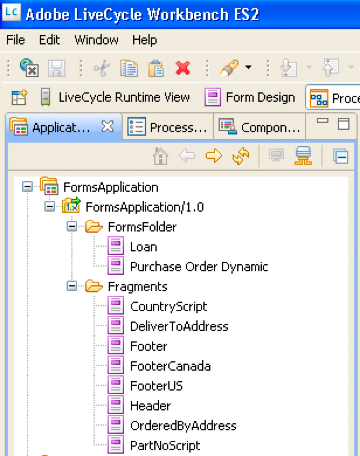

# Formsをレンダリングする Web アプリケーションの作成 {#creating-web-applications-thatrenders-forms}

## Formsをレンダリングする Web アプリケーションの作成 {#creating-web-applications-that-renders-forms}

Java サーブレットを使用してFormsサービスを呼び出し、フォームをレンダリングする Web ベースのアプリケーションを作成できます。 Java™サーブレットを使用する利点の 1 つは、プロセスの戻り値をクライアント Web ブラウザーに書き込める点です。 つまり、フォームを返すFormsサービスとクライアント Web ブラウザーの間のリンクとして Java サーブレットを使用できます。

>[!NOTE]
>
>ここでは、Formsサービスを呼び出し、フラグメントに基づいてフォームをレンダリングする Java サーブレットを使用する Web ベースのアプリケーションを作成する方法について説明します。 ( [フラグメントに基づくFormsのレンダリング](/help/forms/developing/rendering-forms-based-fragments.md).)

Java サーブレットを使用すると、顧客がフォームにデータを表示して入力できるように、フォームをクライアント Web ブラウザーに書き込むことができます。 フォームにデータを入力した後、Web ユーザーはフォーム上の送信ボタンをクリックして、情報を Java サーブレットに送り返し、データを取得して処理できます。 例えば、別のプロセスにデータを送信できます。

このセクションでは、次の図に示すように、米国ベースのフォームデータとカナダベースのフォームデータのどちらを選択できる Web ベースのアプリケーションを作成する方法について説明します。


レンダリングされるフォームは、フラグメントに基づくフォームです。 つまり、ユーザーが米国のデータを選択した場合、返されるフォームは米国のデータに基づくフラグメントを使用します。 例えば、次の図に示すように、フォームのフッターにはアメリカの住所が含まれています。


同様に、ユーザーがカナダのデータを選択した場合、返されるフォームには、次の図に示すように、カナダの住所が含まれます。


>[!NOTE]
>
>フラグメントを基にしたフォームデザインの作成について詳しくは、 [Forms Designer](https://www.adobe.com/go/learn_aemforms_designer_63).

**サンプルファイル**

この節では、次の場所にあるサンプルファイルを使用します。

&lt;*Forms Designer のインストールディレクトリ*>/Samples/Forms/発注/フォームフラグメント

ここで、*インストールディレクトリ*> はインストールパスです。 クライアントアプリケーションの目的上、Purchase Order Dynamic.xdp ファイルはこのインストール場所からコピーされ、という名前のFormsアプリケーションにデプロイされました。 *Applications/FormsApplication*. 発注書の Dynamic.xdp ファイルは、FormsFolder という名前のフォルダーに配置されます。 同様に、フラグメントは、次の図に示すように、Fragments という名前のフォルダーに配置されます。



Purchase Order Dynamic.xdp フォームデザインにアクセスするには、次を指定します。 `Applications/FormsApplication/1.0/FormsFolder/Purchase Order Dynamic.xdp` フォーム名 ( `renderPDFForm` メソッド ) および `repository:///` をコンテンツルート URI 値として設定します。

Web アプリケーションで使用される XML データファイルが Data フォルダーからに移動されました。 `C:\Adobe`(AEM Formsをホストする J2EE アプリケーションサーバーに属するファイルシステム ) ファイル名は発注です *Canada.xml* および発注 *US.xml*.

>[!NOTE]
>
>Workbench を使用したFormsアプリケーションの作成について詳しくは、 [workbench ヘルプ](https://www.adobe.com/go/learn_aemforms_workbench_63).

### 手順の概要 {#summary-of-steps}

フラグメントに基づいてフォームをレンダリングする Web ベースのアプリケーションを作成するには、次の手順を実行します。

1. 新しい Web プロジェクトを作成します。
1. Java サーブレットを表す Java アプリケーションロジックを作成します。
1. Web アプリケーション用の Web ページを作成します。
1. Web アプリケーションを WAR ファイルにパッケージ化します。
1. J2EE アプリケーションサーバーに WAR ファイルをデプロイします。
1. Web アプリケーションをテストします。

>[!NOTE]
>
>これらの手順の一部は、AEM Formsがデプロイされている J2EE アプリケーションによって異なります。 例えば、WAR ファイルのデプロイ方法は、使用している J2EE アプリケーションサーバーによって異なります。 この節では、AEM Formsが JBoss®にデプロイされていることを前提としています。

### Web プロジェクトの作成 {#creating-a-web-project}

Formsサービスを呼び出す Java サーブレットを含む Web アプリケーションを作成する最初の手順は、新しい Web プロジェクトを作成することです。 このドキュメントの基になる Java IDE は Eclipse 3.3 です。Eclipse IDE を使用して、Web プロジェクトを作成し、必要な JAR ファイルをプロジェクトに追加します。 最後に、という名前のHTMLページを追加します。 *index.html* Java サーブレットをプロジェクトに追加します。

次のリストは、Web プロジェクトに追加する必要がある JAR ファイルを指定します。

* adobe-forms-client.jar
* adobe-livecycle-client.jar
* adobe-usermanager-client.jar
* adobe-utilities.jar

これらの JAR ファイルの場所については、 [AEM Forms Java ライブラリファイルを含める](/help/forms/developing/invoking-aem-forms-using-java.md#including-aem-forms-java-library-files).

**Web プロジェクトを作成するには：**

1. Eclipse を起動し、 **ファイル** >  **新規プロジェクト**.
1. 内 **新規プロジェクト** ダイアログボックスで、次を選択します。 **Web** > **ダイナミック Web プロジェクト**.
1. タイプ `FragmentsWebApplication` プロジェクト名を入力し、 **完了**.

**必要な JAR ファイルをプロジェクトに追加するには、次の手順に従います。**

1. [ プロジェクトエクスプローラ ] ウィンドウで、 `FragmentsWebApplication` プロジェクトと選択 **プロパティ**.
1. クリック **Java ビルドパス** そして、 **ライブラリ** タブをクリックします。
1. 次をクリック： **外部 JAR を追加** ボタンをクリックし、含める JAR ファイルを参照します。

**Java サーブレットをプロジェクトに追加するには：**

1. [ プロジェクトエクスプローラ ] ウィンドウで、 `FragmentsWebApplication` プロジェクトと選択 **新規** >  **その他**.
1. を展開します。 **Web** フォルダー、選択 **Servlet**&#x200B;をクリックし、 **次へ**.
1. サーブレットを作成ダイアログボックスで、「 `RenderFormFragment` サーブレット名の場合は、 **完了**.

**プロジェクトにHTMLページを追加するには：**

1. [ プロジェクトエクスプローラ ] ウィンドウで、 `FragmentsWebApplication` プロジェクトと選択 **新規** > **その他**.
1. を展開します。 **Web** フォルダー、選択 **HTML**&#x200B;をクリックし、 **次へ**.
1. [ 新しいHTML] ダイアログボックスで、 `index.html` をクリックします。 **完了**.

>[!NOTE]
>
>を呼び出すHTMLページの作成に関する情報 `RenderFormFragment` Java サーブレット（を参照） [Web ページの作成](/help/forms/developing/rendering-forms.md#creating-the-web-page).

### サーブレットの Java アプリケーションロジックの作成 {#creating-java-application-logic-for-the-servlet}

Java サーブレット内からFormsサービスを呼び出す Java アプリケーションロジックを作成します。 次のコードは、 `RenderFormFragment` Java サーブレット：

```as3
     public class RenderFormFragment extends HttpServlet implements Servlet { 
         public void doGet(HttpServletRequest req, HttpServletResponse resp 
         throws ServletException, IOException { 
         doPost(req,resp); 
          
         } 
         public void doPost(HttpServletRequest req, HttpServletResponse resp 
         throws ServletException, IOException { 
             //Add code here to invoke the Forms service 
             }
```

通常、クライアントコードは Java サーブレットの `doGet` または `doPost` メソッド。 より優れたプログラミング方法は、このコードを別のクラスに配置し、そのクラスを `doPost` メソッド ( または `doGet` メソッド ) を使用し、適切なメソッドを呼び出します。 ただし、コードを簡潔にするために、この節のコード例は最小限に抑えられ、コード例は `doPost` メソッド。

Formsサービス API を使用してフラグメントに基づいてフォームをレンダリングするには、次のタスクを実行します。

1. Java プロジェクトのクラスパスに、adobe-forms-client.jar などのクライアント JAR ファイルを含めます。 これらのファイルの場所については、[AEM Forms Java ライブラリファイルを含める](/help/forms/developing/invoking-aem-forms-using-java.md#including-aem-forms-java-library-files)を参照してください。
1. HTMLフォームから送信されたラジオボタンの値を取得し、米国データとカナダデータのどちらを使用するかを指定します。 アメリカ語が送信された場合、 `com.adobe.idp.Document` が *発注 US.xml*. 同様に、カナダの場合は、 `com.adobe.idp.Document` が *Purchase Order Canada.xml* ファイル。
1. 接続プロパティを含む `ServiceClientFactory` オブジェクトを作成します。（[接続プロパティの設定](/help/forms/developing/invoking-aem-forms-using-java.md#setting-connection-properties)を参照。）
1. の作成 `FormsServiceClient` オブジェクトのコンストラクタを使用し、 `ServiceClientFactory` オブジェクト。
1. の作成 `URLSpec` コンストラクターを使用して URI 値を格納するオブジェクト。
1. を呼び出す `URLSpec` オブジェクトの `setApplicationWebRoot` メソッドを使用して、アプリケーションの Web ルートを表す string 値を渡します。
1. を呼び出す `URLSpec` オブジェクトの `setContentRootURI` メソッドを使用して、コンテンツルート URI 値を指定する string 値を渡します。 フォームデザインとフラグメントがコンテンツルート URI に配置されていることを確認します。 そうでない場合、Formsサービスは例外をスローします。 AEM Formsリポジトリを参照するには、 `repository://`.
1. を呼び出す `URLSpec` オブジェクトの `setTargetURL` メソッドを使用してターゲット URL 値を指定し、フォームデータの投稿先となる文字列値を渡します。 フォームデザインでターゲット URL を定義する場合、空の文字列を渡すことができます。 また、計算を実行するためのフォームの送信先の URL を指定することもできます。
1. を呼び出す `FormsServiceClient` オブジェクトの `renderPDFForm` メソッドを使用して、次の値を渡します。

   * ファイル名拡張子を含むフォームデザイン名を指定する string 値。
   * A `com.adobe.idp.Document` フォームに結合するデータを含むオブジェクト（手順 2 で作成）。
   * A `PDFFormRenderSpec` 実行時オプションを保存するオブジェクト。 詳しくは、 [AEM Forms API リファレンス](https://www.adobe.com/go/learn_aemforms_javadocs_63_en).
   * A `URLSpec` フラグメントに基づいてフォームをレンダリングするためにFormsサービスで必要な URI 値を含むオブジェクト。
   * A `java.util.HashMap` 添付ファイルを保存するオブジェクト。 これはオプションのパラメーターで、 `null` フォームにファイルを添付しない場合。

   この `renderPDFForm` メソッドは、 `FormsResult` クライアントの Web ブラウザーに書き込む必要があるフォームデータストリームを含むオブジェクト。

1. の作成 `com.adobe.idp.Document` を呼び出すことによってオブジェクトを取得 `FormsResult` オブジェクト `getOutputContent` メソッド。
1. のコンテンツタイプを取得する `com.adobe.idp.Document` オブジェクトを呼び出す `getContentType` メソッド。
1. を `javax.servlet.http.HttpServletResponse` を呼び出すことによるオブジェクトのコンテンツタイプ `setContentType` メソッドを使用して、 `com.adobe.idp.Document` オブジェクト。
1. の作成 `javax.servlet.ServletOutputStream` オブジェクトを使用します。オブジェクトは、 `javax.servlet.http.HttpServletResponse` オブジェクトの `getOutputStream` メソッド。
1. の作成 `java.io.InputStream` を呼び出すことによってオブジェクトを取得 `com.adobe.idp.Document` オブジェクトの `getInputStream` メソッド。
1. バイト配列を作成し、 `InputStream` オブジェクトの `read`メソッドを使用し、バイト配列を引数として渡す。
1. を呼び出す `javax.servlet.ServletOutputStream` オブジェクトの `write` メソッドを使用して、フォームデータストリームをクライアント Web ブラウザーに送信します。 バイト配列を `write` メソッド。

次のコード例は、Formsサービスを呼び出し、フラグメントに基づいてフォームをレンダリングする Java サーブレットを表しています。

```as3
 /* 
     * This Java Quick Start uses the following JAR files 
     * 1. adobe-forms-client.jar 
     * 2. adobe-livecycle-client.jar 
     * 3. adobe-usermanager-client.jar 
     * 
     * (Because Forms quick starts are implemented as Java servlets, it is  
     * not necessary to include J2EE specific JAR files - the Java project 
     * that contains this quick start is exported as a WAR file which 
     * is deployed to the J2EE application server) 
     * 
     * These JAR files are located in the following path: 
     * <install directory>/sdk/client-libs 
     * 
     * For complete details about the location of these JAR files,  
     * see "Including AEM Forms library files" in Programming with AEM forms 
     */ 
 import java.io.File; 
 import java.io.FileInputStream; 
 import java.io.IOException; 
 import java.io.PrintWriter; 
  
 import javax.servlet.Servlet; 
 import javax.servlet.ServletException; 
 import javax.servlet.ServletOutputStream; 
 import javax.servlet.http.HttpServlet; 
 import javax.servlet.http.HttpServletRequest; 
 import javax.servlet.http.HttpServletResponse; 
 import com.adobe.livecycle.formsservice.client.*; 
 import java.util.*; 
 import java.io.InputStream; 
 import java.net.URL; 
  
 import com.adobe.idp.Document; 
 import com.adobe.idp.dsc.clientsdk.ServiceClientFactory; 
 import com.adobe.idp.dsc.clientsdk.ServiceClientFactoryProperties; 
  
 public class RenderFormFragment extends HttpServlet implements Servlet { 
      
     public void doGet(HttpServletRequest req, HttpServletResponse resp) 
         throws ServletException, IOException { 
             doPost(req,resp);  
  
     } 
     public void doPost(HttpServletRequest req, HttpServletResponse resp) 
     throws ServletException, IOException { 
          
          
              
         try{ 
             //Set connection properties required to invoke AEM Forms                                 
             Properties connectionProps = new Properties(); 
             connectionProps.setProperty(ServiceClientFactoryProperties.DSC_DEFAULT_SOAP_ENDPOINT, "https://[server]:[port]"); 
             connectionProps.setProperty(ServiceClientFactoryProperties.DSC_TRANSPORT_PROTOCOL,ServiceClientFactoryProperties.DSC_SOAP_PROTOCOL);           
             connectionProps.setProperty(ServiceClientFactoryProperties.DSC_SERVER_TYPE, "JBoss"); 
             connectionProps.setProperty(ServiceClientFactoryProperties.DSC_CREDENTIAL_USERNAME, "administrator"); 
             connectionProps.setProperty(ServiceClientFactoryProperties.DSC_CREDENTIAL_PASSWORD, "password"); 
              
             //Get the value of selected radio button 
             String radioValue = req.getParameter("radio"); 
              
             //Create an Document object to store form data 
             Document oInputData = null;  
              
             //The value of the radio button determines the form data to use 
             //which determines which fragments used in the form 
             if (radioValue.compareTo("AMERICAN") == 0)            { 
                 FileInputStream myData = new FileInputStream("C:\\Adobe\Purchase Order US.xml"); 
                 oInputData = new Document(myData);  
             } 
             else if (radioValue.compareTo("CANADIAN") == 0)            { 
                 FileInputStream myData = new FileInputStream("C:\\Adobe\Purchase Order Canada.xml"); 
                 oInputData = new Document(myData);  
             } 
                      
             //Create a ServiceClientFactory object 
             ServiceClientFactory myFactory = ServiceClientFactory.createInstance(connectionProps); 
                  
             //Create a FormsServiceClient object 
             FormsServiceClient formsClient = new FormsServiceClient(myFactory);  
          
             //Set the parameter values for the renderPDFForm method 
             String formName = "Applications/FormsApplication/1.0/FormsFolder/Purchase Order Dynamic.xdp";   
                                      
             //Cache the PDF form 
             PDFFormRenderSpec pdfFormRenderSpec = new PDFFormRenderSpec(); 
             pdfFormRenderSpec.setCacheEnabled(new Boolean(true)); 
          
             //Specify URI values that are required to render a form 
             //design based on fragments 
             URLSpec uriValues = new URLSpec();  
             uriValues.setApplicationWebRoot("https://[server]:[port]/RenderFormFragment"); 
             uriValues.setContentRootURI("repository:///"); 
             uriValues.setTargetURL("https://[server]:[port]/FormsServiceClientApp/HandleData"); 
                      
             //Invoke the renderPDFForm method and write the  
             //results to a client web browser 
             FormsResult formOut = formsClient.renderPDFForm( 
                         formName,               //formQuery 
                         oInputData,             //inDataDoc 
                         pdfFormRenderSpec,      //PDFFormRenderSpec 
                         uriValues,                //urlSpec 
                         null                    //attachments 
                         ); 
          
             //Create a Document object that stores form data 
             Document myData = formOut.getOutputContent(); 
          
             //Get the content type of the response and 
             //set the HttpServletResponse object’s content type 
             String contentType = myData.getContentType();  
             resp.setContentType(contentType); 
          
             //Create a ServletOutputStream object 
             ServletOutputStream oOutput = resp.getOutputStream(); 
          
             //Create an InputStream object 
             InputStream inputStream = myData.getInputStream(); 
          
             //Write the data stream to the web browser 
             byte[] data = new byte[4096]; 
             int bytesRead = 0; 
             while ((bytesRead = inputStream.read(data)) > 0) 
             { 
                 oOutput.write(data, 0, bytesRead); 
             } 
      
         }catch (Exception e) { 
              System.out.println("The following exception occurred: "+e.getMessage()); 
       } 
     } 
 }
```

### Web ページの作成 {#creating-the-web-page}

index.html Web ページは、Java サーブレットへのエントリポイントを提供し、Formsサービスを呼び出します。 この Web ページは、2 つのラジオHTMLと 1 つの送信ボタンを含む基本的なボタンフォームです。 ラジオボタンの名前は radio です。 ユーザーが送信ボタンをクリックすると、フォームデータが `RenderFormFragment` Java サーブレット。

Java サーブレットは、次の Java コードを使用して、HTMLページから投稿されるデータをキャプチャします。

```as3
             Document oInputData = null;  
              
             //Get the value of selected radio button 
             String radioValue = req.getParameter("radio"); 
                          
             //The value of the radio button determines the form data to use 
             //which determines which fragments used in the form 
             if (radioValue.compareTo("AMERICAN") == 0)            { 
                 FileInputStream myData = new FileInputStream("C:\\Adobe\Purchase Order US.xml"); 
                 oInputData = new Document(myData);  
             } 
             else if (radioValue.compareTo("CANADIAN") == 0)            { 
                 FileInputStream myData = new FileInputStream("C:\\Adobe\Purchase Order Canada.xml"); 
                 oInputData = new Document(myData);  
             }
```

次のHTMLコードは、開発環境のセットアップ中に作成された index.html ファイルにあります。 ( [Web プロジェクトの作成](/help/forms/developing/rendering-forms.md#creating-a-web-project).)

```as3
 <!DOCTYPE html PUBLIC "-//W3C//DTD XHTML 1.0 Transitional//EN" "https://www.w3.org/TR/xhtml1/DTD/xhtml1-transitional.dtd"> 
 <html xmlns="https://www.w3.org/1999/xhtml"> 
 <head> 
 <meta http-equiv="Content-Type" content="text/html; charset=utf-8" /> 
 <title>Untitled Document</title> 
 </head> 
  
 <body> 
 <form name="myform" action="https://[server]:[port]/FragmentsWebApplication/RenderFormFragment" method="post"> 
      <table> 
      <tr> 
        <th>Forms Fragment Web Client</th> 
      </tr> 
      <tr> 
        <td> 
          <label> 
          <input type="radio" name="radio" id="radio_Data" value="CANADIAN" /> 
          Canadian data<br /> 
          </label> 
          <p> 
            <label> 
            <input type="radio" name="radio" id="radio_Data" value="AMERICAN" checked/> 
            American data</label> 
          </p> 
        </td> 
      </tr> 
      <tr> 
      <td> 
        <label> 
          <input type="submit" name="button_Submit" id="button_Submit" value="Submit" /> 
            </label> 
            </td> 
         </tr> 
        </table> 
      </form>     
 </body> 
 </html>
```

### Web アプリケーションのパッケージ化 {#packaging-the-web-application}

Formsサービスを呼び出す Java サーブレットをデプロイするには、Web アプリケーションを WAR ファイルにパッケージ化します。 コンポーネントのビジネスロジックが依存する外部 JAR ファイル（ adobe-livecycle-client.jar や adobe-forms-client.jar など）も WAR ファイルに含めるようにします。

**Web アプリケーションを WAR ファイルにパッケージ化するには、次の手順に従います。**

1. 次の **プロジェクトエクスプローラ** ウィンドウで、右クリック `FragmentsWebApplication` プロジェクトと選択 **書き出し** > **WAR ファイル**.
1. 内 **Web モジュール** テキストボックス、タイプ `FragmentsWebApplication` Java プロジェクトの名前。
1. 内 **宛先** テキストボックス、タイプ `FragmentsWebApplication.war`**の**&#x200B;ファイル名 WAR ファイルの場所を指定し、[ 完了 ] をクリックします。

### J2EE アプリケーションサーバーへの WAR ファイルのデプロイ {#deploying-the-war-file-to-the-j2ee-application-server}

WAR ファイルは、AEM Formsがデプロイされている J2EE アプリケーションサーバーにデプロイできます。 WAR ファイルをデプロイした後は、Web ブラウザを使用してHTMLWeb ページにアクセスできます。

**J2EE アプリケーションサーバーに WAR ファイルをデプロイするには、次の手順に従います。**

* WAR ファイルをエクスポートパスからにコピーします。 *[Forms Install]*\Adobe\Adobe Experience Manager Forms\jboss\server\all\deploy

### Web アプリケーションのテスト {#testing-your-web-application}

Web アプリケーションをデプロイした後、Web ブラウザーを使用してテストできます。 AEM Formsをホストしているコンピューターを使用している場合は、次の URL を指定できます。

* http://localhost:8080/FragmentsWebApplication/index.html

   ラジオボタンを選択し、「送信」ボタンをクリックします。 フラグメントに基づくフォームが Web ブラウザーに表示されます。 問題が発生した場合は、J2EE アプリケーションサーバーのログファイルを参照してください。
