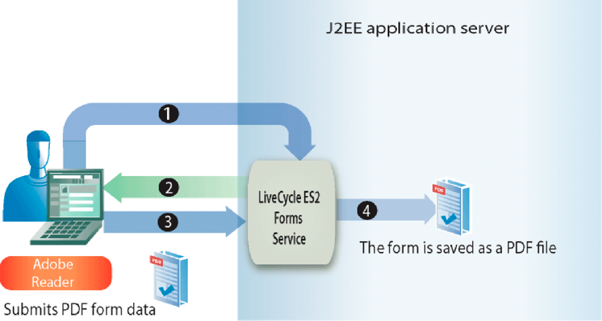

# 送信済みFormsの処理 {#handling-submitted-forms}

ユーザーがインタラクティブフォームに入力できる Web ベースのアプリケーションでは、データをサーバーに送り返す必要があります。 Formsサービスを使用すると、ユーザーがインタラクティブフォームに入力したデータを取得できます。 データを取得した後、ビジネス要件に合わせてデータを処理できます。 例えば、データベースにデータを格納し、別のアプリケーションにデータを送信し、別のサービスにデータを送信し、データをフォームデザインに結合し、Web ブラウザーに表示するなどの操作を実行できます。

フォームデータは、XML データまたはPDFデータ（Designer で設定されるオプション）としてFormsサービスに送信されます。 XML 形式で送信されるフォームを使用して、個々のフィールドデータ値を抽出できます。 つまり、ユーザーがフォームに入力した各フォームフィールドの値を抽出できます。 PDFデータとして送信されるフォームは、XML データではなくバイナリデータです。 フォームは、PDFファイルとして保存するか、別のサービスに送信することができます。 XML 形式で送信されたフォームからデータを抽出し、そのフォームデータを使用してPDFドキュメントを作成する場合は、別のAEM Forms操作を呼び出します。 ( [送信済み XMLPDFでのデータ・ドキュメントの作成](/help/forms/developing/creating-pdf-documents-submitted-xml.md))

次の図は、という名前の Java サーブレットに送信されるデータを示しています `HandleData` Web ブラウザーに表示されるインタラクティブフォームから。

次の表で、図の手順を説明します。

<table>
 <thead>
  <tr>
   <th>
手順
</th>
   <th>
説明
</th>
  </tr>
 </thead>
 <tbody>
  <tr>
   <td>
1
</td>
   <td>
ユーザーがインタラクティブフォームに入力し、フォームの「送信」ボタンをクリックします。
</td>
  </tr>
  <tr>
   <td>
2
</td>
   <td>
データが <code>HandleData</code> XML データとしての Java サーブレット。
</td>
  </tr>
  <tr>
   <td>
3
</td>
   <td>
この <code>HandleData</code> Java サーブレットには、データを取得するアプリケーションロジックが含まれています。
</td>
  </tr>
 </tbody>
</table>

## 送信された XML データの処理 {#handling-submitted-xml-data}

フォームデータが XML として送信されると、送信されたデータを表す XML データを取得できます。 すべてのフォームフィールドは、XML スキーマのノードとして表示されます。 ノードの値は、ユーザーが入力した値に対応します。 フォーム内の各フィールドが XML データ内のノードとして表示されるローンフォームについて考えてみましょう。 各ノードの値は、ユーザーが入力する値に対応します。 ユーザーが次のフォームに示すデータを使用してローンフォームに入力するとします。

次の図に、Formsサービスクライアント API を使用して取得された、対応する XML データを示します。

ローンフォームのフィールド。 これらの値は、Java XML クラスを使用して取得できます。

>[!NOTE]
>
>データを XML データとして送信するには、Designer でフォームデザインを正しく設定する必要があります。 XML データを送信するようにフォームデザインを適切に設定するには、フォームデザイン上の「送信」ボタンが XML データを送信するように設定されていることを確認します。 XML データを送信するための「送信」ボタンの設定について詳しくは、 [AEM Forms Designer](https://www.adobe.com/go/learn_aemforms_designer_63).

## 送信されたPDFデータの処理 {#handling-submitted-pdf-data}

Formsサービスを呼び出す Web アプリケーションについて考えます。 FormsサービスがインタラクティブPDFフォームをクライアント Web ブラウザーにレンダリングした後、ユーザーはフォームに入力し、フォームをPDFデータとして送り返します。 FormsサービスはPDFデータを受け取ると、PDFデータを別のサービスに送信したり、PDFファイルとして保存したりできます。 次の図に、アプリケーションのロジック・フローを示します。

次の表に、この図の手順を示します。

<table>
 <thead>
  <tr>
   <th>
手順
</th>
   <th>
説明
</th>
  </tr>
 </thead>
 <tbody>
  <tr>
   <td>
1
</td>
   <td>
Web ページには、Formsサービスを呼び出す Java サーブレットにアクセスするリンクが含まれています。
</td>
  </tr>
  <tr>
   <td>
2
</td>
   <td>
Formsサービスは、インタラクティブなPDFフォームをクライアント Web ブラウザーにレンダリングします。
</td>
  </tr>
  <tr>
   <td>
3
</td>
   <td>
ユーザーはインタラクティブフォームに入力し、送信ボタンをクリックします。 フォームは、PDFデータとしてFormsサービスに送り返されます。 このオプションは Designer で設定します。
</td>
  </tr>
  <tr>
   <td>
4
</td>
   <td>
Formsサービスは、このPDFデータをPDFファイルとして保存します。 
</td>
  </tr>
 </tbody>
</table>

## 送信された URL UTF-16 データの処理 {#handling-submitted-url-utf-16-data}

フォームデータが URL UTF-16 データとして送信される場合、クライアントコンピューターにはAdobe ReaderまたはAcrobat 8.1 以降が必要です。 また、フォームデザインに URL エンコードされたデータ (HTTP Post) を含む送信ボタンが含まれ、データエンコードオプションが UTF-16 の場合、フォームデザインはメモ帳などのテキストエディターで変更する必要があります。 エンコーディングオプションは、次のいずれかに設定できます。 `UTF-16LE` または `UTF-16BE` （送信ボタン用） Designer はこの機能を提供していません。

>[!NOTE]
>
>Formsサービスについて詳しくは、 [AEM Formsのサービスリファレンス](https://www.adobe.com/go/learn_aemforms_services_63).

## 手順の概要 {#summary-of-steps}

送信されたフォームを処理するには、次のタスクを実行します。

1. プロジェクトファイルを含めます。
1. Forms Client API オブジェクトを作成します。
1. フォームデータを取得します。
1. フォーム送信に添付ファイルが含まれているかどうかを確認します。
1. 送信されたデータを処理します。

**プロジェクトファイルを含める**

必要なファイルを開発プロジェクトに含めます。 Java を使用してクライアントアプリケーションを作成する場合は、必要な JAR ファイルを含めます。 Web サービスを使用している場合は、プロキシファイルを必ず含めてください。

**Forms Client API オブジェクトの作成**

Forms Service Client API 操作をプログラムで実行する前に、Formsサービスクライアントを作成する必要があります。 Java API を使用している場合は、 `FormsServiceClient` オブジェクト。 Forms Web サービス API を使用している場合は、 `FormsService` オブジェクト。

**フォームデータを取得**

送信されたフォームデータを取得するには、 `FormsServiceClient` オブジェクトの `processFormSubmission` メソッド。 このメソッドを呼び出す場合は、送信されたフォームのコンテンツタイプを指定する必要があります。 クライアントの Web ブラウザーからFormsサービスにデータが送信された場合、そのデータは XML またはPDFデータとして送信できます。 フォームフィールドに入力されたデータを取得するには、データを XML データとして送信します。

また、次の実行時オプションを設定して、PDFデータとして送信されたフォームからフォームフィールドを取得することもできます。

* 次の値を `processFormSubmission` メソッドをコンテンツタイプパラメーターとして使用します。 `CONTENT_TYPE=application/pdf`.
* を `RenderOptionsSpec` オブジェクトの `PDFToXDP` 値 `true`
* を `RenderOptionsSpec` オブジェクトの `ExportDataFormat` 値 `XMLData`

送信されたフォームのコンテンツタイプは、 `processFormSubmission` メソッド。 次のリストで、適用可能なコンテンツタイプの値を指定します。

* **text/xml**:フォームがフォームデータを XML として送信する際にPDFするコンテンツタイプを表します。
* **application/x-www-form-urlencoded**:データが XML 形式で送信される場合にHTMLするコンテンツタイプを表します。
* **application/pdf**:PDFフォームがデータをPDFとして送信する際に使用するコンテンツタイプを表します。

>[!NOTE]
>
>「送信されたFormsの処理」セクションに関連付けられている、対応する 3 つのクイックスタートがあることに気が付きます。 Java API クイックスタートを使用して、PDFとして送信されたPDF formsの処理に、送信されたPDFデータの処理方法を示します。 このクイックスタートで指定されているコンテンツタイプは次のとおりです `application/pdf`. Java API クイックスタートを使用した XML 形式で送信されたPDF formsの処理では、PDFフォームから送信された送信済み XML データを処理する方法を示します。 このクイックスタートで指定されているコンテンツタイプは次のとおりです `text/xml`. 同様に、Java API クイックスタートを使用して、XML 形式で送信されたHTMLフォームの処理で、HTMLフォームから送信された送信済み XML データを処理する方法を示します。 このクイックスタートで指定するコンテンツタイプは、 application/x-www-form-urlencoded です。

Formsサービスに投稿されたフォームデータを取得し、その処理状態を判断します。 つまり、データがFormsサービスに送信された場合、必ずしもFormsサービスによるデータの処理が完了し、データの処理準備が整ったとは限りません。 例えば、計算を実行できるように、Formsサービスにデータを送信できます。 計算が完了すると、フォームはレンダリングされてユーザーに返され、計算結果が表示されます。 送信されたデータを処理する前に、Formsサービスがデータの処理を完了したかどうかを確認することをお勧めします。

Formsサービスは、データの処理が完了したかどうかを示す次の値を返します。

* **0 （送信）:** 送信されたデータを処理する準備が整いました。
* **1 （計算）:** Formsサービスがデータに対して計算操作を実行したので、結果をユーザーに返す必要があります。
* **2 （検証）:** Formsサービスで検証されたフォームデータと、その結果をユーザーに返す必要があります。
* **3（次へ）:** 現在のページは、クライアントアプリケーションに書き込む必要がある結果と共に変更されました。
* **4 ( 前へ**):現在のページは、クライアントアプリケーションに書き込む必要がある結果と共に変更されました。

>[!NOTE]
>
>計算と検証は、ユーザーにレンダリングし直す必要があります。 ( [フォームデータの計算](/help/forms/developing/calculating-form-data.md#calculating-form-data).)

**フォーム送信に添付ファイルが含まれているかどうかを確認します**

Formsサービスに送信されたFormsには、添付ファイルを含めることができます。 例えば、Acrobatの組み込み添付ファイルウィンドウを使用すると、ユーザーは添付ファイルを選択して、フォームと共に送信できます。 また、ユーザーは、添付ファイルファイルと共にレンダリングされるHTMLツールバーを使用して、添付ファイルをHTMLすることもできます。

フォームに添付ファイルが含まれているかどうかを確認したら、データを処理できます。 例えば、添付ファイルをローカルファイルシステムに保存できます。

>[!NOTE]
>
>添付ファイルを取得するには、フォームがPDFデータとして送信される必要があります。 フォームが XML データとして送信された場合、添付ファイルは送信されません。

**送信されたデータを処理**

送信データのコンテンツタイプに応じて、個々のフォームフィールドの値を送信済み XML データから抽出したり、送信済みのPDFデータをPDFファイルとして保存（または別のサービスに送信）したりできます。 個々のフォームフィールドを抽出するには、送信された XML データを XML データソースに変換し、 `org.w3c.dom` クラス。

**関連トピック**

[AEM Forms Java ライブラリファイルを含める](/help/forms/developing/invoking-aem-forms-using-java.md#including-aem-forms-java-library-files)

[接続プロパティの設定](/help/forms/developing/invoking-aem-forms-using-java.md#setting-connection-properties)

[Forms Service API クイックスタート](/help/forms/developing/forms-service-api-quick-starts.md#forms-service-api-quick-starts)

[Forms Service にドキュメントを渡す](/help/forms/developing/passing-documents-forms-service.md)

[Formsをレンダリングする Web アプリケーションの作成](/help/forms/developing/creating-web-applications-renders-forms.md)

## Java API を使用して送信済みのフォームを処理する {#handle-submitted-forms-using-the-java-api}

Forms API(Java) を使用して、送信されたフォームを処理します。

1. プロジェクトファイルを含める

   Java プロジェクトのクラスパスに、adobe-forms-client.jar などのクライアント JAR ファイルを含めます。

1. Forms Client API オブジェクトの作成

   * 接続プロパティを含む `ServiceClientFactory` オブジェクトを作成します。
   * の作成 `FormsServiceClient` オブジェクトのコンストラクタを使用し、 `ServiceClientFactory` オブジェクト。

1. フォームデータを取得

   * Java サーブレットに投稿されたフォームデータを取得するには、 `com.adobe.idp.Document` オブジェクトのコンストラクタを使用して、 `javax.servlet.http.HttpServletResponse` オブジェクトの `getInputStream` メソッドをコンストラクタ内から呼び出します。
   * コンストラクタを使用して `RenderOptionsSpec` オブジェクトを作成します。を呼び出してロケール値を設定します。 `RenderOptionsSpec` オブジェクトの `setLocale` メソッドを使用して、ロケール値を指定する string 値を渡す。

   >[!NOTE]
   >
   >Formsサービスに対し、 `RenderOptionsSpec` オブジェクトの `setPDF2XDP` メソッドとパス `true` および `setXMLData` そして通り過ぎ `true`. その後、 `FormsResult` オブジェクトの `getOutputXML` メソッドを使用して、XDP/XML データに対応する XML データを取得します。 ( `FormsResult` オブジェクトが `processFormSubmission`*メソッド（次の手順で説明）*

   * を呼び出す `FormsServiceClient` オブジェクトの `processFormSubmission` メソッドを使用して、次の値を渡します。

      * この `com.adobe.idp.Document` フォームデータを格納するオブジェクト。
      * 関連するすべての HTTP ヘッダーを含む環境変数を指定する string 値。 処理するコンテンツタイプを指定します。 XML データを処理するには、このパラメーターに次の文字列値を指定します。 `CONTENT_TYPE=text/xml`. PDFーデータを処理するには、このパラメーターに次の文字列値を指定します。 `CONTENT_TYPE=application/pdf`.
      * 次を指定する string 値 `HTTP_USER_AGENT` ヘッダー値（例： ）。 `Mozilla/4.0 (compatible; MSIE 6.0; Windows NT 5.1; SV1; .NET CLR 1.1.4322)`」を選択します。このパラメーターの値はオプションです。
      * A `RenderOptionsSpec` 実行時オプションを保存するオブジェクト。

      この `processFormSubmission` メソッドは、 `FormsResult` フォーム送信の結果を含むオブジェクト。

   * を呼び出して、Formsサービスがフォームデータの処理を完了したかどうかを判断します。 `FormsResult` オブジェクトの `getAction` メソッド。 このメソッドが値を返す場合 `0`に設定すると、データを処理する準備が整います。

1. フォーム送信に添付ファイルが含まれているかどうかを確認します

   * を呼び出す `FormsResult` オブジェクトの `getAttachments` メソッド。 このメソッドは、 `java.util.List` フォームと共に送信されたファイルを含むオブジェクト。
   * 反復処理 `java.util.List` オブジェクトを使用して、添付ファイルが存在するかどうかを確認します。 添付ファイルがある場合、各要素は `com.adobe.idp.Document` インスタンス。 を呼び出すことで、添付ファイルを保存できます。 `com.adobe.idp.Document` オブジェクトの `copyToFile` メソッドと `java.io.File` オブジェクト。

   >[!NOTE]
   >
   >この手順は、フォームがPDFとして送信された場合にのみ適用されます。

1. 送信されたデータを処理

   * データコンテンツタイプが `application/vnd.adobe.xdp+xml` または `text/xml`、XML データ値を取得するアプリケーションロジックを作成します。

      * の作成 `com.adobe.idp.Document` を呼び出すことによってオブジェクトを取得 `FormsResult` オブジェクトの `getOutputContent` メソッド。
      * の作成 `java.io.InputStream` を呼び出すことによってオブジェクトを取得 `java.io.DataInputStream` コンストラクタと `com.adobe.idp.Document` オブジェクト。
      * の作成 `org.w3c.dom.DocumentBuilderFactory` オブジェクトの `org.w3c.dom.DocumentBuilderFactory` オブジェクトの `newInstance` メソッド。
      * の作成 `org.w3c.dom.DocumentBuilder` を呼び出すことによってオブジェクトを取得 `org.w3c.dom.DocumentBuilderFactory` オブジェクトの `newDocumentBuilder` メソッド。
      * の作成 `org.w3c.dom.Document` を呼び出すことによってオブジェクトを取得 `org.w3c.dom.DocumentBuilder` オブジェクトの `parse` メソッドおよび `java.io.InputStream` オブジェクト。
      * XML ドキュメント内の各ノードの値を取得します。 このタスクを実行する 1 つの方法は、次の 2 つのパラメーターを受け入れるカスタムメソッドを作成することです。の `org.w3c.dom.Document` オブジェクトおよび値を取得するノードの名前。 このメソッドは、ノードの値を表す文字列値を返します。 このプロセスに続くコード例では、このカスタムメソッドをと呼び出します。 `getNodeText`. このメソッドの本文を示します。
   * データコンテンツタイプが `application/pdf`、アプリケーションロジックを作成して、送信されたPDFデータをPDFファイルとして保存します。

      * の作成 `com.adobe.idp.Document` を呼び出すことによってオブジェクトを取得 `FormsResult` オブジェクトの `getOutputContent` メソッド。
      * の作成 `java.io.File` オブジェクトのパブリックコンストラクターを使用します。 ファイル名の拡張子には必ずPDFを指定してください。
      * を呼び出してPDFファイルを生成します。 `com.adobe.idp.Document` オブジェクトの `copyToFile` メソッドおよび `java.io.File` オブジェクト。

**関連トピック**

[クイックスタート（SOAP モード）:Java API を使用して、XML として送信されたPDF formsの処理](/help/forms/developing/forms-service-api-quick-starts.md#quick-start-soap-mode-handling-pdf-forms-submitted-as-xml-using-the-java-api)

[クイックスタート（SOAP モード）:Java API を使用して、XML として送信されたHTMLフォームの処理](/help/forms/developing/forms-service-api-quick-starts.md#quick-start-soap-mode-handling-html-forms-submitted-as-xml-using-the-java-api)

[クイックスタート（SOAP モード）:Java API を使用して、PDFとして送信されたPDF formsの処理](/help/forms/developing/forms-service-api-quick-starts.md#quick-start-soap-mode-handling-pdf-forms-submitted-as-pdf-using-the-java-api)

[AEM Forms Java ライブラリファイルを含める](/help/forms/developing/invoking-aem-forms-using-java.md#including-aem-forms-java-library-files)

[接続プロパティの設定](/help/forms/developing/invoking-aem-forms-using-java.md#setting-connection-properties)

## Web サービス API を使用して送信されたPDFデータを処理します {#handle-submitted-pdf-data-using-the-web-service-api}

Forms API（Web サービス）を使用して、送信されたフォームを処理します。

1. プロジェクトファイルを含める

   * Forms Service WSDL を使用する Java プロキシクラスを作成します。
   * Java プロキシクラスをクラスパスに含めます。

1. Forms Client API オブジェクトの作成

   の作成 `FormsService` オブジェクトを選択し、認証値を設定します。

1. フォームデータを取得

   * Java サーブレットに投稿されたフォームデータを取得するには、 `BLOB` オブジェクトを指定します。
   * の作成 `java.io.InputStream` を呼び出すことによってオブジェクトを取得 `javax.servlet.http.HttpServletResponse` オブジェクトの `getInputStream` メソッド。
   * の作成 `java.io.ByteArrayOutputStream` オブジェクトのコンストラクタを使用し、 `java.io.InputStream` オブジェクト。
   * の内容をコピーします。 `java.io.InputStream` オブジェクトを `java.io.ByteArrayOutputStream` オブジェクト。
   * を呼び出してバイト配列を作成する `java.io.ByteArrayOutputStream` オブジェクトの `toByteArray` メソッド。
   * 次の項目に `BLOB` オブジェクトを呼び出す `setBinaryData` メソッドを使用し、バイト配列を引数として渡す。
   * コンストラクタを使用して `RenderOptionsSpec` オブジェクトを作成します。を呼び出してロケール値を設定します。 `RenderOptionsSpec` オブジェクトの `setLocale` メソッドを使用して、ロケール値を指定する string 値を渡す。
   * を呼び出す `FormsService` オブジェクトの `processFormSubmission` メソッドを使用して、次の値を渡します。

      * この `BLOB` フォームデータを格納するオブジェクト。
      * 関連するすべての HTTP ヘッダーを含む環境変数を指定する string 値。 処理するコンテンツタイプを指定します。 XML データを処理するには、このパラメーターに次の文字列値を指定します。 `CONTENT_TYPE=text/xml`. PDFーデータを処理するには、このパラメーターに次の文字列値を指定します。 `CONTENT_TYPE=application/pdf`.
      * 次を指定する string 値 `HTTP_USER_AGENT` ヘッダー値；例： `Mozilla/4.0 (compatible; MSIE 6.0; Windows NT 5.1; SV1; .NET CLR 1.1.4322)`.
      * A `RenderOptionsSpec` 実行時オプションを保存するオブジェクト。
      * 空 `BLOBHolder` メソッドによって設定されるオブジェクト。
      * 空 `javax.xml.rpc.holders.StringHolder` メソッドによって設定されるオブジェクト。
      * 空 `BLOBHolder` メソッドによって設定されるオブジェクト。
      * 空 `BLOBHolder` メソッドによって設定されるオブジェクト。
      * 空 `javax.xml.rpc.holders.ShortHolder` メソッドによって設定されるオブジェクト。
      * 空 `MyArrayOf_xsd_anyTypeHolder` メソッドによって設定されるオブジェクト。 このパラメーターは、フォームと共に送信される添付ファイルを保存するために使用されます。
      * 空 `FormsResultHolder` 送信されるフォームを使用してメソッドによって入力されるオブジェクト。

      この `processFormSubmission` メソッドによって `FormsResultHolder` パラメーターとフォーム送信の結果。

   * を呼び出して、Formsサービスがフォームデータの処理を完了したかどうかを判断します。 `FormsResult` オブジェクトの `getAction` メソッド。 このメソッドが値を返す場合 `0`に設定すると、フォームデータを処理する準備が整います。 次の URL を `FormsResult` オブジェクトを作成するには、 `FormsResultHolder` オブジェクトの `value` データメンバー。

1. フォーム送信に添付ファイルが含まれているかどうかを確認します

   の値を取得する `MyArrayOf_xsd_anyTypeHolder` オブジェクトの `value` データメンバー ( `MyArrayOf_xsd_anyTypeHolder` オブジェクトが `processFormSubmission` メソッド )。 このデータメンバは、 `Objects`. 各要素 ( `Object` 配列は `Object`これは、フォームと共に送信されたファイルに対応します。 配列内の各要素を取得し、 `BLOB` オブジェクト。

1. 送信されたデータを処理

   * データコンテンツタイプが `application/vnd.adobe.xdp+xml` または `text/xml`、XML データ値を取得するアプリケーションロジックを作成します。

      * の作成 `BLOB` を呼び出すことによってオブジェクトを取得 `FormsResult` オブジェクトの `getOutputContent` メソッド。
      * を呼び出してバイト配列を作成する `BLOB` オブジェクトの `getBinaryData` メソッド。
      * の作成 `java.io.InputStream` を呼び出すことによってオブジェクトを取得 `java.io.ByteArrayInputStream` コンストラクタと byte 配列を渡す。
      * の作成 `org.w3c.dom.DocumentBuilderFactory` オブジェクトの `org.w3c.dom.DocumentBuilderFactory` オブジェクトの `newInstance` メソッド。
      * の作成 `org.w3c.dom.DocumentBuilder` を呼び出すことによってオブジェクトを取得 `org.w3c.dom.DocumentBuilderFactory` オブジェクトの `newDocumentBuilder` メソッド。
      * の作成 `org.w3c.dom.Document` を呼び出すことによってオブジェクトを取得 `org.w3c.dom.DocumentBuilder` オブジェクトの `parse` メソッドおよび `java.io.InputStream` オブジェクト。
      * XML ドキュメント内の各ノードの値を取得します。 このタスクを実行する 1 つの方法は、次の 2 つのパラメーターを受け入れるカスタムメソッドを作成することです。の `org.w3c.dom.Document` オブジェクトおよび値を取得するノードの名前。 このメソッドは、ノードの値を表す文字列値を返します。 このプロセスに続くコード例では、このカスタムメソッドをと呼び出します。 `getNodeText`. このメソッドの本文を示します。
   * データコンテンツタイプが `application/pdf`、アプリケーションロジックを作成して、送信されたPDFデータをPDFファイルとして保存します。

      * の作成 `BLOB` を呼び出すことによってオブジェクトを取得 `FormsResult` オブジェクトの `getOutputContent` メソッド。
      * を呼び出してバイト配列を作成する `BLOB` オブジェクトの `getBinaryData` メソッド。
      * の作成 `java.io.File` オブジェクトのパブリックコンストラクターを使用します。 ファイル名の拡張子には必ずPDFを指定してください。
      * コンストラクタを使用して `java.io.FileOutputStream` オブジェクトを渡すことによって、`java.io.File` オブジェクトを作成します。
      * を呼び出してPDFファイルを生成します。 `java.io.FileOutputStream` オブジェクトの `write` メソッドを使用してバイト配列を渡す。

**関連トピック**

[Base64 エンコーディングを使用したAEM Formsの呼び出し](/help/forms/developing/invoking-aem-forms-using-web.md#invoking-aem-forms-using-base64-encoding)
