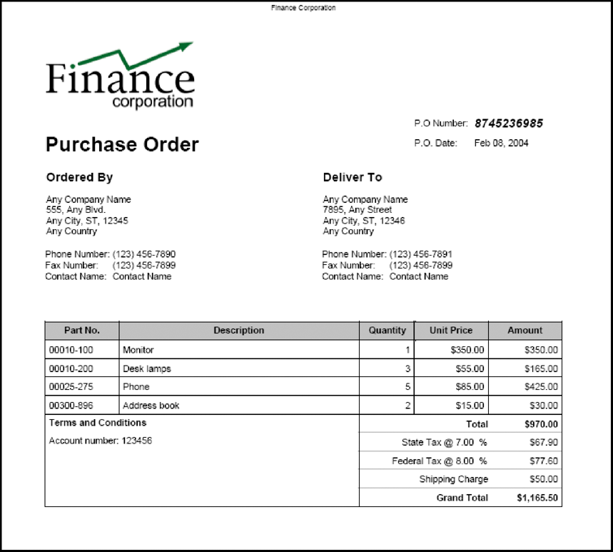

# 編集可能なレイアウトを使用したFormsの事前入力 {#prepopulating-forms-with-flowable-layouts1}

## 編集可能なレイアウトを使用したFormsの事前入力 {#prepopulating-forms-with-flowable-layouts2}

フォームの自動埋め込みは、レンダリングされたフォーム内のユーザーにデータを表示します。 例えば、あるユーザーが、ユーザー名とパスワードを使用して Web サイトにログインしたとします。 認証に成功した場合、クライアントアプリケーションはデータベースに対してユーザー情報を問い合わせます。 データがフォームにマージされ、フォームがユーザーにレンダリングされます。 その結果、ユーザーはフォーム内でパーソナライズされたデータを表示できます。

フォームの自動埋め込みには次の利点があります。

* ユーザーがフォーム内にカスタムデータを表示できる.
* ユーザーがフォームに入力する際に入力する時間を減らします。
* データを配置する場所を制御できるため、データの整合性を維持できる.

次の 2 つの XML データソースを使用して、フォームを事前入力できます。

* XDP データソース。XFA 構文に準拠する XML です ( または、Acrobatを使用して作成されたフォームに事前入力する XFDF データ )。
* フォームのフィールド名に一致する名前と値のペアを含む任意の XML データソース（この節の例では、任意の XML データソースを使用します）。

事前入力するフォームフィールドごとに、XML 要素が存在する必要があります。 XML 要素名は、フィールド名と一致する必要があります。XML 要素がフォームフィールドに対応していない場合や、XML 要素名がフィールド名と一致しない場合、XML 要素は無視されます。すべての XML 要素が指定されている限り、XML 要素の表示順を一致させる必要はありません。

既にデータを含むフォームに事前入力する場合は、XML データソース内に既に表示されているデータを指定する必要があります。 10 個のフィールドを含むフォームの 4 つのフィールドにデータが含まれているとします。 次に、残り 6 つのフィールドに事前入力するとします。 この場合、フォームの自動埋め込みに使用する 10 個の XML 要素を XML データソースに指定する必要があります。 6 つの要素のみを指定した場合、元の 4 つのフィールドは空になります。

例えば、サンプルの確認フォームなどのフォームを事前入力することができます。 ( [インタラクティブPDF formsのレンダリング](/help/forms/developing/rendering-interactive-pdf-forms.md).)

サンプルの確認フォームを事前入力するには、フォーム内の 3 つのフィールドに一致する 3 つの XML 要素を含む XML データソースを作成する必要があります。 このフォームには、次の 3 つのフィールドが含まれています。 `FirstName`, `LastName`、および `Amount`. 最初の手順では、フォームデザイン内のフィールドと一致する XML 要素を含む XML データソースを作成します。 次の手順では、次の XML コードに示すように、XML 要素にデータ値を割り当てます。

```as3
     <Untitled> 
         <FirstName>Jerry</FirstName> 
         <LastName>Johnson</LastName> 
         <Amount>250000</Amount> 
     </Untitled>
```

次の図に示すように、この XML データソースを確認フォームに事前入力し、フォームをレンダリングすると、XML 要素に割り当てたデータ値が表示されます。


### 編集可能なレイアウトを使用したフォームの事前入力 {#prepopulating_forms_with_flowable_layouts-1}

レイアウトが編集可能なFormsは、未定量のデータをユーザーに表示する場合に役立ちます。 フォームのレイアウトはマージされるデータ量に合わせて自動的に調整されるので、固定レイアウトのフォームの場合とは異なり、フォームの固定レイアウトやページ数を事前に決定する必要はありません。

通常、フォームには、実行時に取得されるデータが入力されます。 その結果、インメモリ XML データソースを作成し、そのデータをインメモリ XML データソースに直接配置することで、フォームに事前入力することができます。

Web ベースのアプリケーション（オンラインストアなど）を考えてみましょう。 オンライン買い物客が品目の購入を完了すると、購入したすべての品目は、フォームの事前入力に使用されるメモリ内 XML データソースに配置されます。 次の図に、このプロセスを示します。このプロセスについて、図の後の表で説明します。


次の表に、この図の手順を示します。

<table> 
 <thead> 
  <tr> 
   <th><p>手順</p></th> 
   <th><p>説明</p></th> 
  </tr> 
 </thead> 
 <tbody>
  <tr> 
   <td><p>1</p></td> 
   <td><p>ユーザは、Web ベースのオンラインストアからアイテムを購入する。 </p></td> 
  </tr> 
  <tr> 
   <td><p>2</p></td> 
   <td><p>ユーザーが項目の購入を完了し、「送信」ボタンをクリックすると、メモリ内 XML データソースが作成されます。 購入した項目とユーザー情報は、インメモリ XML データソースに配置されます。 </p></td> 
  </tr> 
  <tr> 
   <td><p>3</p></td> 
   <td><p>XML データソースは、発注書フォームの事前入力に使用されます（このフォームの例を次の表に示します）。 </p></td> 
  </tr> 
  <tr> 
   <td><p>4</p></td> 
   <td><p>発注書フォームがクライアントの Web ブラウザーにレンダリングされます。 </p></td> 
  </tr> 
 </tbody> 
</table>

次の図に、発注書フォームの例を示します。 テーブル内の情報は、XML データ内のレコード数に合わせて調整できます。



>[!NOTE]
>
>フォームには、エンタープライズデータベースや外部アプリケーションなど、他のソースからのデータを事前入力することができます。

### フォームデザインの考慮事項 {#form-design-considerations}

編集可能なレイアウトのFormsは、Designer で作成されたフォームデザインに基づいています。 フォームデザインでは、ユーザー入力に基づく値の計算を含む、レイアウト、プレゼンテーション、データ取得のルールのセットを指定します。 ルールは、データがフォームに入力される際に適用されます。 フォームに追加されるフィールドは、フォームデザイン内のサブフォームです。 例えば、前の図で示した発注書フォームでは、各行がサブフォームになっています。 サブフォームを含むフォームデザインの作成について詳しくは、 [編集可能なレイアウトを含む発注書フォームの作成](https://www.adobe.com/go/learn_aemforms_qs_poformflowable_9).

### データのサブグループについて {#understanding-data-subgroups}

固定レイアウトと編集可能なレイアウトを使用したフォームの事前入力には、XML データソースが使用されます。 ただし、違いは、フォームに編集可能なレイアウトを自動埋め込む XML データソースには、フォーム内で繰り返されるサブフォームの自動埋め込みに使用される繰り返し XML 要素が含まれる点です。 これらの繰り返し XML 要素は、データサブグループと呼ばれます。

前の図に示す発注書フォームの事前入力に使用する XML データソースには、4 つの繰り返しデータのサブグループが含まれています。 各データサブグループは、購入した品目に対応します。 購入した商品は、モニター、デスクランプ、電話、アドレス帳です。

発注書フォームの事前入力には、次の XML データソースが使用されます。

```as3
     <header>  
         <!-- XML elements used to prepopulate non-repeating fields such as address 
         <!and city  
         <txtPONum>8745236985</txtPONum>  
         <dtmDate>2004-02-08</dtmDate>  
         <txtOrderedByCompanyName>Any Company Name</txtOrderedByCompanyName>  
         <txtOrderedByAddress>555, Any Blvd.</txtOrderedByAddress>  
         <txtOrderedByCity>Any City</txtOrderedByCity>  
         <txtOrderedByStateProv>ST</txtOrderedByStateProv>  
         <txtOrderedByZipCode>12345</txtOrderedByZipCode>  
         <txtOrderedByCountry>Any Country</txtOrderedByCountry>  
         <txtOrderedByPhone>(123) 456-7890</txtOrderedByPhone>  
         <txtOrderedByFax>(123) 456-7899</txtOrderedByFax>  
         <txtOrderedByContactName>Contact Name</txtOrderedByContactName>  
         <txtDeliverToCompanyName>Any Company Name</txtDeliverToCompanyName>  
         <txtDeliverToAddress>7895, Any Street</txtDeliverToAddress>  
         <txtDeliverToCity>Any City</txtDeliverToCity>  
         <txtDeliverToStateProv>ST</txtDeliverToStateProv>  
         <txtDeliverToZipCode>12346</txtDeliverToZipCode>  
         <txtDeliverToCountry>Any Country</txtDeliverToCountry>  
         <txtDeliverToPhone>(123) 456-7891</txtDeliverToPhone>  
         <txtDeliverToFax>(123) 456-7899</txtDeliverToFax>  
         <txtDeliverToContactName>Contact Name</txtDeliverToContactName>  
     </header>  
     <detail>  
         <!-- A data subgroup that contains information about the monitor> 
         <txtPartNum>00010-100</txtPartNum>  
         <txtDescription>Monitor</txtDescription>  
         <numQty>1</numQty>  
         <numUnitPrice>350.00</numUnitPrice>  
     </detail>  
     <detail>  
         <!-- A data subgroup that contains information about the desk lamp> 
         <txtPartNum>00010-200</txtPartNum>  
         <txtDescription>Desk lamps</txtDescription>  
         <numQty>3</numQty>  
         <numUnitPrice>55.00</numUnitPrice>  
     </detail>  
     <detail> 
         <!-- A data subgroup that contains information about the Phone> 
             <txtPartNum>00025-275</txtPartNum>  
             <txtDescription>Phone</txtDescription>  
             <numQty>5</numQty>  
             <numUnitPrice>85.00</numUnitPrice>  
     </detail>  
     <detail> 
         <!-- A data subgroup that contains information about the address book> 
         <txtPartNum>00300-896</txtPartNum>  
         <txtDescription>Address book</txtDescription>  
         <numQty>2</numQty>  
         <numUnitPrice>15.00</numUnitPrice>  
     </detail>
```

各データサブグループには、この情報に対応する 4 つの XML 要素が含まれています。

* 項目のパーツ番号
* 項目の説明
* 品目の数
* 単価

データサブグループの親 XML 要素の名前は、フォームデザイン内のサブフォームの名前と一致する必要があります。 例えば、前の図では、データサブグループの親 XML 要素の名前が次のようになっています `detail`. これは、発注書フォームの基になるフォームデザインにあるサブフォームの名前に対応します。 データサブグループの親 XML 要素の名前とサブフォームが一致しない場合、サーバー側のフォームは事前入力されません。

各データサブグループには、サブフォーム内のフィールド名に一致する XML 要素が含まれている必要があります。 この `detail` フォームデザインにあるサブフォームには、次のフィールドが含まれます。

* txtPartNum
* txtDescription
* numQty
* numUnitPrice

>[!NOTE]
>
>繰り返し XML 要素を含むデータソースをフォームに事前入力しようとして、 `RenderAtClient` 選択肢 `No`に設定すると、最初のデータレコードのみがフォームに結合されます。 すべてのデータレコードが確実にフォームに結合されるようにするには、 `RenderAtClient` から `Yes`. 詳しくは、 `RenderAtClient` オプション： [クライアントでのFormsのレンダリング](/help/forms/developing/rendering-forms-client.md).

>[!NOTE]
>
>Formsサービスについて詳しくは、 [AEM Formsのサービスリファレンス](https://www.adobe.com/go/learn_aemforms_services_63).

### 手順の概要 {#summary-of-steps}

フォームに編集可能なレイアウトを事前入力するには、次のタスクを実行します。

1. プロジェクトファイルを含めます。
1. メモリ内 XML データソースを作成します。
1. XML データソースを変換します。
1. 事前入力されたフォームをレンダリングします。

**プロジェクトファイルを含める**

必要なファイルを開発プロジェクトに含めます。 Java を使用してクライアントアプリケーションを作成する場合は、必要な JAR ファイルを含めます。 Web サービスを使用している場合は、プロキシファイルを必ず含めてください。

**プロジェクトファイルを含める**

必要なファイルを開発プロジェクトに含めます。 Java を使用してクライアントアプリケーションを作成する場合は、必要な JAR ファイルを含めます。 Web サービスを使用している場合は、プロキシファイルを必ず含めてください。

**メモリ内 XML データソースの作成**

以下を使用できます。 `org.w3c.dom` 読み込み可能なレイアウトを使用してフォームに事前入力するインメモリ XML データソースを作成するクラスです。 フォームに準拠する XML データソースにデータを配置する必要があります。 編集可能なレイアウトを含むフォームと XML データソースとの関係について詳しくは、 [データのサブグループについて](#understanding-data-subgroups).

**XML データソースを変換する**

を使用して作成されるインメモリ XML データソース `org.w3c.dom` クラスを `com.adobe.idp.Document` オブジェクトを事前入力する必要があります。 インメモリ XML データソースは、Java XML 変換クラスを使用して変換できます。

>[!NOTE]
>
>Formsサービスの WSDL を使用してフォームを事前入力する場合は、 `org.w3c.dom.Document` オブジェクトを `BLOB` オブジェクト。

**事前入力されたフォームをレンダリング**

事前入力されたフォームは、他のフォームと同様にレンダリングされます。 唯一の違いは、 `com.adobe.idp.Document` フォームに事前入力する XML データソースを含むオブジェクト。

**関連トピック**

[AEM Forms Java ライブラリファイルを含める](/help/forms/developing/invoking-aem-forms-using-java.md#including-aem-forms-java-library-files)

[接続プロパティの設定](/help/forms/developing/invoking-aem-forms-using-java.md#setting-connection-properties)

[Forms Service API クイックスタート](/help/forms/developing/forms-service-api-quick-starts.md#forms-service-api-quick-starts)

[インタラクティブPDF formsのレンダリング](/help/forms/developing/rendering-interactive-pdf-forms.md)

[Formsをレンダリングする Web アプリケーションの作成](/help/forms/developing/creating-web-applications-renders-forms.md)

### Java API を使用したフォームの事前入力 {#prepopulating-forms-using-the-java-api}

Forms API(Java) を使用してフォームに編集可能なレイアウトを事前入力するには、次の手順を実行します。

1. プロジェクトファイルを含める

   Java プロジェクトのクラスパスに、adobe-forms-client.jar などのクライアント JAR ファイルを含めます。 これらのファイルの場所については、[AEM Forms Java ライブラリファイルを含める](/help/forms/developing/invoking-aem-forms-using-java.md#including-aem-forms-java-library-files)を参照してください。

1. メモリ内 XML データソースの作成

   * Java の作成 `DocumentBuilderFactory` オブジェクトを `DocumentBuilderFactory` クラス&#39; `newInstance` メソッド。
   * Java の作成 `DocumentBuilder` オブジェクトを `DocumentBuilderFactory` オブジェクトの `newDocumentBuilder` メソッド。
   * を `DocumentBuilder` オブジェクトの `newDocument` メソッドを使用して `org.w3c.dom.Document` オブジェクト。
   * を呼び出して、XML データソースのルート要素を作成します。 `org.w3c.dom.Document` オブジェクトの `createElement` メソッド。 これにより、 `Element` ルート要素を表すオブジェクト。 要素名を表す文字列値を `createElement` メソッド。 戻り値を `Element` にキャストします。次に、 `Document` オブジェクトの `appendChild` メソッドを使用し、ルート要素オブジェクトを引数として渡します。 次のコード行は、このアプリケーションロジックを示しています。

      ` Element root = (Element)document.createElement("transaction");  document.appendChild(root);`

   * を呼び出して、XML データソースのヘッダー要素を作成します。 `Document` オブジェクトの `createElement` メソッド。 要素名を表す文字列値を `createElement` メソッド。 戻り値を `Element` にキャストします。次に、 `root` オブジェクトの `appendChild` メソッドを使用し、ヘッダー要素オブジェクトを引数として渡します。 ヘッダー要素に追加される XML 要素は、フォームの静的な部分に対応します。 次のコード行は、このアプリケーションロジックを示しています。

      ` Element header = (Element)document.createElement("header");  root.appendChild(header);`

   * ヘッダー要素に属する子要素を作成するには、 `Document` オブジェクトの `createElement` メソッドを使用して、要素の名前を表す string 値を渡します。 戻り値を `Element` にキャストします。次に、 `appendChild` メソッドを使用して、 `Document` オブジェクトの `createTextNode` メソッドを引数として使用します。 子要素の値として表示される文字列値を指定します。 最後に、ヘッダー要素の `appendChild` メソッドを使用し、子要素オブジェクトを引数として渡します。 次のコード行は、このアプリケーションロジックを示しています。

      ` Element poNum= (Element)document.createElement("txtPONum");  poNum.appendChild(document.createTextNode("8745236985"));  header.appendChild(LastName);`


   * フォームの静的部分に表示される各フィールドに対して最後のサブステップを繰り返し、残りのすべての要素をヘッダー要素に追加します (XML データソース図では、これらのフィールドが A の節に表示されます ( [データのサブグループについて](#understanding-data-subgroups).)
   * を呼び出して、XML データソースの詳細要素を作成します。 `Document` オブジェクトの `createElement` メソッド。 要素名を表す文字列値を `createElement` メソッド。 戻り値を `Element` にキャストします。次に、 `root` オブジェクトの `appendChild` メソッドを使用し、detail 要素オブジェクトを引数として渡します。 詳細要素に追加される XML 要素は、フォームの動的な部分に対応します。 次のコード行は、このアプリケーションロジックを示しています。

      ` Element detail = (Element)document.createElement("detail");  root.appendChild(detail);`

   * 詳細要素に属する子要素を作成するには、 `Document` オブジェクトの `createElement` メソッドを使用して、要素の名前を表す string 値を渡します。 戻り値を `Element` にキャストします。次に、 `appendChild` メソッドを使用して、 `Document` オブジェクトの `createTextNode` メソッドを引数として使用します。 子要素の値として表示される文字列値を指定します。 最後に、詳細要素の `appendChild` メソッドを使用し、子要素オブジェクトを引数として渡します。 次のコード行は、このアプリケーションロジックを示しています。

      ` Element txtPartNum = (Element)document.createElement("txtPartNum");  txtPartNum.appendChild(document.createTextNode("00010-100"));  detail.appendChild(txtPartNum);`

   * 詳細要素に追加するすべての XML 要素に対して、最後のサブ手順を繰り返します。 発注書フォームの入力に使用する XML データソースを適切に作成するには、詳細要素に次の XML 要素を追加する必要があります。 `txtDescription`, `numQty`、および `numUnitPrice`.
   * フォームの事前入力に使用するすべてのデータ項目に対して、最後の 2 つのサブ手順を繰り返します。

1. XML データソースを変換する

   * の作成 `javax.xml.transform.Transformer` を呼び出すことによってオブジェクトを取得 `javax.xml.transform.Transformer` オブジェクトの静的 `newInstance` メソッド。
   * の作成 `Transformer` を呼び出すことによってオブジェクトを取得 `TransformerFactory` オブジェクトの `newTransformer` メソッド。
   * コンストラクタを使用して `ByteArrayOutputStream` オブジェクトを作成します。
   * の作成 `javax.xml.transform.dom.DOMSource` オブジェクトのコンストラクタを使用し、 `org.w3c.dom.Document` 手順 1 で作成したオブジェクト。
   * コンストラクタを使用して `javax.xml.transform.dom.DOMSource` オブジェクトを渡すことによって、`ByteArrayOutputStream` オブジェクトを作成します。
   * Java の設定 `ByteArrayOutputStream` を呼び出すことによってオブジェクトを取得 `javax.xml.transform.Transformer` オブジェクトの `transform` メソッドおよび `javax.xml.transform.dom.DOMSource` そして `javax.xml.transform.stream.StreamResult` オブジェクト。
   * バイト配列を作成し、 `ByteArrayOutputStream` オブジェクトをバイト配列に変換します。
   * を呼び出してバイト配列を生成します。 `ByteArrayOutputStream` オブジェクトの `toByteArray` メソッド。
   * の作成 `com.adobe.idp.Document` オブジェクトの値を指定します。

1. 事前入力されたフォームをレンダリング

   を呼び出す `FormsServiceClient` オブジェクトの `renderPDFForm` メソッドを使用して、次の値を渡します。

   * ファイル名拡張子を含むフォームデザイン名を指定する string 値。
   * A `com.adobe.idp.Document` フォームに結合するデータを含むオブジェクト。 必ず `com.adobe.idp.Document` オブジェクトは、手順 1 と 2 で作成します。
   * A `PDFFormRenderSpec` 実行時オプションを保存するオブジェクト。
   * A `URLSpec` Formsサービスで必要な URI 値を格納するオブジェクト。
   * A `java.util.HashMap` 添付ファイルを保存するオブジェクト。 これはオプションのパラメーターで、 `null` フォームにファイルを添付しない場合。

   この `renderPDFForm` メソッドは、 `FormsResult` クライアントの Web ブラウザーに書き込む必要があるフォームデータストリームを含むオブジェクト。

   * の作成 `javax.servlet.ServletOutputStream` フォームデータストリームをクライアントの Web ブラウザーに送信するために使用するオブジェクト。
   * の作成 `com.adobe.idp.Document` を呼び出すことによってオブジェクトを取得 `FormsResult` オブジェクト `getOutputContent` メソッド。
   * の作成 `java.io.InputStream` を呼び出すことによってオブジェクトを取得 `com.adobe.idp.Document` オブジェクトの `getInputStream` メソッド。
   * バイト配列を作成し、 `InputStream` オブジェクトの `read` メソッドを使用し、バイト配列を引数として渡す。
   * を呼び出す `javax.servlet.ServletOutputStream` オブジェクトの `write` メソッドを使用して、フォームデータストリームをクライアント Web ブラウザーに送信します。 バイト配列を `write` メソッド。


**関連トピック**

[クイックスタート（SOAP モード）:Java API を使用した、Formsへの編集可能なレイアウトの自動埋め込み](/help/forms/developing/forms-service-api-quick-starts.md#quick-start-soap-mode-prepopulating-forms-with-flowable-layouts-using-the-java-api)

[AEM Forms Java ライブラリファイルを含める](/help/forms/developing/invoking-aem-forms-using-java.md#including-aem-forms-java-library-files)

[接続プロパティの設定](/help/forms/developing/invoking-aem-forms-using-java.md#setting-connection-properties)

### Web サービス API を使用したフォームの事前入力 {#prepopulating-forms-using-the-web-service-api}

Forms API（Web サービス）を使用してフォームに編集可能なレイアウトを事前入力するには、次の手順を実行します。

1. プロジェクトファイルを含める

   * Forms Service WSDL を使用する Java プロキシクラスを作成します。 ( [Apache Axis を使用した Java プロキシクラスの作成](/help/forms/developing/invoking-aem-forms-using-web.md#creating-java-proxy-classes-using-apache-axis).)
   * Java プロキシクラスをクラスパスに含めます。

1. メモリ内 XML データソースの作成

   * Java の作成 `DocumentBuilderFactory` オブジェクトを `DocumentBuilderFactory` クラス&#39; `newInstance` メソッド。
   * Java の作成 `DocumentBuilder` オブジェクトを `DocumentBuilderFactory` オブジェクトの `newDocumentBuilder` メソッド。
   * を `DocumentBuilder` オブジェクトの `newDocument` メソッドを使用して `org.w3c.dom.Document` オブジェクト。
   * を呼び出して、XML データソースのルート要素を作成します。 `org.w3c.dom.Document` オブジェクトの `createElement` メソッド。 これにより、 `Element` ルート要素を表すオブジェクト。 要素名を表す文字列値を `createElement` メソッド。 戻り値を `Element` にキャストします。次に、 `Document` オブジェクトの `appendChild` メソッドを使用し、ルート要素オブジェクトを引数として渡します。 次のコード行は、このアプリケーションロジックを示しています。

      ` Element root = (Element)document.createElement("transaction");  document.appendChild(root);`

   * を呼び出して、XML データソースのヘッダー要素を作成します。 `Document` オブジェクトの `createElement` メソッド。 要素名を表す文字列値を `createElement` メソッド。 戻り値を `Element` にキャストします。次に、 `root` オブジェクトの `appendChild` メソッドを使用し、ヘッダー要素オブジェクトを引数として渡します。 ヘッダー要素に追加される XML 要素は、フォームの静的な部分に対応します。 次のコード行は、このアプリケーションロジックを示しています。

      ` Element header = (Element)document.createElement("header");  root.appendChild(header);`

   * ヘッダー要素に属する子要素を作成するには、 `Document` オブジェクトの `createElement` メソッドを使用して、要素の名前を表す string 値を渡します。 戻り値を `Element` にキャストします。次に、 `appendChild` メソッドを使用して、 `Document` オブジェクトの `createTextNode` メソッドを引数として使用します。 子要素の値として表示される文字列値を指定します。 最後に、ヘッダー要素の `appendChild` メソッドを使用し、子要素オブジェクトを引数として渡します。 次のコード行は、このアプリケーションロジックを示しています。

      ` Element poNum= (Element)document.createElement("txtPONum");  poNum.appendChild(document.createTextNode("8745236985"));  header.appendChild(LastName);`

   * フォームの静的部分に表示される各フィールドに対して最後のサブステップを繰り返し、残りのすべての要素をヘッダー要素に追加します (XML データソース図では、これらのフィールドが A の節に表示されます ( [データのサブグループについて](#understanding-data-subgroups).)
   * を呼び出して、XML データソースの詳細要素を作成します。 `Document` オブジェクトの `createElement` メソッド。 要素名を表す文字列値を `createElement` メソッド。 戻り値を `Element` にキャストします。次に、 `root` オブジェクトの `appendChild` メソッドを使用し、detail 要素オブジェクトを引数として渡します。 詳細要素に追加される XML 要素は、フォームの動的な部分に対応します。 次のコード行は、このアプリケーションロジックを示しています。

      ` Element detail = (Element)document.createElement("detail");  root.appendChild(detail);`

   * 詳細要素に属する子要素を作成するには、 `Document` オブジェクトの `createElement` メソッドを使用して、要素の名前を表す string 値を渡します。 戻り値を `Element` にキャストします。次に、 `appendChild` メソッドを使用して、 `Document` オブジェクトの `createTextNode` メソッドを引数として使用します。 子要素の値として表示される文字列値を指定します。 最後に、詳細要素の `appendChild` メソッドを使用し、子要素オブジェクトを引数として渡します。 次のコード行は、このアプリケーションロジックを示しています。

      ` Element txtPartNum = (Element)document.createElement("txtPartNum");  txtPartNum.appendChild(document.createTextNode("00010-100"));  detail.appendChild(txtPartNum);`

   * 詳細要素に追加するすべての XML 要素に対して、最後のサブ手順を繰り返します。 発注書フォームの入力に使用する XML データソースを適切に作成するには、詳細要素に次の XML 要素を追加する必要があります。 `txtDescription`, `numQty`、および `numUnitPrice`.
   * フォームの事前入力に使用するすべてのデータ項目に対して、最後の 2 つのサブ手順を繰り返します。

1. XML データソースを変換する

   * の作成 `javax.xml.transform.Transformer` を呼び出すことによってオブジェクトを取得 `javax.xml.transform.Transformer` オブジェクトの静的 `newInstance` メソッド。
   * の作成 `Transformer` を呼び出すことによってオブジェクトを取得 `TransformerFactory` オブジェクトの `newTransformer` メソッド。
   * コンストラクタを使用して `ByteArrayOutputStream` オブジェクトを作成します。
   * の作成 `javax.xml.transform.dom.DOMSource` オブジェクトのコンストラクタを使用し、 `org.w3c.dom.Document` 手順 1 で作成したオブジェクト。
   * コンストラクタを使用して `javax.xml.transform.dom.DOMSource` オブジェクトを渡すことによって、`ByteArrayOutputStream` オブジェクトを作成します。
   * Java の設定 `ByteArrayOutputStream` を呼び出すことによってオブジェクトを取得 `javax.xml.transform.Transformer` オブジェクトの `transform` メソッドおよび `javax.xml.transform.dom.DOMSource` そして `javax.xml.transform.stream.StreamResult` オブジェクト。
   * バイト配列を作成し、 `ByteArrayOutputStream` オブジェクトをバイト配列に変換します。
   * を呼び出してバイト配列を生成します。 `ByteArrayOutputStream` オブジェクトの `toByteArray` メソッド。
   * の作成 `BLOB` オブジェクトのコンストラクタを使用してオブジェクトを呼び出します。 `setBinaryData` メソッドを渡し、byte 配列を渡します。

1. 事前入力されたフォームをレンダリング

   を呼び出す `FormsService` オブジェクトの `renderPDFForm` メソッドを使用して、次の値を渡します。

   * ファイル名拡張子を含むフォームデザイン名を指定する string 値。
   * A `BLOB` フォームに結合するデータを含むオブジェクト。 必ず `BLOB` 手順 1 および 2 で作成されたオブジェクト。
   * A `PDFFormRenderSpecc` 実行時オプションを保存するオブジェクト。 詳しくは、 [AEM Forms API リファレンス](https://www.adobe.com/go/learn_aemforms_javadocs_63_en).
   * A `URLSpec` Formsサービスで必要な URI 値を格納するオブジェクト。
   * A `java.util.HashMap` 添付ファイルを保存するオブジェクト。 これはオプションのパラメーターで、 `null` フォームにファイルを添付しない場合。
   * 空 `com.adobe.idp.services.holders.BLOBHolder` メソッドによって設定されるオブジェクト。 これは、レンダリングされたPDFフォームを保存するために使用されます。
   * 空 `javax.xml.rpc.holders.LongHolder` メソッドによって設定されるオブジェクト。 （この引数は、フォームのページ数を保存します）。
   * 空 `javax.xml.rpc.holders.StringHolder` メソッドによって設定されるオブジェクト。 （この引数はロケール値を格納します）。
   * 空 `com.adobe.idp.services.holders.FormsResultHolder` この操作の結果を格納するオブジェクト。

   この `renderPDFForm` メソッドによって `com.adobe.idp.services.holders.FormsResultHolder` オブジェクト。クライアント Web ブラウザーに書き込む必要があるフォームデータストリームを含む最後の引数値として渡されます。

   * の作成 `FormResult` オブジェクトを作成するには、 `com.adobe.idp.services.holders.FormsResultHolder` オブジェクトの `value` データメンバー。
   * の作成 `BLOB` を呼び出してフォームデータを含むオブジェクト `FormsResult` オブジェクトの `getOutputContent` メソッド。
   * のコンテンツタイプを取得する `BLOB` オブジェクトを呼び出す `getContentType` メソッド。
   * を `javax.servlet.http.HttpServletResponse` を呼び出すことによるオブジェクトのコンテンツタイプ `setContentType` メソッドを使用して、 `BLOB` オブジェクト。
   * の作成 `javax.servlet.ServletOutputStream` オブジェクトを使用します。オブジェクトは、 `javax.servlet.http.HttpServletResponse` オブジェクトの `getOutputStream` メソッド。
   * バイト配列を作成し、 `BLOB` オブジェクトの `getBinaryData` メソッド。 このタスクは、 `FormsResult` オブジェクトをバイト配列に変換します。
   * を呼び出す `javax.servlet.http.HttpServletResponse` オブジェクトの `write` メソッドを使用して、フォームデータストリームをクライアント Web ブラウザーに送信します。 バイト配列を `write` メソッド。

   >[!NOTE]
   >
   >この `renderPDFForm` メソッドによって `com.adobe.idp.services.holders.FormsResultHolder` オブジェクト。クライアント Web ブラウザーに書き込む必要があるフォームデータストリームを含む最後の引数値として渡されます。

**関連トピック**

[Base64 エンコーディングを使用したAEM Formsの呼び出し](/help/forms/developing/invoking-aem-forms-using-web.md#invoking-aem-forms-using-base64-encoding)
