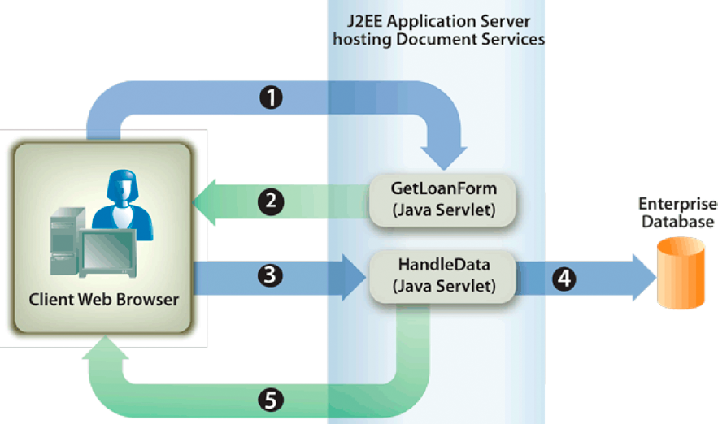

# インタラクティブPDF formsのレンダリング {#rendering-interactive-pdf-forms}

Formsサービスは、ユーザーから情報を収集するために、インタラクティブPDF formsをクライアントデバイス（通常は Web ブラウザー）にレンダリングします。 インタラクティブフォームがレンダリングされると、ユーザーはフォームフィールドにデータを入力し、フォーム上の送信ボタンをクリックして、情報をFormsサービスに送り返すことができます。 インタラクティブなPDFフォームを表示するには、クライアント Web ブラウザーをホストしているコンピューターにAdobe ReaderまたはAcrobatをインストールする必要があります。

>[!NOTE]
>
>Formsサービスを使用してフォームをレンダリングする前に、フォームデザインを作成します。 通常、フォームデザインは Designer で作成され、XDP ファイルとして保存されます。 フォームデザインの作成について詳しくは、 [Forms Designer](https://www.adobe.com/go/learn_aemforms_designer_63).

**サンプルのローン申し込み**

Formsサービスがインタラクティブフォームを使用してユーザーから情報を収集する方法を示す、サンプルのローン申し込みフォームが導入されています。 このアプリケーションを使用すると、ユーザーはローンのセキュリティ保護に必要なデータをフォームに入力し、データをFormsサービスに送信できます。 次の図に、ローン申し込みのロジックフローを示します。



次の表に、この図の手順を示します。

<table> 
 <thead> 
  <tr> 
   <th><p>手順</p></th> 
   <th><p>説明</p></th> 
  </tr> 
 </thead> 
 <tbody>
  <tr> 
   <td><p>1</p></td> 
   <td><p>この <code>GetLoanForm</code> Java サーブレットは、「HTML」ページから呼び出されます。 </p></td> 
  </tr> 
  <tr> 
   <td><p>2</p></td> 
   <td><p>この <code>GetLoanForm</code> Java サーブレットは、Forms service Client API を使用して、ローンフォームをクライアント Web ブラウザーにレンダリングします。 ( <a href="#render-an-interactive-pdf-form-using-the-java-api">Java API を使用したインタラクティブPDFフォームのレンダリング</a>.)</p></td> 
  </tr> 
  <tr> 
   <td><p>3</p></td> 
   <td><p>ユーザーがローンフォームに入力し、「送信」ボタンをクリックすると、データが <code>HandleData</code> Java サーブレット。 ( <i>"Loan form"</i>.)</p></td> 
  </tr> 
  <tr> 
   <td><p>4</p></td> 
   <td><p>この <code>HandleData</code> Java サーブレットは、Formsサービスクライアント API を使用して、フォーム送信を処理し、フォームデータを取得します。 その後、データはエンタープライズデータベースに保存されます。 ( <a href="/help/forms/developing/handling-submitted-forms.md#handling-submitted-forms">送信済みFormsの処理</a>.)</p></td> 
  </tr> 
  <tr> 
   <td><p>5</p></td> 
   <td><p>確認フォームが Web ブラウザーにレンダリングされます。 ユーザーの姓と名などのデータは、レンダリング前にフォームに結合されます。 ( <a href="/help/forms/developing/prepopulating-forms-flowable-layouts.md">編集可能なレイアウトを使用したFormsの事前入力</a>.)</p></td> 
  </tr> 
 </tbody> 
</table>

**ローンフォーム**

このインタラクティブなローンフォームは、サンプルのローン申し込みフォーム `GetLoanForm` Java サーブレット。


**確認フォーム**

このフォームは、サンプルのローン申し込みフォームの `HandleData` Java サーブレット。


この `HandleData` Java サーブレットは、このフォームにユーザーの姓と名および金額を事前入力します。 フォームが事前入力された後、クライアントの Web ブラウザーに送信されます。 ( [編集可能なレイアウトを使用したFormsの事前入力](/help/forms/developing/prepopulating-forms-flowable-layouts.md))

**Java サーブレット**

サンプルのローン申し込みフォームは、Java サーブレットとして存在するForms Service Application の一例です。 Java サーブレットは、WebSphere などの J2EE アプリケーションサーバー上で実行される Java プログラムで、Forms service Client API コードを含みます。

次のコードは、GetLoanForm という名前の Java サーブレットの構文を示しています。

```as3
     public class GetLoanForm extends HttpServlet implements Servlet { 
         public void doGet(HttpServletRequest req, HttpServletResponse resp 
         throws ServletException, IOException { 
          
         } 
         public void doPost(HttpServletRequest req, HttpServletResponse resp 
         throws ServletException, IOException { 
              
             }
```

通常、Formsサービスのクライアント API コードは Java サーブレットの `doGet` または `doPost` メソッド。 このコードを別のクラスに配置し、そのクラスを `doPost` メソッド ( または `doGet` メソッド ) を使用し、適切なメソッドを呼び出します。 ただし、コードを簡潔にするために、この節のコード例は最小限に抑えられ、コード例は `doPost` メソッド。

>[!NOTE]
>
>Formsサービスについて詳しくは、 [AEM Formsのサービスリファレンス](https://www.adobe.com/go/learn_aemforms_services_63).

**手順の概要**

インタラクティブPDFフォームをレンダリングするには、次のタスクを実行します。

1. プロジェクトファイルを含めます。
1. Forms Client API オブジェクトを作成します。
1. URI 値を指定します。
1. フォームにファイルを添付します（オプション）。
1. インタラクティブPDFフォームをレンダリング
1. フォームデータストリームをクライアントの Web ブラウザーに書き込みます。

**プロジェクトファイルを含める**

必要なファイルを開発プロジェクトに含めます。 Java を使用してクライアントアプリケーションを作成する場合は、必要な JAR ファイルを含めます。 Web サービスを使用している場合は、プロキシファイルを必ず含めてください。

**Forms Client API オブジェクトの作成**

Forms Service Client API 操作をプログラムで実行する前に、Forms Client API オブジェクトを作成する必要があります。 Java API を使用している場合は、 `FormsServiceClient` オブジェクト。 Forms Web サービス API を使用している場合は、 `FormsService` オブジェクト。

**URI 値の指定**

Formsサービスでフォームをレンダリングするために必要な URI 値を指定できます。 Formsアプリケーションの一部として保存されたフォームデザインは、コンテンツルート URI 値を使用して参照できます `repository:///`. 例えば、次のフォームデザインの名前が *Loan.xdp* という名前のFormsアプリケーション内にある *FormsApplication*:


このフォームデザインにアクセスするには、 `Applications/FormsApplication/1.0/FormsFolder/Loan.xdp` フォーム名 ( `renderPDFForm` メソッド ) および `repository:///` をコンテンツルート URI 値として設定します。

>[!NOTE]
>
>Workbench を使用したFormsアプリケーションの作成について詳しくは、 [Workbench ヘルプ](https://www.adobe.com/go/learn_aemforms_workbench_63).

Formsアプリケーション内のリソースへのパスは次のとおりです。

`Applications/Application-name/Application-version/Folder.../Filename`

次に、URI 値の例を示します。

* Applications/AppraisalReport/1.0/Forms/FullForm.xdp
* Applications/AnotherApp/1.1/Assets/picture.jpg
* Applications/SomeApp/2.0/Resources/Data/XSDs/MyData.xsd

インタラクティブフォームをレンダリングする際に、フォームデータの投稿先となるターゲット URL などの URI 値を定義できます。 ターゲット URL は、次のいずれかの方法で定義できます。

* Designer でフォームデザインをデザインする際の送信ボタン
* Formsサービスクライアント API を使用する

ターゲット URL がフォームデザイン内で定義されている場合は、Formsサービスクライアント API を使用して上書きしないでください。 つまり、Forms API を使用してターゲット URL を設定すると、フォームデザインで指定された URL が、API を使用して指定された URL にリセットされます。 フォームデザインで指定されたターゲット URL にPDFフォームを送信する場合は、プログラムによってターゲット URL を空の文字列に設定します。

送信ボタンと（サーバーで実行される対応するスクリプトを含む）計算ボタンを含むフォームがある場合、フォームが送信されるスクリプトの URL をプログラムで定義してスクリプトを実行できます。 フォームデザインの送信ボタンを使用して、フォームデータが投稿される URL を指定します。 ( [フォームデータの計算](/help/forms/developing/calculating-form-data.md).)

>[!NOTE]
>
>XDP ファイルを参照する URL 値を指定する代わりに、 `com.adobe.idp.Document` Formsサービスのインスタンス。 この `com.adobe.idp.Document` インスタンスにフォームデザインが含まれています。 ( [Forms Service にドキュメントを渡す](/help/forms/developing/passing-documents-forms-service.md).)

**フォームにファイルを添付する**

フォームにファイルを添付できます。 添付ファイルを含むPDFフォームをレンダリングすると、ユーザーは添付ファイルペインを使用してAcrobatで添付ファイルを取得できます。 フォームには、テキストファイルなどの様々なファイルタイプを添付したり、バイナリファイル (JPGファイルなど ) に添付したりできます。

>[!NOTE]
>
>添付ファイルをフォームに添付するオプションはオプションです。

**インタラクティブPDFフォームのレンダリング**

フォームをレンダリングするには、Designer で作成され、XDP またはPDFファイルとして保存されたフォームデザインを使用します。 また、Acrobatを使用して作成され、PDFファイルとして保存されたフォームをレンダリングすることもできます。 インタラクティブPDFフォームをレンダリングするには、 `FormsServiceClient` オブジェクトの `renderPDFForm` メソッドまたは `renderPDFForm2` メソッド。

この `renderPDFForm` は `URLSpec` オブジェクト。 XDP ファイルへのコンテンツルートは、 `URLSpec` オブジェクトの `setContentRootURI` メソッド。 フォームデザイン名 ( `formQuery`) は別のパラメーター値として渡されます。 2 つの値が連結され、フォームデザインへの絶対参照が取得されます。

この `renderPDFForm2` メソッドは `com.adobe.idp.Document` レンダリングする XDP またはPDFドキュメントを含むインスタンス。

>[!NOTE]
>
>入力ドキュメントがPDFドキュメントの場合、タグ付きPDFの実行時オプションは設定できません。 入力ファイルが XDP ファイルの場合は、タグ付きPDFオプションを設定できます。

## Java API を使用したインタラクティブPDFフォームのレンダリング {#render-an-interactive-pdf-form-using-the-java-api}

Forms API(Java) を使用してインタラクティブなPDFフォームをレンダリングします。

1. プロジェクトファイルを含める

   Java プロジェクトのクラスパスに、adobe-forms-client.jar などのクライアント JAR ファイルを含めます。

1. Forms Client API オブジェクトの作成

   * 接続プロパティを含む `ServiceClientFactory` オブジェクトを作成します。
   * の作成 `FormsServiceClient` オブジェクトのコンストラクタを使用し、 `ServiceClientFactory` オブジェクト。

1. URI 値の指定

   * の作成 `URLSpec` コンストラクターを使用して URI 値を格納するオブジェクト。
   * を呼び出す `URLSpec` オブジェクトの `setApplicationWebRoot` メソッドを使用して、アプリケーションの Web ルートを表す string 値を渡します。
   * を呼び出す `URLSpec` オブジェクトの `setContentRootURI` メソッドを使用して、コンテンツルート URI 値を指定する string 値を渡します。 フォームデザインがコンテンツルート URI に配置されていることを確認します。 そうでない場合、Formsサービスは例外をスローします。 リポジトリを参照するには、次を指定します。 `repository:///`.
   * を呼び出す `URLSpec` オブジェクトの `setTargetURL` メソッドを使用してターゲット URL 値を指定し、フォームデータの投稿先となる文字列値を渡します。 フォームデザインでターゲット URL を定義する場合、空の文字列を渡すことができます。 また、計算を実行するためのフォームの送信先の URL を指定することもできます。

1. フォームにファイルを添付する

   * の作成 `java.util.HashMap` オブジェクトのコンストラクタを使用してファイルの添付ファイルを格納します。
   * を呼び出す `java.util.HashMap` オブジェクトの `put` メソッドを使用して、レンダリングされたフォームに添付する各ファイルを指定します。 このメソッドに次の値を渡します。

      * 添付ファイルの名前（ファイル名の拡張子を含む）を指定する string 値。
   * A `com.adobe.idp.Document` 添付ファイルを含むオブジェクト。

   >[!NOTE]
   >
   >フォームに添付するファイルごとに、この手順を繰り返します。 この手順はオプションで、 `null`*添付ファイルを送信しない場合*

1. インタラクティブPDFフォームのレンダリング

   を呼び出す `FormsServiceClient` オブジェクトの `renderPDFForm` メソッドを使用して、次の値を渡します。

   * ファイル名拡張子を含むフォームデザイン名を指定する string 値。 Formsアプリケーションの一部であるフォームデザインを参照する場合は、必ず次のような完全なパスを指定してください。 `Applications/FormsApplication/1.0/FormsFolder/Loan.xdp`.
   * A `com.adobe.idp.Document` フォームに結合するデータを含むオブジェクト。 データを結合しない場合は、空の `com.adobe.idp.Document` オブジェクト。
   * A `PDFFormRenderSpec` 実行時オプションを保存するオブジェクト。 これはオプションのパラメーターで、 `null` 実行時のオプションを指定しない場合。
   * A `URLSpec` Formsサービスで必要な URI 値を格納するオブジェクト。
   * A `java.util.HashMap` 添付ファイルを保存するオブジェクト。 これはオプションのパラメーターで、 `null` フォームにファイルを添付しない場合。

   この `renderPDFForm` メソッドは、 `FormsResult` クライアントの Web ブラウザーに書き込む必要があるフォームデータストリームを含むオブジェクト。

1. フォームデータストリームをクライアント Web ブラウザーに書き込む

   * の作成 `com.adobe.idp.Document` を呼び出すことによってオブジェクトを取得 `FormsResult` オブジェクト `getOutputContent` メソッド。
   * のコンテンツタイプを取得する `com.adobe.idp.Document` オブジェクトを呼び出す `getContentType` メソッド。
   * を `javax.servlet.http.HttpServletResponse` を呼び出すことによるオブジェクトのコンテンツタイプ `setContentType` メソッドを使用して、 `com.adobe.idp.Document` オブジェクト。
   * の作成 `javax.servlet.ServletOutputStream` オブジェクトを使用します。オブジェクトは、 `javax.servlet.http.HttpServletResponse` オブジェクトの `getOutputStream` メソッド。
   * の作成 `java.io.InputStream` を呼び出すことによってオブジェクトを取得 `com.adobe.idp.Document` オブジェクトの `getInputStream` メソッド。
   * バイト配列を作成し、 `InputStream` オブジェクトの `read` メソッドを使用し、バイト配列を引数として渡す。
   * を呼び出す `javax.servlet.ServletOutputStream` オブジェクトの `write` メソッドを使用して、フォームデータストリームをクライアント Web ブラウザーに送信します。 バイト配列を `write` メソッド。

## Web サービス API を使用したインタラクティブPDFフォームのレンダリング {#render-an-interactive-pdf-form-using-the-web-service-api}

Forms API（Web サービス）を使用して、インタラクティブなPDFフォームをレンダリングします。

1. プロジェクトファイルを含める

   * Forms Service WSDL を使用する Java プロキシクラスを作成します。
   * Java プロキシクラスをクラスパスに含めます。

1. Forms Client API オブジェクトの作成

   の作成 `FormsService` オブジェクトを選択し、認証値を設定します。

1. URI 値の指定

   * の作成 `URLSpec` コンストラクターを使用して URI 値を格納するオブジェクト。
   * を呼び出す `URLSpec` オブジェクトの `setApplicationWebRoot` メソッドを使用して、アプリケーションの Web ルートを表す string 値を渡します。
   * を呼び出す `URLSpec` オブジェクトの `setContentRootURI` メソッドを使用して、コンテンツルート URI 値を指定する string 値を渡します。 フォームデザインがコンテンツルート URI に配置されていることを確認します。 そうでない場合、Formsサービスは例外をスローします。 リポジトリを参照するには、次を指定します。 `repository:///`.
   * を呼び出す `URLSpec` オブジェクトの `setTargetURL` メソッドを使用してターゲット URL 値を指定し、フォームデータの投稿先となる文字列値を渡します。 フォームデザインでターゲット URL を定義する場合、空の文字列を渡すことができます。 また、計算を実行するためのフォームの送信先の URL を指定することもできます。

1. フォームにファイルを添付する

   * の作成 `java.util.HashMap` オブジェクトのコンストラクタを使用してファイルの添付ファイルを格納します。
   * を呼び出す `java.util.HashMap` オブジェクトの `put` メソッドを使用して、レンダリングされたフォームに添付する各ファイルを指定します。 このメソッドに次の値を渡します。

      * 添付ファイルの名前（ファイル名の拡張子を含む）を指定する string 値
   * A `BLOB` 添付ファイルを含むオブジェクト

   >[!NOTE]
   >
   >フォームに添付するファイルごとに、この手順を繰り返します。

1. インタラクティブPDFフォームのレンダリング

   を呼び出す `FormsService` オブジェクトの `renderPDFForm` メソッドを使用して、次の値を渡します。

   * ファイル名拡張子を含むフォームデザイン名を指定する string 値。 Formsアプリケーションの一部であるフォームデザインを参照する場合は、必ず次のような完全なパスを指定してください。 `Applications/FormsApplication/1.0/FormsFolder/Loan.xdp`.
   * A `BLOB` フォームに結合するデータを含むオブジェクト。 データを結合しない場合は、 `null`.
   * A `PDFFormRenderSpec` 実行時オプションを保存するオブジェクト。 これはオプションのパラメーターで、 `null` 実行時のオプションを指定しない場合。
   * A `URLSpec` Formsサービスで必要な URI 値を格納するオブジェクト。
   * A `java.util.HashMap` 添付ファイルを保存するオブジェクト。 これはオプションのパラメーターで、 `null` フォームにファイルを添付しない場合。
   * 空 `com.adobe.idp.services.holders.BLOBHolder` メソッドによって設定されるオブジェクト。 これは、レンダリングされたPDFフォームを保存するために使用されます。
   * 空 `javax.xml.rpc.holders.LongHolder` メソッドによって設定されるオブジェクト。 （この引数は、フォームのページ数を保存します。）
   * 空 `javax.xml.rpc.holders.StringHolder` メソッドによって設定されるオブジェクト。 （この引数はロケール値を格納します。）
   * 空 `com.adobe.idp.services.holders.FormsResultHolder` この操作の結果を格納するオブジェクト。

   この `renderPDFForm` メソッドによって `com.adobe.idp.services.holders.FormsResultHolder` オブジェクト。クライアント Web ブラウザーに書き込む必要があるフォームデータストリームを含む最後の引数値として渡されます。

1. フォームデータストリームをクライアント Web ブラウザーに書き込む

   * の作成 `FormResult` オブジェクトを作成するには、 `com.adobe.idp.services.holders.FormsResultHolder` オブジェクトの `value` データメンバー。
   * の作成 `BLOB` を呼び出してフォームデータを含むオブジェクト `FormsResult` オブジェクトの `getOutputContent` メソッド。
   * のコンテンツタイプを取得する `BLOB` オブジェクトを呼び出す `getContentType` メソッド。
   * を `javax.servlet.http.HttpServletResponse` を呼び出すことによるオブジェクトのコンテンツタイプ `setContentType` メソッドを使用して、 `BLOB` オブジェクト。
   * の作成 `javax.servlet.ServletOutputStream` オブジェクトを使用します。オブジェクトは、 `javax.servlet.http.HttpServletResponse` オブジェクトの `getOutputStream` メソッド。
   * バイト配列を作成し、 `BLOB` オブジェクトの `getBinaryData` メソッド。 このタスクは、 `FormsResult` オブジェクトをバイト配列に変換します。
   * を呼び出す `javax.servlet.http.HttpServletResponse` オブジェクトの `write` メソッドを使用して、フォームデータストリームをクライアント Web ブラウザーに送信します。 バイト配列を `write` メソッド。

**フォームデータストリームをクライアント Web ブラウザーに書き込む**

Formsサービスがフォームをレンダリングすると、クライアントの Web ブラウザーに書き込む必要があるフォームデータストリームが返されます。 クライアント Web ブラウザーに書き込まれると、フォームはユーザーに対して表示されます。
