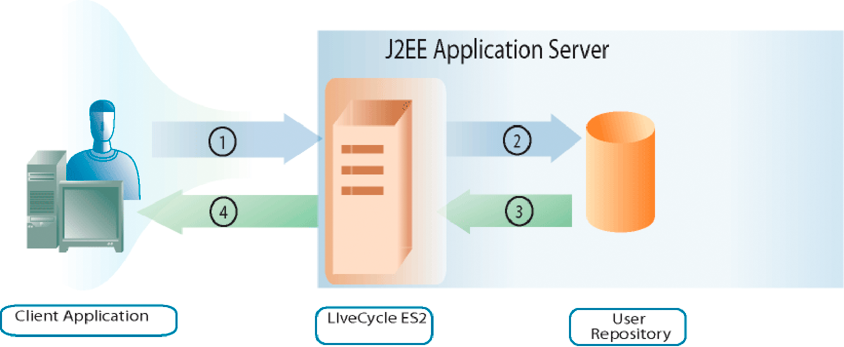

# ユーザーの管理 {#managing-users}

**User Management について**

ユーザー管理 API を使用して、役割、権限、プリンシパル（ユーザーまたはグループ）を管理し、ユーザーを認証できるクライアントアプリケーションを作成できます。 User Management API は、次のAEM Forms API で構成されています。

* ディレクトリマネージャーサービス API
* Authentication Manager サービス API
* 認証マネージャーサービス API

User Management では、役割および権限の割り当て、削除、決定が可能です。 また、ドメイン、ユーザー、グループの割り当て、削除、問い合わせも可能です。 最後に、ユーザー管理を使用してユーザーを認証できます。

In [ユーザーの追加](users.md#adding-users) プログラムによってユーザーを追加する方法を理解できます。 この節では、Directory Manager Service API を使用します。

In [ユーザーの削除](users.md#deleting-users) ユーザーをプログラムで削除する方法を理解できます。 この節では、Directory Manager Service API を使用します。

In [ユーザーとグループの管理](users.md#managing-users-and-groups) ローカルユーザーとディレクトリユーザーの違いを理解し、Java および web サービス API を使用してユーザーとグループをプログラムで管理する方法の例を確認できます。 この節では、Directory Manager Service API を使用します。

In [ロールと権限の管理](users.md#managing-roles-and-permissions) システムの役割と権限、およびそれらを拡張するためにプログラムで実行できる操作について学び、Java および web サービス API を使用して役割と権限をプログラムで管理する方法の例を確認します。 このセクションでは、Directory Manager Service API と Authorization Manager Service API の両方を使用します。

In [ユーザーの認証](users.md#authenticating-users) Java および web サービス API を使用してプログラムによってユーザーを認証する方法の例が表示されます。 この節では、Authorization Manager Service API を使用します。

**認証プロセスについて**

User Management には、組み込みの認証機能が用意されており、独自の認証プロバイダーと接続する機能も備えています。 User Management は、認証要求を受け取ると（ユーザーがログインを試みるなど）、認証プロバイダーにユーザー情報を渡して認証を行います。 User Management は、ユーザーの認証後に認証プロバイダーから結果を受け取ります。

次の図は、ログインを試みるエンドユーザー、User Management、および認証プロバイダー間のやり取りを示しています。

次の表に、認証プロセスの各手順を示します。

<table> 
 <thead> 
  <tr> 
   <th>
手順
</th> 
   <th>
説明
</th> 
  </tr> 
 </thead> 
 <tbody>
  <tr> 
   <td>
1
</td> 
   <td>
ユーザーが User Management を呼び出すサービスにログインしようとします。 ユーザはユーザ名とパスワードを指定する。 
</td> 
  </tr> 
  <tr> 
   <td>
2
</td> 
   <td>
User Management は、ユーザー名とパスワード、および設定情報を認証プロバイダーに送信します。
</td> 
  </tr> 
  <tr> 
   <td>
3
</td> 
   <td>
認証プロバイダは、ユーザストアに接続し、ユーザを認証します。
</td> 
  </tr> 
  <tr> 
   <td>
4
</td> 
   <td>
認証プロバイダーが結果を User Management に返します。
</td> 
  </tr> 
  <tr> 
   <td>
5
</td> 
   <td>
User Management は、ユーザーが製品にログインしたり、製品へのアクセスを拒否したりできます。
</td> 
  </tr> 
 </tbody> 
</table>

>[!NOTE]
>
>サーバーのタイムゾーンがクライアントのタイムゾーンと異なる場合、WebSphere Application Server クラスター上の.NET クライアントを使用してネイティブの SOAP スタック上でAEM Forms GeneratePDFサービスの WSDL を使用すると、次の User Management 認証エラーが発生する場合があります。

`[com.adobe.idp.um.webservices.WSSecurityHandler] errorCode:12803 errorCodeHEX:0x3203 message:WSSecurityHandler: UM authenticate returns exception : An error was discovered processing the <wsse:Security> header. (WSSecurityEngine: Invalid timestamp The security semantics of message have expired).`

**ディレクトリ管理について**

User Management は、LDAP ディレクトリへの接続をサポートするディレクトリサービスプロバイダ (DirectoryManagerService) でパッケージ化されます。 組織で LDAP 以外のリポジトリを使用してユーザーレコードを保存する場合、リポジトリで使用する独自のディレクトリサービスプロバイダーを作成できます。

ディレクトリサービスプロバイダーは、User Management のリクエスト時にユーザーストアからレコードを取得します。 User Management は、パフォーマンスを向上させるために、ユーザーおよびグループのレコードをデータベースに定期的にキャッシュします。

ディレクトリサービスプロバイダーを使用して、User Management データベースとユーザーストアを同期できます。 この手順では、すべてのユーザーディレクトリ情報と、すべてのユーザーレコードとグループレコードが最新の状態に保たれます。

また、DirectoryManagerService では、ドメインを作成および管理する機能を提供します。 ドメインは、異なるユーザーベースを定義します。 ドメインの境界は、通常、組織の構造やユーザーストアの設定方法に従って定義されます。 User Management ドメインは、認証プロバイダーおよびディレクトリサービスプロバイダーが使用する設定を提供します。

User Management が書き出す設定 XML で、属性値がのルートノード `Domains` には、User Management 用に定義された各ドメインの XML 要素が含まれます。 これらの各要素には、特定のサービスプロバイダーに関連付けられたドメインの側面を定義する他の要素が含まれます。

**objectSID の値について**

Active Directory を使用する場合、 `objectSID` の値は、複数のドメインで一意の属性ではありません。 この値は、オブジェクトのセキュリティ識別子を格納します。 複数ドメイン環境（ドメインのツリーなど）では、 `objectSID` の値は異なる場合があります。

An `objectSID` 値は、ある Active Directory ドメインから別のドメインにオブジェクトが移動された場合に変更されます。 同じオブジェクトが存在する `objectSID` の値は、ドメイン内の任意の場所に配置します。 例えば、BUILTIN\Administrators、BUILTIN\Power Users などのグループも同じようになります `objectSID` の値を指定できません。 これら `objectSID` の値はよく知られています。

## ユーザーの追加 {#adding-users}

Directory Manager Service API（Java および Web サービス）を使用すると、ユーザーをプログラムでAEM Formsに追加できます。 ユーザーを追加した後、ユーザーを必要とするサービス操作を実行する際に、そのユーザーを使用できます。 例えば、新しいユーザーにタスクを割り当てることができます。

### 手順の概要 {#summary-of-steps}

ユーザーを追加するには、次の手順を実行します。

1. プロジェクトファイルを含めます。
1. DirectoryManagerService クライアントを作成します。
1. ユーザー情報を定義します。
1. ユーザーをAEM Formsに追加します。
1. ユーザーが追加されていることを確認します。

**プロジェクトファイルを含める**

開発プロジェクトに必要なファイルを含めます。 Java を使用してクライアントアプリケーションを作成する場合は、必要な JAR ファイルを含めます。 Web サービスを使用している場合は、プロキシファイルを含めます。

**DirectoryManagerService クライアントの作成**

Directory Manager サービスの操作をプログラムで実行する前に、Directory Manager Service API クライアントを作成します。

**ユーザー情報の定義**

Directory Manager Service API を使用して新しいユーザーを追加する場合は、そのユーザーの情報を定義します。 通常、新しいユーザーを追加する場合、次の値を定義します。

* **ドメイン名**:ユーザーが属するドメイン（例： ） `DefaultDom`) をクリックします。
* **ユーザー識別子の値**:ユーザーの識別子の値 ( 例： `wblue`) をクリックします。
* **プリンシパルタイプ**:ユーザーのタイプ ( 例えば、 `USER)`.
* **名**:ユーザーの特定の名前 ( 例： `Wendy`) をクリックします。
* **姓**:ユーザーの姓（例： ） `Blue)`.
* **ロケール**:ユーザーのロケール情報。

**AEM Formsへのユーザーの追加**

ユーザー情報を定義した後、そのユーザーをAEM Formsに追加できます。 ユーザーを追加するには、 `DirectoryManagerServiceClient` オブジェクトの `createLocalUser` メソッド。

**ユーザーが追加されたことを確認します。**

ユーザーが追加されたことを確認して、問題が発生しなかったことを確認できます。 ユーザー識別子の値を使用して、新しいユーザーを見つけます。

**関連トピック**

[Java API を使用したユーザーの追加](users.md#add-users-using-the-java-api)

[Web サービス API を使用してユーザーを追加する](users.md#add-users-using-the-web-service-api)

[AEM Forms Java ライブラリファイルを含める](/help/forms/developing/invoking-aem-forms-using-java.md#including-aem-forms-java-library-files)

[接続プロパティの設定](/help/forms/developing/invoking-aem-forms-using-java.md#setting-connection-properties)

[ユーザーの削除](users.md#deleting-users)

### Java API を使用したユーザーの追加 {#add-users-using-the-java-api}

Directory Manager Service API(Java) を使用してユーザーを追加します。

1. プロジェクトファイルを含めます。

   Java プロジェクトのクラスパスに、adobe-usermanager-client.jar などのクライアント JAR ファイルを含めます。

1. DirectoryManagerServices クライアントを作成します。

   の作成 `DirectoryManagerServiceClient` オブジェクトのコンストラクタを使用し、 `ServiceClientFactory` 接続プロパティを含むオブジェクト。

1. ユーザー情報を定義します。

   * コンストラクタを使用して `UserImpl` オブジェクトを作成します。
   * を呼び出して、データメイン名を設定します。 `UserImpl` オブジェクトの `setDomainName` メソッド。 ドメイン名を指定する string 値を渡します。
   * を呼び出して、プリンシパルタイプを設定します。 `UserImpl` オブジェクトの `setPrincipalType` メソッド。 ユーザーのタイプを指定する string 値を渡します。 例えば、次の項目を指定できます。 `USER`.
   * を呼び出して、ユーザー識別子の値を設定します。 `UserImpl` オブジェクトの `setUserid` メソッド。 ユーザー識別子の値を指定する string 値を渡します。 例えば、次の項目を指定できます。 `wblue`.
   * を呼び出して、正規名を設定します。 `UserImpl` オブジェクトの `setCanonicalName` メソッド。 ユーザーの正規名を指定する string 値を渡します。 例えば、次の項目を指定できます。 `wblue`.
   * を呼び出して、指定された名前を設定します。 `UserImpl` オブジェクトの `setGivenName` メソッド。 ユーザーの名前を指定する string 値を渡します。 例えば、次の項目を指定できます。 `Wendy`.
   * を呼び出して、ファミリ名を設定します。 `UserImpl` オブジェクトの `setFamilyName` メソッド。 ユーザーの姓を指定する string 値を渡します。 例えば、次の項目を指定できます。 `Blue`.

   >[!NOTE]
   >
   >に属するメソッドを呼び出す `UserImpl` オブジェクトを使用して他の値を設定します。 例えば、 `UserImpl` オブジェクトの `setLocale` メソッド。

1. ユーザーをAEM Formsに追加します。

   を呼び出す `DirectoryManagerServiceClient` オブジェクトの `createLocalUser` メソッドを使用して、次の値を渡します。

   * この `UserImpl` 新しいユーザーを表すオブジェクト
   * ユーザーのパスワードを表す string 値です

   この `createLocalUser` メソッドは、ローカルユーザー識別子の値を指定する string 値を返します。

1. ユーザーが追加されたことを確認します。

   * コンストラクタを使用して `PrincipalSearchFilter` オブジェクトを作成します。
   * を呼び出して、ユーザー識別子の値を設定します。 `PrincipalSearchFilter` オブジェクトの `setUserId` メソッド。 ユーザー識別子の値を表す string 値を渡します。
   * を呼び出す `DirectoryManagerServiceClient` オブジェクトの `findPrincipals` メソッドを使用して、 `PrincipalSearchFilter` オブジェクト。 このメソッドは、 `java.util.List` インスタンス ( 各要素は `User` オブジェクト。 反復処理 `java.util.List` インスタンスを使用して、ユーザーを特定します。

**関連トピック**

[手順の概要](users.md#summary-of-steps)

[クイックスタート（SOAP モード）:Java API を使用したユーザーの追加](/help/forms/developing/user-manager-java-api-quick.md#quick-start-soap-mode-adding-users-using-the-java-api)

[AEM Forms Java ライブラリファイルを含める](/help/forms/developing/invoking-aem-forms-using-java.md#including-aem-forms-java-library-files)

[接続プロパティの設定](/help/forms/developing/invoking-aem-forms-using-java.md#setting-connection-properties)

### Web サービス API を使用してユーザーを追加する {#add-users-using-the-web-service-api}

Directory Manager Service API（Web サービス）を使用してユーザーを追加します。

1. プロジェクトファイルを含めます。

   MTOM を使用するMicrosoft .NET プロジェクトを作成します。 サービス参照に次の WSDL 定義を使用していることを確認してください。 `http://localhost:8080/soap/services/DirectoryManagerService?WSDL&lc_version=9.0.1`.

   >[!NOTE]
   >
   >置換 `localhost` を、AEM Formsをホストするサーバーの IP アドレスに設定します。

1. DirectoryManagerService クライアントを作成します。

   * の作成 `DirectoryManagerServiceClient` オブジェクトのデフォルトのコンストラクタを使用します。
   * の作成 `DirectoryManagerServiceClient.Endpoint.Address` オブジェクトを `System.ServiceModel.EndpointAddress` コンストラクタ。 WSDL をAEM Formsサービスに渡す文字列値 ( 例： `http://localhost:8080/soap/services/DirectoryManagerService?blob=mtom`) をクリックします。 を使用する必要はありません。 `lc_version` 属性。 この属性は、サービス参照を作成する際に使用されます。 次の項目を指定してください。 `?blob=mtom`.
   * の作成 `System.ServiceModel.BasicHttpBinding` オブジェクトを作成するには、 `DirectoryManagerServiceClient.Endpoint.Binding` フィールドに入力します。 戻り値を `BasicHttpBinding` にキャストします。
   * を `System.ServiceModel.BasicHttpBinding` オブジェクトの `MessageEncoding` ～に向かって `WSMessageEncoding.Mtom`. この値は、MTOM が確実に使用されるようにします。
   * 次のタスクを実行して、基本的な HTTP 認証を有効にします。

      * フィールドにAEM forms ユーザー名を割り当てます。 `DirectoryManagerServiceClient.ClientCredentials.UserName.UserName`.
      * 対応するパスワード値をフィールドに割り当てます。 `DirectoryManagerServiceClient.ClientCredentials.UserName.Password`.
      * 定数値を割り当て `HttpClientCredentialType.Basic` フィールドに `BasicHttpBindingSecurity.Transport.ClientCredentialType`.
      * 定数値を割り当て `BasicHttpSecurityMode.TransportCredentialOnly` フィールドに `BasicHttpBindingSecurity.Security.Mode`.

1. ユーザー情報を定義します。

   * コンストラクタを使用して `UserImpl` オブジェクトを作成します。
   * デフォルト名を設定するには、 `UserImpl` オブジェクトの `domainName` フィールドに入力します。
   * プリンシパルタイプを設定するには、 `UserImpl` オブジェクトの `principalType` フィールドに入力します。 例えば、次の項目を指定できます。 `USER`.
   * ユーザー識別子の値を設定するには、 `UserImpl` オブジェクトの `userid` フィールドに入力します。
   * 正規名の値を `UserImpl` オブジェクトの `canonicalName` フィールドに入力します。
   * 指定された名前の値を `UserImpl` オブジェクトの `givenName` フィールドに入力します。
   * ファミリ名の値を設定するには、 `UserImpl` オブジェクトの `familyName` フィールドに入力します。

1. ユーザーをAEM Formsに追加します。

   を呼び出す `DirectoryManagerServiceClient` オブジェクトの `createLocalUser` メソッドを使用して、次の値を渡します。

   * この `UserImpl` 新しいユーザーを表すオブジェクト
   * ユーザーのパスワードを表す string 値です

   この `createLocalUser` メソッドは、ローカルユーザー識別子の値を指定する string 値を返します。

1. ユーザーが追加されたことを確認します。

   * コンストラクタを使用して `PrincipalSearchFilter` オブジェクトを作成します。
   * ユーザー識別子の値を表す string 値を `PrincipalSearchFilter` オブジェクトの `userId` フィールドに入力します。
   * を呼び出す `DirectoryManagerServiceClient` オブジェクトの `findPrincipals` メソッドを使用して、 `PrincipalSearchFilter` オブジェクト。 このメソッドは、 `MyArrayOfUser` コレクションオブジェクト。各要素は `User` オブジェクト。 反復処理 `MyArrayOfUser` コレクションを使用して、ユーザーを特定します。

**関連トピック**

[手順の概要](users.md#summary-of-steps)

[MTOM を使用したAEM Formsの呼び出し](/help/forms/developing/invoking-aem-forms-using-web.md#invoking-aem-forms-using-mtom)

[SwaRef を使用したAEM Formsの呼び出し](/help/forms/developing/invoking-aem-forms-using-web.md#invoking-aem-forms-using-swaref)

## ユーザーの削除 {#deleting-users}

Directory Manager Service API（Java および Web サービス）を使用して、AEM Formsからユーザーをプログラムで削除できます。 ユーザーを削除すると、そのユーザーは、ユーザーを必要とするサービス操作を実行できなくなります。 例えば、削除されたユーザーにタスクを割り当てることはできません。

### 手順の概要 {#summary_of_steps-1}

ユーザーを削除するには、次の手順に従います。

1. プロジェクトファイルを含めます。
1. DirectoryManagerService クライアントを作成します。
1. 削除するユーザーを指定します。
1. AEM Formsからユーザーを削除します。

**プロジェクトファイルを含める**

開発プロジェクトに必要なファイルを含めます。 Java を使用してクライアントアプリケーションを作成する場合は、必要な JAR ファイルを含めます。 Web サービスを使用している場合は、プロキシファイルを含めます。

**DirectoryManagerService クライアントの作成**

Directory Manager Service API 操作をプログラムで実行する前に、Directory Manager サービスクライアントを作成します。

**削除するユーザーを指定**

ユーザーの識別子の値を使用して、削除するユーザーを指定できます。

**AEM Formsからのユーザーの削除**

ユーザーを削除するには、 `DirectoryManagerServiceClient` オブジェクトの `deleteLocalUser` メソッド。

**関連トピック**

[Java API を使用したユーザーの削除](users.md#delete-users-using-the-java-api)

[Web サービス API を使用したユーザーの削除](users.md#delete-users-using-the-web-service-api)

[AEM Forms Java ライブラリファイルを含める](/help/forms/developing/invoking-aem-forms-using-java.md#including-aem-forms-java-library-files)

[接続プロパティの設定](/help/forms/developing/invoking-aem-forms-using-java.md#setting-connection-properties)

[ユーザーの追加](users.md#adding-users)

### Java API を使用したユーザーの削除 {#delete-users-using-the-java-api}

Directory Manager Service API(Java) を使用してユーザーを削除します。

1. プロジェクトファイルを含めます。

   Java プロジェクトのクラスパスに、adobe-usermanager-client.jar などのクライアント JAR ファイルを含めます。

1. DirectoryManagerService クライアントを作成します。

   の作成 `DirectoryManagerServiceClient` オブジェクトのコンストラクタを使用し、 `ServiceClientFactory` 接続プロパティを含むオブジェクト。

1. 削除するユーザーを指定します。

   * コンストラクタを使用して `PrincipalSearchFilter` オブジェクトを作成します。
   * を呼び出して、ユーザー識別子の値を設定します。 `PrincipalSearchFilter` オブジェクトの `setUserId` メソッド。 ユーザー識別子の値を表す string 値を渡します。
   * を呼び出す `DirectoryManagerServiceClient` オブジェクトの `findPrincipals` メソッドを使用して、 `PrincipalSearchFilter` オブジェクト。 このメソッドは、 `java.util.List` インスタンス ( 各要素は `User` オブジェクト。 反復処理 `java.util.List` インスタンスを使用して、削除するユーザーを特定します。

1. AEM Formsからユーザーを削除します。

   を呼び出す `DirectoryManagerServiceClient` オブジェクトの `deleteLocalUser` メソッドを使用して、 `User` オブジェクトの `oid` フィールドに入力します。 を呼び出す `User` オブジェクトの `getOid` メソッド。 以下を使用： `User` から取得したオブジェクト `java.util.List` インスタンス。

**関連トピック**

[手順の概要](users.md#summary-of-steps)

[クイックスタート（EJB モード）:Java API を使用したユーザーの削除](/help/forms/developing/user-manager-java-api-quick.md#quick-start-soap-mode-deleting-users-using-the-java-api)

[クイックスタート（SOAP モード）:Java API を使用したユーザーの削除](/help/forms/developing/user-manager-java-api-quick.md#quick-start-soap-mode-deleting-users-using-the-java-api)

[AEM Forms Java ライブラリファイルを含める](/help/forms/developing/invoking-aem-forms-using-java.md#including-aem-forms-java-library-files)

[接続プロパティの設定](/help/forms/developing/invoking-aem-forms-using-java.md#setting-connection-properties)

### Web サービス API を使用したユーザーの削除 {#delete-users-using-the-web-service-api}

Directory Manager Service API（Web サービス）を使用してユーザーを削除します。

1. プロジェクトファイルを含めます。

   Java プロジェクトのクラスパスに、adobe-usermanager-client.jar などのクライアント JAR ファイルを含めます。

1. DirectoryManagerService クライアントを作成します。

   * の作成 `DirectoryManagerServiceClient` オブジェクトのデフォルトのコンストラクタを使用します。
   * の作成 `DirectoryManagerServiceClient.Endpoint.Address` オブジェクトを `System.ServiceModel.EndpointAddress` コンストラクタ。 WSDL をAEM Formsサービスに渡す文字列値 ( 例： `http://localhost:8080/soap/services/DirectoryManagerService?blob=mtom`) をクリックします。 を使用する必要はありません。 `lc_version` 属性。 この属性は、サービス参照を作成する際に使用されます。 次の項目を指定してください。 `blob=mtom.`
   * の作成 `System.ServiceModel.BasicHttpBinding` オブジェクトを作成するには、 `DirectoryManagerServiceClient.Endpoint.Binding` フィールドに入力します。 戻り値を `BasicHttpBinding` にキャストします。
   * を `System.ServiceModel.BasicHttpBinding` オブジェクトの `MessageEncoding` ～に向かって `WSMessageEncoding.Mtom`. この値は、MTOM が確実に使用されるようにします。
   * 次のタスクを実行して、基本的な HTTP 認証を有効にします。

      * フィールドにAEM forms ユーザー名を割り当てます。 `DirectoryManagerServiceClient.ClientCredentials.UserName.UserName`.
      * 対応するパスワード値をフィールドに割り当てます。 `DirectoryManagerServiceClient.ClientCredentials.UserName.Password`.
      * 定数値を割り当て `HttpClientCredentialType.Basic` フィールドに `BasicHttpBindingSecurity.Transport.ClientCredentialType`.
      * 定数値を割り当て `BasicHttpSecurityMode.TransportCredentialOnly` フィールドに `BasicHttpBindingSecurity.Security.Mode`.

1. 削除するユーザーを指定します。

   * コンストラクタを使用して `PrincipalSearchFilter` オブジェクトを作成します。
   * ユーザー識別子の値を設定するには、 `PrincipalSearchFilter` オブジェクトの `userId` フィールドに入力します。
   * を呼び出す `DirectoryManagerServiceClient` オブジェクトの `findPrincipals` メソッドを使用して、 `PrincipalSearchFilter` オブジェクト。 このメソッドは、 `MyArrayOfUser` コレクションオブジェクト。各要素は `User` オブジェクト。 反復処理 `MyArrayOfUser` コレクションを使用して、ユーザーを特定します。 この `User` から取得したオブジェクト `MyArrayOfUser` コレクションオブジェクトは、ユーザーを削除するために使用されます。

1. AEM Formsからユーザーを削除します。

   ユーザーを削除するには、 `User` オブジェクトの `oid` フィールド値を `DirectoryManagerServiceClient` オブジェクトの `deleteLocalUser` メソッド。

**関連トピック**

[手順の概要](users.md#summary-of-steps)

[MTOM を使用したAEM Formsの呼び出し](/help/forms/developing/invoking-aem-forms-using-web.md#invoking-aem-forms-using-mtom)

[SwaRef を使用したAEM Formsの呼び出し](/help/forms/developing/invoking-aem-forms-using-web.md#invoking-aem-forms-using-swaref)

## グループの作成 {#creating-groups}

Directory Manager Service API（Java および Web サービス）を使用して、プログラムによってAEM Formsグループを作成できます。 グループを作成した後、そのグループを使用して、グループを必要とするサービス操作を実行できます。 例えば、ユーザーを新しいグループに割り当てることができます。 ( [ユーザーとグループの管理](users.md#managing-users-and-groups).)

### 手順の概要 {#summary_of_steps-2}

グループを作成するには、次の手順を実行します。

1. プロジェクトファイルを含めます。
1. DirectoryManagerService クライアントを作成します。
1. グループが存在しないことを確認します。
1. グループを作成します。
1. グループでアクションを実行します。

**プロジェクトファイルを含める**

開発プロジェクトに必要なファイルを含めます。 Java を使用してクライアントアプリケーションを作成する場合は、必要な JAR ファイルを含めます。

次の JAR ファイルをプロジェクトのクラスパスに追加する必要があります。

* adobe-livecycle-client.jar
* adobe-usermanager-client.jar
* adobe-utilities.jar(AEM Formsを JBoss にデプロイする場合に必須 )
* jbossall-client.jar(AEM Formsが JBoss にデプロイされている場合に必須 )

これらの JAR ファイルの場所について詳しくは、 [AEM Forms Java ライブラリファイルを含める](/help/forms/developing/invoking-aem-forms-using-java.md#including-aem-forms-java-library-files).

**DirectoryManagerService クライアントの作成**

Directory Manager サービスの操作をプログラムで実行する前に、Directory Manager Service API クライアントを作成します。

**グループが存在するかどうかを判断する**

グループを作成する場合は、そのグループが同じドメインに存在しないことを確認します。 つまり、2 つのグループが同じドメイン内で同じ名前を持つことはできません。 このタスクを実行するには、検索を実行し、2 つの値に基づいて検索結果をフィルタリングします。 プリンシパルタイプをに設定します。 `com.adobe.idp.um.api.infomodel.Principal.PRINCIPALTYPE_GROUP` を設定して、グループのみが返されるようにします。 また、ドメイン名を必ず指定してください。

**グループの作成**

ドメインにグループが存在しないと判断したら、グループを作成し、次の属性を指定します。

* **CommonName**:グループの名前。
* **ドメイン**:グループを追加するドメイン。
* **説明**:グループの説明。

**グループでのアクションの実行**

グループを作成した後、そのグループを使用してアクションを実行できます。 例えば、ユーザーをグループに追加できます。 ユーザーをグループに追加するには、ユーザーとグループの両方で一意の ID 値を取得します。 これらの値を `addPrincipalToLocalGroup` メソッド。

**関連トピック**

[Java API を使用したグループの作成](users.md#create-groups-using-the-java-api)

[AEM Forms Java ライブラリファイルを含める](/help/forms/developing/invoking-aem-forms-using-java.md#including-aem-forms-java-library-files)

[接続プロパティの設定](/help/forms/developing/invoking-aem-forms-using-java.md#setting-connection-properties)

[ユーザーの追加](users.md#adding-users)

[ユーザーの削除](users.md#deleting-users)

### Java API を使用したグループの作成 {#create-groups-using-the-java-api}

Directory Manager Service API(Java) を使用してグループを作成します。

1. プロジェクトファイルを含めます。

   Java プロジェクトのクラスパスに、adobe-usermanager-client.jar などのクライアント JAR ファイルを含めます。

1. DirectoryManagerService クライアントを作成します。

   の作成 `DirectoryManagerServiceClient` オブジェクトのコンストラクタを使用し、 `ServiceClientFactory` 接続プロパティを含むオブジェクト。

1. グループが存在するかどうかを確認します。

   * コンストラクタを使用して `PrincipalSearchFilter` オブジェクトを作成します。
   * を呼び出して、プリンシパルタイプを設定します。 `PrincipalSearchFilter` オブジェクトの `setPrincipalType` オブジェクト。 値を渡す `com.adobe.idp.um.api.infomodel.Principal.PRINCIPALTYPE_GROUP`.
   * を呼び出してドメインを設定する `PrincipalSearchFilter` オブジェクトの `setSpecificDomainName` オブジェクト。 ドメイン名を指定する string 値を渡します。
   * グループを検索するには、 `DirectoryManagerServiceClient` オブジェクトの `findPrincipals` メソッド（プリンシパルはグループにすることができます）。 パス `PrincipalSearchFilter` プリンシパルタイプとドメイン名を指定するオブジェクト。 このメソッドは、 `java.util.List` 各要素が以下の場合に適用されるインスタンス `Group` インスタンス。 各グループインスタンスは、 `PrincipalSearchFilter` オブジェクト。
   * 反復処理 `java.util.List` インスタンス。 各要素について、グループ名を取得します。 グループ名が新しいグループ名と等しくないことを確認します。

1. グループを作成します。

   * グループが存在しない場合は、 `Group` オブジェクトの `setCommonName` メソッドを使用し、グループ名を指定する string 値を渡します。
   * を呼び出す `Group` オブジェクトの `setDescription` メソッドを使用し、グループの説明を指定する string 値を渡します。
   * を呼び出す `Group` オブジェクトの `setDomainName` メソッドを使用して、ドメイン名を指定する string 値を渡します。
   * を呼び出す `DirectoryManagerServiceClient` オブジェクトの `createLocalGroup` メソッドを使用して、 `Group` インスタンス。

   この `createLocalUser` メソッドは、ローカルユーザー識別子の値を指定する string 値を返します。

1. グループでアクションを実行します。

   * コンストラクタを使用して `PrincipalSearchFilter` オブジェクトを作成します。
   * を呼び出して、ユーザー識別子の値を設定します。 `PrincipalSearchFilter` オブジェクトの `setUserId` メソッド。 ユーザー識別子の値を表す string 値を渡します。
   * を呼び出す `DirectoryManagerServiceClient` オブジェクトの `findPrincipals` メソッドを使用して、 `PrincipalSearchFilter` オブジェクト。 このメソッドは、 `java.util.List` インスタンス ( 各要素は `User` オブジェクト。 反復処理 `java.util.List` インスタンスを使用して、ユーザーを特定します。
   * を呼び出して、グループにユーザーを追加する `DirectoryManagerServiceClient` オブジェクトの `addPrincipalToLocalGroup` メソッド。 の戻り値を渡す `User` オブジェクトの `getOid` メソッド。 の戻り値を渡す `Group` オブジェクトの `getOid` メソッド ( `Group` 新しいグループを表すインスタンス )。

**関連トピック**

[手順の概要](users.md#summary-of-steps)

[AEM Forms Java ライブラリファイルを含める](/help/forms/developing/invoking-aem-forms-using-java.md#including-aem-forms-java-library-files)

[接続プロパティの設定](/help/forms/developing/invoking-aem-forms-using-java.md#setting-connection-properties)

## ユーザーとグループの管理 {#managing-users-and-groups}

このトピックでは、 (Java) を使用して、ドメイン、ユーザー、グループをプログラムで割り当て、削除、およびクエリする方法について説明します。

>[!NOTE]
>
>ドメインを設定する際は、グループとユーザーに一意の識別子を設定する必要があります。 選択する属性は、LDAP 環境内で一意である必要があるだけでなく、不変である必要があり、ディレクトリ内では変更されません。 この属性は、単純な文字列データ型である必要があります ( 現在、Active Directory 2000/2003で許可されている唯一の例外は、 `"objectsid"`（バイナリ値） Novell eDirectory 属性 `"GUID"`例えば、は単純な文字列データ型ではないので、機能しません。

* Active Directory の場合は、 `"objectsid"`.
* SunOne の場合は、 `"nsuniqueid"`.

>[!NOTE]
>
>LDAP ディレクトリの同期の実行中に複数のローカルユーザーおよびグループを作成することは、サポートされていません。 この処理を試みると、エラーが発生します。

### 手順の概要 {#summary_of_steps-3}

ユーザーとグループを管理するには、次の手順を実行します。

1. プロジェクトファイルを含めます。
1. DirectoryManagerService クライアントを作成します。
1. 適切なユーザーまたはグループ操作を呼び出します。

**プロジェクトファイルを含める**

開発プロジェクトに必要なファイルを含めます。 Java を使用してクライアントアプリケーションを作成する場合は、必要な JAR ファイルを含めます。 Web サービスを使用している場合は、プロキシファイルを必ず含めてください。

**DirectoryManagerService クライアントの作成**

Directory Manager サービスの操作をプログラムで実行する前に、Directory Manager サービスクライアントを作成する必要があります。 Java API を使用する場合は、 `DirectoryManagerServiceClient` オブジェクト。 Web サービス API を使用すると、これは `DirectoryManagerServiceService` オブジェクト。

**適切なユーザーまたはグループ操作を呼び出す**

サービスクライアントを作成したら、ユーザーまたはグループの管理操作を呼び出すことができます。 サービスクライアントでは、ドメイン、ユーザー、グループの割り当て、削除、問い合わせをおこなうことができます。 ディレクトリプリンシパルまたはローカルプリンシパルをローカルグループに追加することは可能ですが、ローカルプリンシパルをディレクトリグループに追加することはできません。

**関連トピック**

[Java API を使用したユーザーとグループの管理](users.md#managing-users-and-groups-using-the-java-api)

[Web サービス API を使用したユーザーとグループの管理](users.md#managing-users-and-groups-using-the-web-service-api)

[AEM Forms Java ライブラリファイルを含める](/help/forms/developing/invoking-aem-forms-using-java.md#including-aem-forms-java-library-files)

[接続プロパティの設定](/help/forms/developing/invoking-aem-forms-using-java.md#setting-connection-properties)

[User Manager API クイックスタート](/help/forms/developing/user-manager-java-api-quick.md#user-manager-java-api-quick-start-soap)

### Java API を使用したユーザーとグループの管理 {#managing-users-and-groups-using-the-java-api}

(Java) を使用してユーザー、グループ、ドメインをプログラムで管理するには、次のタスクを実行します。

1. プロジェクトファイルを含めます。

   Java プロジェクトのクラスパスに、adobe-usermanager-client.jar などのクライアント JAR ファイルを含めます。 これらのファイルの場所については、[AEM Forms Java ライブラリファイルを含める](/help/forms/developing/invoking-aem-forms-using-java.md#including-aem-forms-java-library-files)を参照してください。

1. DirectoryManagerService クライアントを作成します。

   の作成 `DirectoryManagerServiceClient` オブジェクトのコンストラクタを使用し、 `ServiceClientFactory` 接続プロパティを含むオブジェクト。 詳しくは、 [接続プロパティの設定&#x200B;](/help/forms/developing/invoking-aem-forms-using-java.md#setting-connection-properties)*.*

1. 適切なユーザーまたはグループ操作を呼び出します。

   ユーザーまたはグループを検索するには、 `DirectoryManagerServiceClient` オブジェクトのプリンシパルを検索するメソッド（プリンシパルはユーザーまたはグループにすることができるので）。 次の例では、 `findPrincipals` メソッドは、検索フィルター ( `PrincipalSearchFilter` オブジェクト )。

   この場合の戻り値は `java.util.List` 次を含む `Principal` オブジェクトを繰り返し処理し、結果をキャストします。 `Principal` オブジェクトを `User` または `Group` オブジェクト。

   結果の使用 `User` または `Group` オブジェクト ( 両方とも `Principal` インターフェイス )、ワークフローで必要な情報を取得します。 例えば、ドメイン名と正規名の値を組み合わせて、プリンシパルを一意に識別します。 これらは、 `Principal` オブジェクトの `getDomainName` および `getCanonicalName` メソッドに含まれます。

   ローカルユーザーを削除するには、 `DirectoryManagerServiceClient` オブジェクトの `deleteLocalUser` メソッドを使用してユーザーの識別子を渡します。

   ローカルグループを削除するには、 `DirectoryManagerServiceClient` オブジェクトの `deleteLocalGroup` メソッドを使用してグループの識別子を渡します。

**関連トピック**

[手順の概要](users.md#summary-of-steps)

[AEM Forms Java ライブラリファイルを含める](/help/forms/developing/invoking-aem-forms-using-java.md#including-aem-forms-java-library-files)

[接続プロパティの設定](/help/forms/developing/invoking-aem-forms-using-java.md#setting-connection-properties)

### Web サービス API を使用したユーザーとグループの管理 {#managing-users-and-groups-using-the-web-service-api}

Directory Manager Service API（Web サービス）を使用してユーザー、グループ、ドメインをプログラムで管理するには、次のタスクを実行します。

1. プロジェクトファイルを含めます。

   * Directory Manager WSDL を使用するMicrosoft .NET クライアントアセンブリを作成します。 ( [Base64 エンコーディングを使用したAEM Formsの呼び出し](/help/forms/developing/invoking-aem-forms-using-web.md#invoking-aem-forms-using-base64-encoding).)
   * Microsoft .NET クライアントアセンブリを参照します。 ( [Base64 エンコーディングを使用する.NET クライアントアセンブリの作成](/help/forms/developing/invoking-aem-forms-using-web.md#creating-a-net-client-assembly-that-uses-base64-encoding).)

1. DirectoryManagerService クライアントを作成します。

   の作成 `DirectoryManagerServiceService` オブジェクトを指定します。

1. 適切なユーザーまたはグループ操作を呼び出します。

   ユーザーまたはグループを検索するには、 `DirectoryManagerServiceService` オブジェクトのプリンシパルを検索するメソッド（プリンシパルはユーザーまたはグループにすることができるので）。 次の例では、 `findPrincipalsWithFilter` メソッドは、検索フィルター ( `PrincipalSearchFilter` オブジェクト )。 を使用する場合 `PrincipalSearchFilter` オブジェクト、ローカルプリンシパルは、 `isLocal` プロパティをに設定します。 `true`. この動作は、Java API で発生する動作とは異なります。

   >[!NOTE]
   >
   >検索フィルターで結果の最大数が指定されていない場合 ( `PrincipalSearchFilter.resultsMax` フィールド ) の場合、最大 1000 個の結果が返されます。 これは、Java API を使用して発生する動作とは異なります。Java API では、10 個の結果がデフォルトで最大になっています。 また、 `findGroupMembers` は、結果の最大数が検索フィルターで指定されていない限り ( 例えば、 `GroupMembershipSearchFilter.resultsMax` フィールド ) に書き込まれます。 これは、 `GenericSearchFilter` クラス。 詳しくは、 [AEM Forms API リファレンス](https://www.adobe.com/go/learn_aemforms_javadocs_63_en).

   この場合の戻り値は `object[]` 次を含む `Principal` オブジェクトを繰り返し処理し、結果をキャストします。 `Principal` オブジェクトを `User` または `Group` オブジェクト。

   結果の使用 `User` または `Group` オブジェクト ( 両方とも `Principal` インターフェイス )、ワークフローで必要な情報を取得します。 例えば、ドメイン名と正規名の値を組み合わせて、プリンシパルを一意に識別します。 これらは、 `Principal` オブジェクトの `domainName` および `canonicalName` フィールドに設定されます。

   ローカルユーザーを削除するには、 `DirectoryManagerServiceService` オブジェクトの `deleteLocalUser` メソッドを使用してユーザーの識別子を渡します。

   ローカルグループを削除するには、 `DirectoryManagerServiceService` オブジェクトの `deleteLocalGroup` メソッドを使用してグループの識別子を渡します。

**関連トピック**

[手順の概要](users.md#summary-of-steps)

[MTOM を使用したAEM Formsの呼び出し](/help/forms/developing/invoking-aem-forms-using-web.md#invoking-aem-forms-using-mtom)

## ロールと権限の管理 {#managing-roles-and-permissions}

このトピックでは、Authorization Manager Service API(Java) を使用して、役割と権限をプログラムで割り当て、削除、決定する方法について説明します。

AEM Formsで、 *役割* は、1 つ以上のシステムレベルのリソースにアクセスするための権限のグループです。 これらの権限はユーザー管理を通じて作成され、サービスコンポーネントによって適用されます。 例えば、管理者は「ポリシーセット作成者」の役割をユーザーのグループに割り当てることができます。 Rights Managementは、その役割を持つグループのユーザーに対し、管理コンソールを通じてポリシーセットを作成することを許可します。

次の 2 種類の役割があります。 *デフォルトの役割* および *カスタムロール*. デフォルトの役割 (*システムロール )* は既にAEM Formsに存在します。 デフォルトのロールは管理者が削除または変更できないと想定され、不変です。 その後、管理者が作成したカスタムロールは、変更または削除できるので、可変です。

役割を使用すると、権限の管理が容易になります。 ロールがプリンシパルに割り当てられると、そのプリンシパルに一連の権限が自動的に割り当てられ、プリンシパルに関する特定のアクセス関連の決定はすべて、割り当てられた権限の全体セットに基づいておこなわれます。

### 手順の概要 {#summary_of_steps-4}

役割と権限を管理するには、次の手順を実行します。

1. プロジェクトファイルを含めます。
1. AuthorizationManagerService クライアントを作成します。
1. 適切な役割または権限の操作を呼び出します。

**プロジェクトファイルを含める**

開発プロジェクトに必要なファイルを含めます。 Java を使用してクライアントアプリケーションを作成する場合は、必要な JAR ファイルを含めます。 Web サービスを使用している場合は、プロキシファイルを必ず含めてください。

**AuthorizationManagerService クライアントの作成**

User Management AuthorizationManagerService 操作をプログラムで実行する前に、AuthorizationManagerService クライアントを作成する必要があります。 Java API を使用すると、これは `AuthorizationManagerServiceClient` オブジェクト。

**適切な役割または権限の操作を呼び出す**

サービスクライアントを作成したら、役割または権限の操作を呼び出すことができます。 サービスクライアントを使用すると、役割と権限の割り当て、削除、決定をおこなうことができます。

**関連トピック**

[Java API を使用した役割と権限の管理](users.md#managing-roles-and-permissions-using-the-java-api)

[Web サービス API を使用した役割と権限の管理](users.md#managing-roles-and-permissions-using-the-web-service-api)

[AEM Forms Java ライブラリファイルを含める](/help/forms/developing/invoking-aem-forms-using-java.md#including-aem-forms-java-library-files)

[接続プロパティの設定](/help/forms/developing/invoking-aem-forms-using-java.md#setting-connection-properties)

[User Manager API クイックスタート](/help/forms/developing/user-manager-java-api-quick.md#user-manager-java-api-quick-start-soap)

### Java API を使用した役割と権限の管理 {#managing-roles-and-permissions-using-the-java-api}

Authorization Manager Service API(Java) を使用して役割と権限を管理するには、次のタスクを実行します。

1. プロジェクトファイルを含めます。

   Java プロジェクトのクラスパスに、adobe-usermanager-client.jar などのクライアント JAR ファイルを含めます。

1. AuthorizationManagerService クライアントを作成します。

   の作成 `AuthorizationManagerServiceClient` オブジェクトのコンストラクタを使用し、 `ServiceClientFactory` 接続プロパティを含むオブジェクト。

1. 適切な役割または権限の操作を呼び出します。

   プリンシパルにロールを割り当てるには、を呼び出します。 `AuthorizationManagerServiceClient` オブジェクトの `assignRole` メソッドを使用して、次の値を渡します。

   * A `java.lang.String` 役割識別子を含むオブジェクト
   * の配列 `java.lang.String` プリンシパル識別子を含むオブジェクト。

   プリンシパルからロールを削除するには、を呼び出します。 `AuthorizationManagerServiceClient` オブジェクトの `unassignRole` メソッドを使用して、次の値を渡します。

   * A `java.lang.String` 役割識別子を含むオブジェクト。
   * の配列 `java.lang.String` プリンシパル識別子を含むオブジェクト。

**関連トピック**

[手順の概要](users.md#summary-of-steps)

[クイックスタート（SOAP モード）:Java API を使用した役割と権限の管理](/help/forms/developing/user-manager-java-api-quick.md#quick-start-soap-mode-managing-roles-and-permissions-using-the-java-api)

[AEM Forms Java ライブラリファイルを含める](/help/forms/developing/invoking-aem-forms-using-java.md#including-aem-forms-java-library-files)

[接続プロパティの設定](/help/forms/developing/invoking-aem-forms-using-java.md#setting-connection-properties)

### Web サービス API を使用した役割と権限の管理 {#managing-roles-and-permissions-using-the-web-service-api}

Authorization Manager Service API（Web サービス）を使用して、役割と権限を管理します。

1. プロジェクトファイルを含めます。

   MTOM を使用するMicrosoft .NET プロジェクトを作成します。 次の WSDL 定義を使用していることを確認します。 `http://localhost:8080/soap/services/AuthorizationManagerService?WSDL&lc_version=9.0.1`.

   >[!NOTE]
   >
   >置換 `localhost` を、AEM Formsをホストするサーバーの IP アドレスに設定します。

1. AuthorizationManagerService クライアントを作成します。

   * の作成 `AuthorizationManagerServiceClient` オブジェクトのデフォルトのコンストラクタを使用します。
   * の作成 `AuthorizationManagerServiceClient.Endpoint.Address` オブジェクトを `System.ServiceModel.EndpointAddress` コンストラクタ。 WSDL をAEM Formsサービスに渡す文字列値 ( 例： `http://localhost:8080/soap/services/AuthorizationManagerService?blob=mtom`.) を使用する必要はありません。 `lc_version` 属性。 この属性は、サービス参照を作成する際に使用されます。
   * の作成 `System.ServiceModel.BasicHttpBinding` オブジェクトを作成するには、 `AuthorizationManagerServiceClient.Endpoint.Binding` フィールドに入力します。 戻り値を `BasicHttpBinding` にキャストします。
   * を `System.ServiceModel.BasicHttpBinding` オブジェクトの `MessageEncoding` ～に向かって `WSMessageEncoding.Mtom`. この値は、MTOM が確実に使用されるようにします。
   * 次のタスクを実行して、基本的な HTTP 認証を有効にします。

      * フィールドにAEM forms ユーザー名を割り当てます。 `AuthorizationManagerServiceClient.ClientCredentials.UserName.UserName`.
      * 対応するパスワード値をフィールドに割り当てます。 `AuthorizationManagerServiceClient.ClientCredentials.UserName.Password`.
      * 定数値を割り当て `HttpClientCredentialType.Basic` フィールドに `BasicHttpBindingSecurity.Transport.ClientCredentialType`.
      * 定数値を割り当て `BasicHttpSecurityMode.TransportCredentialOnly` フィールドに `BasicHttpBindingSecurity.Security.Mode`.

1. 適切な役割または権限の操作を呼び出します。

   プリンシパルにロールを割り当てるには、を呼び出します。 `AuthorizationManagerServiceClient` オブジェクトの `assignRole` メソッドを使用して、次の値を渡します。

   * A `string` 役割識別子を含むオブジェクト
   * A `MyArrayOf_xsd_string` プリンシパル識別子を含むオブジェクト。

   プリンシパルからロールを削除するには、を呼び出します。 `AuthorizationManagerServiceService` オブジェクトの `unassignRole` メソッドを使用して、次の値を渡します。

   * A `string` 役割識別子を含むオブジェクト。
   * の配列 `string` プリンシパル識別子を含むオブジェクト。

**関連トピック**

[手順の概要](users.md#summary-of-steps)

[MTOM を使用したAEM Formsの呼び出し](/help/forms/developing/invoking-aem-forms-using-web.md#invoking-aem-forms-using-mtom)

## ユーザーの認証 {#authenticating-users}

このトピックでは、Authentication Manager Service API(Java) を使用して、クライアント・アプリケーションがユーザーをプログラムで認証する方法について説明します。

ユーザー認証は、安全なデータを格納するエンタープライズデータベースやその他のエンタープライズリポジトリとやり取りする際に必要になる場合があります。

例えば、ユーザーが Web ページにユーザー名とパスワードを入力し、その値をFormsをホストする J2EE アプリケーションサーバーに送信するシナリオを考えてみます。 Formsのカスタムアプリケーションは、Authentication Manager サービスを使用してユーザーを認証できます。

認証が成功した場合、アプリケーションは保護されたエンタープライズデータベースにアクセスします。 そうでない場合は、ユーザーが許可されたユーザーでないことを示すメッセージがユーザーに送信されます。

次の図に、アプリケーションのロジック・フローを示します。

次の表に、この図の手順を示します

<table> 
 <thead> 
  <tr> 
   <th>
手順
</th> 
   <th>
説明
</th> 
  </tr> 
 </thead> 
 <tbody>
  <tr> 
   <td>
1
</td> 
   <td>
ユーザがウェブサイトにアクセスし、ユーザ名とパスワードを指定する。 この情報は、AEM Formsをホストする J2EE アプリケーションサーバーに送信されます。
</td> 
  </tr> 
  <tr> 
   <td>
2
</td> 
   <td>
ユーザー資格情報は Authentication Manager サービスで認証されます。 ユーザーの資格情報が有効な場合、ワークフローは手順 3 に進みます。 そうでない場合は、ユーザーが許可されたユーザーでないことを示すメッセージがユーザーに送信されます。
</td> 
  </tr> 
  <tr> 
   <td>
3
</td> 
   <td>
ユーザー情報とフォームデザインは、セキュリティで保護されたエンタープライズデータベースから取得されます。 
</td> 
  </tr> 
  <tr> 
   <td>
4
</td> 
   <td>
ユーザー情報がフォームデザインとマージされ、フォームがユーザーにレンダリングされます。 
</td> 
  </tr> 
 </tbody> 
</table>

### 手順の概要 {#summary_of_steps-5}

プログラムによるユーザーの認証をおこなうには、次の手順を実行します。

1. プロジェクトファイルを含めます。
1. AuthenticationManagerService クライアントを作成します。
1. 認証操作を呼び出します。
1. 必要に応じて、コンテキストを取得し、クライアントアプリケーションが認証用に別のAEM Formsサービスに転送できるようにします。

**プロジェクトファイルを含める**

開発プロジェクトに必要なファイルを含めます。 Java を使用してクライアントアプリケーションを作成する場合は、必要な JAR ファイルを含めます。 Web サービスを使用している場合は、プロキシファイルを必ず含めてください。

**AuthenticationManagerService クライアントの作成**

ユーザーをプログラムで認証する前に、AuthenticationManagerService クライアントを作成する必要があります。 Java API を使用する場合、 `AuthenticationManagerServiceClient` オブジェクト。

**認証操作を呼び出す**

サービスクライアントを作成したら、認証操作を呼び出すことができます。 この操作には、ユーザー名やパスワードなど、ユーザーに関する情報が必要です。 ユーザーが認証を受けない場合は、例外が発生します。

**認証コンテキストの取得**

ユーザーを認証したら、認証済みユーザーに基づいてコンテキストを作成できます。 その後、コンテンツを使用して別のAEM Formsサービスを呼び出すことができます。 例えば、コンテキストを使用して `EncryptionServiceClient` パスワードを使用してPDFドキュメントを暗号化します。 認証されたユーザーがという名前の役割を持っていることを確認します。 `Services User` AEM Formsサービスを呼び出すために必要な

**関連トピック**

[AEM Forms Java ライブラリファイルを含める](/help/forms/developing/invoking-aem-forms-using-java.md#including-aem-forms-java-library-files)

[接続プロパティの設定](/help/forms/developing/invoking-aem-forms-using-java.md#setting-connection-properties)

[User Manager API クイックスタート](/help/forms/developing/user-manager-java-api-quick.md#user-manager-java-api-quick-start-soap)

[パスワードを使用したPDFドキュメントの暗号化](/help/forms/developing/encrypting-decrypting-pdf-documents.md#encrypting-pdf-documents-with-a-password)

### Java API を使用したユーザーの認証 {#authenticate-a-user-using-the-java-api}

Authentication Manager Service API(Java) を使用してユーザーを認証します。

1. プロジェクトファイルを含めます。

   Java プロジェクトのクラスパスに、adobe-usermanager-client.jar などのクライアント JAR ファイルを含めます。

1. AuthenticationManagerServices クライアントを作成します。

   の作成 `AuthenticationManagerServiceClient` オブジェクトのコンストラクタを使用し、 `ServiceClientFactory` 接続プロパティを含むオブジェクト。

1. 認証操作を呼び出します。

   を呼び出す `AuthenticationManagerServiceClient` オブジェクトの `authenticate` メソッドを使用して、次の値を渡します。

   * A `java.lang.String` ユーザーの名前を格納するオブジェクト。
   * バイト配列 (a `byte[]` オブジェクト ) には、ユーザーのパスワードが含まれます。 次の `byte[]` を呼び出すことによってオブジェクトを取得 `java.lang.String` オブジェクトの `getBytes` メソッド。

   authenticate メソッドは、 `AuthResult` オブジェクト。認証済みユーザーに関する情報が含まれます。

1. 認証コンテキストを取得します。

   を呼び出す `ServiceClientFactory` オブジェクトの `getContext` メソッドを使用して、 `Context` オブジェクト。

   次に、 `Context` オブジェクトの `initPrincipal` メソッドを使用して、 `AuthResult`.

### Web サービス API を使用したユーザーの認証 {#authenticate-a-user-using-the-web-service-api}

Authentication Manager Service API（Web サービス）を使用してユーザーを認証します。

1. プロジェクトファイルを含めます。

   * Authentication Manager WSDL を使用するMicrosoft .NET クライアントアセンブリを作成します。 ( [Base64 エンコーディングを使用したAEM Formsの呼び出し](/help/forms/developing/invoking-aem-forms-using-web.md#invoking-aem-forms-using-base64-encoding).)
   * Microsoft .NET クライアントアセンブリを参照します。 ( [Base64 エンコーディングを使用したAEM Formsの呼び出し](/help/forms/developing/invoking-aem-forms-using-web.md#invoking-aem-forms-using-base64-encoding).)

1. AuthenticationManagerService クライアントを作成します。

   の作成 `AuthenticationManagerServiceService` オブジェクトを指定します。

1. 認証操作を呼び出します。

   を呼び出す `AuthenticationManagerServiceClient` オブジェクトの `authenticate` メソッドを使用して、次の値を渡します。

   * A `string` ユーザーの名前を含むオブジェクト
   * バイト配列 (a `byte[]` オブジェクト ) には、ユーザーのパスワードが含まれます。 次の `byte[]` オブジェクトを変換する `string` に対するパスワードを含むオブジェクト `byte[]` 配列を指定します。
   * 返される値は `AuthResult` オブジェクトです。このオブジェクトは、ユーザーに関する情報を取得するために使用できます。 以下の例では、ユーザーの情報は、最初に `AuthResult` オブジェクトの `authenticatedUser` フィールドを開き、その結果を取得する `User` オブジェクトの `canonicalName` および `domainName` フィールド。

**関連トピック**

[MTOM を使用したAEM Formsの呼び出し](/help/forms/developing/invoking-aem-forms-using-web.md#invoking-aem-forms-using-mtom)

[SwaRef を使用したAEM Formsの呼び出し](/help/forms/developing/invoking-aem-forms-using-web.md#invoking-aem-forms-using-swaref)

## プログラムによるユーザーの同期 {#programmatically-synchronizing-users}

User Management API を使用して、プログラムによってユーザーを同期できます。 ユーザーを同期する際、ユーザーリポジトリ内のユーザーデータでAEM Formsを更新します。 例えば、新しいユーザーをユーザーリポジトリに追加するとします。 同期操作を実行すると、新しいユーザーがAEM forms ユーザーになります。 また、ユーザーリポジトリー内のユーザーはAEM Formsから削除されます。

次の図は、AEM Formsがユーザーリポジトリと同期している様子を示しています。

次の表に、この図の手順を示します

<table> 
 <thead> 
  <tr> 
   <th>
手順
</th> 
   <th>
説明
</th> 
  </tr> 
 </thead> 
 <tbody>
  <tr> 
   <td>
1
</td> 
   <td>
AEM Formsが同期操作を実行するように要求するクライアントアプリケーションです。
</td> 
  </tr> 
  <tr> 
   <td>
2
</td> 
   <td>
AEM Formsが同期操作を実行します。
</td> 
  </tr> 
  <tr> 
   <td>
3
</td> 
   <td>
ユーザー情報が更新されます。
</td> 
  </tr> 
  <tr> 
   <td>
4
</td> 
   <td>
ユーザは、更新されたユーザ情報を表示することができる。 
</td> 
  </tr> 
 </tbody> 
</table>

### 手順の概要 {#summary_of_steps-6}

プログラムによってユーザーを同期するには、次の手順を実行します。

1. プロジェクトファイルを含めます。
1. UserManagerUtilServiceClient クライアントを作成します。
1. エンタープライズドメインを指定します。
1. 認証操作を呼び出します。
1. 同期処理が完了したかどうかを確認する

**プロジェクトファイルを含める**

開発プロジェクトに必要なファイルを含めます。 Java を使用してクライアントアプリケーションを作成する場合は、必要な JAR ファイルを含めます。 Web サービスを使用している場合は、プロキシファイルを必ず含めてください。

**UserManagerUtilServiceClientclientclient の作成**

プログラムによるユーザーの同期を行う前に、 `UserManagerUtilServiceClient` オブジェクト。

**エンタープライズドメインを指定**

User Management API を使用して同期操作を実行する前に、ユーザーが属するエンタープライズドメインを指定します。 1 つまたは複数のエンタープライズドメインを指定できます。 プログラムによって同期操作を実行する前に、管理コンソールを使用してエンタープライズドメインを設定する必要があります。 ( [管理ヘルプ](https://www.adobe.com/go/learn_aemforms_admin_63).)

**同期操作を呼び出す**

1 つ以上のエンタープライズドメインを指定した後、同期操作を実行できます。 この操作の実行に要する時間は、ユーザーリポジトリ内にあるユーザーレコードの数によって異なります。

**同期処理が完了したかどうかを確認する**

プログラムによって同期操作を実行した後、操作が完了したかどうかを判断できます。

**関連トピック**

[AEM Forms Java ライブラリファイルを含める](/help/forms/developing/invoking-aem-forms-using-java.md#including-aem-forms-java-library-files)

[接続プロパティの設定](/help/forms/developing/invoking-aem-forms-using-java.md#setting-connection-properties)

[User Manager API クイックスタート](/help/forms/developing/user-manager-java-api-quick.md#user-manager-java-api-quick-start-soap)

[パスワードを使用したPDFドキュメントの暗号化](/help/forms/developing/encrypting-decrypting-pdf-documents.md#encrypting-pdf-documents-with-a-password)

### Java API を使用したプログラムによるユーザーの同期 {#programmatically-synchronizing-users-using-the-java-api}

User Management API(Java) を使用してユーザーを同期します。

1. プロジェクトファイルを含めます。

   Java プロジェクトのクラスパスに、adobe-usermanager-client.jar や adobe-usermanager-util-client.jar などのクライアント JAR ファイルを含めます。

1. UserManagerUtilServiceClient クライアントを作成します。

   の作成 `UserManagerUtilServiceClient` オブジェクトのコンストラクタを使用し、 `ServiceClientFactory` 接続プロパティを含むオブジェクト。

1. エンタープライズドメインを指定します。

   * を呼び出す `UserManagerUtilServiceClient` オブジェクトの `scheduleSynchronization` メソッドを使用して、ユーザー同期操作を開始します。
   * の作成 `java.util.Set` インスタンスを `HashSet` コンストラクタ。 次の項目を指定してください。 `String` をデータ型として設定します。 この `Java.util.Set` インスタンスは、同期操作が適用されるドメイン名を格納します。
   * 追加するドメイン名ごとに、 `java.util.Set` オブジェクトの add メソッドを参照し、ドメイン名を渡します。

1. 同期操作を呼び出します。

   を呼び出す `ServiceClientFactory` オブジェクトの `getContext` メソッドを使用して、 `Context` オブジェクト。

   次に、 `Context` オブジェクトの `initPrincipal` メソッドを使用して、 `AuthResult`.

**関連トピック**

[プログラムによるユーザーの同期](users.md#programmatically-synchronizing-users)

[AEM Forms Java ライブラリファイルを含める](/help/forms/developing/invoking-aem-forms-using-java.md#including-aem-forms-java-library-files)

[接続プロパティの設定](/help/forms/developing/invoking-aem-forms-using-java.md#setting-connection-properties)
