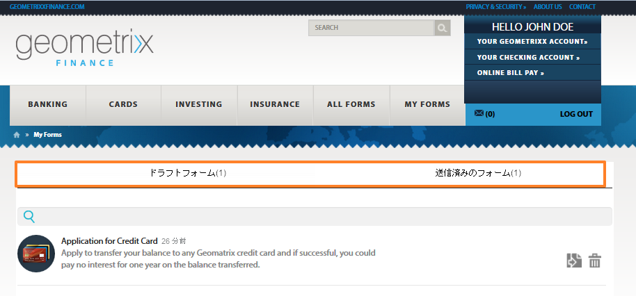
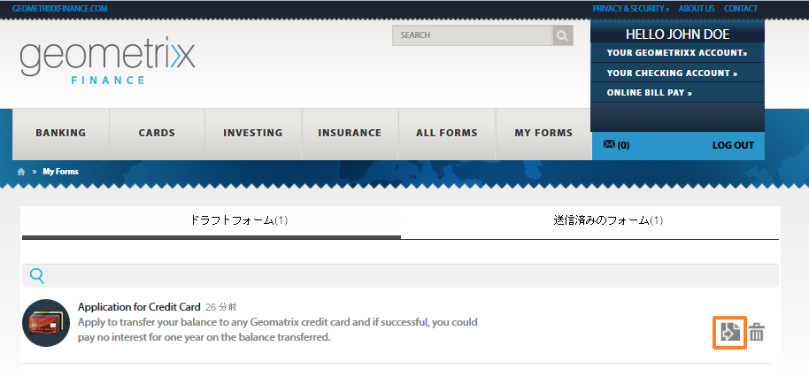

# 発行済みフォームへのアクセスと入力 {#accessing-and-filling-published-forms}

フォーム中心のポータルデプロイメント設定では、フォーム開発とポータル開発が 2 つの異なるアクティビティになります。 フォームデザイナーがフォームをデザインし、リポジトリに保存しますが、Web 開発者はフォームをリストし、送信を処理する Web アプリケーションを作成します。 フォームリポジトリと Web アプリケーションの間で通信がおこなわれないので、Formsは Web 層にコピーされます。

これは、多くの場合、設定の管理と実稼動の遅延に問題を引き起こします。 例えば、リポジトリで新しいバージョンのフォームが使用可能な場合、フォームデザイナーは、Web 層のフォームを置き換え、Web アプリケーションを変更し、パブリックサイトに再デプロイします。 Web アプリケーションを再デプロイすると、サーバーのダウンタイムが発生する場合があります。 サーバーのダウンタイムは計画的なアクティビティなので、変更を即座にパブリックサイトにプッシュすることはできません。

Forms Portal は、管理のオーバーヘッドと実稼動の遅延を軽減します。 これにより、Web 開発者にAdobe Experience Manager(AEM) を使用して作成された Web サイトでフォームポータルを作成し、カスタマイズするためのコンポーネントが支給されます。

フォームポータルおよびその機能について詳しくは、「[ポータルでのフォーム発行の概要](/help/forms/using/introduction-publishing-forms.md)」を参照してください。

## フォームポータルの概要 {#getting-started-with-forms-portal}

発行済みのフォームポータルページに移動します。 フォームポータルページの作成について詳しくは、[フォームポータルページの作成](/help/forms/using/creating-form-portal-page.md)を参照してください。

フォームポータルの Search &amp; Lister コンポーネントは、AEMサーバーのパブリッシュインスタンスで使用できるフォームを表示します。 このリストには、フォームポータルページの作成時にフィルターで定義されたすべてのフォームまたはフォームが含まれます。 フォームポータルページは、次の画像のようになります。

**図：** *フォームポータルページのサンプル*

### Search &amp; Lister {#search-and-lister}

Search &amp; Lister コンポーネントを使用すると、フォームポータルに以下の機能を追加できます。

* パネル表示、カード表示、またはグリッド表示で、すぐに使用できるフォームを一覧表示します。 また、Forms Manager の特定のフォルダーのカスタム templatesList フォームもサポートします。
* フォームのレンダリング方法 (HTML5、PDF、またはその両方 ) を指定します。
* PDFと XFA-forms のレンダリング方法 (HTML5、PDF、またはその両方 ) を指定します。 HTML5としてのNon-XFAフォーム
* 条件（フォームプロパティ、メタデータ、タグなど）に基づいたフォームの検索を有効にします。
* フォームデータをサーブレットに送信します。
* カスタムスタイルシートを使用して、ルック＆フィールをカスタマイズすることができます。
* フォームへのリンクを作成します。

次のオプションを使用して、Forms Portal ページでフォームを検索できます。

* 全文検索
* 詳細検索

全文検索では、指定したキーワードに基づいてフォームを検索し、リストすることができます。

**図：** *詳細検索ダイアログ*

「詳細検索」では、指定したフォームプロパティに基づいてフォームを検索できます。 これにより、全文検索よりも具体的な結果が得られます。 「詳細」検索には、タグ、プロパティ（作成者、説明、タイトルなど）、変更日、フルテキストに基づく検索が含まれます。

リスターは、検索パラメーターに基づいてフォームを表示します。 検索結果内の各フォームは、関連フォームにハイパーリンクされたアイコン付きで表示されます。 アイコンをクリックすると、そのアイコンが開き、関連フォームを使用できます。

### フォームへの入力 {#filling-a-form}

**図：** *サンプルのアダプティブフォーム*

フォームは、ページの Search &amp; Lister コンポーネント内のフォームと共に提供されるリンクからアクセスできます。

各フォームには、ユーザーがフォームに入力できるようにするヘルプ情報が含まれています。

#### ドラフトと送信 {#drafts-and-submission}

ユーザーは、「保存」ボタンをクリックしてフォームのドラフトを保存することができます。 これにより、ユーザーは、フォームを送信する前に一定期間フォームを操作できます。

フォームに入力されたデータ（添付ファイルを含む）は、ドラフトとしてサーバーに保存されます。 フォームのドラフトは、何回でも保存できます。 保存したフォームは、ページのドラフトと送信コンポーネントの「ドラフト」タブに表示されます。

フォーム入力が完了すると、ユーザーはフォームの「送信」ボタンをクリックしてフォームを送信します。 送信済みのフォームは、ページのドラフトと送信コンポーネントの「送信」タブに表示されます。

>[!NOTE]
>
>送信済みのフォームは、アダプティブフォームの送信アクションが、フォームポータル送信アクションとして設定されている場合にのみ、送信済みフォームのタブに表示されます。送信アクションについて詳しくは、「[送信アクションの設定](/help/forms/using/configuring-submit-actions.md)」を参照してください。

**図：** *ドラフトと送信コンポーネント*

## 送信済みのフォームデータを使用して新しいフォームを開始 {#start-a-new-form-using-submitted-form-data}

非常に頻繁に入力および送信する必要があるフォームがあります。 例えば、個々の納税申告用のフォームは、毎年提出されます。 このような場合、フォームに入力するたびに情報の一部が変わりますが、個人や家族の詳細など、ほとんどの情報は変わりません。 ただし、フォーム全体に一から再度入力する必要があります。

AEM Formsは、フォーム入力の操作性を最適化し、フォームの入力と送信に要する時間を大幅に短縮するのに役立ちます。 エンドユーザーは、送信済みのフォームのデータを使用して新しいフォームを開始できます。 この機能は [ドラフトと送信コンポーネント](/help/forms/using/draft-submission-component.md). ドラフトと送信コンポーネントをフォームポータルページに追加して公開すると、エンドユーザーは「送信済みのForms 」タブと「ドラフトのForms 」タブにオプションが表示され、送信済みフォームのデータを使用して新しいフォームを開始できます。 次の画像は、そのオプションをハイライトしています。

「 」ボタンをクリックして新しいフォームを開始すると、対応する送信済みフォームのデータを含む新しいフォームが開きます。 これで、必要に応じて情報を確認および更新し、フォームを送信できます。
