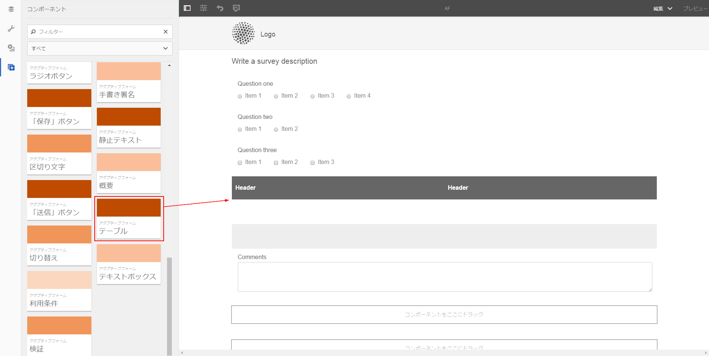

# アダプティブフォームのテーブル {#tables-in-adaptive-forms}

複雑なデータであっても、テーブルを使用することで、効果的かつシンプルにまとめて提示できます。情報をわかりやすく配置し、行と列に分けて規則正しく配列することで、ユーザーも入力しやすくなります。金融サービスや政府機関が提供するフォームの大部分は、数字を入力して計算を実行できる大規模なデータテーブルを必要とします。

AEM Forms を使用すると、サイドバーにあるコンポーネントブラウザーから表コンポーネントを追加し、アダプティブフォーム内で表を作成できるようになります。主な機能には、以下のようなものがあります。

* モバイルデバイス上のレスポンシブなレイアウト
* 設定可能な行と列
* 実行時の動的な追加と削除
* セルの結合と分割
* スクリーンリーダーによるアクセス
* CSS を使用したカスタムレイアウト
* XDP テーブルコンポーネントとの互換性とマッピング
* XSD 複合タイプ要素を使用した行またはセルの追加のサポート
* XML ファイルからのデータの結合

## テーブルの作成 {#create-a-table}

表を作成するには、表コンポーネントをサイドキックにあるコンポーネントブラウザーからアダプティブフォームへとドラッグ＆ドロップします。テーブルには、デフォルトで 2 つの列とヘッダー行を含む 3 つの行が含まれています。



### ヘッダーと本文セルについて {#about-header-and-body-cells}

ヘッダーセルは、テキストフィールドです。ヘッダーのラベルを変更するには、ヘッダーセルを右クリックし、「**編集**」をクリックします。編集ダイアログの「**値**」フィールドのラベルを編集して、「**OK**」をクリックします。

ボディセルは、デフォルトでテキストボックスになっています。ボディセルは、数値ボックス、日付選択、ドロップダウンリストなど、サイドキックで使用できるどのアダプティブフォームコンポーネントとでも置き換えることができます。

例えば、以下のテーブルの最初のボディ行には、テキストボックス、日付選択、ドロップダウンリストのコンポーネントがセルとして含まれています。


結合したいセルを選択し、右クリックして「**結合**」を選択することで、複数のセルを結合できます。また、結合されたセルを右クリックして「**セルの分割**」を選択することで、セルを分割できます。

### 行および列の追加、削除、移動 {#add-delete-move-rows-and-columns}

行または列を追加／削除したり、テーブルの中で行を上下に移動させることができます。

行または列を追加／削除する、または行を移動させるには、行または列に含まれるセルのいずれかをクリックします。列の一番上および行の左側にドロップダウンメニューが表示されます。上部のメニューには列を追加または削除するオプションが表示され、左側のメニューには行を追加、削除または移動させるオプションが表示されます。

* 追加の操作では、選択された行の下に行が、そして選択された列の右隣に列が追加されます。
* 削除の操作では、選択された行または列が削除されます。
* 上へ移動または下へ移動の操作は、選択された行を上下に移動させます。

行のドロップダウンメニューでは、行のプロパティ、設定、スタイル設定オプションを編集する編集操作も提供されます。


>[!NOTE]
>
>テーブルには、任意の数の行を追加できますが、追加できる列の数は最大 6 つまでに制限されています。また、テーブルからヘッダー行を削除することはできません。

### テーブルの列幅の設定 {#set-column-width}

テーブルの列幅を設定するには、次の手順を実行します。

1. 「**[!UICONTROL コンテンツ]**」タブで、 **[!UICONTROL テーブル]**&#x200B;コンポーネントをタップし、設定（）アイコンをタップします。

1. 「**[!UICONTROL 列幅]**」フィールドに値のコンマ区切りリストを入力して、テーブルの各列の比例する幅を指定します。例えば、3 つの列を含むテーブルの場合、「**[!UICONTROL 列幅]**」フィールドの値で 2、4、6 を指定すると、1 列目の幅は 2/12、2 列目は 4/12、3 列目は 6/12 に設定されます。最初の列の幅である 2/12 は、テーブル幅の 6 分の 1 を表します。同様に、4/12 は 2 番目の列の幅をテーブル幅の 3 分の 1 に設定し、6/12 は 3 番目の列の幅をテーブル幅の半分に設定します。

### テーブルの説明の追加 {#add-table-description}

情報がどのように整理されているか、スクリーンリーダーが解釈し、読み出すことのできる説明を、テーブルに追加できます。説明を追加するには、以下の手順を実行します。

1. テーブルを選択して  をタップし、サイドバーにプロパティを表示します。
1. 「アクセシビリティ」タブで概要を指定します。
1. 「**完了**」をクリックします。

## テーブルのスタイルの設定 {#configure}

ページツールバーでスタイルモードを使用することで、テーブルのスタイルを定義できます。以下の手順を実行して、スタイルモードに切り替え、テーブルのスタイルを編集します。

1. ページツールバーで、プレビューの前に、／**スタイル**&#x200B;をタップします。

1. サイドバーでテーブルを選択し、編集ボタン  をタップします。

   サイドバーにスタイルプロパティが表示されます。


>[!NOTE]
>
>ヘッダーおよびボディ行のカラーテーマは、LESS 変数の値を変更することで変更できます。詳しくは、「[AEM Forms のテーマ](/help/forms/using/themes.md)」を参照してください。

## 動的に行を追加または削除する {#add-or-delete-a-row-dynamically}

テーブルには、実行時の動的な行の追加および削除のサポートがあらかじめ含まれています。

1. テーブルの行を選択して  をタップします。
1. 「設定を繰り返し」タブで、テーブルの行の数を制限する最大値と最小値を指定します。
1. 「**完了**」をクリックします。

実行時には、 **`+`** および *`-`* ボタンを使用して行を追加または削除します。


>[!NOTE]
>
>行の動的な追加／削除は、テーブルの「左側にヘッダー」のモバイルレイアウトではサポートされていません。

## テーブルの式 {#expressions-in-a-table}

アダプティブフォームの表では、表または行を表示/非表示にする、すべての数値を加算して合計をセルに表示する、セルを有効または無効にする、ユーザー入力を検証するなどの動作を誘導する数式を JavaScript で作成することができます。これらの数式は、アダプティブフォームのスクリプトモデル API を使用しています。

テーブルと行では、式によって返される値を基にその表示をコントロールする表示式のみがサポートされていますが、セルでは、以下の式がサポートされています。

* **初期化スクリプト：**&#x200B;フィールドの初期化時にアクションを実行します。
* **値コミットスクリプト：**&#x200B;フィールドの値が変更された後でフォームのコンポーネントを変更します。

>[!NOTE]
>
>同じフィールドに XFA change/exit スクリプトも適用されている場合は、値コミットスクリプトの前に XFA change/exit スクリプトが実行されます。

* **式の計算**：フィールドの値を自動計算します。
* **検証式**：フィールドを検証します。
* **アクセス式**：フィールドを有効／無効にします。
* **表示式**：フィールドおよびパネルの表示をコントロールします。

テーブルまたは行の表示の式は、対応する編集コンポーネントダイアログの「パネルプロパティ」タブで定義できます。セルの式は、編集コンポーネントダイアログの「スクリプト」タブで定義できます。

アダプティブフォームクラス、イベント、オブジェクト、パブリック API の完全なリストについては、「[アダプティブフォームの JavaScript ライブラリ API リファレンス](https://helpx.adobe.com/aem-forms/6/javascript-api/index.html)」を参照してください。

## モバイルレイアウト {#mobile-layouts}

アダプティブフォームの表は、その流動的でレスポンシブなレイアウトで、モバイルデバイスでの卓越したエクスペリエンスを提供します。AEM Forms には、テーブル用のモバイルレイアウトとして、「左側にヘッダー」と「折りたたみ可能な列」の 2 種類が用意されています。

テーブルのモバイルレイアウトは、テーブルの編集コンポーネントダイアログの「スタイル設定」タブから設定できます。

### 左側にヘッダー {#headers-on-left}

左側にヘッダーのレイアウトでは、テーブルのヘッダーが左側に転置され、ヘッダーに寄せてセルがひとつだけ表示されている形になっています。このレイアウトでの各行は、個別のセクションとして表示されます。以下の画像では、デスクトップ上でのテーブルとモバイルデバイス上でのテーブルを比較しています。


**図：** *左にヘッダーレイアウトのテーブルのデスクトップビュー*


**図：** *左側にヘッダーレイアウトを持つテーブルのモバイル表示*

### 折りたたみ可能な列のレイアウト {#collapsible-columns-layout}

折りたたみ可能な列のレイアウトでは、デバイスの大きさによって 1 つまたは 2 つの列が表示され、その他の列は折りたたまれます。折りたたみ／展開アイコンをクリックすると、テーブルの他の列を表示できます。

>[!NOTE]
>
>折りたたみ可能な列のレイアウトはモバイルデバイス向けに最適化されていますが、テーブルの中のすべての列を表示するのに十分な幅がない場合に、デスクトップにも使用できます。

以下の画像では、列が折りたたまれた状態と展開された状態で、テーブルがどのように表示されるかを比較しています。


**図：** *モバイルデバイス上で列が 2 つだけ表示されている表の折りたたまれた列*


**図：** *モバイルデバイス上で展開された表の列*

## テーブルでのデータの結合 {#merge-data-in-a-table}

アダプティブフォームの表では、実行時に、XML ファイルからのデータを使用して表にデータを入力することができます。データ XML ファイルは、AEM Forms サーバーが稼動しているマシンのローカルファイルシステム、または CRX リポジトリに置くことができます。

XML ファイルのデータを使用して入力する、以下の銀行取引概要テーブルの例を見てみましょう。


この例で使用する要素名プロパティを以下に示します。

* 行：**Row1**
* 取引日の下のボディセル：**tableItem1**
* 説明の下のボディセル：**tableItem2**
* 取引の種類の下のボディセル：**type**
* 金額（USD）の下のボディセル：**tableItem3**

以下の形式のデータを含む XML ファイル：

```xml
<?xml version="1.0" encoding="UTF-8"?><afData>
  <afUnboundData>
    <data>
 <typeSelect>0</typeSelect>
 <Row1>
      <tableItem1>2015-01-08</tableItem1>
      <tableItem2>Purchase laptop</tableItem2>
      <type>0</type>
      <tableItem3>12000</tableItem3>
 </Row1>
 <Row1>
      <tableItem1>2015-01-05</tableItem1>
      <tableItem2>Transport expense</tableItem2>
      <type>0</type>
      <tableItem3>120</tableItem3>
 </Row1>
 <Row1>
      <tableItem1>2014-01-08</tableItem1>
      <tableItem2>Laser printer</tableItem2>
      <type>0</type>
      <tableItem3>500</tableItem3>
 </Row1>
 <Row1>
      <tableItem1>2014-12-08</tableItem1>
      <tableItem2>Credit card payment</tableItem2>
      <type>0</type>
      <tableItem3>300</tableItem3>
 </Row1>
 <Row1>
      <tableItem1>2015-01-06</tableItem1>
      <tableItem2>Interest earnings</tableItem2>
      <type>1</type>
      <tableItem3>12000</tableItem3>
 </Row1>
 <Row1>
      <tableItem1>2015-01-05</tableItem1>
      <tableItem2>Payment from a client</tableItem2>
      <type>1</type>
      <tableItem3>500</tableItem3>
 </Row1>
 <Row1>
      <tableItem1>2015-01-08</tableItem1>
      <tableItem2>Food expense</tableItem2>
      <type>0</type>
      <tableItem3>120</tableItem3>
 </Row1>
 </data>
  </afUnboundData>
  <afBoundData>
    <data/>
  </afBoundData>
  <afBoundData/>
</afData>
```

サンプル XML では、行のデータは、テーブルの行の要素名である `<Row1>` タグによって定義されています。`<Row1>` タグ内では、各セルのデータは、タグ内の `<tableItem1>`、`<tableItem2>`、`<tableItem3>`、`<type>` などの要素名で定義されています。

このデータを実行時にテーブルと統合するには、wcmmode を無効にした状態で、XML の絶対位置をテーブルを含むアダプティブフォームに示す必要があります。例えば、アダプティブフォームが *http://localhost:4502/myForms/bankTransaction.html* にあり、データ XML ファイルが *C:/myTransactions/bankSummary.xml* に保存されている場合、データを持ったテーブルは次の URL で確認することができます。

*http://localhost:4502/myForms/bankTransaction.html?dataRef=file:/// C:/myTransactions/bankSummary.xml&amp;wcmmode=disabled*


## XDP コンポーネントおよび XSD 複合タイプの使用 {#use-xdp-components-and-xsd-complex-types}

XFA フォームテンプレートに基づいてアダプティブフォームを作成した場合、XFA 要素を AEM コンテンツファインダの「データモデル」タブから利用することができます。表を含むこれらの XFA 要素は、アダプティブフォームにドラッグ＆ドロップすることができます。

XFA の表要素は、表コンポーネントにマッピングされており、追加設定なしでアダプティブフォームに使用することができます。XDP 表のすべてのプロパティおよび機能は、アダプティブフォームに移動されるときに保持されるため、ネイティブのアダプティブフォームの表と同様に操作を行うことができます。例えば、XDP 表の行が繰り返し可能とマークされている場合、アダプティブフォームにドロップされたときにも繰り返されます。

さらに、XDP サブフォームをドラッグ＆ドロップして、新しい行をテーブルに追加することもできます。ただし、階層化されたサブフォームをドロップすることはできませんので注意してください。

>[!NOTE]
>
>ヘッダー行のない XDP 表は、アダプティブフォームの表コンポーネントにマッピングされません。代わりに、流動的なレイアウトを持つアダプティブフォームのパネルコンポーネントにマッピングされます。また、階層化された表を XDP からアダプティブフォームに追加する場合、外側の表はパネルに変換され、内側の表は保持されます。

さらに、XSD 複合タイプ要素のグループをドラッグ＆ドロップし、テーブルの行を作成できます。要素をドロップした行のすぐ下に、新しい行が作成されます。XSD 複合タイプ要素を使用して作成されたセルは、XSD への連結参照を維持します。また、セルに要素をドロップすることで、ボディセルを XSD 複合タイプ要素で置き換えることもできます。

>[!NOTE]
>
>XDP テーブルコンポーネント（サブフォーム）または XSD 複合タイプ内の要素の数は、行内のセルの数を超えることはできません。例えば、セルが 3 つしかない行に、4 つの要素をドロップすることはできません。これは、エラーとなります。
>
>要素数が行内のセルの数より少ない場合、要素に基づいたセルが新しい行にまず追加され、その後、行内の残りのセルに入力するためにデフォルトのセルが追加されます。例えば、3 つの要素のグループを 4 つのセルを持つ行にドロップした場合、最初の 3 つのセルはドロップされた要素に基づくセルとなり、残りの 1 つのセルはテーブルのデフォルトのセルになります。

## 主な考慮事項 {#key-considerations}

* XSD ベースのテーブルの作成中に行を上下に移動させると、フォームの送信時に、テーブルの行から、XML によって生成されたデータのデータ損失が見られます。
* デフォルトのテーブルの各ボディセルには、事前に定義された要素名が関連付けられています。アダプティブフォームに別の表を追加すると、新しい表のデフォルトのボディセルには、最初の表と同じ要素名が割り当てられます。このようなケースでは、フォームの送信時に生成されるデータに、どちらかひとつのテーブルのデフォルトのボディセルのデータのみが含まれることになります。そのため、テーブルをまたいで一意の名前になるようにデフォルトのボディセルの要素名を変更し、データ損失を避けるようにしてください。

   これは、デフォルトのボディセルにのみ該当します。テーブルに行または列を追加すると、デフォルト以外のボディセルに対して、一意の要素名が自動生成されます。
