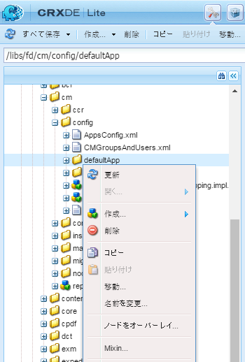
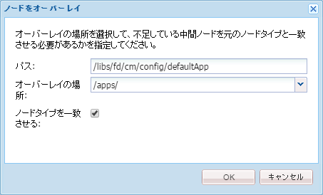
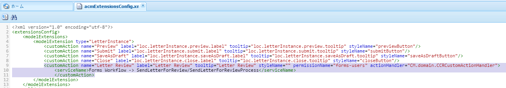
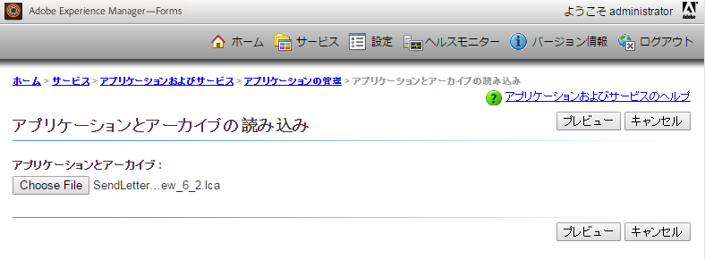
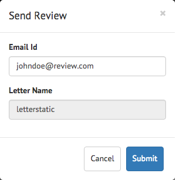

# 「通信を作成」UI へのカスタムアクションまたはボタンの追加 {#add-custom-action-button-in-create-correspondence-ui}

## 概要 {#overview}

Correspondence Management ソリューションでは、「通信を作成」UI にカスタムアクションを追加できます。

このドキュメントのシナリオでは、通信を作成ユーザーインターフェイスでボタンを作成し、レターをレビューPDFとして電子メールに添付して共有する方法について説明します。

### 前提条件 {#prerequisites}

このシナリオを完了するには、以下が必要になります。

* CRX および JavaScript についての知識
* LiveCycle サーバー

## シナリオ：通信を作成ユーザーインターフェイスにボタンを作成してレビュー用のレターを送信する {#scenario-create-the-button-in-the-create-correspondence-user-interface-to-send-a-letter-for-review}

通信を作成ユーザーインターフェイスにボタンを追加して、ボタンのアクション（ここではレビュー用のレターの送信）を指定するには、次の操作を行います。

1. 通信を作成ユーザーインターフェイスにボタンを追加します
1. ボタンにアクション処理を追加します
1. アクション「処理」をLiveCycleするプロセスの追加

### 通信を作成ユーザーインターフェイスへのボタンの追加 {#add-the-button-to-the-create-correspondence-user-interface}

1. に移動します。 `https://[server]:[port]/[ContextPath]/crx/de` 管理者としてログインします。
1. apps フォルダーに、 `defaultApp` （config フォルダー内の）defaultApp フォルダーに似たパス/構造を持つ フォルダーの作成手順は次のとおりです。

   * を右クリックします。 **[!UICONTROL defaultApp]** 次のパスにあるフォルダーを選択し、 **[!UICONTROL ノードをオーバーレイ]**:

      /libs/fd/cm/config/defaultApp/

      

   * ノードをオーバーレイダイアログに次の値が表示されていることを確認します。

      **[!UICONTROL パス：]** /libs/fd/cm/config/defaultApp/

      **[!UICONTROL オーバーレイの場所：]** /apps/

      **[!UICONTROL ノードタイプを一致させる：]** 確認済み

      

   * 「**[!UICONTROL OK]**」をクリックします。
   * 「**[!UICONTROL すべて保存]**」をクリックします。

1. acmExtensionsConfig.xml ファイル（/libs branch の下）のコピーを /apps branch の下に作成します。

   * 「/libs/fd/cm/config/defaultApp/acmExtensionsConfig.xml」に移動します。

   * acmExtensionsConfig.xml ファイルを右クリックし、「 」を選択します。 **[!UICONTROL コピー]**.

      

   * 「/apps/fd/cm/config/defaultApp/」にある **[!UICONTROL defaultApp]** フォルダーを右クリックし、「**[!UICONTROL 貼り付け]**」を選択します。
   * 「**[!UICONTROL すべて保存]**」をクリックします。

1. apps フォルダーで新しく作成した acmExtentionsConfig.xml のコピーをダブルクリックします。ファイルが開いて編集可能になります。
1. 次のコードを検索します。

   ```xml
   <?xml version="1.0" encoding="utf-8"?>
   <extensionsConfig>
       <modelExtensions>
           <modelExtension type="LetterInstance">
     <customAction name="Preview" label="loc.letterInstance.preview.label" tooltip="loc.letterInstance.preview.tooltip" styleName="previewButton"/>
               <customAction name="Submit" label="loc.letterInstance.submit.label" tooltip="loc.letterInstance.submit.tooltip" styleName="submitButton" permissionName="forms-users"/>
               <customAction name="SaveAsDraft" label="loc.letterInstance.saveAsDraft.label" tooltip="loc.letterInstance.saveAsDraft.tooltip" styleName="submitButton" permissionName="forms-users"/>
               <customAction name="Close" label="loc.letterInstance.close.label" tooltip="loc.letterInstance.close.tooltip" styleName="closeButton"/>
           </modelExtension>
       </modelExtensions>
   </extensionsConfig> 
   ```

1. レターを電子メールで送信するには、LiveCycle Forms ワークフローを使用します。次のように、acmExtensionsConfig.xml の modelExtension タグの下に customAction タグを追加します。

   ```xml
    <customAction name="Letter Review" label="Letter Review" tooltip="Letter Review" styleName="" permissionName="forms-users" actionHandler="CM.domain.CCRCustomActionHandler">
         <serviceName>Forms Workflow -> SendLetterForReview/SendLetterForReviewProcess</serviceName>
       </customAction>
   ```

   

   modelExtension タグには、アクションボタンのアクション、権限、外観を設定する customAction 子タグのセットが含まれています。以下は customAction 設定タグの一覧です。

   | **名前** | **説明** |
   |---|---|
   | name | 実行するアクションの英数字名。 このタグの値は必須です。modelExtension タグ内で一意であり、アルファベットで始まる必要があります。 |
   | label | アクションボタンに表示するラベル。 |
   | tooltip | ボタンのツールチップテキスト。ボタンにカーソルを置くと表示されます。 |
   | styleName | アクションボタンに適用されるカスタムスタイルの名前。 |
   | permissionName | 対応するアクションは、ユーザーが permissionName で指定された権限を持つ場合にのみ表示されます。 permissionName をとして指定する場合 `forms-users`の場合、すべてのユーザーがこのオプションにアクセスできます。 |
   | actionHandler | ユーザーがボタンをクリックしたときに呼び出される ActionHandler クラスの完全修飾名。 |

   上記のパラメーター以外に、customAction には追加の設定を関連付けることができます。これらの追加の設定は、 CustomAction オブジェクトを通じてハンドラーで使用できます。

   | **名前** | **説明** |
   |---|---|
   | serviceName | customAction に serviceName という名前の子タグが含まれている場合、関連する button/link をクリックすると、serviceName タグで表される名前でプロセスが呼び出されます。 このプロセスが Letter PostProcess と同じ署名を持っていることを確認します。 サービス名に「Forms Workflow ->」プレフィックスを追加します。 |
   | タグ名に cm_プレフィックスを含むパラメーター | customAction に cm_で始まる子タグが含まれている場合、後処理（レター後処理、または serviceName タグで表される特殊な処理）では、これらのパラメーターは、cm_プレフィックスが削除された関連タグの下の入力 XML コードで使用できます。 |
   | actionName | クリックによる後処理が発生するたびに、送信された XML には、ユーザーアクションの名前を持つタグの下に、名前を持つ特殊なタグが含まれます。 |

1. 「**[!UICONTROL すべて保存]**」をクリックします。

#### /apps branch 内のプロパティファイルを使用したローカルフォルダーの作成 {#create-a-locale-folder-with-properties-file-in-the-apps-branch}

ACMExtensionsMessages.properties ファイルには、通信を作成ユーザーインターフェイスの様々なフィールドのラベルとツールチップメッセージが含まれています。 カスタマイズしたアクションやボタンを機能させるために、/apps branch にこのファイルのコピーを作成します。

1. を右クリックします。 **[!UICONTROL ロケール]** 次のパスにあるフォルダーを選択し、 **[!UICONTROL ノードをオーバーレイ]**:

   /libs/fd/cm/config/defaultApp/locale

1. ノードをオーバーレイダイアログに次の値が表示されていることを確認します。

   **[!UICONTROL パス：]** /libs/fd/cm/config/defaultApp/locale

   **[!UICONTROL オーバーレイの場所：]** /apps/

   **[!UICONTROL ノードタイプを一致させる：]** 確認済み

1. 「**[!UICONTROL OK]**」をクリックします。
1. 「**[!UICONTROL すべて保存]**」をクリックします。
1. 次のファイルを右クリックし、「 」を選択します。 **[!UICONTROL コピー]**:

   `/libs/fd/cm/config/defaultApp/locale/ACMExtensionsMessages.properties`

1. 次のパスにある **[!UICONTROL locale]** フォルダーを右クリックし、「**[!UICONTROL 貼り付け]**」を選択します。

   `/apps/fd/cm/config/defaultApp/locale/`

   ACMExtensionsMessages.properties ファイルがローカルフォルダーにコピーされます。

1. 新しく追加されたカスタムアクション/ボタンのラベルをローカライズするには、内の関連ロケールの ACMExtensionsMessages.properties ファイルを作成します。 `/apps/fd/cm/config/defaultApp/locale/`.

   たとえば、この記事で作成したカスタムアクションまたはボタンをローカライズするには、次のエントリを使用して ACMExtensionsMessages_fr.properties という名前のファイルを作成します。

   `loc.letterInstance.letterreview.label=Revue De Lettre`

   同様に、このファイルにツールチップやスタイルのプロパティなどを追加できます。

1. 「**[!UICONTROL すべて保存]**」をクリックします。

#### Adobe Asset Composer 構築ブロックバンドルの再起動 {#restart-the-adobe-asset-composer-building-block-bundle}

サーバー側の変更をすべて加えた後、Adobe Asset Composer 構築ブロックバンドルを再起動します。このシナリオでは、サーバー側の acmExtensionsConfig.xml ファイルと ACMExtensionsMessages.properties ファイルが編集されるので、AdobeAsset Composer 構築ブロックバンドルを再起動する必要があります。

>[!NOTE]
>
>ブラウザーのキャッシュをクリアする必要が生じる場合があります。

1. `https://[host]:[port]/system/console/bundles` にアクセスします。必要に応じて、管理者としてログインします。

1. Adobe Asset Composer 構築ブロックバンドルを検索します。バンドルを再起動します。「停止」をクリックした後、「開始」をクリックします。

   

Adobe Asset Composer 構築ブロックバンドルを再起動した後、通信を作成ユーザーインターフェイスにカスタムボタンが表示されます。通信を作成ユーザーインターフェイスでレターを開いて、カスタムボタンをプレビューできます。

### ボタンへのアクション処理の追加 {#add-action-handling-to-the-button}

通信を作成ユーザーインターフェイスはデフォルトで、次の場所にある cm.domain.js ファイルの ActionHandler を実装します。

/libs/fd/cm/ccr/gui/components/admin/clientlibs/ccr/js/cm.domain.js

カスタムのアクション処理の場合は、CRX の /apps branch にある cm.domain.js ファイルのオーバーレイを作成します。

アクション/ボタンをクリックした際のアクション/ボタンの処理には、次のロジックが含まれています。

* 新しく追加したアクションを表示または非表示にする：actionVisible() 関数をオーバーライドして実行します。
* 新しく追加したアクションを有効/無効にする：actionEnabled() 関数をオーバーライドして実行されます。
* ユーザーがボタンをクリックしたときの実際のアクション処理：handleAction() 関数の実装を上書きして実行されます。

1. `https://[server]:[port]/[ContextPath]/crx/de` にアクセスします。必要に応じて、管理者としてログインします。

1. apps フォルダーに、次のフォルダーに類似した構造で、CRX の /apps branch に `js` という名前のフォルダーを作成します。

   `/libs/fd/cm/ccr/gui/components/admin/clientlibs/ccrui/js`

   フォルダーの作成手順は次のとおりです。

   1. を右クリックします。 **[!UICONTROL js]** 次のパスにあるフォルダーを選択し、 **[!UICONTROL ノードをオーバーレイ]**:

      `/libs/fd/cm/ccr/gui/components/admin/clientlibs/ccrui/js`

   1. ノードをオーバーレイダイアログに次の値が表示されていることを確認します。

      **[!UICONTROL パス：]** /libs/fd/cm/ccr/gui/components/admin/clientlibs/ccrui/js

      **[!UICONTROL オーバーレイの場所：]** /apps/

      **[!UICONTROL ノードタイプを一致させる：]** 確認済み

   1. 「**[!UICONTROL OK]**」をクリックします。
   1. 「**[!UICONTROL すべて保存]**」をクリックします。

1. 次の手順に従って、ccrcustomization.js という名前のファイルを js フォルダーに作成し、ボタンのアクション処理のためのコードを指定します。

   1. を右クリックします。 **[!UICONTROL js]** 次のパスにあるフォルダーを選択し、 **[!UICONTROL 作成/ファイルを作成]**:

      `/apps/fd/cm/ccr/gui/components/admin/clientlibs/ccrui/js`

      ファイルに ccrcustomization.js という名前を付けます。

   1. ccrcustomization.js ファイルをダブルクリックして、CRX で開きます。
   1. ファイルに次のコードを貼り付けて、「**[!UICONTROL すべて保存]**」をクリックします。

      ```
      /* for adding and handling custom actions in Extensible Toolbar.
        * One instance of handler will be created for each action.
        * CM.domain.CCRCustomActionHandler is actionHandler class.
        */
      var CCRCustomActionHandler;
          CCRCustomActionHandler = CM.domain.CCRCustomActionHandler = new Class({
              className: 'CCRCustomActionHandler',
              extend: CCRDefaultActionHandler,
              construct : function(action,model){
              }
          });
          /**
           * Called when user user click an action
           * @param extraParams additional arguments that may be passed to handler (For future use)
           */
          CCRCustomActionHandler.prototype.handleAction = function(extraParams){
              if (this.action.name == CCRCustomActionHandler.SEND_FOR_REVIEW) {
                  var sendForReview = function(){
                      var serviceName = this.action.actionConfig["serviceName"];
                      var inputParams = {};
                      inputParams["dataXML"] = this.model.iccData.data;
                      inputParams["letterId"] = this.letterVO.id;
                      inputParams["letterName"] = this.letterVO.name;
                      inputParams["mailId"] = $('#email').val();
                      /*function to invoke the LivecyleService */
                      ServiceDelegate.callJSONService(this,"lc.icc.renderlib.serviceInvoker.json","invokeProcess",[serviceName,inputParams],this.onProcessInvokeComplete,this.onProcessInvokeFail);
                      $('#ccraction').modal("hide");
                  }
                  if($('#ccraction').length == 0){
                      /*For first click adding popup & setting letterName.*/
                      $("body").append(popUp);
                      $("input[id*='letterName']").val(this.letterVO.name);   
                      $(document).on('click',"#submitLetter",$.proxy( sendForReview, this ));
                  }
                  $('#ccraction').modal("show");
              }
          };
          /**
           * Should the action be enabled in toolbar
           * @param extraParams additional arguements that may be passed to handler (For future use)
           * @return flag indicating whether the action should be enabled
           */
         CCRCustomActionHandler.prototype.actionEnabled = function(extraParams){
                  /*can be customized as per user requirement*/
                  return true;
          };
          /**
           * Should the action be visible in toolbar
           * @param extraParams additional arguments that may be passed to handler (For future use)
           * @return flag indicating whether the action should be enabled
           */
          CCRCustomActionHandler.prototype.actionVisible = function(extraParams){
              /*Check can be enabled for Non-Preview Mode.*/
              return true;
          };
          /*SuccessHandler*/
          CCRCustomActionHandler.prototype.onProcessInvokeComplete = function(response) {
              ErrorHandler.showSuccess("Letter Sent for Review");
          };
          /*FaultHandler*/
          CCRCustomActionHandler.prototype.onProcessInvokeFail = function(event) {
              ErrorHandler.showError(event.message);
          };
          CCRCustomActionHandler.SEND_FOR_REVIEW  = "Letter Review";
      /*For PopUp*/
          var popUp = '<div class="modal fade" id="ccraction" tabindex="-1" role="dialog" aria-hidden="true">'+
          '<div class="modal-dialog modal-sm">'+
              '<div class="modal-content">' +
                  '<div class="modal-header">'+
                      '<button type="button" class="close" data-dismiss="modal" aria-label="Close"><span aria-hidden="true">&times;</span></button>'+
                      '<h4 class="modal-title"> Send Review </h4>'+
                  '</div>'+
                  '<div class="modal-body">'+
                      '<form>'+
                          '<div class="form-group">'+
                              '<label class="control-label">Email Id</label>'+
                              '<input type="text" class="form-control" id="email">'+
                          '</div>'+
                          '<div class="form-group">'+
                              '<label  class="control-label">Letter Name</label>'+
                              '<input id="letterName" type="text" class="form-control" readonly>'+
                          '</div>'+
                          '<div class="form-group">'+
                              '<input id="letterData" type="text" class="form-control hide" readonly>'+
                          '</div>'+
                      '</form>'+
                  '</div>'+
                  '<div class="modal-footer">'+
                     '<button type="button" class="btn btn-default" data-dismiss="modal"> Cancel </button>'+
                     '<button type="button" class="btn btn-primary" id="submitLetter"> Submit </button>'+
                  '</div>'+
              '</div>'+
          '</div>'+
      '</div>';
      ```

### LiveCycle プロセスの追加によるアクション<span class="acrolinxCursorMarker"></span>処理の有効化 {#add-the-livecycle-process-to-enable-action-span-class-acrolinxcursormarker-span-handling}

このシナリオでは、添付された components.zip ファイルに含まれる次のコンポーネントを有効にします。

* DSC コンポーネント jar (`DSCSample.jar`)
* レビュープロセス LCA(`SendLetterForReview.lca`)

をダウンロードして展開します。 `components.zip` 取得するファイル `DSCSample.jar` および `SendLetterForReview.lca` ファイル。 これらのファイルは、次の手順に従って使用します。

[ファイルを入手](assets/components.zip)

#### LiveCycle サーバーの設定と LCA プロセスの実行 {#configure-the-livecycle-server-to-run-the-lca-process}

>[!NOTE]
>
>この手順は、「 OSGi 設定」を使用していて、実装するカスタマイズのタイプに LC 統合が必要な場合にのみ必要です。

LCA プロセスは LiveCycle サーバー上で実行され、サーバーアドレスとログイン情報が必要になります。

1. に移動します。 `https://[server]:[port]/system/console/configMgr` 管理者としてログインします。
1. Adobe LiveCycle Client SDK Configuration を見つけて、「**[!UICONTROL 編集]**」（編集アイコン）をクリックします。「設定」パネルが開きます。

1. 次の詳細を入力し、 **[!UICONTROL 保存]**:

   * **[!UICONTROL サーバー URL]**:Send For Review サービスがアクションハンドラーコードで使用する LC サーバーの URL。
   * **[!UICONTROL ユーザー名]**:LC サーバーの管理者ユーザー名
   * **[!UICONTROL パスワード]**：管理者ユーザー名のパスワード

   

#### LiveCycle Archive（LCA）のインストール {#install-livecycle-archive-lca}

電子メールサービスのLiveCycleを可能にする必要なプロセス。

>[!NOTE]
>
>このプロセスの処理を表示するか、独自の類似プロセスを作成するには、Workbench が必要になります。

1. 次の場所に Livecycle Server adminui に管理者としてログインします。 `https:/[lc server]/:[lc port]/adminui`.

1. **[!UICONTROL ホーム／サービス／アプリケーションおよびサービス／アプリケーションの管理]**&#x200B;に移動します。

1. SendLetterForReview アプリケーションが既に存在する場合は、この手順の残りの手順をスキップします。それ以外の場合は、次の手順に進みます。

   

1. 「**[!UICONTROL 読み込み]**」をクリックします。

1. クリック **[!UICONTROL ファイルを選択]** を選択し、 **[!UICONTROL SendLetterForReview.lca]**.

   

1. 「**[!UICONTROL プレビュー]**」をクリックします。

1. 選択 **[!UICONTROL 読み込みの完了時にアセットをランタイムにデプロイする]**.

1. 「**[!UICONTROL 読み込み]**」をクリックします。

#### 「許可リストに加えるサービス」リストへの ServiceName の追加 {#adding-servicename-to-the-allowlisted-service-list}

AEM サーバーにアクセスする必要のある LiveCycle サービスを AEM サーバーで指定します。

1. に管理者としてログインします。 `https:/[host]/:[port]/system/console/configMgr`.

1. を探して、 **[!UICONTROL AdobeLiveCycleクライアント SDK の設定]**. AdobeLiveCycleClient SDK Configuration パネルが表示されます。
1. 「サービス名」リストで、「 + 」アイコンをクリックし、 serviceName を追加します。 **[!UICONTROL SendLetterForReview/SendLetterForReviewProcess]**.

1. 「**[!UICONTROL 保存]**」をクリックします。

#### 電子メールサービスの設定 {#configure-the-email-service}

このシナリオでは、Correspondence Management で電子メールを送信できるようにするため、LiveCycle サーバーで電子メールサービスを設定します。

1. 管理者の資格情報を使用して、次の場所に Livecycle Server adminui にログインします。 `https:/[lc server]:[lc port]/adminui`.

1. **[!UICONTROL ホーム／サービス／アプリケーションおよびサービス／サービスの管理]**&#x200B;に移動します。

1. 「**[!UICONTROL 電子メールサービス]**」を検索してクリックします。

1. In **[!UICONTROL SMTP ホスト]**、電子メールサービスを設定します。

1. 「**[!UICONTROL 保存]**」をクリックします。

#### DSC サービスの設定 {#configure-the-dsc-service}

Correspondence Management API を使用するには、 `DSCSample.jar` ( このドキュメントに `components.zip`) をクリックし、LiveCycleサーバーにアップロードします。 次の期間の後 `DSCSample.jar` ファイルがLiveCycleサーバーにアップロードされた場合、AEMサーバーは `DSCSample.jar` ファイルを使用して、renderLetter API にアクセスします。

詳しくは、 [AEM FormsとAdobeLiveCycle](/help/forms/using/aem-livecycle-connector.md).

1. の cmsa.properties でAEMサーバー URL を更新します。 `DSCSample.jar`（以下の場所）。

   DSCSample.jar\com\adobe\livecycle\cmsa.properties

1. 設定ファイルに次のパラメーターを指定します。

   * **crx.serverUrl**=https:/[ホスト]/:[ポート]/[コンテキストパス]/[AEM URL]
   * **crx.username**= AEM ユーザー名
   * **crx.password**= AEMパスワード
   * **crx.appRoot**=/content/apps/cm

   >[!NOTE]
   >
   >サーバー側で変更を加えるたびに、サーバーを再起動します。

   この `DSCSample.jar` ファイルは `renderLetter` API renderLetter API について詳しくは、 [インターフェイス LetterRenderService](https://helpx.adobe.com/aem-forms/6-1/javadocs/com/adobe/icc/ddg/api/LetterRenderService.html).

#### DSC を JEE 上のAEM Formsに読み込む {#import-dsc-to-livecyle}

`DSCSample.jar``renderLetter` ファイルは API を使用して、C で入力された XML データの PDF バイト列として レターをレンダリングします。renderLetter およびその他の API について詳しくは、「[レターのレンダリングサービス](https://helpx.adobe.com/aem-forms/6-2/javadocs/com/adobe/icc/ddg/api/LetterRenderService.html)」を参照してください。

1. Livecycle Workbenchを起動してログインします。
1. 選択 **[!UICONTROL Window > Show Views > Components]**. Components ビューが Workbench ES2 に追加されます。

1. 右クリック **[!UICONTROL コンポーネント]** を選択し、 **[!UICONTROL コンポーネントをインストール]**.

1. を選択します。 `DSCSample.jar` ファイルをファイルブラウザーで指定し、 **[!UICONTROL 開く]**.
1. 右クリック **[!UICONTROL RenderWrapper]** を選択し、 **[!UICONTROL 開始コンポーネント]**. コンポーネントが起動すると、コンポーネント名の横に緑色の矢印が表示されます。

## レビュー用のレターの送信 {#send-letter-for-review}

レビュー用のレターを送信するためのアクションとボタンを設定した後、次の操作を行います。

1. ブラウザーのキャッシュをクリアします。

1. 通信を作成 UI で、 **[!UICONTROL レターのレビュー]** レビュー担当者の電子メール ID を指定します。

1. 「**[!UICONTROL 送信]**」をクリックします。



レビュー担当者は、PDF ファイルとして添付されたレターが含まれる電子メールを受信します。
