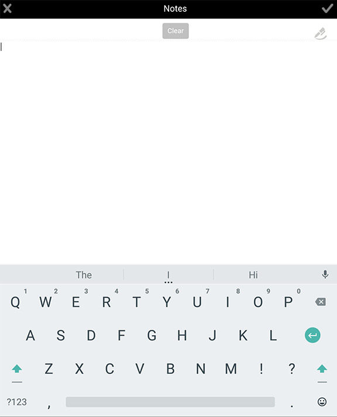

# AEM Forms Workflow（JEE 上の AEM Forms）と同期されたフォーム内で、 {#adding-attachments}

## AEM Forms Workflow サーバー (JEE 上のAEM Forms) と同期されたフォームに添付ファイルを追加する {#adding-annotations}

AEM Forms アプリでは、AEM Forms JEE サーバーと同期されたフォームに対して、画像、手書きメモやテキストメモを添付することができます。フォームを AEM Forms Workflow サーバから読み込んだ場合は、添付ファイルがフォームに追加されます。添付ボタンをタップできます  をクリックして、フォーム内のすべての添付ファイルを一緒に表示します。 赤色の通知は、フォームの添付ファイルの数を表示します。フォームに添付ファイルがない場合は、赤い通知ボタンを表示できません。 フォームに添付ファイルがない場合は、「添付ファイル」ボタンをタップします ，写真や手書きメモを添付するオプションを取得します。

以下のオプションがあります。

* **[!UICONTROL ギャラリー]**：デバイス上に保存されたファイルの中から、画像を追加することができます。

* **[!UICONTROL カメラ]**：写真を撮ってフォームに追加することができます。

* **[!UICONTROL メモ]**：手書きメモやテキストメモを追加できます。用途  手書きを追加し、  をクリックして、テキストメモを追加します。

>[!NOTE]
>
>1 人のユーザーが追加した添付ファイルは、他のAEM Formsアプリユーザーには表示されません。 他のユーザーは、ユーザーが追加した添付ファイルを削除することはできません。

### 「添付ファイル」画面 {#the-attachments-screen}

すべての添付ファイルを 1 か所に表示するには、 . ここで、添付ファイルの追加、名前変更、削除を行うことができます。

別の画像、手書きメモ、またはテキストを添付する場合は、「添付ファイル」画面の「**+**」ボタンを使用することができます。

### 写真を追加する {#adding-a-photograph}

フォームに画像を添付する際は、モバイルデバイスのカメラを使用するか、またはデバイスに保存された画像を使用することができます。

1. 添付ボタンをタップします  窓の下に
1. タップ **[!UICONTROL ギャラリー]** または **[!UICONTROL カメラ]** が表示されるポップアップに表示されます。
1. 選択したオプションに応じて、次の操作を行います。

   1. 「**[!UICONTROL カメラ]**」を選択した場合：

      写真を撮ります。次に、 **[!UICONTROL 用途]**  」ボタンをクリックします。

      または、 **[!UICONTROL Retake]**  ボタンで写真を撮り直す

   1. 「**[!UICONTROL ギャラリー]**」を選択した場合：

      デバイスの画像ブラウザがポップアップ表示されます。デバイスの画像ブラウザから、添付する画像をタップします。

### メモを追加する {#adding-a-note}

この **メモ** 「 」オプションを使用すると、フォームに手書きの手書きメモとテキストの添付ファイルを追加できます。

1. 添付ボタンをタップします  窓の下に
1. 表示されるポップアップで「**[!UICONTROL メモ]**」をタップします。
1. 起動した「メモ」ユーザーインターフェイスで、フリーハンドの手書きメモをキャプチャします。

   
   **図：** *手書き*

   「手書きメモ」インターフェイスでは、以下のオプションを使用できます。

   * **[!UICONTROL クリア]**：スクリーンをクリアします。
   * **[!UICONTROL 完了]**:現在の手書きメモを添付します。
   * **[!UICONTROL キャンセル]**:現在の手書きメモを破棄し、手書きメモユーザーインターフェイスを終了します。
   * :手書きメモをクリアし、テキストメモを追加します。

   

## AEM Forms Workflow を使用しない AEM Forms Server と同期されるフォームの添付ファイル（OSGi での AEM Forms） {#attachments-in-forms-synced-with-the-aem-forms-servers-without-aem-forms-workflow-aem-forms-on-osgi}

AEM Forms OSGi サーバーと同期するモバイル向けフォームの添付ファイルは、AEM Forms JEE サーバーと同様の動作をします。

フォームレベルの添付ファイルは、アプリ上で AEM Forms OSGi サーバーから読み込んだアダプティブフォームではサポートされません。画像やテキストメモを添付するには、フォームの作成時に、フィールドレベルの添付ファイルを有効にします。ファイルの添付コンポーネントを、コンポーネントブラウザーからフィールド上にドラッグ＆ドロップします。

アダプティブフォームでは、添付されたファイルをレコードのドキュメント（DoR）に表示することができます。詳しくは、 [XFA 以外のアダプティブフォームでレコードのドキュメントを生成する](/help/forms/using/generate-document-of-record-for-non-xfa-based-adaptive-forms.md).
