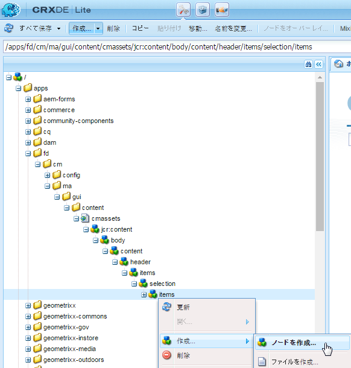
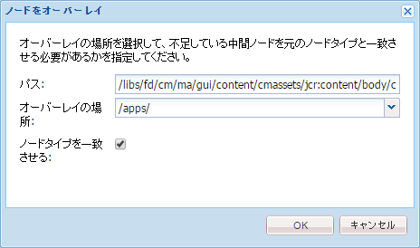

# アセット一覧表示画面へのカスタムアクションの追加 {#add-custom-action-to-the-asset-listing-view}

>[!CAUTION]
>
>AEM 6.4 の拡張サポートは終了し、このドキュメントは更新されなくなりました。 詳細は、 [技術サポート期間](https://helpx.adobe.com/jp/support/programs/eol-matrix.html). サポートされているバージョンを見つける [ここ](https://experienceleague.adobe.com/docs/?lang=ja).

## 概要 {#overview}

Correspondence Management ソリューションを使用すると、アセットを管理ユーザーインターフェイスにカスタムアクションを追加できます。

次の目的で、アセット一覧表示にカスタムアクションを追加できます。

* 1 つ以上のアセットタイプまたはレター
* 1 つ、複数のアセット/レターを選択した場合、または選択しない場合に実行（アクション/コマンドがアクティブになる）

このカスタマイズは、「フラットPDFをダウンロード」コマンドをレターのアセット一覧表示に追加するシナリオで実演されます。 このカスタマイズのシナリオを活用し、ユーザーが選択した 1 つのレターのフラット PDF をダウンロードできるようにします。

### 前提条件 {#prerequisites}

次のシナリオまたは類似のシナリオを完了するには、次の知識が必要です。

* CRX
* JavaScript
* Java

## シナリオ：レターのフラットPDF版をダウンロードするコマンドをレターリストのユーザーインターフェイスに追加する {#addcommandtoletters}

以下の手順では、「フラットPDFをダウンロード」コマンドをレターのアセット一覧表示に追加し、選択したレターのフラットPDFをユーザーがダウンロードできるようにします。 これらの手順を適切なコードとパラメーターと共に使用して、データディクショナリやテキストなど、別のアセットに対して他の機能を追加できます。

Correspondence Management をカスタマイズして、ユーザーがフラットPDFのレターをダウンロードできるようにするには、次の手順を実行します。

1. `https://[server]:[port]/[ContextPath]/crx/de` にアクセスし、管理者としてログインします。

1. 次の手順で、apps フォルダーに、selection フォルダー内の items フォルダーに類似したパス／構造で items という名前のフォルダーを作成します。

   1. 次のパスにある **[!UICONTROL items]** フォルダーを右クリックし、「**[!UICONTROL ノードをオーバーレイ]**」を選択します。

      `/libs/fd/cm/ma/gui/content/cmassets/jcr:content/body/content/header/items/selection/items`

      >[!NOTE]
      >
      >このパスは、1 つ以上のアセット/レターの選択に対応するアクションの作成に固有です。 選択を行わずに動作するアクションを作成する場合は、代わりに次のパスのオーバーレイノードを作成し、それに応じて残りの手順を完了する必要があります。
      >
      >
      >`/libs/fd/cm/ma/gui/content/cmassets/jcr:content/body/content/header/items/default/items`

      

   1. ノードをオーバーレイダイアログに次の値が表示されていることを確認します。

      **[!UICONTROL パス：]** /libs/fd/cm/ma/gui/content/cmassets/jcr:content/body/content/header/items/selection/items

      **[!UICONTROL 場所：]** /apps/

      **[!UICONTROL ノードタイプを一致させる：]**&#x200B;選択済み

      

   1. 「**[!UICONTROL OK]**」をクリックします。apps フォルダーにフォルダー構造が作成されます。

      「**[!UICONTROL すべて保存]**」をクリックします。

1. 次の手順を使用し、新規作成した items フォルダーに特定のアセットのカスタムのボタン／アクション用のノードを追加します（例：downloadFlatPDF）。

   1. **[!UICONTROL items]**&#x200B;フォルダーを右クリックし、**[!UICONTROL 作成]**／**[!UICONTROL ノードを作成]**&#x200B;を選択します。

   1. ノードを作成ダイアログに次の値が表示されていることを確認し、「**[!UICONTROL OK]**」をクリックします。

      **[!UICONTROL 名前：]** downloadFlatPDF（または、このプロパティに与える任意の名前）

      **[!UICONTROL 型：]** nt:unstructured

   1. 新しく作成したノードをクリックします（ここでは downloadFlatPDF）。CRX にノードのプロパティが表示されます。
   1. 次のプロパティをノード（ここでは downloadFlatPDF）に追加し、「**[!UICONTROL すべて保存]**」をクリックします。

   <table> 
    <tbody> 
    <tr> 
    <td><strong>名前</strong></td> 
    <td><strong>型</strong></td> 
    <td><strong>値と説明</strong></td> 
    </tr> 
    <tr> 
    <td>class</td> 
    <td>文字列</td> 
    <td>foundation-collection-action</td> 
    </tr> 
    <tr> 
    <td>foundation-collection-action</td> 
    <td>文字列</td> 
    <td><p>{"target": ".cq-manageasset-admin-childpages", "activeSelectionCount": "single","type": "LETTER"}<br /> <br /> <br /> <strong>activeSelectionCount</strong> は、単一または複数に設定し、カスタムアクションが実行されるアセットとして、単一または複数のアセットの選択を許可できます。</p> <p><strong>type</strong> は次のうち 1 つまたは複数（複数の場合はカンマ区切り）です。LETTER,TEXT,LIST,CONDITION,DATADICTIONARY</p> </td> 
    </tr> 
    <tr> 
    <td>icon</td> 
    <td>文字列</td> 
    <td>icon-download<br /> <br />Correspondence Management のコマンド／メニューの左側に表示されるアイコンです。使用できるその他のアイコンと設定については、<a href="https://docs.adobe.com/docs/en/aem/6-3/develop/ref/coral-ui/coralui3/Coral.Icon.html" target="_blank">CoralUI Icons ドキュメント</a>を参照してください。<br /> </td> 
    </tr> 
    <tr> 
    <td>jcr:primaryType</td> 
    <td>名前</td> 
    <td>nt:unstructured</td> 
    </tr> 
    <tr> 
    <td>rel</td> 
    <td>文字列</td> 
    <td>download-flat-pdf-button</td> 
    </tr> 
    <tr> 
    <td>sling:resourceType</td> 
    <td>文字列</td> 
    <td>granite/ui/components/endor/actionbar/button</td> 
    </tr> 
    <tr> 
    <td>text</td> 
    <td>文字列</td> 
    <td>Download Flat PDF（または任意のラベル）<br /> <br />アセット一覧表示のインターフェイスに表示されるコマンド。</td> 
    </tr> 
    <tr> 
    <td>title</td> 
    <td>String</td> 
    <td>Download a flat PDF of the selected letter（または任意のラベルや代替テキスト）<br /> <br />このタイトルは、カスタムコマンドの上にカーソルを置いたときに Correspondence Management に表示される代替テキストです。</td> 
    </tr> 
    </tbody> 
    </table>

1. 次の手順で、apps フォルダーに、admin フォルダー内の items フォルダーに類似したパス／構造で js という名前のフォルダーを作成します。

   1. 次のパスにある **[!UICONTROL js]** フォルダーを右クリックし、「**[!UICONTROL ノードをオーバーレイ]**」を選択します。 &quot;

      `/libs/fd/cm/ma/gui/components/admin/clientlibs/admin/js`

   1. ノードをオーバーレイダイアログに次の値が表示されていることを確認します。

      **[!UICONTROL パス：]** /libs/fd/cm/ma/gui/components/admin/clientlibs/admin/js

      **[!UICONTROL 場所：]** /apps/

      **[!UICONTROL ノードタイプを一致させる：]**&#x200B;選択済み

   1. 「**[!UICONTROL OK]**」をクリックします。apps フォルダーにフォルダー構造が作成されます。「**[!UICONTROL すべて保存]**」をクリックします。

1. 次の手順を使用し、formaction.js という名前のファイルを js フォルダーに作成し、ボタンのアクション処理のコードを指定します。

   1. 次のパスにある **[!UICONTROL js]**&#x200B;フォルダーを右クリックし、**[!UICONTROL 作成／ファイルを作成]**&#x200B;を選択します。

      `/apps/fd/cm/ma/gui/components/admin/clientlibs/admin/js`

      ファイルに formaction.js という名前を付けます。

   1. ファイルをダブルクリックして、CRX で開きます。
   1. formaction.js ファイル（/apps 階層の下）で、formaction.js ファイルのコードを次の場所にコピーします。

      `/libs/fd/cm/ma/gui/components/admin/clientlibs/admin/js/formaction.js`

      次に、formaction.js（/apps 階層の下）ファイルの最後に以下のコードを追加し、「**[!UICONTROL すべて保存]**」をクリックします。

      ```
      /* Action url for xml file to be added.*/
      var ACTION_URL = "/apps/fd/cm/ma/gui/content/commons/actionhandlers/items/letterpdfdownloader.html";
      
      /* File upload handling*/
      var fileSelectedHandler = function(e){
          if(e && e.target && e.target.value)
              $(".downloadLetterPDFBtn").removeAttr('disabled');
          else
              $(".downloadLetterPDFBtn").attr('disabled','disabled');
      }
      
      /*Handing of Download button in pop up.*/
      var downloadClickHandler = function(){
          $('#downloadLetterPDFDilaog').modal("hide");
          var element = $('.foundation-selections-item');
          var path = $(element).data("path");
          $("#fileUploadForm").attr('action', ACTION_URL + "?letterId="+path).submit();
      }
      
      /*Click handling on action button.*/
      $(document).on("click",'.download-flat-pdf-button',function(e){
          $("#uploadSamepledata").val("");
           if($('#downloadLetterPDFDilaog').length == 0){
              $(document).on("click",".downloadLetterPDFBtn",downloadClickHandler);
              $(document).on("change","#uploadSamepledata",fileSelectedHandler);
              $("body").append(downloadLetterPDFDilaog);
          }
            $('#downloadLetterPDFDilaog').modal("show");
      });
      
      /*Download popup.*/
      var downloadLetterPDFDilaog = '<div id="downloadLetterPDFDilaog" class="coral-Modal notice " role="dialog"  aria-hidden="true">'+
          '<form id="fileUploadForm" method="POST" enctype="multipart/form-data">'+
              '<div class="coral-Modal-header">'+
                  '<h2 class="coral-Modal-title coral-Heading coral-Heading--2" id="modal-header1443020790107-label" tabindex="0">Download Letter as PDF.</h2>'+
                  '<button type="button" class="coral-MinimalButton coral-Modal-closeButton" data-dismiss="modal">×</button>'+
              '</div>'+
              '<div class="coral-Modal-body" id="modal-header1443020790107-message" role="document" tabindex="0">'+
                  '<div class="coral-Modal-message">'+
                      '<p></p>'+
                  '</div>'+
                  '<div class="coral-Modal-uploader">'+
                      '<p>Select sample data for letter.</p>'+
                      '<input type="file" id="uploadSamepledata" name="file" accept=".xml" size="70px">'+
                  '</div>'+
              '</div>'+
           '</form>'+
              '<div class="coral-Modal-footer">'+
                  '<button type="button" class="coral-Button" data-dismiss="modal">Cancel</button>'+
                  '<button type="button" class="coral-Button coral-Button--primary downloadLetterPDFBtn" disabled="disabled">Download</button>'+
              '</div>'+
      '</div>';
      ```

      この手順で追加したコードは libs フォルダーのコードを上書きするので、前のコードを/apps ブランチの formaction.js ファイルにコピーします。 /libs ブランチから/apps ブランチにコードをコピーすると、以前の機能も確実に機能します。

      上記のコードは、この手順で作成したコマンドを文字固有で処理するためのコードです。 他のアセットを処理するアクションを作成する場合は、JavaScript コードを変更します。

1. 次の手順で、apps フォルダーに、actionhandlers フォルダー内の items フォルダーに類似したパス／構造で items という名前のフォルダーを作成します。

   1. 次のパスにある **[!UICONTROL items]** フォルダーを右クリックし、「**[!UICONTROL ノードをオーバーレイ]**」を選択します。

      `/libs/fd/cm/ma/gui/content/commons/actionhandlers/items/`

   1. ノードをオーバーレイダイアログに次の値が表示されていることを確認します。

      **[!UICONTROL パス：]** /libs/fd/cm/ma/gui/content/commons/actionhandlers/items/

      **[!UICONTROL 場所：]** /apps/

      **[!UICONTROL ノードタイプを一致させる：]**&#x200B;選択済み

   1. 「**[!UICONTROL OK]**」をクリックします。apps フォルダーにフォルダー構造が作成されます。

   1. 「**[!UICONTROL すべて保存]**」をクリックします。

1. 次の手順で、新しく作成した items ノードに、特定のアセットのカスタムのボタン／アクション用のノードを追加します（例：letterpdfdownloader）。

   1. items フォルダーを右クリックして、「**[!UICONTROL 作成／ノードを作成]**」を選択します。

   1. ノードを作成ダイアログに次の値が表示されていることを確認し、「**[!UICONTROL OK]**」をクリックします。

      **[!UICONTROL 名前：]** letterpdfdownloader（またはこのプロパティに与える任意の名前。一意の名前である必要があります。これ以外の名前を使用する場合、formaction.js ファイルの ACTION_URL の変数にも同一の名前を指定する必要があります）。

      **[!UICONTROL 型：]** nt:unstructured

   1. 新しく作成したノードをクリックします（ここでは downloadFlatPDF）。CRX にノードのプロパティが表示されます。

   1. 次のプロパティをノード（ここでは letterpdfdownloader）に追加し、「**[!UICONTROL すべて保存]**」をクリックします。

      | **名前** | **種類** | **値** |
      |---|---|---|
      | sling:resourceType | 文字列 | fd/cm/ma/gui/components/admin/clientlibs/admin |

1. 次の場所に、コマンドのアクション処理のコードを指定した POST.jsp という名前のファイルを作成します。

   /apps/fd/cm/ma/gui/components/admin/clientlibs/admin

   1. 次のパスにある **[!UICONTROL admin]** フォルダーを右クリックし、**[!UICONTROL 作成／ファイルを作成]**&#x200B;を選択します

      /apps/fd/cm/ma/gui/components/admin/clientlibs/admin

      ファイルに POST.jsp という名前を付けます。（POST.jsp 以外のファイル名を使用しないでください）。

   1. **[!UICONTROL POST.jsp]** ファイルをダブルクリックして、CRX で開きます。
   1. POST.jsp ファイルに次のコードを追加して、「**[!UICONTROL すべて保存]**」をクリックします。

      このコードはレターレンダリングサービスに固有です。 他のアセットの場合は、そのアセットの Java ライブラリをこのコードに追加します。 AEM Forms API について詳しくは、 [AEM Forms API](https://adobe.com/go/learn_aemforms_javadocs_63_en).

      AEM ライブラリについて詳しくは、AEM [コンポーネント](/help/sites-developing/components.md)を参照してください。

      ```xml
      /*Import libraries. Here we are downloading letter flat pdf with input xml data so we require letterRender Api. For any other Module functionality we need to first import that library. */            
      <%@include file="/libs/foundation/global.jsp"%>
      <!DOCTYPE html lang="en" PUBLIC "-//W3C//DTD XHTML 1.1//EN" "https://www.w3.org/TR/xhtml11/DTD/xhtml11.dtd">
      <%@page import="com.adobe.icc.ddg.api.*"%>
      <%@page import="com.adobe.icc.dbforms.obj.*"%>
      <%@page import="com.adobe.icc.render.obj.*" %>
      <%@page import="com.adobe.icc.services.api.*" %>
      <%@page import="org.apache.sling.api.resource.*" %>
      <%@page import="java.io.File" %>
      <%@page import="java.util.*" %>
      <%@page import="com.adobe.livecycle.content.appcontext.AppContextManager"%>
      <%@page import=" com.adobe.icc.dbforms.exceptions.ICCException"%>
      <%@page import="java.io.InputStream" %>
      <%@page import="java.io.FileInputStream" %>
      <%@page import="org.apache.commons.io.IOUtils" %>
      <%@page session="false" contentType="text/html; charset=utf-8"%>
      <%@taglib prefix="sling" uri="https://sling.apache.org/taglibs/sling/1.0"%>
      <%@taglib prefix="cq" uri="https://www.day.com/taglibs/cq/1.0" %>
       <%@page session="false" contentType="text/html; charset=utf-8"%>
      <%
         AppContextManager.setCurrentAppContext("/content/apps/cm");
         /*Get letter id sent in js file.*/
          String letterId = request.getParameter("letterId");
          if(letterId.lastIndexOf("?") != -1)
              letterId = letterId.substring(0, letterId.indexOf("?"));
          String fileName = null;
          String letterName = null;
          InputStream inputStream = null;
          /*Get xml file data*/
          if (slingRequest.getRequestParameter("file") != null)
              inputStream = slingRequest.getRequestParameter("file").getInputStream();
          if(letterId != null){
              String xmlData = null;
              try{
                  xmlData = IOUtils.toString(inputStream, "UTF-8");
              }
              catch (Exception e) {
                  log.error("Xml data does not exists.");
              }
              /*letter Name from letter letter id.*/
              letterName = letterId.substring(letterId.lastIndexOf("/")+1);
              /*Invoking letter render services API.*/
              LetterRenderService letterRenderService = sling.getService(LetterRenderService.class);
              /*using CM renderLetter api to get pdfbytes.*/
              PDFResponseType  pdfResponseType= letterRenderService.renderLetter(letterId,xmlData,true,false,false,false);
              byte[] bytes = null;
              /*Downloading pdf bytes as pdf.*/
              if(pdfResponseType != null && pdfResponseType.getFile() != null){
                  bytes = pdfResponseType.getFile().getDocument();
                  /*set the response header to enable download*/
                  response.setContentType("application/OCTET-STREAM");
                  response.setHeader("Content-Disposition", "attachment;filename=\"" + letterName + ".pdf\"");
                  response.setHeader("Pragma", "cache");
                  response.setHeader("Cache-Control", "private");
                  out.clear();
                  response.getOutputStream().write(bytes);
              }
          }
          else{
              log.error("Letter id does not exists.");
          }
      %>
      ```

## カスタム機能によるレターのフラットな PDF のダウンロード {#download-flat-pdf-of-a-letter-using-the-custom-functionality}

レターのフラットな PDF のダウンロード用にカスタム機能を追加した後、次の手順を使用して、選択したレターのフラットな PDF 版をダウンロードできます。

1. `https://[server]:[port]/[ContextPath]/projects.html` に移動し、ログインします。

1. **[!UICONTROL Forms／レター]**&#x200B;を選択します。Correspondence Management には、システムで使用可能なレターが一覧表示されます。
1. 「**[!UICONTROL 選択]**」をクリックし、選択するレターをクリックします。
1. **[!UICONTROL 詳細]**／&lt;Download Flat PDF>（この記事の解説に従って作成したカスタム機能）を選択します。PDF でレターをダウンロードするダイアログが表示されます。

   メニュー項目名、機能、代替テキストは、[レターのフラットな PDF バージョンをダウンロードするためのコマンドをレターリストのユーザーインターフェイスに追加するシナリオ](#addcommandtoletters)で作成したカスタマイズに準じます。

   

1. 「PDF でレターをダウンロード」ダイアログで、PDF に入力するデータから関連する XML を選択します。

   >[!NOTE]
   >
   >フラットな PDF としてレターをダウンロードする前に、「**[!UICONTROL レポートの作成]**」オプションで、レターのデータを保持した状態の XML ファイルを作成することができます。

   

   フラットな PDF としてレターがコンピューターにダウンロードされます。
