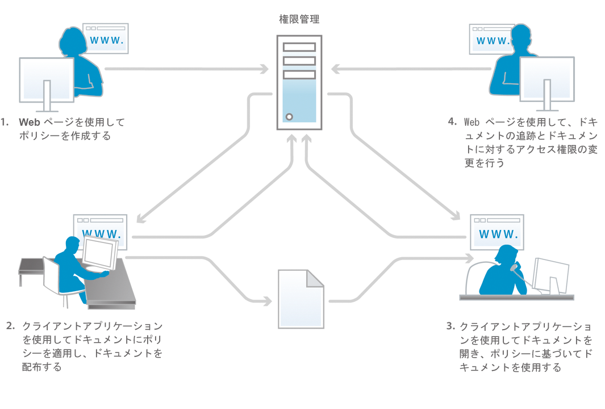
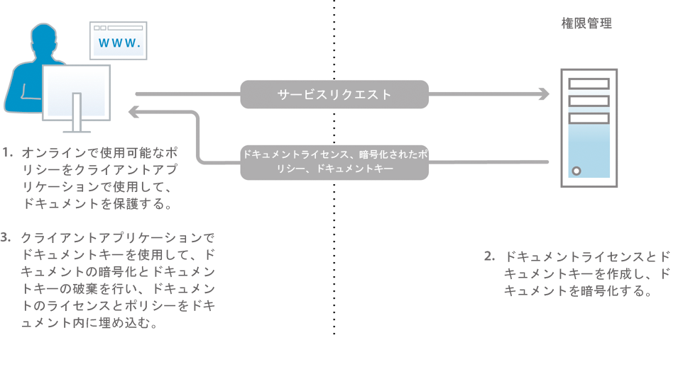
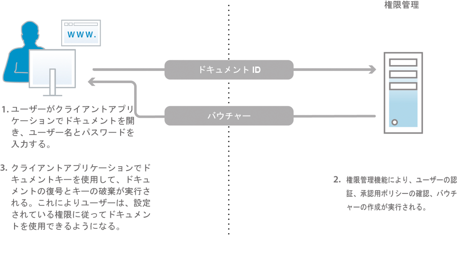

# ドキュメントセキュリティについて {#about-document-security}

>[!CAUTION]
>
>AEM 6.4 の拡張サポートは終了し、このドキュメントは更新されなくなりました。 詳細は、 [技術サポート期間](https://helpx.adobe.com/jp/support/programs/eol-matrix.html). サポートされているバージョンを見つける [ここ](https://experienceleague.adobe.com/docs/?lang=ja).

Document Security を使用すると、許可されたユーザーのみがドキュメントを使用できるようになります。 Document Security を使用すると、サポートされている形式で保存した情報を安全に配布できます。 次のファイル形式がサポートされています。

* Adobe PDFファイル
* Microsoft® Word、Excel および PowerPoint ファイル

サポートされるファイルタイプをポリシーで保護する方法の詳細については、 [追加の Document Security 情報](https://www.adobe.com/go/learn_aemforms_doc_security_63).

Document Security を使用すると、事前定義された機密設定を簡単に作成、保存、ドキュメントに適用できます。 また、情報がユーザーの手の届かない範囲に広がらないように、ドキュメントを配布した後の受信者のドキュメントの使用方法を監視および制御することもできます。

ポリシーを使用してドキュメントを保護できます。 A *ポリシー* は、機密設定と許可されたユーザーのリストを含む情報の集まりです。 ポリシーで指定する機密設定によって、ポリシーを適用したドキュメントを受信者が使用する方法が決まります。 例えば、受信者がテキストの印刷やコピー、テキストの編集、または保護されたドキュメントへの署名やコメントの追加を行えるかどうかを指定できます。

Document Security ユーザーは、エンドユーザーの Web ページを使用してポリシーを作成します。 管理者は、Document Security Web ページを使用して、許可されたすべてのユーザーが使用できる共有ポリシーを含むポリシーセットを作成します。

ポリシーは Document Security に保存されますが、クライアントアプリケーションを使用してドキュメントに適用します。 ポリシーをPDF・ドキュメントに適用する方法について詳しくは、 *Acrobat Help*. Microsoft Office など、他のアプリケーションを使用してポリシーを適用する場合は、 *Acrobat Reader DC Extensions ヘルプ* アプリケーションの

ドキュメントにポリシーを適用すると、ポリシーで指定された機密設定によって、ドキュメントに含まれる情報が保護されます。 また、機密設定によって、PDFドキュメント内のファイル（テキスト、オーディオ、ビデオ）も保護されます。 ポリシーで保護されたドキュメントは、ポリシーで承認された受信者に配布できます。

**ドキュメントのアクセス制御と監査**

ポリシーを使用してドキュメントを保護すると、ドキュメントを配布した後でも、そのドキュメントを継続的に制御できます。 ドキュメントを監視し、ポリシーを変更し、ユーザーがドキュメントにアクセスし続けないようにしたり、ドキュメントに適用されるポリシーを切り替えたりできます。

Document Security を使用すると、ポリシーで保護されたドキュメントを監視し、許可されたユーザーや許可されていないユーザーがドキュメントを開こうとした場合などのイベントを追跡できます。

**コンポーネント**

Document Security は、サーバーとユーザーインターフェイスで構成されます。

**サーバー：** Document Security がユーザー認証、ポリシーのリアルタイム管理、機密性の適用などのトランザクションを実行する際に使用する中央コンポーネントです。 また、サーバーは、ポリシー、監査レコード、その他の関連情報の中央リポジトリも提供します。

**Web ページ：** ポリシーを作成し、ポリシーで保護されたドキュメントを管理し、ポリシーで保護されたドキュメントに関連するイベントを監視するインターフェイス。 また、管理者は、招待ユーザーに対するユーザー認証、監査、メッセージングなどのグローバルオプションを設定したり、招待ユーザーアカウントを管理したりできます。

この図の手順は次のとおりです。

1. ドキュメント所有者は、Web ページを使用してポリシーを作成します。 ドキュメントの所有者は、自分だけがアクセスできる個人用ポリシーを作成できます。 管理者およびポリシーセットコーディネーターは、許可されたユーザーがアクセスできるポリシーセット内に共有ポリシーを作成できます。
1. ドキュメントの所有者がポリシーを適用し、ドキュメントを保存して配布します。 ドキュメントは、E メール、ネットワークフォルダー、Web サイトのいずれかを通じて配布できます。
1. 受信者は、適切なクライアントアプリケーションでドキュメントを開きます。 受信者は、ポリシーに従ってドキュメントを使用できます。
1. ドキュメント所有者、ポリシーセットコーディネーター、または管理者は、Web ページを使用してドキュメントを追跡し、ドキュメントへのアクセスを変更できます。

## Document Security ユーザーについて {#about-document-security-users}

様々なタイプのユーザーが Document Security を使用して様々なタスクを実行します。

* システム管理者またはその他の情報システム (IS) 担当者が Document Security をインストールして設定します。 このユーザーは、サーバー、Web ページ、ポリシーおよびドキュメントのグローバル設定を行う役割も果たします。

   これらの設定には、例えば、基本的な Document Security URL、監査とプライバシー通知、招待ユーザー登録通知、デフォルトのオフラインリース期間などが含まれます。

* Document Security 管理者は、ポリシーおよびポリシーセットを作成し、必要に応じてポリシーで保護されたユーザー向けドキュメントを管理します。 また、招待ユーザーアカウントを作成し、システム、ドキュメント、ユーザー、ポリシー、ポリシーセット、カスタムイベントを監視します。 また、グローバルサーバーの設定、Web ページとポリシーの設定を、システム管理者と共に行うこともできます。

   管理者は、管理コンソールの「ユーザー管理」領域で、ユーザーに次の役割を割り当てることができます。 これらのロールを割り当てられたユーザーは、管理コンソールの Document Security ユーザーインターフェイス領域でタスクを実行します。

   **Document Security の上級管理者**

   このロールを持つユーザーは、管理コンソールのすべての Document Security 設定にアクセスできます。 これらの権限は、役割に関連付けられています。

   * 設定を管理
   * ポリシーの管理
   * ポリシーセットの管理
   * ドキュメントを管理
   * ドキュメント発行者の管理
   * 招待ユーザーとローカルユーザーの管理
   * イベントを表示
   * 委任
   * 外部ユーザーの招待

   **Document Security 管理者**

   このロールを持つユーザーは、管理コンソールの Document Security セクションの設定ページを使用して、Document Security サーバーを設定できます。 この権限は、役割の「設定の管理」に関連付けられています。

   >[!NOTE]
   >
   >この役割を持つユーザーは、管理コンソールにログインして設定関連の設定を編集できるように、管理コンソールのユーザー役割も持っている必要があります。

   **ドキュメントセキュリティポリシーセット管理者**

   このロールを持つユーザーは、管理コンソールの Document Security セクションを使用して、他のユーザーのポリシーを編集したり、ポリシーセットを作成、編集および削除したりできます。 ポリシーセット管理者は、ポリシーセットを作成する際に、そのポリシーセットにポリシーセットコーディネーターを割り当てることができます。 これらの権限は、役割に関連付けられています。

   * ポリシーの管理
   * ポリシーセットの管理
   * ドキュメントを管理
   * ドキュメント発行者の管理
   * イベントを表示
   * 委任

   >[!NOTE]
   >
   >この役割を持つユーザーは、管理コンソールにログインして設定関連の設定を編集できるように、管理コンソールのユーザー役割も持っている必要があります。

   **Document Security 招待ユーザーとローカルユーザーの管理**

   このロールを持つユーザーは、関連する Document Security Web ページで、招待ユーザーとローカルユーザーをすべて管理するために必要なタスクを実行できます。 これらの権限は、役割に関連付けられています。

   * 招待ユーザーとローカルユーザーの管理
   * 外部ユーザーの招待
   * エンドユーザー Web ページへのアクセス

   >[!NOTE]
   >
   >この役割を持つユーザーは、管理コンソールにログインして設定関連の設定を編集できるように、管理コンソールのユーザー役割も持っている必要があります。

   **Document Security ユーザーの招待**

   この役割を持つユーザーは、ユーザーを招待できます。 これらの権限は、役割に関連付けられています。

   * 外部ユーザーの招待
   * エンドユーザー Web ページへのアクセス

   **Document Security エンドユーザー**

   このロールを持つユーザーは、Document Security のエンドユーザー Web ページにアクセスできます。 また、この役割を管理者に割り当てて、管理者がエンドユーザーページを使用してポリシーを作成できるようにすることもできます。 この権限は、役割のエンドユーザー Web ページにアクセスする権限に関連付けられています。

* 有効な Document Security アカウントを持つ組織内のユーザーは、独自のポリシーを作成し、ポリシーを使用してドキュメントを保護し、ポリシーで保護されたドキュメントを追跡および管理し、ドキュメントに関連するイベントを監視します。
* ポリシーセットコーディネーターは、ドキュメントの管理、イベントの表示、他のポリシーセットコーディネーターの管理（権限に基づく）をおこないます。 管理者は、ユーザーを特定のポリシーセットのポリシーセットコーディネーターとして指定します。
* 組織外のユーザー（例えば、ビジネスパートナー）は、Document Security の Document Security ディレクトリに存在する場合、管理者がアカウントを作成した場合、または自動電子メール招待プロセスで Document Security に登録した場合、ポリシーで保護されたドキュメントを使用できます。 管理者がアクセス設定を有効にする方法に応じて、招待ユーザーは、ドキュメントにポリシーを適用する権限、ポリシーの作成、変更、削除、他の外部ユーザーにポリシーで保護されたドキュメントの使用を招待する権限を持つことができます。
* 開発者は、AEM forms SDK を使用して、カスタムアプリケーションを Document Security と統合します。

Document Security 管理者は、User Management で次の権限を使用してカスタムロールを作成できます。

* Document Security 設定の管理
* Document Security 招待ユーザーとローカルユーザーの管理
* Document Security ポリシーセットの管理
* Document Security ポリシーセットの管理
* Document Security サーバーイベントの表示
* Document Security ポリシーの所有者の変更

## ポリシーとポリシーで保護されたドキュメント {#policies-and-policy-protected-documents}

*ポリシー*&#x200B;は、一連の機密設定、およびポリシーが適用されるドキュメントにアクセスできるユーザーを定義します。また、ポリシーを使用すると、ドキュメントに対する権限を動的に変更できます。 これにより、ドキュメントを保護するユーザーは、機密設定を変更してドキュメントへのアクセスを取り消したり、ポリシーを切り替えたりできます。

Adobe Acrobat® Pro とAcrobat Standardを使用して、PDFドキュメントにポリシー保護を適用できます。 適切なAcrobat Reader DC拡張子がインストールされたクライアントアプリケーションを使用することで、Microsoft Word、Excel、PowerPoint ファイルなど、他のファイルタイプにポリシー保護を適用できます。

### ポリシーの仕組み {#how-policies-work}

ポリシーには、許可されたユーザーに関する情報と、ドキュメントに適用する機密設定が含まれます。 ユーザーは、組織内の任意のユーザーに加えて、アカウントを持つ組織外のユーザーになることができます。 管理者がユーザー招待機能を有効にした場合、新しいユーザーをポリシーに追加することも可能なので、登録招待用の E メールプロセスが開始されます。

ポリシーの機密設定によって、受信者がドキュメントを使用する方法が決まります。 例えば、受信者がテキストの印刷やコピー、変更、または保護されたドキュメントへの署名やコメントの追加を行えるかどうかを指定できます。 同じポリシーで、特定のユーザーに対して異なる機密設定を指定することもできます。

>[!NOTE]
>
>ポリシーを通じて適用される機密設定は、パスワードまたは証明書セキュリティオプションを使用してAcrobatのPDFドキュメントに適用された可能性のある設定よりも優先されます。 ( 詳しくは、 Acrobatヘルプを参照してください )。

ユーザーと管理者は、Document Security Web ページを使用してポリシーを作成します。 1 つのドキュメントに適用できるポリシーは、一度に 1 つだけです。 ポリシーを適用するには、次のいずれかの方法を使用します。

* Acrobatまたは他のクライアントアプリケーションでドキュメントを開き、ドキュメントを保護するポリシーを選択します。
* ドキュメントを E メールの添付ファイルとしてMicrosoft Outlook で送信します。 この場合、ポリシーのリストからポリシーを選択するか、Acrobatがデフォルトの機密設定で作成する自動生成ポリシーを選択して、E メールメッセージの受信者のみのドキュメントを保護できます。

ポリシーは、クライアントアプリケーションを使用してドキュメントから削除できます。

この図の手順は次のとおりです。

1. ドキュメント所有者は、サポートされるクライアントアプリケーションのドキュメントを、オンラインでの使用を許可するポリシーで保護します。
1. Document Security は、ドキュメントライセンスとドキュメントキーを作成し、ポリシーを暗号化します。 ドキュメントライセンス、暗号化されたポリシー、ドキュメントキーがクライアントアプリケーションに返されます。
1. ドキュメントはドキュメントキーで暗号化され、ドキュメントキーは破棄されます。 ドキュメントにライセンスとポリシーが埋め込まれました。 これらのタスクは、サポートされるクライアントアプリケーションで実行されます。

PDFをドキュメントに適用すると、ポリシードキュメントに含まれるファイル（テキスト、オーディオ、ビデオ）を含むドキュメントの情報は、ポリシーで指定された機密設定で保護されます。 Document Security は、ライセンスと暗号化情報を生成し、ドキュメントに埋め込みます。 ドキュメントを配布すると、Document Security は、ドキュメントを開こうとした受信者を認証し、ポリシーで指定されている権限に従ってアクセスを許可できます。

オフラインでの使用が有効になっている場合、受信者は、ポリシーで指定された期間に対して、ポリシーで保護されたドキュメントをオフライン（アクティブなインターネットやネットワークに接続していない）で使用することもできます。

### ポリシーで保護されたドキュメントの動作方法 {#how-policy-protected-documents-work}

ポリシーで保護されたドキュメントを開いて使用するには、ポリシーに自分の名前を受信者として含め、有効な Document Security アカウントを持っている必要があります。 PDFドキュメントの場合は、AcrobatまたはAdobe Reader®が必要です。 その他のファイルタイプの場合は、Acrobat Reader DC拡張子がインストールされたファイルに適したアプリケーションが必要です。

ポリシーで保護されたドキュメント、Acrobat、Adobe ReaderまたはAcrobat Reader DCの拡張機能を開こうとすると、Document Security に接続して認証を受けます。 その後、ログオンに進むことができます。 ドキュメントの使用が監査中の場合は、通知メッセージが表示されます。 Document Security は、許可するドキュメント権限を決定した後、ドキュメントの復号化を管理します。 その後、ポリシーの機密設定に従ってドキュメントを使用できます。

この図の手順は次のとおりです。

1. ドキュメントユーザーは、サポートされているクライアントアプリケーションでドキュメントを開き、サーバーで認証します。 ドキュメント識別子は Document Security サーバーに送信されます。
1. Document Security は、ユーザーを認証し、ポリシーで認証を確認し、割引券を作成します。 割引券（ドキュメントキーと権限を含む）がクライアントアプリケーションに返されます。
1. ドキュメントはドキュメントキーで復号化され、ドキュメントキーは破棄されます。 その後、ポリシーの機密設定に従ってドキュメントを使用できます。 これらのタスクは、サポートされるクライアントアプリケーションで実行されます。

次の条件下でドキュメントを引き続き使用できます。

* 無期限、またはポリシーで指定された有効期間
* 管理者またはポリシーを適用したユーザーがドキュメントへのアクセスを無効にするか、ポリシーを変更するまで

ポリシーでオフラインアクセスが許可されている場合は、ポリシーで保護されたドキュメントを（インターネットやネットワークに接続せずに）オフラインで使用することもできます。 ドキュメントを同期するには、まず Document Security にログインする必要があります。 その後、ポリシーで指定されているオフラインリース期間の間、ドキュメントを使用できます。

オフラインリース期間が終了したら、オンラインにしてポリシーで保護されたドキュメントを開くか、クライアントアプリケーションでコマンドを使用して、ドキュメントを Document Security と再び同期する必要があります。 ( *Acrobat Help* または適切な *Acrobat Reader DC Extensions ヘルプ* （詳細は）

「保存」または「名前を付けて保存」メニューコマンドを使用して、ポリシーで保護されたドキュメントのコピーを保存すると、新しいドキュメントに対してポリシーが自動的に適用および適用されます。 新しいドキュメントを開こうとするイベントも監査され、元のドキュメントに対して記録されます。

## ポリシーセット {#policy-sets}

ポリシーセットは、ある共通の目的を持つ一群のポリシーをグループ化するために使用します&#x200B;*。*&#x200B;その後、これらのポリシーセットは、システム内のユーザーのサブセットで使用できるようになります。

各ポリシーセットには、1 つ以上のポリシーセットコーディネーターを関連付けることができます。 ポリシーセットコーディネーターは、管理者、または追加の権限を持つユーザーです。 この *ポリシーセットコーディネーター* は、通常、特定のポリシーセット内のポリシーを最も効果的に作成できる、組織内の専門家です。

ポリシーセットコーディネーターは、次のタスクを実行できます。

* 新しいポリシーの作成
* ポリシーセット内のポリシーを編集および削除します
* ポリシーセット設定を編集
* ポリシーセットコーディネーターの追加と削除
* ポリシーセット内の任意のポリシーまたはドキュメントのポリシーおよびドキュメントイベントを表示します
* ドキュメントへのアクセスを取り消す
* ドキュメントのポリシーを切り替えます。

ポリシーセットは、Document Security 管理 Web ページで、管理者および権限を持つポリシーセットコーディネーターが作成および削除します。

通常、ドメイン内のどのユーザーまたはグループがポリシーセットのポリシーを使用してドキュメントを保護できるかを指定することで、限られた数のユーザーがポリシーセットを使用できるようになります。

Document Security がインストールされると、 *グローバルポリシーセット*. ソフトウェアをインストールした管理者が、このポリシーセットを管理します。
