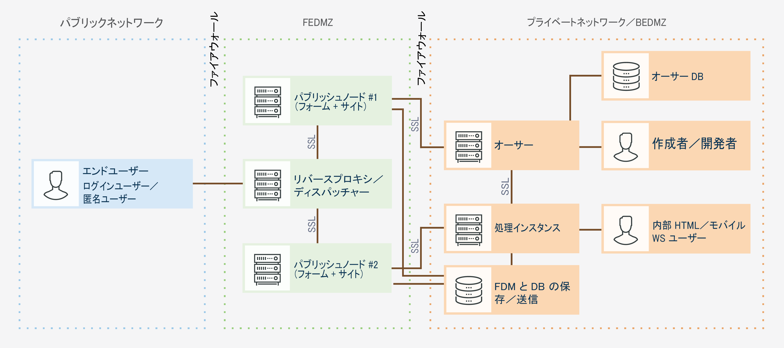
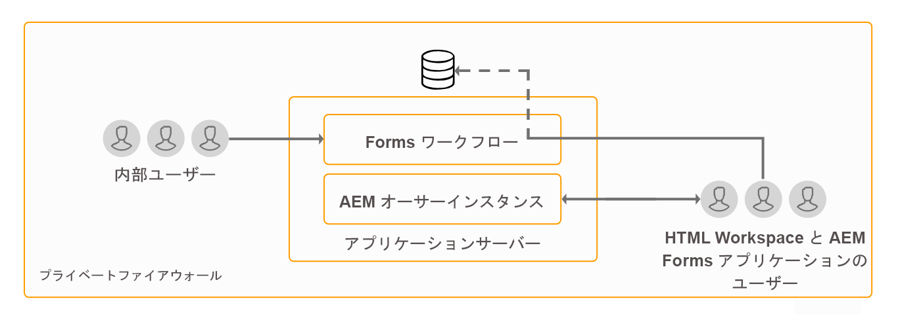
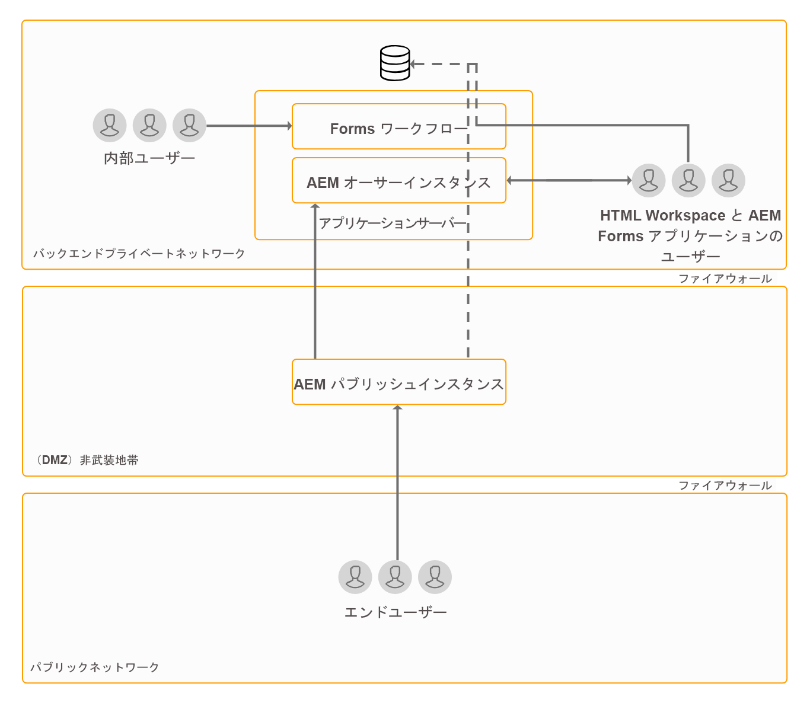
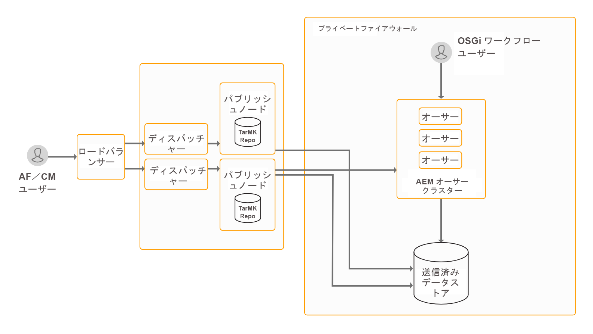
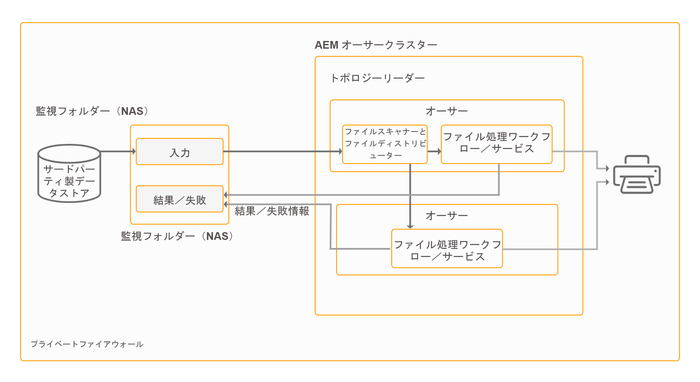
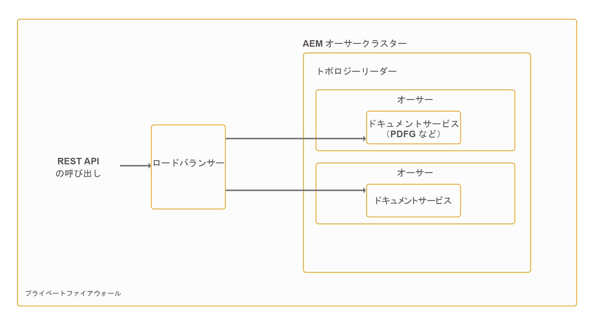

# AEM Forms のアーキテクチャとデプロイメントトポロジー {#architecture-and-deployment-topologies-for-aem-forms}

## アーキテクチャ {#architecture}

AEM Formsは、AEM as a AEMパッケージにデプロイされるアプリケーションです。 このパッケージは、AEM Formsアドオンパッケージと呼ばれます。 AEM Formsアドオンパッケージには、AEM OSGi コンテナにデプロイされるサービス（API プロバイダー）と、AEM Sling フレームワークで管理されるサーブレットまたは JSP（フロントエンドと REST API の両方の機能を提供）の両方が含まれます。 次の図は、このセットアップを示しています。

AEM Forms のアーキテクチャには、次のコンポーネントが含まれています。

* **AEM のコアサービス:** 組み込みアプリケーションに対して提供される AEM の基本サービス。これらのサービスには、JCR 準拠のコンテンツリポジトリ、OSGi サービスコンテナ、ワークフローエンジン、トラストストア、キーストアなどが含まれます。 これらのサービスは AEM Forms アプリケーションで使用できますが AEM Forms パッケージには含まれていません。これらのサービスは、AEMスタック全体の不可欠な要素であり、様々なAEM Formsコンポーネントがこれらのサービスを使用します。
* **Formsサービス：** PDFドキュメントの作成、アセンブリ、配布、アーカイブなど、フォーム関連の機能を提供し、電子署名を追加してドキュメントへのアクセスを制限し、バーコードフォームをデコードします。 これらのサービスは、AEMにコデプロイされたカスタムコードで一般に使用できます。
* **Web レイヤー：**&#x200B;共通のサービスおよびフォームのサービス上に構築された JSP またはサーブレットで、次の機能を提供します。

   * **フロントエンドのオーサリング：**&#x200B;フォームのオーサリングと管理に使用されるユーザーインターフェイス。
   * **フォームのレンダリングおよび送信のフロントエンド**：AEM Forms のエンドユーザー向けユーザーインターフェイス（行政機関の Web サイトにアクセスするユーザー向けのユーザーインターフェイスなど）。これにより、フォームのレンディション（Web ブラウザーでのフォームの表示）と送信機能が提供されます。
   * **** REST API：JSP および サーブレットにより、モバイル SDK フォームなど、HTTP ベースのクライアントによるリモートでの利用向けにフォームサービスのサブセットがエクスポートされます。

**AEM Forms on OSGi:** OSGi 環境上のAEM Formsは、AEM Formsパッケージがデプロイされた標準の AEM オーサーまたは AEM パブリッシュです。 AEM Formsは、 [単一サーバー環境、ファームおよびクラスター化された設定](/help/sites-deploying/recommended-deploys.md). クラスター設定は、AEM オーサーインスタンスでのみ使用できます。

**JEE 上のAEM Forms:** JEE 上のAEM Formsは、JEE スタック上で動作するAEM Formsサーバーです。 この環境には、AEM Formsアドオンパッケージを持つ AEM オーサーと、アプリケーションサーバー上で動作する 1 つの JEE スタックに共同でデプロイされる追加のAEM Forms JEE 機能が含まれています。 JEE 上のAEM Formsは、単一サーバー設定およびクラスター設定で実行できます。 AEM Forms on JEE は、Document Security、プロセス管理、およびAEM FormsにアップグレードするLiveCycleのお客様に対してのみ実行する必要があります。 JEE 上のAEM Formsを使用するシナリオを以下に示します。

* **HTMLワークスペースのサポート (HTMLWorkspace を使用するお客様向け ):** JEE 上のAEM Formsは、処理インスタンスを使用したシングルサインオンを可能にし、処理インスタンスでレンダリングされた特定のアセットを提供し、HTMLワークスペース内でレンダリングされたフォームの送信を処理します。
* **高度なフォーム/インタラクティブ通信データ処理**:高度なプロセス管理機能が必要な複雑な使用例では、JEE 上のAEM Formsを使用して、フォーム/インタラクティブ通信データの追加処理（結果を適切なデータストアに保存）をおこなうことができます。

JEE 上のAEM Formsは、AEMコンポーネントに次のサポートサービスも提供しています。

* **統合されたユーザー管理：** JEE 上のAEM Formsのユーザーを OSGi 上のAEM forms ユーザーとして認識でき、OSGi と JEE の両方のユーザーで SSO を有効にするのに役立ちます。 これは、OSGi 上のAEM forms と JEE 上のAEM Formsの間でシングルサインオンが必要な場合 ( 例えば、HTMLワークスペース ) に必要です。
* **アセットのホスティング：** JEE 上のAEM Formsは、OSGi 上のAEM FormsでレンダリングされたHTML（例えば、アセット 5 フォーム）を提供できます。

AEM Formsオーサリングユーザーインターフェイスは、レコードのドキュメント (DOR)、PDF forms、HTML5 Formsの作成をサポートしていません。 このようなアセットは、スタンドアロンのForms Designer アプリケーションを使用して設計され、AEM Forms Manager に個別にアップロードされます。 また、JEE 上のAEM Formsの場合、フォームを (AEM Forms Workbench の ) アセットとして設計し、JEE サーバー上のAEM Formsにデプロイすることもできます。

AEM Forms on OSGi とAEM Forms on JEE の両方にワークフロー機能があります。 JEE 上のAEM Formsの本格的な Process Management 機能をインストールしなくても、OSGi 上のAEM forms で様々なタスクに対する基本ワークフローを迅速に構築してデプロイできます。 ～には多少の違いがある [OSGi 上のAEM Forms上の Forms 中心のワークフローの機能と、JEE 上のAEM Formsの Process Management 機能](/help/forms/using/capabilities-osgi-jee-workflows.md). OSGi 上のAEM Forms上での Forms 中心のワークフローの開発と管理では、使い慣れたAEM Workflow とAEM Inbox の機能を使用します。

## 用語 {#terminologies}

以下の図は、AEM Forms の一般的なデプロイメント環境で使用される AEM Forms サーバーの様々な設定とそのコンポーネントを示しています。

**オーサーインスタンス：**&#x200B;オーサーインスタンスは、標準の作成者実行モードで稼働する AEM Forms サーバーです。オーサーインスタンスは、OSGi 環境内の JEE 上の AEM Forms にすることも、OSGi 環境内の AEM Forms にすることもできます。このインスタンスは、内部ユーザー、フォームとインタラクティブ通信の設計者、開発者が使用するためのインスタンスです。このインスタンスでは、次の機能を使用することができます。

* **フォームとインタラクティブ通信の作成機能と管理機能：**&#x200B;設計者と開発者は、アダプティブフォームとインタラクティブ通信の作成と編集を行うことができます。また、外部で作成されたフォーム（Adobe Forms Designer で作成されたフォームなど）をアップロードしたり、こうしたアセットを Forms Manager コンソールを使用して管理したりすることができます。
* **フォームとインタラクティブ通信の発行機能：**&#x200B;オーサーインスタンス上でホストされるアセットをパブリッシュインスタンスに発行して、ランタイム操作を実行することができます。AEM の複製機能を使用して、アセットが発行されます。すべてのオーサーインスタンス上で、発行済みフォームを処理インスタンスに手動でプッシュするための複製エージェントを設定し、受信したフォームをパブリッシュインスタンスに対して自動的に複製するための、「*受信時*」トリガーが有効になっている複製エージェントを処理インスタンス上で設定することをお勧めします。

**公開：** パブリッシュインスタンスは、標準のパブリッシュ実行モードで動作するAEM Formsサーバーです。 パブリッシュインスタンスは、フォームベースのアプリケーションを使用するエンドユーザー向けのインスタンスです。例えば、公開されている Web サイトにアクセスしてフォームを送信するユーザーなどが、このインスタンスを使用します。このインスタンスでは、次の機能を使用することができます。

* エンドユーザー用のフォームのレンダリングと送信を行う機能。
* 送信済みフォームの未加工データを処理インスタンスに転送してさらに処理を行い、最終的な記録システムに保存する機能。この機能は、AEM Forms に付属するデフォルトの実装で AEM の逆複製機能を使用して実行されます。代替処理として、最初にフォームデータをローカルに保存するのではなく、フォームデータを処理インスタンスに直接プッシュすることもできます（逆複製を行うには、最初にフォームデータをローカルに保存しておく必要があります）。パブリッシュインスタンス上に機密性の高いデータを保存することを懸念するお客様は、この問題に対処できます [代替実装](/help/forms/using/configuring-draft-submission-storage.md)処理インスタンスは通常、より安全なゾーンに配置されるので、
* インタラクティブ通信とレターのレンダリングと送信：インタラクティブ通信とレターはパブリッシュインスタンス上でレンダリングされ、対応するデータがストレージと後処理用に処理インスタンスに送信されます。 このデータをパブリッシュインスタンス上のローカルの場所に保存して、処理インスタンスに対してこのデータを逆複製することも、このデータをパブリッシュインスタンスに保存することなく、処理インスタンスに直接プッシュすることもできます（デフォルトのオプションは逆複製です）。セキュリティを意識している顧客の場合は、処理インスタンスに直接プッシュするオプションを使用することをお勧めします。

**処理中：** 作成者実行モードで実行され、ユーザーが forms-manager グループに割り当てられていないAEM Formsのインスタンス。 JEE 上のAEM Formsまたは OSGi 上のAEM Formsを処理インスタンスとしてデプロイできます。 フォームのオーサリングおよび管理アクティビティが処理インスタンスで実行されず、オーサーインスタンスでのみ発生するように、ユーザーは割り当てられません。 処理インスタンスでは、次の機能を使用することができます。

* **発行インスタンスから到着した生のフォームデータの処理：** これは、主に、データが届く際にトリガーするAEMワークフローを介して処理インスタンスで実行されます。 このワークフローでは、標準搭載の「フォームデータモデル」ステップを使用して、データまたはドキュメントを適切なデータストアにアーカイブできます。
* **フォームデータを安全な場所に保存する機能：**&#x200B;処理インスタンスには、ファイアウォールの背後に配置されたリポジトリが用意されています。このリポジトリを使用して、ユーザーから隔離された未加工のフォームデータが保存されます。オーサーインスタンス上のフォームデザイナーも、パブリッシュインスタンス上のエンドユーザーも、このリポジトリにアクセスできません。

   >[!NOTE]
   >
   > Adobeでは、AEMリポジトリを使用する代わりに、サードパーティのデータストアを使用して、最終的に処理されたデータを保存することをお勧めします。

* **パブリッシュインスタンスから到着した通信データの保存と後処理：** AEMワークフローは、対応するレター定義のオプションの後処理を実行します。 AEM ワークフローで、最終的な処理済みデータを、適切な外部データストアに保存することができます。

* **HTMLワークスペースのホスティング**:処理インスタンスは、HTMLWorkspace のフロントエンドをホストします。 HTMLワークスペースは、レビューおよび承認プロセスに関連付けられたタスク/グループ割り当ての UI を提供します。

処理インスタンスは、次の理由で、オーサー実行モードで実行するように設定されています。

* 作成者実行モードの場合、パブリッシュインスタンスの未加工のフォームデータを逆複製することができます。デフォルトのデータストレージハンドラーには、リバースレプリケーション機能が必要です。
* パブリッシュインスタンスから届く生のフォームデータを処理する主な手段であるAEM Workflows は、オーサースタイルのシステムで実行することをお勧めします。

## JEE 上の AEM Forms の物理的なトポロジーの例 {#sample-physical-topologies-for-aem-forms-on-jee}

以下に推奨するAEM Forms on JEE トポロジは、主にLiveCycleまたは JEE 上のAEM Formsの以前のバージョンからアップグレードするお客様向けです。 Adobeでは、新規インストールに OSGi でAEM Formsを使用することをお勧めします。 JEE 上のAEM Formsの新規インストールでは、Document Security および Process Management 機能の使用のみお勧めします。

### ドキュメントサービスまたはドキュメントセキュリティ機能を使用するためのトポロジー {#topology-for-using-document-services-or-document-security-capabilities}

ドキュメントサービスまたはドキュメントセキュリティ機能だけを使用する場合は、以下のようなトポロジーを構成することをお勧めします。このトポロジでは、AEM Formsの 1 つのインスタンスを使用することをお勧めします。 必要に応じて、AEM Formsサーバーのクラスターまたはファームを作成することもできます。 ほとんどのユーザーがAEM Formsサーバーの機能にプログラムでアクセスし、ユーザーインターフェイスを介した操作が最小限の場合は、このトポロジをお勧めします。 このトポロジは、Document Services のバッチ処理操作で役立ちます。 例えば、出力サービスを使用して、編集不可の PDF ドキュメントを毎日数百件作成するような場合に、このトポロジーを構成することをお勧めします。

AEM Formsでは、1 台のサーバーからすべての機能を設定して実行できますが、容量計画、ロードバランシングを実行し、実稼動環境で特定の機能用に専用のサーバーを設定する必要があります。 例えば、PDFジェネレーターサービスを使用して 1 日に数千ページを変換し、電子署名を追加してドキュメントへのアクセスを制限する場合、PDFジェネレーターサービスと電子署名機能用に別のAEM Formsサーバーを設定します。 これにより、パフォーマンスが最適化され、各サーバーを個別にスケーリングできるようになります。

### AEM Forms Process Management を使用するためのトポロジ {#topology-for-using-aem-forms-process-management}

AEM Formsのお客様は、AEM Formsのプロセス管理機能（例：Workspace）の使用を計画している場合、次に示すトポロジと似たトポロジを使用できます。 JEE 上のAEM Formsサーバーは、1 つのサーバーまたはクラスター設定に含めることができます。

LiveCycleES4 からアップグレードする場合、このトポロジは、JEE 上のAEM Formsに組み込まれた AEM オーサーが追加される以外は、LiveCycle内に既に存在するものと密接に一致します。 また、アップグレードを実行する場合も、クラスタリング要件は変わりません。クラスター環境でAEM Formsを使用していた場合、AEM 6.4 Formsでも引き続き同じ操作を行うことができます。 HTMLWorkspace を使用するための JEE のAEM Formsの新規インストールの場合、JEE 環境に組み込まれたAEMオーサーインスタンスを実行することが追加の要件になります。

フォームデータストアは、フォームとインタラクティブ通信の最終処理データを保存するためのサードパーティのデータストアです。 このデータストアは、このトポロジーにおけるオプションの構成要素です。また、必要に応じて、処理インスタンスを設定し、そのリポジトリを最終的な記録システムとして使用することもできます。

このトポロジは、後処理、アダプティブフォーム、HTML5 フォーム、インタラクティブ通信の各機能を使用せずに、JEE 上のAEM Formsサーバーをプロセス管理機能 (HTMLWorkspace) で使用する場合に推奨されます。

### アダプティブフォーム、HTML5 フォーム、インタラクティブ通信機能を使用するためのトポロジー {#topology-for-using-adaptive-forms-html-forms-interactive-communication-capabilities}

アダプティブフォーム、HTML5 フォーム、PDF フォームなど、AEM Forms のデータ取得機能を使用する場合は、以下のようなトポロジーを構成することをお勧めします。このトポロジは、AEM Formsのインタラクティブ通信機能を使用する場合にも推奨されます。

上記の推奨トポロジに対して、次の変更やカスタマイズを行うことができます。

* HTMLWorkspace とAEM Formsアプリを使用するには、AEMのオーサーインスタンスまたは処理インスタンスが必要です。 外部の AEM オーサーサーバーを追加でセットアップする代わりに、JEE サーバー上の AEM Forms に組み込まれた AEM オーサーインスタンスを使用することができます。
* AEM オーサーインスタンスまたは処理インスタンスは、OSGi、アダプティブフォーム、フォームポータル、インタラクティブ通信上のForms中心のワークフローに対してのみ必要です。
* インタラクティブ通信エージェント UI は、通常、組織内で実行されます。 そのため、エージェント UI のパブリッシュサーバーをプライベートネットワーク内に保持できます。
* JEE サーバー上のAEM Formsに組み込まれた OSGi 上のAEM forms インスタンスは、OSGi および監視フォルダー上でForms中心のワークフローを実行することもできます。

## OSGi 上の AEM Forms を使用する場合の物理的なトポロジーの例 {#sample-physical-topologies-for-using-aem-forms-on-osgi}

### データキャプチャ、インタラクティブ通信、OSGi 上のフォーム中心のワークフロー機能のトポロジ {#topology-for-data-capture-interactive-communication-form-centric-workflow-on-osgi-capabilities}

アダプティブフォーム、HTML5 フォーム、PDF フォームなど、AEM Forms のデータ取得機能を使用する場合は、以下のようなトポロジーを構成することをお勧めします。インタラクティブ通信機能と OSGi 上のフォームベースワークフロー機能を使用する場合も、このトポロジーを構成することをお勧めします。例えば、ビジネスプロセスワークフローで AEM インボックスと AEM Forms アプリケーションを使用する場合などです。

### オフラインのバッチ処理で監視フォルダー機能を使用する場合のトポロジー {#topology-for-using-watched-folder-capabilities-for-offline-batch-processing}

バッチ処理で監視フォルダーを使用する場合は、以下のようなトポロジーを構成することをお勧めします。トポロジにはクラスター環境が表示されますが、負荷に応じて、1 つのインスタンスを使用するか、AEM Formsサーバーのファームを使用するかを決定します。 このトポロジーの場合、サードパーティ製のデータソースを、専用の記録システムとして使用することになります。このデータソースが、監視フォルダーの入力元になります。以下の図では、出力が印刷ファイル形式になっていますが、出力内容をファイルシステムに保存することも、電子メールで送信することもできます。また、別の方法で出力を使用することもできます。

### API ベースのオフライン処理でドキュメントサービス機能を使用する場合のトポロジー {#topology-for-using-document-services-capabilities-for-offline-api-based-processing}

ドキュメントサービス機能だけを使用する場合は、以下のようなトポロジーを構成することをお勧めします。このトポロジーでは、OSGi サーバー上で AEM Forms のクラスターを使用することをお勧めします。多くのユーザーが API を使用して AEM Forms サーバーの機能にアクセスし、ユーザーインターフェイス上ではほとんど操作を実行しない場合は、このトポロジーを構成することをお勧めします。複数のソフトウェアクライアントを使用する場合は、このトポロジーを構成すると非常に便利です。例えば、PDF Generator サービスを使用する複数のクライアントにより、オンデマンドで PDF ドキュメントを作成するような場合です。

AEM Forms では、設定されたすべての機能を 1 台のサーバーで実行できますが、運用規模の計画、負荷分散、特定の機能を実行するための専用サーバーのセットアップを、実稼働環境で行う必要があります。例えば、PDF Generator サービスを使用して、1 日に数千のページと複数のアダプティブフォームをデータ取得用に変換する環境の場合、PDF Generator サービスとアダプティブフォームの機能を実行するための AEM Forms サーバーを個別にセットアップする必要があります。これにより、パフォーマンスが最適化され、各サーバーを個別にスケーリングできるようになります。

