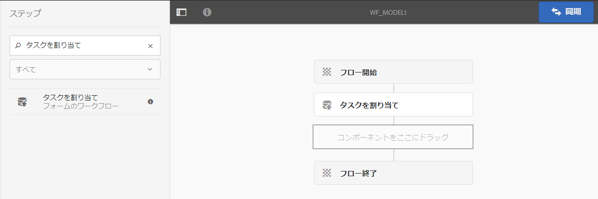
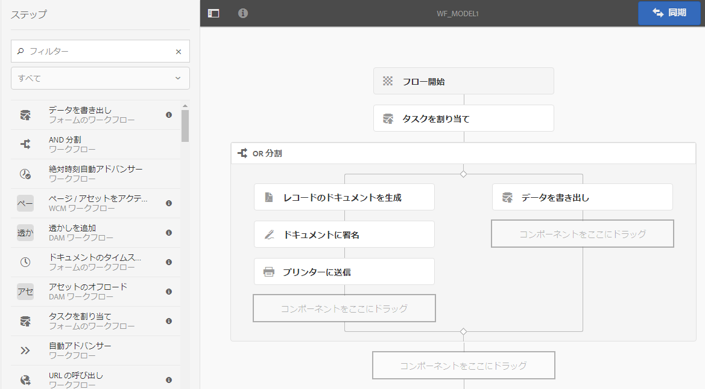

# OSGi 上の Forms 中心のワークフロー {#forms-centric-workflow-on-osgi}

>[!CAUTION]
>
>AEM 6.4 の拡張サポートは終了し、このドキュメントは更新されなくなりました。 詳細は、 [技術サポート期間](https://helpx.adobe.com/jp/support/programs/eol-matrix.html). サポートされているバージョンを見つける [ここ](https://experienceleague.adobe.com/docs/?lang=ja).


企業は、数百も数千ものフォーム、様々なバックエンドシステム、オンラインまたはオフラインのデータソースからデータを収集します。 また、データに関する意思決定を行うための動的なユーザーセットもあります。これには、反復的なレビューと承認のプロセスが含まれます。

大規模な組織や企業は、内部および外部オーディエンスのレビューおよび承認ワークフローに加えて、繰り返しタスクをおこないます。 例えば、PDFドキュメントを別の形式に変換します。 手動でおこなうと、これらのタスクには多くの時間とリソースがかかります。 企業には、後で事前定義された形式で使用するために、ドキュメントにデジタル署名し、フォームデータをアーカイブする法的要件もあります。

## OSGi 上の Forms 中心のワークフローの導入 {#introduction-to-forms-centric-workflow-on-osgi}

AEM Workflows を使用して、アダプティブフォームベースのワークフローを迅速に構築することができます。 これらのワークフローは、レビューと承認、ビジネスプロセスフローに使用して、ドキュメントサービスを開始し、Acrobat Sign署名ワークフローと統合したり、同様の操作をおこなうことができます。 例えば、クレジットカードの申請処理、従業員の休暇承認ワークフロー、フォームの PDF ドキュメントとしての保存などです。さらに、これらのワークフローは、組織内またはネットワークファイアウォールをまたいで使用できます。

OSGi での Forms 中心のワークフローを使用すると、JEE スタックに本格的なプロセス管理機能をインストールしなくても、OSGi スタックで様々なタスクのワークフローを迅速に構築およびデプロイできます。ワークフローの開発と管理では、使い慣れたAEM Workflow とAEM Inbox の機能を使用します。 ワークフローにより、複数のソフトウェアシステム、ネットワーク、部門、組織にわたる実際のビジネスプロセスを自動化するための基礎が構築されます。

設定後、これらのワークフローを手動でトリガーして、定義済みのプロセスを完了したり、ユーザーがフォームや [correspondence management](/help/forms/using/cm-overview.md) レター。 この強化されたAEM Workflow 機能により、AEM Formsは、2 つの異なる似た機能を提供します。 デプロイメント戦略の一環として、どれが最適かを決定する必要があります。 OSGi での Forms 中心の AEM ワークフローと JEE での Process Management の[比較](/help/forms/using/capabilities-osgi-jee-workflows.md)を参照してください。さらに、デプロイメントトポロジーについては、「[AEM Forms のアーキテクチャとデプロイメントトポロジー](/help/forms/using/aem-forms-architecture-deployment.md)」を参照してください。

OSGi 上の Forms 中心のワークフローは、[AEM インボックス](/help/sites-authoring/inbox.md)を拡張し、AEM ワークフローエディターに追加のコンポーネント（手順）を提供することで、AEM Forms 中心のワークフローをサポートします。拡張されたAEMインボックスの機能は、 [AEM Forms Workspace](/help/forms/using/introduction-html-workspace.md). 人間中心のワークフロー（承認、レビューなど）の管理に加え、AEMワークフローを使用して自動化できます [ドキュメントサービス](/help/sites-developing/workflows-step-ref.md)関連する操作 ( 例えば、PDFの生成 ) および電子署名 (Acrobat Sign) ドキュメント。

次の図は、OSGi 上の Forms 中心のワークフローを作成、実行、監視するためのエンドツーエンドの手順を示します。


## 事前準備 {#before-you-start}

* ワークフローとは、実際のビジネスプロセスを表すものです。 実際のビジネスプロセスを維持し、ビジネスプロセスの参加者のリストを準備します。 また、ワークフローの作成を開始する前に、販促物 ( アダプティブフォーム、PDFドキュメントなど ) を準備しておく必要があります。
* ワークフローには複数のステージが含まれることがあります。これらのステージは、AEM インボックスに表示され、ワークフローの進捗を分かりやすくします。ビジネスプロセスを論理的なステージに分割します。
* AEM Workflows のタスクの割り当て手順を設定して、ユーザーまたは担当者に電子メール通知を送信できます。 ですから [電子メール通知を有効にする](#configure-email-service).
* ワークフローでは、電子署名にAcrobat Signを使用することもできます。 ワークフローでAcrobat Signを使用する予定がある場合、 [AEM Forms用のAcrobat Signの設定](/help/forms/using/adobe-sign-integration-adaptive-forms.md) ワークフローで使用する前に。

## ワークフローモデルの作成 {#create-a-workflow-model}

ワークフローモデルは、ビジネスプロセスのロジックとフローで構成されます。 また、一連の手順で構成されています。これらの手順は、AEM のコンポーネントです。必要に応じて、ワークフロー手順をパラメーターやスクリプトを使用してさらに機能性や制御が高くなるように拡張することができます。初期状態で使用できる AEM 手順に加えて、AEM Forms はいくつかの手順を提供しています。AEM と AEM Forms の手順の詳細なリストについては、「[AEM ワークフロー手順のリファレンス](/help/sites-developing/workflows-step-ref.md)」と「[OSGi 上の Forms 中心のワークフロー - 手順のリファレンス](/help/forms/using/aem-forms-workflow.md)」を参照してください。

AEM には、提供されているワークフロー手順を使用してワークフローモデルを作成するための直感的なユーザーインターフェイスが用意されています。ワークフローモデルを作成するためのステップごとの手順については、「[ワークフローモデルの作成](/help/sites-developing/workflows-models.md)」を参照してください。次の例では承認およびレビューワークフローでワークフローモデルを作成するためのステップごとの手順が示されています。

>[!NOTE]
>
>ワークフローモデルを作成または編集するには、ワークフローエディターグループのメンバーである必要があります。

### 承認およびレビューワークフロー用のモデルの作成 {#create-a-model-for-an-approval-and-review-workflow}

承認とレビューのワークフローは、意思決定を行うために人間が介入する必要があるタスク用です。 次の例では、住宅ローンの申し込みをフロントオフィスの銀行代理店が入力するワークフローモデルを作成します。 申込が入力されると、承認用に送信されます。 その後、承認された申請は、Acrobat Signを使用して電子署名を申請する申請者に送信されます。

この例は、以下に添付されたパッケージとして利用できます。 パッケージマネージャーを使用してサンプルを読み込み、インストールします。 また、アプリケーションのワークフローモデルを手動で作成するには、次の手順を実行します。

この例では、金融機関の担当者が記入する住宅ローン申し込みのためのワークフローモデルを作成します。入力が完了すると、承認用に申し込みが送信されます。 その後、承認済みのアプリケーションが、Acrobat Signを使用した電子署名用にお客様に送信されます。 パッケージマネージャーを使ってサンプルを読み込んでインストールできます。

[ファイルを入手](assets/example-mortgage-loan-application.zip)

1. ワークフローモデルコンソールを開きます。デフォルトの URL は、`https://[Server]:[port]/libs/cq/workflow/admin/console/content/models.html/etc/workflow/models`
1. 「**[!UICONTROL 作成]**」を選択してから、「**[!UICONTROL モデルを作成]**」を選択します。「ワークフローモデルを追加」のダイアログが表示されます。
1. 「**[!UICONTROL タイトル]**」と「**[!UICONTROL 名前]**」（オプション）を入力します。例えば、住宅ローン申し込みと入力します。「**[!UICONTROL 完了]**」をタップします。
1. 新しく作成されたワークフローモデルを選択して「**編集」をタップします。**&#x200B;これで、ワークフローステップを追加してビジネスロジックを構築できるようになりました。新しいワークフローモデルを初めて作成する場合、次のものが含まれます。

   * 手順：フローの開始と終了。これらの手順は、ワークフローの始まりと終わりを表します。これらの手順は必須で、編集または削除できません。
   * 「手順 1」という名称の参加者手順の例。この手順は、作業項目を管理者ユーザーに割り当てるように設定されています。この手順を削除します。

1. メール通知を有効にします。OSGi でフォーム中心のワークフローを設定して、ユーザーまたは担当者にメール通知を送信できます。メール通知を有効にするには、以下の設定を実行します。

   1. AEM Configuration Manager（`https://[server]:[port]/system/console/configMgr`）に移動します。
   1. **[!UICONTROL Day CQ メールサービス]**&#x200B;の設定を開きます。「**[!UICONTROL SMTP サーバーのホスト名]**」、「**[!UICONTROL SMTP サーバーポート]**」、「**[!UICONTROL 送信元アドレス]**」フィールドの値を指定します。「**[!UICONTROL 保存]**」をクリックします。
   1. 「**[!UICONTROL Day CQ Link Externalizer]**」の設定を開きます。「**[!UICONTROL ドメイン]**」フィールドで、ローカルインスタンス、オーサーインスタンス、発行インスタンスの実際のホスト名/ IP アドレスとポート番号を指定します。「**[!UICONTROL 保存]**」をクリックします。

1. ワークフローステージを作成します。 ワークフローには複数のステージが含まれることがあります。これらのステージは、AEMインボックスに表示され、ワークフローの進行状況をレポートします。

   ステージを定義するには、 アイコンをタップしてワークフローモデルのプロパティを表示し、「**[!UICONTROL ステージ]**」タブを開いてワークフローモデルのステージを追加して、「**[!UICONTROL 保存して閉じる」をタップします。]**&#x200B;住宅ローン申し込みの例では、ローン申請、ローン申請ステータス、署名予定ドキュメント、署名済みローンドキュメントのステージを作成します。

1. 「**[!UICONTROL タスクの割り当て]**」ステップブラウザーをワークフローモデルにドラッグアンドドロップします。これをモデルの最初の手順にします。

   タスクの割り当てコンポーネントは、ワークフローによって作成されたタスクをユーザーまたはグループに割り当てます。 タスクの割り当てと共に、コンポーネントを使用して、アダプティブフォームまたは非インタラクティブPDFをタスクに指定できます。 アダプティブフォームはユーザーからの入力を受け付けるために必要であり、非インタラクティブ PDF または読み取り専用のアダプティブフォームはレビュー専用のワークフローに使用されます。

   また、タスクの動作を制御するためにその手順を使用することもできます。例えば、レコードの自動ドキュメントの作成、特定のユーザーまたはグループへのタスクの割り当て、送信されたデータのパス、事前に入力されるデータのパス、デフォルトのアクションを制御できます。タスク割り当てのオプションについては、「[OSGi 上の Forms 中心のワークフロー - ステップのリファレンス](/help/forms/using/aem-forms-workflow.md)」を参照してください。

   

   住宅ローンのサンプルでは、読み取り専用のアダプティブフォームを使用してタスクの割り当て手順を設定し、タスクの完了後に PDF ドキュメントを表示します。また、ローン申請を承認できるユーザーグループも選択します。「**[!UICONTROL アクション]**」タブで、「**[!UICONTROL 送信]**」オプションを無効にします。を指定します。 **[!UICONTROL ルート変数]**. 例えば、actionTaken などです。 また、「承認」および「却下」のルートを追加します。 ルートは、AEMインボックスに個別のアクション（ボタン）として表示されます。 ワークフローでは、ユーザーがタップした操作（ボタン）に基づいて分岐が選択されます。

   セクションの始めに示すサンプルパッケージを読み込むことにより、住宅ローン申し込みの例に設定されているタスク割り当て手順のすべてのフィールドの値を一式入手できます。

1. OR 分割コンポーネントをステップブラウザーからワークフローモデルにドラッグ＆ドロップします。OR 分割は、ワークフロー内に分割を作成し、以降は 1 つの分岐だけがアクティブになります。これを使用すると、ワークフローに条件付き処理パスを導入できます。必要に応じて、各分岐にワークフローステップを追加できます。

   OR 分割のプロパティを開き、Branch1 と Branch2 に次のコードスニペットを追加します。 これらのコードスニペットは、AEMインボックスのユーザーアクションに基づいてブランチを選択するのに役立ちます。

   **ブランチ 1 のコードスニペット**

   AEM インボックスで「**[!UICONTROL 承認]**」をタップすると、分岐 1 がアクティブになります。

   ```
   function check(){
      var action = workflowData.getMetaDataMap().get("actionTaken","");
   log.info("action " + action);
      return action=="Approve";
   }
   ```

   **ブランチ 2 のコードスニペット**

   AEM インボックスで「**[!UICONTROL 拒否]**」をタップすると、分岐 2 がアクティブになります。

   ```
   function check(){
      var action = workflowData.getMetaDataMap().get("actionTaken","");
   log.info("action " + action);
      return action=="Reject";
   }
   ```

1. その他のワークフローステップを追加し、ビジネスロジックを構築します。

   住宅ローンの例では、次の画像に示すように、レコードのドキュメントの生成、2 つのタスクの割り当て、1 つのドキュメントの署名ステップをモデルのブランチ 1 に追加します。 タスクの割り当てステップの 1 つは&#x200B;**申請者の署名予定ローンドキュメント**&#x200B;の表示と送信に使用し、もう 1 つは、**署名済みドキュメントの表示**&#x200B;に使用します。また、分岐 2 にタスクの割り当てコンポーネントも追加します。AEM インボックスで「拒否」をタップすると、分岐 2 がアクティブになります。

   住宅ローン申し込みの例で設定されたタスクの割り当て手順、レコードのドキュメント手順、ドキュメントに署名手順のすべてのフィールドの値の完全なセットについては、この節の最初にダウンロードできるサンプルパッケージをインポートします。

   ワークフローモデルの準備が整いました。 ワークフローは、様々な方法で起動できます。 詳しくは、 [OSGi でのForms中心のワークフローの起動](#launch).

   

## Forms 中心のワークフローアプリケーションの作成 {#create-a-forms-centric-workflow-application}

申し込みフォームは、ワークフローに関連付けられたアダプティブフォームです。 インボックス経由でアプリケーションが送信されると、関連するワークフローが起動します。FormsワークフローをAEMインボックスおよびAEM Formsアプリでアプリとして使用できるようにするには、以下の手順を実行してワークフローアプリケーションを作成します。

>[!NOTE]
>
>ワークフローアプリケーションを作成して管理するには、fd-administrator グループのメンバーである必要があります。

1. AEMオーサーインスタンスで、に移動します。  > **[!UICONTROL Forms]** > **[!UICONTROL ワークフローアプリケーションを管理]** とタップ **[!UICONTROL 作成]**.
1. ワークフローアプリケーションを作成ウィンドウで、以下のフィールドに入力を入力し、 **[!UICONTROL 作成]**. 新しいアプリケーションが作成され、ワークフローアプリケーション画面にリストされます。

<table> 
 <tbody> 
  <tr> 
   <td>フィールド</td> 
   <td>説明</td> 
  </tr> 
  <tr> 
   <td>タイトル</td> 
   <td>タイトルはAEMインボックスに表示され、ユーザーがアプリケーションを選択するのに役立ちます。 説明的な内容にします。 たとえば、Savings Account Opening Application などです。<br /> </td> 
  </tr> 
  <tr> 
   <td>名前 </td> 
   <td>アプリケーションの名前を指定します。英数字、ハイフン、アンダースコア以外の文字はすべてハイフンで置き換えられます。 </td> 
  </tr> 
  <tr> 
   <td>説明</td> 
   <td>説明はAEM Inbox に表示されます。 アプリケーションに関する詳細な情報を説明フィールドに入力します。 例えば、アプリケーションの目的です。<br /> </td> 
  </tr> 
  <tr> 
   <td>アダプティブフォーム</td> 
   <td><p>アダプティブフォームのパスを指定します。 ユーザーがアプリケーションを起動すると、指定したアダプティブフォームが表示されます。</p> <p><strong>注意</strong>：ワークフローアプリケーションは、2 ページ以上または Apple iPad でスクロールが必要なフォームや PDF ドキュメントをサポートしません。Apple iPad でアプリケーションを開く際にアダプティブフォームや PDF ドキュメントが 2 ページにまたがる場合は、フォームのフィールドや 2 ページ目のコンテンツが失われます。</p> </td> 
  </tr> 
  <tr> 
   <td>アクセスグループ</td> 
   <td><p>グループを選択します。 アプリケーションは、選択したグループのメンバーに対してのみAEMインボックスに表示されます。 アクセスグループオプションを使用すると、ワークフローユーザーグループのすべてのグループを選択することができます。 </p> <br /> </td> 
  </tr> 
  <tr> 
   <td>事前入力サービス</td> 
   <td>を選択します。 <a href="/help/forms/using/prepopulate-adaptive-form-fields.md#aem-forms-custom-prefill-service" target="_blank">事前入力サービス</a> アダプティブフォーム用に作成されます。<br /> </td> 
  </tr> 
  <tr> 
   <td>ワークフローモデル</td> 
   <td>アプリケーションの <a href="/help/forms/using/aem-forms-workflow.md#create-a-workflow-model">ワークフローモデル</a> を選択します。ワークフローモデルは、ビジネスプロセスのロジックとフローで構成されます。 </td> 
  </tr> 
  <tr> 
   <td>データファイルのパス</td> 
   <td>crx-repository 内のデータファイルのパスを指定します。 パスはアダプティブフォームのペイロードを基準とした相対パスで、データファイルの名前が含まれます。 必ず拡張子を含む完全なファイル名を指定してください（該当する場合）。例えば、[payload]/data.xml のようになります。 </td> 
  </tr> 
  <tr> 
   <td>添付ファイルのパス</td> 
   <td>crx-repository の添付ファイルフォルダーのパスを指定します。 添付ファイルのパスは、ペイロードの場所を基準とします。例えば、[payload]/data.xml のようになります。 </td> 
  </tr> 
  <tr> 
   <td>レコードのドキュメントのパス</td> 
   <td>crx-repository 内のレコードのドキュメントファイルのパスを指定します。 パスは、アダプティブフォームのペイロードの場所に対する相対パスです。必ず拡張子を含む完全なファイル名を指定してください（該当する場合）。例えば、[payload]/DOR/creditcard.pdf のようになります。</td> 
  </tr> 
 </tbody> 
</table>

## OSGi 上での Forms 中心のワークフローの起動 {#launch}

Forms中心のワークフローは、次の方法で起動またはトリガーできます。

* [AEM インボックスからのアプリケーションの送信](#inbox)
* [AEM Forms アプリケーションからのアプリケーションの送信](#afa)

* [アダプティブフォームの送信](#af)
* [監視フォルダーの使用](#watched)

* [インタラクティブ通信またはレターの送信](#letter)

### AEM インボックスからのアプリケーションの送信 {#inbox}

作成したワークフローアプリケーションは、インボックスでアプリケーションとして使用できます。workflow-users グループのメンバーであるユーザーは、関連するワークフローをトリガーする申込書に入力して送信できます。 AEM インボックスを使用してアプリケーションを送信し、タスクを管理する方法について詳しくは、「[AEM インボックスでの Forms アプリケーションとタスクの管理](/help/forms/using/manage-applications-inbox.md)」を参照してください。

### AEM Forms アプリケーションからのアプリケーションの送信 {#afa}

AEM Forms アプリケーションは、AEM Forms サーバーと同期されます。AEM Forms アプリケーションをアカウントで使用することで、フォームデータ、タスク、ワークフローアプリケーション、保存済み情報（ドラフト、テンプレート）を変更することができます。詳しくは、「[AEM Forms アプリケーション](/help/forms/using/aem-forms-app.md)」と関連記事を参照してください。

### アダプティブフォームの送信 {#af}

アダプティブフォームの送信アクションを設定して、アダプティブフォームの送信時にワークフローを開始することができます。 アダプティブフォームは、 **[!UICONTROL AEM Workflow を起動]** 送信アクションを使用して、アダプティブフォームの送信時にワークフローを開始します。 送信アクションについて詳しくは、 [送信アクションの設定](/help/forms/using/configuring-submit-actions.md). AEM Formsアプリケーションを通じてアダプティブフォームを送信するには、アダプティブフォームプロパティで「 AEM Formsアプリと同期」を有効にします。

AEM Formsアプリケーションからワークフローを同期、送信、トリガーするようにアダプティブフォームを設定することができます。 詳しくは、 [フォームの使用](/help/forms/using/working-with-form.md).

### 監視フォルダーの使用 {#watched}

管理者（fd-administrators グループのメンバー）は、ユーザーがPDFにファイル（フォルダーファイルなど）を配置したときに、事前設定済みのワークフローを実行するようにネットワークフォルダーを設定できます。 ワークフローが完了したら、指定した出力フォルダーに結果ファイルを保存できます。 このようなフォルダーは、 [監視フォルダー](/help/forms/using/watched-folder-in-aem-forms.md). 次の手順を実行して、ワークフローを起動するように監視フォルダーを設定します。

1. AEMオーサーインスタンスで、に移動します。  **[!UICONTROL Forms /監視フォルダーを設定]**. 既に設定されている監視フォルダーのリストが表示されます。
1. 「**[!UICONTROL 新規]**」をタップします。フィールドのリストが表示されます。 次のフィールドの値を指定して、ワークフローの監視フォルダーを設定します。

<table> 
 <tbody> 
  <tr> 
   <td>フィールド</td> 
   <td>説明</td> 
  </tr> 
  <tr> 
   <td><span class="uicontrol">名前</span></td> 
   <td>監視フォルダーの名前を指定します。 このフィールドでは、英数字のみをサポートします。</td> 
  </tr> 
  <tr> 
   <td><span class="uicontrol">パス</span></td> 
   <td>監視フォルダーの物理的な場所を指定します。 クラスター環境では、AEMクラスターノードからアクセス可能な共有ネットワークフォルダーを使用します。</td> 
  </tr> 
  <tr> 
   <td><span class="uicontrol">次を使用してファイルを処理</span></td> 
   <td>「<span class="uicontrol">ワークフロー</span>」オプションを選択します。 </td> 
  </tr> 
  <tr> 
   <td><span class="uicontrol">ワークフローモデル</span></td> 
   <td>ワークフローモデルを選択します。<br /> </td> 
  </tr> 
  <tr> 
   <td><span class="uicontrol">出力ファイルのパターン</span></td> 
   <td>出力ファイルとディレクトリのディレクトリ構造を指定します。 また、 <a href="/help/forms/using/admin-help/configuring-watched-folder-endpoints.md" target="_blank">出力ファイルとディレクトリのパターン</a>.</td> 
  </tr> 
 </tbody> 
</table>

1. タップ **[!UICONTROL 詳細]**. 次のフィールドの値を指定し、をタップします。 **[!UICONTROL 作成]**. ワークフローを起動するように監視フォルダーを設定できます。これで、監視フォルダーの入力ディレクトリにファイルが配置されるといつでも、指定されたワークフローがトリガーされます。

   | フィールド | 説明 |
   |---|---|
   | ペイロードマッパーフィルター | 監視フォルダーを作成すると、crx-repository にフォルダー構造が作成されます。 フォルダー構造は、ワークフローのペイロードとして使用できます。 監視フォルダー構造からの入力を受け入れるようにAEM Workflow をマッピングするスクリプトを作成できます。 標準搭載の実装が使用可能で、ペイロードマッパーフィルターに表示されます。 カスタム実装がない場合、デフォルトの実装を選択します。 |

   「詳細設定」タブには、さらに多くのフィールドが含まれています。 これらのほとんどのフィールドにはデフォルトの値が指定されています。すべてのフィールドについて詳しくは、 [監視フォルダーの作成または設定](/help/forms/using/creating-configure-watched-folder.md) 記事。

### インタラクティブ通信またはレターの送信 {#letter}

インタラクティブ通信やレターを送信する際に、OSGi 上の Forms 中心のワークフローを関連付けて実行することができます。通信の管理では、ワークフローを使用して、インタラクティブ通信とレターの後処理を実行します。例えば、最終レターの電子メール送信、印刷、FAX 送信、アーカイブなどです。 詳細な手順については、 [インタラクティブ通信とレターの後処理](/help/forms/using/submit-letter-topostprocess.md).

## 追加の設定 {#additional-configurations}

### 電子メールサービスを設定する {#configure-email-service}

AEMワークフローの「タスクの割り当て」手順と「電子メールの送信」手順を使用して、電子メールを送信できます。 次の手順を実行して、電子メールの送信に必要な電子メールサーバーおよびその他の設定を指定します。

1. AEM Configuration Manager（`https://[server]:[port]/system/console/configMgr`）に移動します。
1. **[!UICONTROL Day CQ メールサービス]**&#x200B;の設定を開きます。「**[!UICONTROL SMTP サーバーのホスト名]**」、「**[!UICONTROL SMTP サーバーポート]**」、「**[!UICONTROL 送信元アドレス]**」フィールドの値を指定します。「**[!UICONTROL 保存]**」をクリックします。
1. 「**[!UICONTROL Day CQ Link Externalizer]**」の設定を開きます。「**[!UICONTROL ドメイン]**」フィールドで、ローカルインスタンス、オーサーインスタンス、発行インスタンスの実際のホスト名/ IP アドレスとポート番号を指定します。「**[!UICONTROL 保存]**」をクリックします。

### ワークフローインスタンスの削除 {#purge-workflow-instances}

ワークフローインスタンスの数を最小限に抑えるとワークフローエンジンのパフォーマンスが向上します。完了したワークフローインスタンスや実行中のワークフローインスタンスはリポジトリーから定期的に削除できます。詳しくは、 [ワークフローインスタンスの定期的なパージ](/help/sites-administering/workflows-administering.md#regular-purging-of-workflow-instances).
