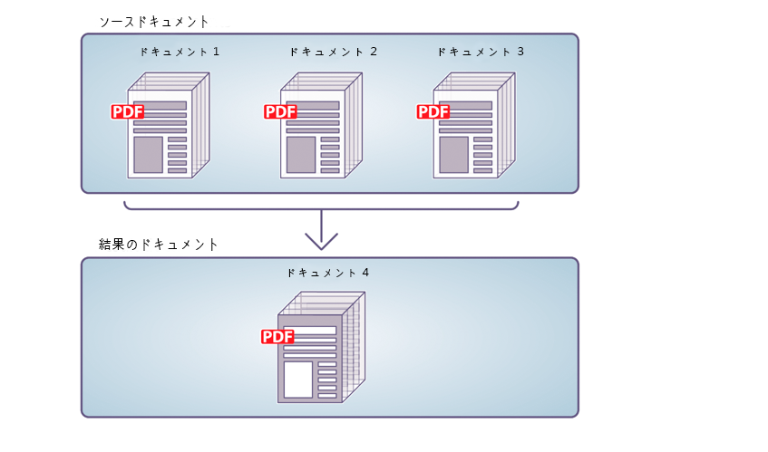
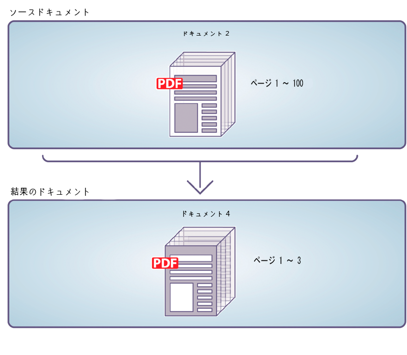

# Assembler サービスの使用 {#using-assembler-service}

Assembler サービスでは、PDF ドキュメントや XDP ドキュメントの結合、並べ替えおよび拡張と、PDF ドキュメントに関する情報の取得ができます。Assembler サービスに送信される各ジョブには、Document Description XML（DDX）ドキュメント、ソースドキュメントおよび外部リソース（文字列とグラフィック）が含まれます。Assembler サービスについて詳しくは、「[Assembler サービスの概要](/help/forms/using/overview-aem-document-services.md#p-assembler-service-p)」を参照してください。

以下の操作において Assembler サービスを使用できます。

## PDF ドキュメントのアセンブリ {#assemble-pdf-documents}

Assembler サービスを使用すると、複数の PDF ドキュメントを 1 つの PDF ドキュメントまたは PDF ポートフォリオにアセンブリできます。また、ナビゲーション支援機能やセキュリティ強化機能を PDF ドキュメントに適用することもできます。PDF ドキュメントをアセンブリする方法には、次のようなものがあります。

### 単一 PDF ドキュメントのアセンブリ {#assemble-a-simple-pdf-document}

次の図は、3 つのソースドキュメントを 1 つの結果ドキュメントに統合する場合の様子を示しています。


**図：** *複数のPDFドキュメントからの簡単なPDFドキュメントのアセンブリ*

以下に、このドキュメントのアセンブリに使用される簡単な DDX ドキュメントの例を示します。この例では、結果ドキュメントの名前と共に、結果ドキュメントの生成に使用するソースドキュメントの名前も指定しています。

```xml
<PDF result="Doc4">
<PDF source="Doc1"/>
<PDF source="Doc2"/>
<PDF source="Doc3"/>
</PDF>
```

ドキュメントのアセンブリは、以下のコンテンツと特性を備えた結果ドキュメントを生成します。\
特徴：

* 各ソースドキュメントのすべてまたは一部
* アセンブリによる結果ドキュメントに対して正規化される、各ソースドキュメントのしおりのすべてまたは一部
* メタデータ、ページラベル、ページサイズなどのベースドキュメント（Doc1）から採用したその他の特性
* オプションで、結果ドキュメントに結果内のしおりから構築される目次を含めることができます。

### PDF ポートフォリオの作成 {#create-a-pdf-portfolio}

Assembler サービスでは、複数のドキュメントおよび独立したユーザーインターフェイスを含む PDF ポートフォリオを作成できます。このインターフェイスは、PDF ポートフォリオレイアウトまたは PDF ポートフォリオナビゲーター（ナビゲーター）と呼ばれています。PDF ポートフォリオは、ナビゲーター、フォルダー、ようこそページを追加することによって、PDF パッケージの機能を拡張します。このインターフェイスでは、ローカライズされたテキスト文字列、カスタムカラースキーム、およびグラフィックリソースを利用して、ユーザーエクスペリエンスを向上させることができます。また、PDF ポートフォリオには、ポートフォリオ内のファイルを整理するためのフォルダーも含まれています。

Assembler サービスによって以下の DDX ドキュメントが解釈されると、2 つのファイルの PDF ポートフォリオナビゲーターとパッケージで構成される PDF ポートフォリオがアセンブリされます。ナビゲーターは、myNavigator ソースで指定された場所から取得されます。ナビゲータのデフォルトカラースキームは、pinkScheme カラースキームに変更されます。

```xml
<DDX xmlns="https://ns.adobe.com/DDX/1.0/">
<PDF result="Untitled 1">
<Portfolio>
<Navigator source="myNavigator"/>
<ColorScheme scheme="pinkScheme"/>
</Portfolio>
<PackageFiles>
<PDF source="sourcePDF1"/>
<PDF source="sourcePDF2"/>
</PackageFiles>
</PDF>
</DDX>
```

### 暗号化ドキュメントのアセンブリ {#assemble-encrypted-documents}

ドキュメントをアセンブリするとき、パスワードを使用して PDF ドキュメントを暗号化することもできます。PDF ドキュメントがパスワードを使用して暗号化されている場合、Adobe Reader または Acrobat で PDF ドキュメントを表示するには、パスワードを指定する必要があります。パスワードを使用して PDF ドキュメントを暗号化するには、PDF ドキュメントの暗号化に必要な暗号化要素の値を DDX ドキュメントに含める必要があります。

PDF ドキュメントをパスワードを使用して暗号化するために、LiveCycle のインストールに Encryption サービスを含める必要はありません。

1 つ以上の入力ドキュメントが暗号化されている場合、ドキュメントを開くためのパスワードを DDX の一部として指定する必要があります。

### ベイツナンバリングを使用したドキュメントのアセンブリ {#assemble-documents-using-bates-numbering}

ドキュメントをアセンブリする場合、ベイツナンバリングを使用して各ページに一意のページ識別子を適用することができます。ベイツナンバリングを使用すると、ドキュメント（またはドキュメントセット）内の各ページに、ページを一意に識別する数字が割り当てられます。例えば、原材料情報を含む、1 つの組立部品の製造に関する生産ドキュメントに、1 つの識別子が割り当てられます。ベイツナンバリングの数値は連続した増分値で、オプションでプレフィックスやサフィックスが付きます。プレフィックス + 数値 + サフィックスの形式は、ベイツパターンと呼ばれます。

次の図は、ドキュメントのヘッダに一意の識別子を含む PDF ドキュメントを示しています。


**図：** *PDFのヘッダーに一意の ID が含まれるヘッダードキュメント*

### ドキュメントの統合およびアセンブリ {#flatten-and-assemble-documents}

Assembler サービスを使用して、インタラクティブ PDF ドキュメント（フォームなど）を非インタラクティブ PDF（PDF ドキュメント）に変換できます。インタラクティブ PDF ドキュメントでは、ユーザーは PDF ドキュメントフィールドにデータを入力したり、このフィールドのデータを変更したりできます。インタラクティブ PDF ドキュメントを非インタラクティブ PDF ドキュメントに変換するプロセスは「フラット化」と呼ばれます。PDF ドキュメントを統合すると、フォームフィールドのグラフィック表示は残されますが、インタラクティブではなくなります。PDF ドキュメントを統合する理由の 1 つは、データを変更できないようにすることです。また、フィールドに関連付けられたスクリプトも動作しなくなります。

インタラクティブ PDF ドキュメントからアセンブリして PDF を作成する場合に、Assembler サービスはこれらのフォームを統合してから結果ドキュメントにアセンブリします。

>[!NOTE]
>
>Assembler サービスは、Output サービスを使用して動的 XFA フォームを統合します。XFA 動的フォームの統合を要求する DDX を Assembler サービスが処理する場合に Output サービスを使用できないと、例外が発生します。Acrobat フォームまたは静的 XFA フォームの統合については、Assembler サービスでは、Output サービスを使用せずに実行できます。

## XDP ドキュメントのアセンブリ {#assemble-xdp-documents}

Assembler サービスを使用すると、複数の XDP ドキュメントを 1 つの XDP または PDF ドキュメントにアセンブリできます。ソース XDP ファイルに挿入ポイントがある場合は、フラグメントを挿入する位置を指定できます。

XDP ドキュメントをアセンブリする方法には、次のようなものがあります。

### 単一の XDP ドキュメントのアセンブリ {#assemble-a-simple-xdp-document}

次の図は、3 つの XDP ソースドキュメントを 1 つの結果 XDP ドキュメントにアセンブリする場合の様子を示しています。結果 XDP ドキュメントには、3 つのソース XDP ドキュメントと関連データが含まれます。結果ドキュメントには、ベースドキュメント（最初のソース XDP ドキュメント）から基本属性が受け継がれます。


**図：** *複数の XDP ドキュメントからの単純な XDP ドキュメントのアセンブリ*

上記の結果ドキュメントを生成する DDX ドキュメントを次に示します。

```xml
<DDX xmlns="https://ns.adobe.com/DDX/1.0/">
<XDP result="MyXDPResult">
<XDP source="sourceXDP1"/>
<XDP source="sourceXDP2"/>
<XDP source="sourceXDP3"/>
</XDP>
</DDX>
```

### アセンブリ時における参照の解決 {#resolving-references-during-assembly}

通常、XDP ドキュメントには、絶対参照または相対参照によって参照した画像を含めることができます。Assembler サービスは、デフォルトで結果の XDP ドキュメント内の画像参照を保持します。

ソース XDP ドキュメント内の参照画像は、Assembler サービスでのアセンブル時に XDP ファイル内で絶対参照として扱うか、相対参照として扱うかを指定できます。相対参照も絶対参照も含めず、すべての画像を結果の に埋め込むように選択できます。この動作を設定するには、次のオプションのいずれかを resolveAssets タグの値として指定します。デフォルトでは、結果ドキュメント内の参照は解決されません。

<table> 
 <tbody> 
  <tr> 
   <th>値</th> 
   <th>説明</th> 
  </tr> 
  <tr> 
   <td>none</td> 
   <td>参照の解決を一切行いません。</td> 
  </tr> 
  <tr> 
   <td>all</td> 
   <td>ソース XDP ドキュメント内で参照されているすべての画像を埋め込みます。</td> 
  </tr> 
  <tr> 
   <td>相対的</td> 
   <td>ソース XDP ドキュメント内で相対参照を介して参照されているすべての画像を埋め込みます。<br /></td> 
  </tr> 
  <tr> 
   <td>absolute</td> 
   <td>ソース XDP ドキュメントで絶対参照を介して参照されているすべての画像が埋め込まれます。<br /></td> 
  </tr> 
 </tbody> 
</table>

resolveAssets 属性の値は、XDP ソースタグまたは親の XDP 結果タグで指定できます。XDP 結果タグで指定した場合、属性は、その XDP 結果タグの子であるすべての XDP ソース要素に継承されます。ただし、ソース要素の属性を明示的に指定すると、そのソースドキュメントのみの結果要素の設定が上書きされます。

#### XDP ドキュメント内のすべてのソース参照を解決する {#resolve-all-source-references-in-an-xdp-document}

ソース XDP ドキュメント内のすべての参照を解決するには、以下の例のように、結果ドキュメントの resolveAssets 属性を all に\
指定します。

```xml
<DDX xmlns="https://ns.adobe.com/DDX/1.0/">
<XDP result="result.xdp" resolveAssets="all">
<XDP source="input1.xdp" />
<XDP source="input2.xdp" />
<XDP source="input3.xdp" />
</XDP>
</DDX
```

また、すべてのソース XDP ドキュメントの属性を個別に指定した場合も、同じ結果に\
なります。

```xml
<DDX xmlns="https://ns.adobe.com/DDX/1.0/">
<XDP result="result.xdp">
<XDP source="input1.xdp" resolveAssets="all"/>
<XDP source="input2.xdp" resolveAssets="all"/>
<XDP source="input3.xdp" resolveAssets="all"/>
</XDP>
</DDX>
```

#### XDP ドキュメント内の特定のソース参照を解決する {#resolve-selected-source-references-in-an-xdp-document}

特定のソース参照を選択して解決するには、目的のソースドキュメントに対して resolveAssets 属性を指定します。個々のソースドキュメントの属性によって、結果の XDP ドキュメントの設定が上書きされます。この例では、含まれているフラグメントも解決されます。

```xml
<DDX xmlns="https://ns.adobe.com/DDX/1.0/">
<XDP result="result.xdp" resolveAssets="all">
<XDP source="input1.xdp" >
<XDPContent source="fragment.xdp" insertionPoint="MyInsertionPoint"
fragment="myFragment"/>
</XDP>
<XDP source="input2.xdp" />
</XDP>
</DDX>
```

#### 絶対参照または相対参照を選択して解決する {#selectively-resolve-absolute-or-relative-references}

次の例に示すように、ソースドキュメントの全部または一部で特定の絶対参照または相対参照を解決できます。

```xml
<DDX xmlns="https://ns.adobe.com/DDX/1.0/">
<XDP result="result.xdp" resolveAssets="absolute">
<XDP source="input1.xdp" />
<XDP source="input2.xdp" />
</XDP>
</DDX
```

### フォームフラグメントの XFA フォームへの動的な挿入 {#dynamically-insert-form-fragments-into-an-xfa-form}

Assembler サービスを使用して、フラグメントが挿入される別の XFA フォームから XFA フォームを作成できます。この機能を使うと、フラグメントを使用して複数のフォームを作成できます。

フォームフラグメントの動的挿入機能は、ソース管理の一元化をサポートします。共通して使用されるコンポーネントのソースを 1 つに維持できます。例えば、自社のシンボルマークを表すフラグメントを作成したとします。マークを変更した場合、変更が必要なのはこのフラグメントだけです。フラグメントを含むフォームは変更不要です。

フォームデザイナーは、LiveCycle Designer を使用してフォームフラグメントを作成します。このようなフラグメントは、XFA フォーム内では一意の名前を持つサブフォームとなります。また、一意の名前を持つ挿入ポイントを含んだ XFA フォームを作成する場合も、Designer を使用します。プログラマーは、XFA フォームへのフラグメントの挿入する方法を指定する DDX ドキュメントを作成します。

次の図に、2 つの XML フォーム（XFA テンプレート）を示します。左側のフォームには、myInsertionPoint という挿入ポイントがあります。右側のフォームには、myFragment というフラグメントがあります。


**図：** *フォームフラグメントの XFA フォームへの挿入*

Assembler サービスによって以下の DDX ドキュメントが解釈されると、別の XML フォームを含む XML フォームが作成されます。myFragmentSource ドキュメントの myFragment サブフォームが、myFormSource ドキュメント内の myInsertionPoint の位置に挿入されます。

```xml
<DDX xmlns="https://ns.adobe.com/DDX/1.0/">
<XDP result="myFormResult">
<XDP source="myFormSource">
<XDPContent fragment="myFragment" insertionPoint="myInsertionPoint"
source="myFragmentSource"/>
</XDP>
</XDP>
</DDX
```

### XDP ドキュメントの PDF へのパッケージ化 {#package-an-xdp-document-as-pdf}

以下の DDX ドキュメントのように、Assembler サービスを使用して、XDP ドキュメントを PDF ドキュメントとしてパッケージ化できます。

```xml
<DDX xmlns="https://ns.adobe.com/DDX/1.0/">
<PDF result="Untitled 1" encryption="passEncProfile1">
<XDP>
<XDP source="sourceXDP3"/>
<XDP source="sourceXDP4"/>
</XDP>
</PDF>
</DDX>
```

## PDF ドキュメントのディスアセンブリ {#disassemble-pdf-documents}

Assembler サービスを使用して PDF ドキュメントをディスアセンブリできます。また、ソースドキュメントからページを抽出したり、しおりの位置を境にソースドキュメントを分割することもできます。このタスクは、一般的に、PDF ドキュメントが最初に多数の個別ドキュメント（明細書一式など）から作成された場合に役立ちます。

### ソースドキュメントからのページの抽出 {#extract-pages-from-a-source-document}

次の図で、ページ 1 ～ 3 は、ソースドキュメントから抽出されて、新しい結果ドキュメントに配置されています。


**図：** *ソースドキュメントからの特定のページの抽出*

次に、このドキュメントのディスアセンブリに使用される DDX ドキュメントの例を示します。

```xml
<PDF result="Doc4">
<PDF source="Doc2" pages="1-3"/>
</PDF>
```

### しおりに基づいたソースドキュメントの分割 {#divide-a-source-document-based-on-bookmarks}

以下の図では、DocA は複数の結果ドキュメントに分割されています。ページ上の第 1 レベル 1 のブックマークは、新しい結果ドキュメントの開始を示します。


**図：** *しおりに基づくソースドキュメントを複数のドキュメントに分割する*

次に、しおりを使用してソースドキュメントをディスアセンブリする DDX ドキュメントの例を示します。

```xml
<PDFsFromBookmarks prefix="A">
<PDF source="DocA"/>
</PDFsFromBookmarks>
```

## ドキュメントが PDF/A に準拠しているかどうかの検証 {#determine-whether-documents-are-pdf-a-compliant}

Assembler サービスを使用すると、PDF ドキュメントが PDF/A に準拠しているかどうかを検証することができます。PDF/A は、ドキュメントのコンテンツを長期間保存するためのアーカイブ形式です。フォントはドキュメント内に埋め込まれ、ファイルは圧縮されません。その結果、通常、PDF/A ドキュメントは標準の PDF ドキュメントよりも大きくなります。なお、PDF/A ドキュメントには、オーディオおよびビデオのコンテンツは含まれません。

## PDF ドキュメントに関する情報の取得 {#obtain-information-about-a-pdf-document}

Assembler サービスを使用して、次の PDF 情報を取得できます。

* テキスト情報

   * ドキュメントの各ページに含まれる単語
   * ドキュメントの各ページにおける各単語の位置
   * ドキュメントの各ページの各段落に含まれる文章

* しおりに関する情報（ページ番号、タイトル、設定先、外観など）。任意の PDF ドキュメントからこのデータを書き出し、別の PDF ドキュメントに読み込むことができます。

* 添付ファイル（ファイル情報を含む）。ページレベルの添付ファイルの場合は、添付ファイル注釈の場所が含まれます。任意の PDF ドキュメントからこのデータを書き出し、別の PDF ドキュメントに読み込むことができます。

* パッケージファイル情報（ファイル情報、フォルダー、パッケージ、スキーマ、フィールドデータなど）。任意の PDF ドキュメントからこのデータを書き出し、別の PDF ドキュメントに読み込むことができます。

## DDX ドキュメントの検証 {#validate-ddx-documents}

Assembler サービスを使用すると、DDX ドキュメントが有効かどうかを検証できます。例えば、LiveCycle を以前のバージョンからアップグレードした後に検証を実行すると、DDX ドキュメントが有効であることを確認できます。

## 他のサービスの呼び出し {#call-other-services}

DDX ドキュメントを使用して、Assembler サービスで次の LiveCycle サービスを呼び出すことができます。Assembler サービスが呼び出せるのは、LiveCycle と一緒にインストールされる次のサービスだけです。

**Reader Extensions サービス**：Adobe Reader ユーザーは、結果 PDF ドキュメントに電子署名を行うことができます。

**Forms サービス**：XDP ファイルと XML データファイルを結合して、データを埋め込んだインタラクティブフォームを含む PDF ドキュメントを作成することができます。

**Output サービス**：動的な XML フォームを、非インタラクティブフォームを含む PDF ドキュメントに変換（フォームを統合）します。Assembler サービスでは、静的な XML フォームと Acrobat フォームを統合する際に Output サービスを呼び出しません。

```xml
<?xml version="1.0" encoding="UTF-8"?>
<DDX xmlns="https://ns.adobe.com/DDX/1.0/">
<PDF result="outDoc">
<PDF source="doc1"/>
<PDF source="doc2"/>
<ReaderRights
credentialAlias="LCESCred"
digitalSignatures="true"/>
</PDF>
</DDX>
```

DDX と Assembler サービスを使用して他の LiveCycle サービスを呼び出すことによって、プロセスダイアグラムが単純化され、ワークフローをカスタマイズする手間を減らすことができます。(関連項目, [AEM Document Services をプログラムとして使用する](https://helpx.adobe.com/experience-manager/6-4/forms/using/aem-document-services-programmatically.html))
