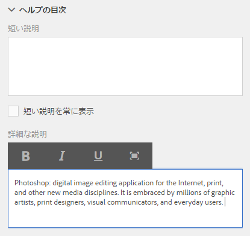

# フォームフィールド用の文脈依存ヘルプの作成 {#authoring-in-context-help-for-form-fields}

>[!CAUTION]
>
>AEM 6.4 の拡張サポートは終了し、このドキュメントは更新されなくなりました。 詳細は、 [技術サポート期間](https://helpx.adobe.com/jp/support/programs/eol-matrix.html). サポートされているバージョンを見つける [ここ](https://experienceleague.adobe.com/docs/?lang=ja).

## はじめに {#introduction}

エンドユーザーがフォームに記入しているときに、特定のフォームフィールドへの記入方法がわからない場合があります。このような問題に対処するため、アダプティブフォームでは、テキストの追加や、フォームフィールドへの豊富な文脈依存ヘルプの追加がサポートされています。 これにより、フォーム入力エクスペリエンスを向上し、エンドユーザーにとっての曖昧さを回避することができます。

この記事では、アダプティブフォームのオーサリング中に文脈依存ヘルプを追加する方法について説明しますForms。

## 文脈依存ヘルプの追加 {#add-in-context-help}

文脈依存ヘルプは、サイドバーにある「プロパティ」タブの「ヘルプコンテンツ」セクションの次のオプションを使用して指定できます。

* [簡単な説明](/help/forms/using/authoring-in-field-help.md#p-short-description-p)
* [詳細な説明](/help/forms/using/authoring-in-field-help.md#p-long-description-p)

>[!NOTE]
>
>詳細な説明は簡単な説明をオーバーライドします。両方を指定した場合は、詳細な説明のみが表示されます。

### 簡単な説明 {#short-description}

簡単な説明フィールドは、フォームフィールドの記入に関する短く簡単なヒントを提供するためにあります。簡単な説明内で指定されたテキストは、フィールドの上にカーソルを移動させると、ツールヒントとして表示されます。

>[!NOTE]
>
>ヘルプテキストを常にフィールドの下に表示するには、「**簡単な説明を常に表示する**」を選択します。

### 詳細な説明 {#long-description}

「詳細な説明」フィールドを使って、文脈依存ヘルプに長いテキストを指定したり、ビデオなどのリッチメディアコンテンツを埋め込んだりすることができます。例えば、次の画像では文脈依存ヘルプとしてビデオを埋め込む方法を示しています。

詳細な説明を追加すると、**が表示されますか？** アイコンがフィールドの隣に表示されます。アイコンをクリックすると、詳細な説明セクションに追加されたコンテンツが表示されます。

### パネルレベルのヘルプ {#panel-level-help}

フォームフィールドの文脈依存ヘルプに加え、パネル編集ダイアログの「ヘルプコンテンツ」タブから、パネルレベルでヘルプを指定することができます。

パネルにヘルプを追加すると、**が表示されますか？** アイコンがパネルの説明の隣に表示されます。このアイコンをクリックすると、パネル編集ダイアログの「ヘルプコンテンツ」セクションに追加されたコンテンツが表示されます。

