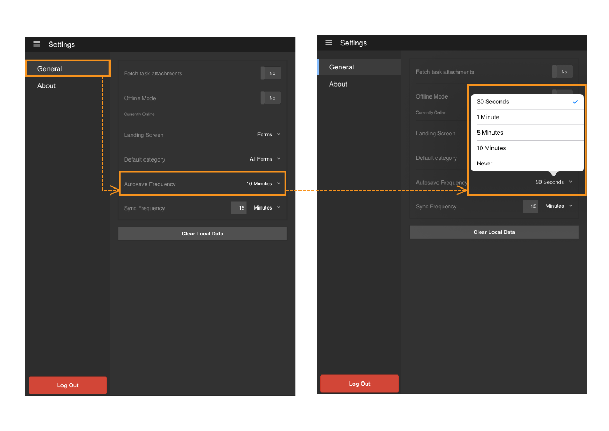

# AEM Forms アプリケーションで自動保存を使用 {#using-autosave-in-aem-forms-app}

Adobe Experience Manager Forms アプリケーションでユーザーがデータを入力すると、自動保存の機能により一定の間隔でデータが保存されます。AEM Forms アプリケーションの自動保存の機能は、意図せずにアプリケーションを終了した場合にデータの損失を防ぐことができます。

次のような場合にアプリケーションが意図せずに終了することがあります。

* バッテリー残量の低下によりデバイスがシャットダウンした場合
* ユーザーがアプリケーションを故意に終了した場合
* 予期しないクラッシュが発生した場合

入力したデータを保存する間隔は、指定することができます。

>[!NOTE]
>
>自動保存の頻度は慎重に選択してください。自動保存を頻繁に実行すると、デバイスのパフォーマンスに影響を及ぼすことがあります。

AEM Forms アプリケーションで自動保存の機能を使用するには、次の手順を実行します。

1. アプリケーションにログインし、**[!UICONTROL 設定／一般]**&#x200B;に移動します。
1. 一般画面で、 **[!UICONTROL 自動保存頻度]** オプションを使用して、入力したデータを保存する間隔を選択します。
   

1. アプリケーションを再起動して同じユーザーでログインすると、未保存のタスクの復元ダイアログで、タスクを復元するように求められます。クリック **[!UICONTROL OK]** [ 未保存のタスクの復元 ] ダイアログボックスで、保存済みのタスクの操作を再開します。 「**[!UICONTROL キャンセル]**」をクリックし、最後にトリガーされた自動保存の保存済みデータを削除して、新しいタスクで作業を始めることもできます。

   「**[!UICONTROL OK]**」をクリックすると、アプリケーションがクラッシュする前に最後にトリガーされた自動保存に対応するデータが使用されてタスクが復元されます。フォームデータと、タスクに関連付けられているすべての添付ファイルが含まれます。
   **A.** 作業中のフォーム **B.** アプリが強制的に閉じられました **C.** 未保存のタスクを復元ダイアログで再起動したアプリ **D.** 元のデータで復元されたフォーム
