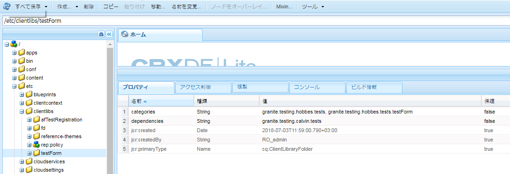

# アダプティブフォームのテスト自動化 {#automate-testing-of-adaptive-forms}

>[!CAUTION]
>
>AEM 6.4 の拡張サポートは終了し、このドキュメントは更新されなくなりました。 詳細は、 [技術サポート期間](https://helpx.adobe.com/jp/support/programs/eol-matrix.html). サポートされているバージョンを見つける [ここ](https://experienceleague.adobe.com/docs/?lang=ja).

## 概要 {#overview}

アダプティブフォームは、顧客とのやり取りを行う上で欠かすことができないものです。新しい修正パックの展開やフォームでルール変更があった場合など、アダプティブフォームに変更が加えられるたびにアダプティブフォームをテストすることが重要です。しかしながら、アダプティブフォームの機能テストおよびすべてのフィールドの機能テストは時間を要する作業です。

Calvin を使用すれば web ブラウザーでアダプティブフォームの自動テストを実行できます。Calvin は、テストの実行用に [Hobbes](/help/sites-developing/hobbes.md) のユーザーインターフェイスを利用して、次のツールを提供します。

* テストを作成するための JavaScript API。
* テストを実行するためのユーザーインターフェイス。

Calvin を使用すると、CRXDE でテストケースを作成し、Web ブラウザーで直接 UI テストを実行して、アダプティブフォームの以下の側面を十分にテストできます。

<table> 
 <tbody> 
  <tr> 
   <td><strong>テストするアダプティブフォームの機能</strong></td> 
   <td><strong>説明</strong></td> 
  </tr> 
  <tr> 
   <td>アダプティブフォームの事前入力エクスペリエンス</td> 
   <td> 
    <ul> 
     <li>データモデルのタイプに基づいて、フォームが期待どおりに事前入力されているか。</li> 
     <li>フォームオブジェクトのデフォルト値は、期待どおりに事前入力されますか？</li> 
    </ul> </td> 
  </tr> 
  <tr> 
   <td>アダプティブフォームの送信エクスペリエンス</td> 
   <td> 
    <ul> 
     <li>送信時に正しいデータが生成されているか。</li> 
     <li>送信時に、フォームがサーバー上で再検証されますか？</li> 
     <li>送信アクションは、実行されるフォームに対して設定されていますか？</li> 
    </ul> </td> 
  </tr> 
  <tr> 
   <td><p>式ルール</p> <p> </p> </td> 
   <td> 
    <ul> 
     <li>フィールドを終了した後にスクリプトを計算、表示、実行など、フォームオブジェクトに関連付けられた式は、関連する UI 操作の実行後に実行されますか？<br /> </li> 
    </ul> </td> 
  </tr> 
  <tr> 
   <td>検証</td> 
   <td> 
    <ul> 
     <li>操作を実行した後、フィールド検証は期待どおりに実行されますか？</li> 
    </ul> </td> 
  </tr> 
  <tr> 
   <td><p>遅延読み込み</p> <p> </p> </td> 
   <td> 
    <ul> 
     <li>タブ（またはパネルのナビゲーション項目）をクリックすると、HTML は遅延読み込みの設定ごとにサーバーから取得されていますか。</li> 
    </ul></td> 
  </tr> 
  <tr> 
   <td><p>UI インタラクション</p> </td> 
   <td> 
    <ul> 
     <li><a href="https://helpx.adobe.com/aem-forms/6-3/calvin-sdk-javascript-api/calvin.html#toc2__anchor" target="_blank">アダプティブフォームオブジェクトでの UI インタラクションのテスト</a></li> 
    </ul> </td> 
  </tr> 
 </tbody> 
</table>

### 前提条件 {#prerequisites}

この記事を使用してテストケースを作成する前に、以下を知っておく必要があります。

* [Hobbes](https://docs.adobe.com/docs/jp/aem/6-3/develop/components/hobbes.html) を使用したテストスイートの作成とテストケースの実行
* [Hobbes JavaScript API](https://docs.adobe.com/docs/jp/aem/6-2/develop/ref/test-api/index.html)
* [Calvin JavaScript API](https://helpx.adobe.com/jp/aem-forms/6-3/calvin-sdk-javascript-api/calvin.html)

## 例：Hobbes をテストフレームワークとして使用し、アダプティブフォームのテストスイートを作成する {#example-create-a-test-suite-for-an-adaptive-form-using-hobbes-as-testing-framework}

次の例では、複数のアダプティブフォームをテストするためのテストスイートの作成手順を説明します。 テストするフォームごとに別々のテストケースを作成する必要があります。 次の手順と同様の手順に従い、手順 11 で JavaScript コードを変更することで、独自のテストスイートを作成してアダプティブフォームをテストすることができます。

1. Web ブラウザーで CRXDE Lite（`https://[server]:[port]/crx/de`）に移動します。
1. /etc/clientlibs サブフォルダーを右クリックして、**[!UICONTROL 作成／ノードを作成]**&#x200B;をクリックします。名前（ここでは afTestRegistration）を入力し、ノードのタイプを cq:ClientLibraryFolder と指定して、「 **[!UICONTROL OK]**.

   clientlibs フォルダーには、アプリケーション（JS および Init）の登録側面が含まれます。 フォームに固有のすべての Hobbes テストスイートオブジェクトを clientlibs フォルダーに登録することをお勧めします。

1. 次のプロパティ値を、新しく作成したノード（ここでは afTestRegistration）で指定し、「**[!UICONTROL すべて保存]**」をクリックします。これらのプロパティにより、Hobbes でフォルダーをテストとして認識できます。このクライアントライブラリを他のクライアントライブラリで依存関係として再利用するには、granite.testing.calvin.tests という名前を付けます。

<table> 
 <tbody> 
  <tr> 
   <td>プロパティ</td> 
   <td>タイプ</td> 
   <td>値</td> 
  </tr> 
  <tr> 
   <td><p>カテゴリ</p> </td> 
   <td><p>String[]</p> </td> 
   <td><p>granite.testing.hobbes.tests, granite.testing.calvin.tests</p> </td> 
  </tr> 
  <tr> 
   <td><p>依存関係</p> </td> 
   <td><p>String[]</p> </td> 
   <td><p>granite.testing.hobbes.testrunner、granite.testing.calvin、apps.testframework.all</p> </td> 
  </tr> 
 </tbody> 
</table>

>[!NOTE]
>
>granite.testing.calvin.af clientlib には、すべてのアダプティブフォーム API が含まれています。 これらの API は calvin 名前空間の一部です。


1. テストノード（ここでは **afTestRegistration）** を右クリックして、**[!UICONTROL 作成／ファイルを作成]**&#x200B;をクリックします。ファイル名に「js.txt」と入力して、「**[!UICONTROL OK]**」をクリックします。
1. js.txt ファイルに次のテキストを追加します。

   ```
   #base=.
   js.txt
   ```

1. 「**[!UICONTROL すべて保存]**」をクリックして、js.txt ファイルを閉じます。
1. テストノード（ここでは **afTestRegistration）** を右クリックして、**[!UICONTROL 作成／ファイルを作成]**&#x200B;をクリックします。ファイル名に「init.js」と入力して、「**[!UICONTROL OK]**」をクリックします。
1. init.js ファイルに次のコードをコピーして、「**[!UICONTROL すべて保存]**」をクリックします。

   ```
   (function(window, hobs) {
       'use strict';
       window.testsuites = window.testsuites || {};
     // Registering the test form suite to the sytem
     // If there are other forms, all registration should be done here
       window.testsuites.testForm = new hobs.TestSuite("Adaptive Form - Demo Test", {
           path: '/etc/clientlibs/afTestRegistration/init.js',
           register: true
       });
    // window.testsuites.testForm1 = new hobs.TestSuite("testForm1");
   }(window, window.hobs));
   ```

   上記のコードは、 **アダプティブフォーム — デモテスト**. 別の名前でテストスイートを作成するには、名前を変更します。

1. クリック **[!UICONTROL 作成]** > **ノードを作成** をクリックして、テストする各フォームの clientlib フォルダーの下にノードを作成します。 この例では、 **testForm** アダプティブフォームをテストするには **testForm** `.`次のプロパティを指定し、「 **[!UICONTROL OK]**:

   * 名前：testForm （自分のフォーム名）
   * タイプ：cq:ClientLibraryFolder

1. 次のプロパティを新しく作成したノード（ここでは testForm）に追加し、アダプティブフォームをテストします。

   | **プロパティ** | **タイプ** | **値** |
   |---|---|---|
   | カテゴリ | 文字列[] | granite.testing.hobbes.tests、granite.testing.hobbes.tests.testForm |
   | 依存関係 | 文字列[] | granite.testing.calvin.tests |

   >[!NOTE]
   >
   >この例では、より良い管理のために、クライアントライブラリ granite.testing.calvin.tests における依存関係を使用します。また、必要に応じてクライアントライブラリカテゴリ「granite.testing.hobbes.tests.testForm」を追加して、このクライアントライブラリを再使用しています。

   

1. テストフォーム用に作成したフォルダー（ここでは testForm）を右クリックし、「 」を選択します。 **[!UICONTROL 作成/ファイルを作成]**. ファイルに scriptingTest.js という名前を付け、次のコードをファイルに追加して、 **[!UICONTROL すべて保存します。]**

   次のコードを使用して別のアダプティブフォームをテストするには、**navigateTo**（行 11、36、62）および個々のテストケースで、フォームのパスと名前を変更します。フォームおよびフォームオブジェクトのさまざまな機能をテストするための API について詳しくは、[Calvin API](https://helpx.adobe.com/jp/aem-forms/6-3/calvin-sdk-javascript-api/calvin.html)を参照してください。

   ```
   (function(window, hobs) {
       'use strict';
   
    var ts = new hobs.TestSuite("Script Test", {
           path: '/etc/clientlibs/testForm/scriptingTest.js',
     register: false
    }) 
   
       .addTestCase(new hobs.TestCase("Checking execution of calculate script")
           // navigate to the testForm which is to be tested
           .navigateTo("/content/forms/af/testForm.html?wcmmode=disabled")
           // check if adaptive form is loaded
           .asserts.isTrue(function () {
               return calvin.isFormLoaded()
           })
           .execSyncFct(function () {
               // create a spy before checking for the expression
               calvin.spyOnExpression("panel1.textbox1");
               // setValue would trigger enter, set the value and exit from the field
               calvin.setValueInDOM("panel1.textbox", "5");
           })
           // if the calculate expression was setting "textbox1" value to "5", let's also check that
           .asserts.isTrue(function () {
               return calvin.isExpressionExecuted("panel1.textbox1", "Calculate");
           })
           .execSyncFct(function () {
               calvin.destroySpyOnExpression("panel1.textbox1");
           })
           .asserts.isTrue(function () {
               return calvin.model("panel1.textbox1").value == "5"
           })
       )
   
       .addTestCase(new hobs.TestCase("Calculate script Test")
           // navigate to the testForm which is to be tested
           .navigateTo("/content/forms/af/cal/demoform.html?wcmmode=disabled&dataRef=crx:///content/forms/af/cal/prefill.xml")
           // check if adaptive form is loaded
           .asserts.isTrue(function () {
               return calvin.isFormLoaded()
           })
   
           .execSyncFct(function () {
               // create a spy before checking for the expression
               calvin.spyOnExpression("panel2.panel1488218690733.downPayment");
               // setValue would trigger enter, set the value and exit from the field
               calvin.setValueInDOM("panel2.panel1488218690733.priceProperty", "1000000");
           })
           .asserts.isTrue(function () {
               return calvin.isExpressionExecuted("panel2.panel1488218690733.downPayment", "Calculate");
           })
           .execSyncFct(function () {
               calvin.destroySpyOnExpression("panel2.panel1488218690733.downPayment");
           })
           .asserts.isTrue(function () {
               // if the calculate expression was setting "downPayment" value to "10000", let's also check that
      return calvin.model("panel2.panel1488218690733.downPayment").value == 10000
           })
       )
   
       .addTestCase(new hobs.TestCase("Checking execution of Value commit script")
           // navigate to the testForm which is to be tested
           .navigateTo("/content/forms/af/cal/demoform.html?wcmmode=disabled&dataRef=crx:///content/forms/af/cal/prefill.xml")
           // check if adaptive form is loaded
           .asserts.isTrue(function () {
               return calvin.isFormLoaded()
           })
   
           .execSyncFct(function () {
               // create a spy before checking for the expression
               calvin.spyOnExpression("panel2.panel1488218690733.priceProperty");
               // setValue would trigger enter, set the value and exit from the field
               calvin.setValueInDOM("panel2.panel1488218690733.priceProperty", "100");
           })
           .asserts.isTrue(function () {
               return calvin.isExpressionExecuted("panel2.panel1488218690733.priceProperty", "Value Commit");
           })
           .execSyncFct(function () {
               calvin.destroySpyOnExpression("panel2.panel1488218690733.priceProperty");
           })
           .asserts.isTrue(function () {
            // if the value commit expression was setting "textbox1488215618594" value to "0", let's also check that
               return calvin.model("panel2.panel1488218690733.textbox1488215618594").value == 0
           })
       );
   
    // register the test suite with testForm
     window.testsuites.testForm.add(ts);
   
    }(window, window.hobs));
   ```

   テストケースが作成されます。テストケースを実行して、Hobbes を介してアダプティブフォームをテストします。テストケースの実行手順について詳しくは、[自動化されたテストを使用した UI のテストでテストを実行する](/help/sites-developing/hobbes.md)を参照してください。

また、添付ファイル SampleTestPackage.zip に含まれるパッケージをインストールすれば、「例： Hobbes をテスト用フレームワークとして使用してアダプティブフォームのテストスイートを作成する」で説明した手順の結果と同じ結果を得ることができます。

[ファイルを入手](assets/sampletestpackage.zip)

## 自動テストを使用した UI のテスト {#testing-your-ui-using-automated-tests}

### 単一のテストスイートの実行 {#running-a-single-test-suite}

テストスイートは個別に実行できます。 テストスイートを実行すると、テストケースとそのアクションが実行され、テストの完了後に結果が表示されるにつれ、ページは変化します。 アイコンは結果を示します。

チェックマークアイコンは、合格したテストを示します。 

「X」アイコンは、失敗したテストを示します：

テストスイートを実行するには：

1. テストパネルで、実行するテストケースの名前をクリックまたはタップして、アクションの詳細を展開します。

   

1. 「テストを実行」ボタンをクリックまたはタップします。

   

1. テストが実行されると、プレースホルダーはページコンテンツに置き換えられます。

   

1. 「説明」をタップまたはクリックして結果パネルを開き、テストケースの結果をレビューします。結果パネルでテストケースの名前をタップまたはクリックすると、すべての詳細が表示されます。

   

AEMアダプティブフォームをテストする手順は、AEM UI をテストする手順と似ています。 アダプティブフォームのテストについて詳しくは、 [UI のテスト](https://helpx.adobe.com/jp/experience-manager/6-3/sites-developing/hobbes.html):

* テストスイートの表示
* 複数のテストの実行

## 用語集 {#glossary}

<table> 
 <tbody> 
  <tr> 
   <td><strong>用語</strong></td> 
   <td><strong>説明</strong></td> 
  </tr> 
  <tr> 
   <td><p>テストスイート</p> </td> 
   <td><p>テストスイートは関連するテストケースのコレクションです。</p> </td> 
  </tr> 
  <tr> 
   <td><p>テストケース</p> </td> 
   <td><p>テストケースは、ユーザーが UI を使用して実行するタスクを表します。テストスイートにテストケースを追加して、ユーザーが実行するアクティビティをテストします。</p> </td> 
  </tr> 
  <tr> 
   <td><p>アクション</p> </td> 
   <td><p>アクションとは、UI でジェスチャ（ボタンのクリックや入力ボックスへの値の入力など）を実行するメソッドです。</p> <p>hobs.actions.Asserts、hobs.actions.Core および hobs.utils.af クラスのメソッドは、テストで使用できるアクションです。 すべてのアクションは同期的に実行されます。</p> </td> 
  </tr> 
  <tr> 
   <td><p>オーサー環境またはパブリッシュ環境</p> </td> 
   <td><p>一般に、フォームは、オーサー環境またはパブリッシュ環境でテストできます。 パブリッシュ環境の場合、デフォルトでは、テストを実行するためのアクセスは制限されます。 これは、テストランナーに関連するすべてのクライアントライブラリが、JCR 構造の/libs 内にあるからです。</p> </td> 
  </tr> 
 </tbody> 
</table>
