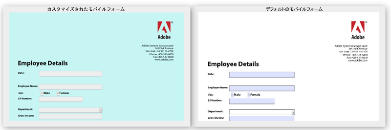

# HTML5 フォームのデフォルトスタイルの変更 {#changing-default-styles-of-html-forms}

HTML5 のフォームはHTML5 機能を使用してレンダリングされ、レンダリングされたフォームのスタイル設定は CSS を使用しておこなわれます。 HTML5 フォームのデフォルトの外観は、PDFレンディションに似ています。 開発者は、カスタム CSS を使用して、HTML5 フォームのデフォルトの外観を変更できます。

この記事では、HTML5 フォームのスタイルを変更するための詳細手順を説明します。[スタイルの概要](/help/forms/using/css-styles.md)の記事では、HTML5 フォームのさまざまなスタイル設定を詳しく解説します。この記事に記載されている手順を実行する前に、「スタイルの概要」の記事を必ずお読みください。

次の 2 つの画像はデフォルトのスタイルとカスタマイズされたスタイルの違いを示しています。

## フォームのスタイル設定 {#style-your-forms}

1. **カスタムスタイルを追加するプロファイルを選択**

   **https://&lt;server>:&lt;port>/crx/de** の URL で CRX DE インターフェイスにアクセスし、プロファイルを作成するか、既存のプロファイルを選択します。プロファイルの作成方法について学ぶには、[プロファイルの新規作成](/help/forms/using/custom-profile.md)を参照してください。

1. **HTML5 フォームのスタイル設定用の CSS スタイルシートの作成**

   プロファイルレンダラーを作成したフォルダーに移動し、CSS スタイルシートファイルを作成します。 以下の手順に従います。

   1. フォルダーを右クリックし、「 」を選択します。 **作成** -> **ファイルを作成** メニューから
   HTML5 フォーム内の特定のコンポーネントに対して作成する CSS クラスについては、 [スタイルの概要](/help/forms/using/css-styles.md).

1. **プロファイルレンダラーにスタイルシートを含める**

   CRX DE でプロファイルレンダラーページ（jsp ファイル）を開き、CSS ファイルを XFA クライアントライブラリのすぐ下のページに含めます。 次の手順を実行して、CSS ファイルをプロファイルに含めます。

   1. レンダラーページで次の行を検索します。

      &lt;cq:includeClientLib categories=&quot;xfaforms.profile&quot; />

   1. 次の行を上記の行の下に挿入して、スタイルシートを含めます。

      &lt;link href=&quot;/path/to/stylesheet&quot; rel=&quot;stylesheet&quot; type=&quot;text/css&quot;/>

   1.  ファイルを保存します。
