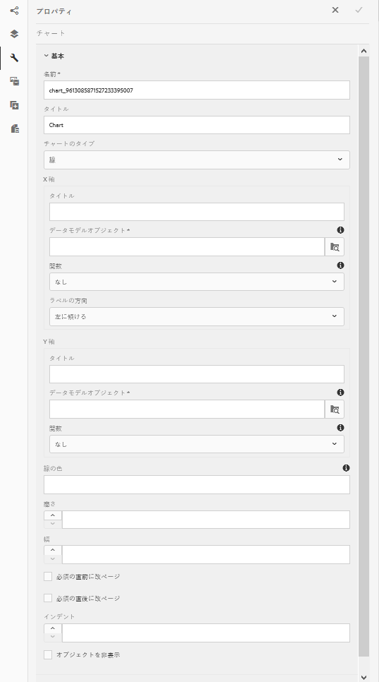
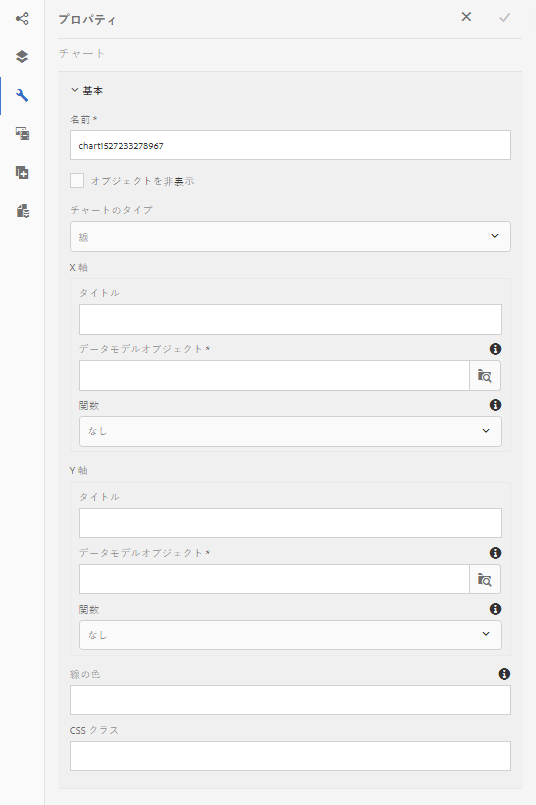
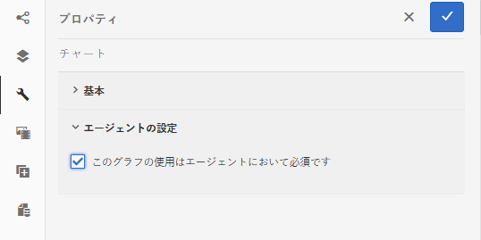
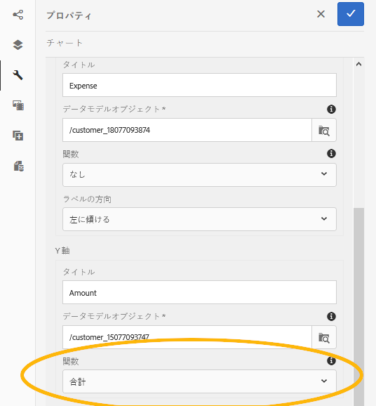

# インタラクティブ通信内でグラフを使用する {#using-charts-in-interactive-communications}

インタラクティブ通信内でグラフを使用すると、大量の情報を、分析が簡単で理解しやすい視覚的な形式で表現することができます

表やグラフはデータを視覚的に表現します。インタラクティブ通信で大量の情報を分かりやすい視覚的な形式で表現することにより、複雑なデータを視覚的に理解して分析することができます。

インタラクティブ通信を作成する際にグラフを追加することにより、インタラクティブ通信のフォームデータモデルから取得した 2 次元のデータを視覚的に表現することができます。グラフコンポーネントを使用すると、次のタイプのグラフの追加、設定ができます。

* 円グラフ
* 列
* ドーナツグラフ
* 棒グラフ（Web チャネルの場合のみ）
* 線グラフ
* 線とポイントグラフ
* ポイントグラフ
* 領域

## インタラクティブ通信にグラフを追加して設定する {#add-and-configure-chart-in-an-interactive-communication}

インタラクティブ通信にグラフを追加するには、次の手順を実行します。

1. AEM のサイドバーにあるグラフコンポーネントを、インタラクティブ通信の印刷チャネルまたは Web チャネルにドラッグアンドドロップします。

   * 印刷チャネル：ターゲット領域と画像フィールド
   * Web チャネル：パネルとターゲット領域

   グラフコンポーネントをドロップすると、グラフ用のプレースホルダーが作成されます。

1. インタラクティブ通信エディターでグラフコンポーネントをタップし、コンポーネントツールバーからを選択します。 **[!UICONTROL 設定 (]** ) をクリックします。

   グラフの基本プロパティがフォーカスされた状態で、プロパティサイドバーが表示されます。

   
   **図：** *印刷チャネルの折れ線グラフの基本プロパティ*

   
   **図：** *Web チャネルの折れ線グラフの基本プロパティ*

1. 印刷チャネルと Web チャネルのグラフの基本プロパティを設定します。両方のチャネルで共通して使用されるプロパティのほかに、各チャネル固有のプロパティとグラフタイプ固有のプロパティも用意されています。

   * **[!UICONTROL 名前]**:グラフオブジェクトの名前。 ここで指定したグラフの名前は、グラフ出力には表示されませんが、グラフを参照するためのルールで使用されます。
   * **[!UICONTROL グラフのタイプ]**:グラフのタイプを指定します。円グラフ、列グラフ、ドーナツグラフ、線グラフ、線グラフ、線とポイントグラフ、ポイントグラフ、面グラフのいずれかを指定できます。
   * **[!UICONTROL オブジェクトを非表示]**:最終的な出力でグラフを非表示にする場合に選択します。
   * **[!UICONTROL X 軸]**&#x200B;と **[!UICONTROL Y 軸]**&#x200B;で、以下のプロパティを指定します。

      * **[!UICONTROL タイトル]**:インタラクティブ通信に表示する X 軸と Y 軸のタイトルを指定します。
      * **[!UICONTROL データモデルオブジェクト*]**：インタラクティブ通信の作成時に指定したフォームデータモデルの X 軸と Y 軸について、データモデルオブジェクトを参照して選択します。グラフの X 軸と Y 軸にプロットするために、互いに関連して意味のある同じ親データモデルオブジェクトの 2 つのコレクション/配列タイプのプロパティを選択します。
      * **[!UICONTROL 関数]**:統計関数を使用して軸の値を計算するには、X/Y 軸の関数を選択します。 関数について詳しくは、 [グラフでの関数の使用](#usefunction) および [例 2:折れ線グラフでの合計関数と平均関数の適用](#applicationsumfrequency).

   >[!NOTE]
   >
   >印刷チャネルの X 軸でデータモデルオブジェクトを連結する場合、そのデータモデルオブジェクトのデータタイプは、Number、String、Date のいずれかでなければなりません。印刷チャネルの Y 軸でデータモデルオブジェクトを連結する場合、そのデータモデルオブジェクトのデータタイプは Number でなければなりません。印刷チャネルの右側に表示されている凡例を使用することをお勧めします。

   グラフのプロパティの詳細については、 [グラフの基本プロパティ](#basicpropertiescharts).

1. （印刷チャネルの場合のみ）「エージェント設定」で、このグラフをエージェントで使用するかどうかを指定します。次の場合： **[!UICONTROL エージェントがこのグラフを使用するには t が必須です]** 「 」オプションが選択されていない場合、エージェント UI の「コンテンツ」タブにあるグラフの目のアイコンをタップして、グラフの表示/非表示を切り替えることができます。

   

1. プロパティサイドバーで、 .

   グラフのプレビューを表示して、グラフの外観とデータを確認します。必要な場合は、グラフのプロパティをさらに編集します。

1. インタラクティブ通信の編集画面に戻り、必要な変更を行います。

## 例 1：印刷チャネルと Web チャネルのグラフ出力 {#chartoutputprintweb}

「基本」タブで、グラフのタイプ、データを格納するソースフォームデータモデルのプロパティ、グラフの X 軸と Y 軸上に描画されるラベルを指定します。必要に応じて、グラフ上に表示される値を計算するための統計関数を指定することもできます。

ここでは、インタラクティブ通信を使用して生成されたクレジットカードの取引明細を例として、基本的なプロパティに関して最低限知っておくべき情報について説明します。具体的な例として、取引明細に記載されている様々な支払額を描画するグラフを生成する場合を考えてみます。この例では、インタラクティブ通信の印刷出力と Web 出力で、異なるタイプのグラフを使用します。

最初に、以下のプロパティを指定する必要があります。

* **[!UICONTROL グラフのタイプ]**：この例では、印刷チャネルで列グラフを生成し、Web チャネルでドーナツグラフを生成します。
* **[!UICONTROL データモデルオブジェクト]**：グラフの X 軸と Y 軸上に描画されるデータの取得元を指定します。この例では、X 軸に支払額を表示し、Y 軸に支出項目名を表示します。
* **[!UICONTROL タイトル]**：X 軸と Y 軸のタイトルを指定します（この例では、印刷チャネルの列グラフでのみ、このオプションを指定します）。この例では、X 軸のタイトルを「Amount ($)」、Y 軸のタイトルを「Expense」とします。
* **[!UICONTROL ラベルの方向]** （この例では、印刷チャネルの列タイプのグラフのみ） — この例 `Tilt Left`

* **[!UICONTROL ツールチップ]** 費用（web チャネルのみ）の上にマウスを置くと表示されます。この例では `${x}: $ ${y}`は、次の形式で表示されます。 `[Expense Label: $ Amount]` ( 例：テーマパーク訪問：$ 315)


**図：** *インタラクティブ通信の印刷出力の縦棒グラフ*

**A.** Y 軸 — フォームデータモデルのプロパティから取得した金額と、「タイトル」プロパティを「金額 ($)」に設定した金額 **B.** X 軸のラベル方向を左に傾けるに設定 **C.** X 軸 — フォームデータモデルのプロパティから取得した費用の説明で、「タイトル」プロパティを「費用」に設定します。


**図：** *インタラクティブ通信の Web 出力のドーナツグラフ*

**A.** ドーナツグラフの内側の半径プロパティが設定されています **B.** [ 凡例を表示 ] プロパティが選択され、[ 凡例の位置 ] プロパティが [ 右 ] に設定されている **C.** ツールチップはマウスを合わせると項目の詳細を表示します。ツールチップは${x} に設定されています。$${y}

## 例 2: 線グラフ内で Sum 関数と Frequency 関数を適用する {#applicationsumfrequency}

グラフ内で関数を適用すると、フォームデータモデルでは直接指定できないデータを描画することができます。この例では、クレジットカード明細の例を使用して、Sum 関数と Frequency 関数をグラフに適用する方法を説明します。


**図：** *3 つの「Bed and Breakfast」トランザクションを含む機能を持たない折れ線グラフ*

### Sum 関数 {#sum-function}

Sum 関数を適用することにより、同じデータプロパティの複数のインスタンスの値を合計し、グラフ上で 1 つの項目として表示することができます。例えば以下のグラフの場合、Y 軸に Sum 関数を適用すると、3 つの「Bed and Breakfast」項目の金額が合計され（それぞれの金額は、99.45 ドル、78 ドル、12 ドル）、1 つの項目としてグラフに表示されます（合計金額は 189.45 ドル）。

同じデータプロパティで複数のインスタンスが存在する場合は、Sum 関数を適用して合計値を表示すると、グラフが見やすくなります。


### Frequency 関数 {#frequency-function}

Frequency 関数をグラフに適用すると、X 軸に表示される項目の発生数が Y 軸に表示されます（またはその逆）。例えば、Frequency 関数を Y 軸に適用する（Amount/TransAmount）と、「Bed and Breakfast」項目の値が Y 軸上で「3」として表示され、残りの項目についてはすべて「1」として表示されます。


## グラフの基本プロパティ {#basicpropertiescharts}

「基本」タブでは、次のプロパティを設定できます。

**名前** グラフ要素の識別子。 ここで指定した名前はグラフには表示されませんが、他のコンポーネント、スクリプト、SOM 式を参照する際にこの名前を使用すると便利です。

**タイトル（印刷チャネルのみ）** グラフのタイトルを指定します。

**グラフのタイプ** 生成するグラフのタイプを指定します。 有効なオプションは、円グラフ、列グラフ、ドーナツグラフ、棒グラフ（Web チャネルの場合のみ）、線グラフ、線とポイントグラフ、ポイントグラフ、領域グラフです。詳しくは、例 1 を参照してください。印刷および Web でのグラフ出力。

**X 軸/タイトル** X 軸のタイトルを指定します。

**X 軸/データモデルオブジェクト&amp;ast;** X 軸にプロットするフォームデータモデルコレクション項目の名前を指定します。

**X 軸/関数** x 軸の値の計算に使用する統計/カスタム関数を指定します。 関数の詳細については、「グラフでの関数の使用」および「例 2:折れ線グラフでの合計関数と平均関数の適用。

**X 軸/ラベルの方向** 印刷チャネルでのグラフ上のラベルの方向。 ラベルの方向を [ カスタム回転 ] として選択した場合は、[ カスタム回転角度（度）] フィールドが表示されます。 「カスタム回転の角度（度）」フィールドでは、回転角度を 15 度単位で選択することができます。

**Y 軸/タイトル** Y 軸のタイトルを指定します。

**Y 軸/データモデルオブジェクト (&amp;A);** Y 軸に印刷するフォームデータモデルコレクション項目を指定します。 印刷チャネルでは、Y 軸のデータモデルオブジェクトのタイプは数値である必要があります。

**Y 軸/機能** Y 軸の値の計算に使用する統計/カスタム関数を指定します。 関数の詳細については、「グラフでの関数の使用」および「例 2:折れ線グラフでの合計関数と平均関数の適用。

**凡例を表示** 有効にすると、円グラフまたはドーナツグラフの凡例が表示されます。

**凡例の位置** グラフを基準にした凡例の位置を指定します。 使用できるオプションは、右端、左端、上、下です。

**高さ（印刷チャネルのみ）** グラフの高さ（ピクセル単位）。

**幅（印刷チャネルのみ）** グラフの幅（ピクセル単位）。

>[!NOTE]
>
>Web チャネルのグラフの幅については、スタイルレイヤーを使用するかテーマを適用して調整することができます。

**ツールチップ（Web チャネルのみ）** Web チャネル内のグラフのデータポイントにマウスを置くときにツールチップが表示される形式を指定します。 デフォルト値は\${x}(\${y}) です。 グラフの種類に応じて、グラフ内のポイント、棒、スライスにマウスを置くと、変数\${x} と\${y} が x 軸と y 軸の対応する値に動的に置き換えられ、ツールチップに表示されます。

ツールヒントを無効にするには、「ツールヒント」フィールドを空白にします。このオプションは線グラフと領域グラフには適用できません。例えば、 [例 1:印刷および Web でのグラフ出力](#chartoutputprintweb).

**CSS クラス（Web チャネルのみ）** CSS クラスの名前を「 CSS クラス」フィールドに指定し、グラフにカスタムスタイルを適用します。

**前に改ページする必須（印刷チャネルのみ）** グラフの前に必須の改ページを追加し、新しいページの上にグラフを配置する場合に選択します。

**直後に改ページする必須（印刷チャネルのみ）** グラフの後に必須の改ページを追加し、新しいページの上部でグラフの後にコンテンツを配置する場合に選択します。

**インデント（印刷チャネルのみ）** ページの左からグラフのインデントを指定します。

**グラフ固有の設定** 一般的な設定に加えて、次のグラフ固有の設定を使用できます。

* **内半径**：ドーナツグラフで使用できます。グラフ内の内側の円の半径をピクセルで指定できます。
* **線の色**：線グラフ、線とポイントグラフ、領域グラフで使用できます。グラフ内の線の色を 16 進値で指定できます。
* **ポイントの色**:ポイントグラフと折れ線グラフとポイントグラフで使用でき、グラフ内のポイントの色を 16 進値で指定できます。

* **領域の色**:面グラフで使用可能：グラフの線の下の領域の色を 16 進値で指定します。

## グラフでの関数の使用 {#usefunction}

統計関数を使用するようにグラフを設定し、ソースデータの値を計算して、グラフにプロットできます。グラフ内で関数を適用すると、フォームデータモデルでは直接指定できないデータを描画することができます。

グラフコンポーネントにはいくつかの関数が組み込まれていますが、自分で関数を作成し、その関数を使用して Web チャネルのグラフを設定することもできます



>[!NOTE]
>
>関数はグラフの X 軸の値を計算する場合にも、Y 軸の値を計算する場合にも使用できます。

### デフォルトの関数 {#default-functions}

デフォルトでは、以下の関数をグラフコンポーネントに使用できます。

**平均（平均）** 一方の軸にある特定の値の X 軸または Y 軸の値の平均を返します。

**合計** 一方の軸にある特定の値の X 軸または Y 軸のすべての値の合計を返します。

**最大** 一方の軸にある特定の値の X 軸または Y 軸の値の最大値を返します。

**頻度** 一方の軸にある特定の値の X 軸または Y 軸の値の数を返します。

**範囲** 一方の軸にある特定の値の X 軸または Y 軸の最大値と最小値の差を返します。

**中央値** 一方の軸にある特定の値の、X 軸または Y 軸の上半分の値と下半分の値を区切る値を返します。

**最小** 一方の軸にある特定の値の X 軸または Y 軸の最小値を返します。

**モード** 他の軸にある特定の値の X 軸または Y 軸で最も多く出現する値を返します

### Web チャネルのカスタム関数 {#custom-functions-in-web-channel}

グラフでデフォルトの関数を使用するだけでなく、JavaScript™ でカスタム関数を作成し、Web チャネル用のグラフコンポーネントの関数リストにその関数を追加することもできます。

関数は入力された配列または値、カテゴリ名を使用して、値を返します。次に例を示します。

```
Multiply(valueArray, category) {
 var val = 1;
 _.each(valueArray, function(value) {
 val = val * value;
 });
 return val;
}
```

カスタム関数を作成したら、以下を実行してグラフの設定で使用できるようにします。

1. 該当するインタラクティブ通信に関連付けられているクライアントライブラリにカスタム関数を追加します。詳しくは、 [送信アクションの設定](/help/forms/using/configuring-submit-actions.md) および [クライアント側ライブラリの使用](/help/sites-developing/clientlibs.md).

1. 関数ドロップダウンにカスタム関数を表示するには、CRXDe Lite で、 `nt:unstructured` 次のプロパティを持つ apps フォルダーのノード。

   * プロパティを追加 `guideComponentType` 値は次のとおり `fd/af/reducer`. (mandatory)
   * プロパティを追加 `value` をカスタム JavaScript™関数の完全修飾名に追加します。 （必須）を選択し、値を Multiply などのカスタム関数の名前に設定します。
   * プロパティを追加 `jcr:description` を、関数ドロップダウンに表示されるカスタム関数の名前として表示する値に置き換えます。 例えば、**Multiply** と表示されます。
   * プロパティを追加 `qtip` カスタム関数の短い説明となる値を持つ。 「**関数**」ドロップダウンリスト内の関数名にポインターを置くと、ここで指定した説明がツールヒントとして表示されます。

1. 「**すべて保存**」をクリックして設定を保存します。

これで関数をグラフで使用できるようになります。
